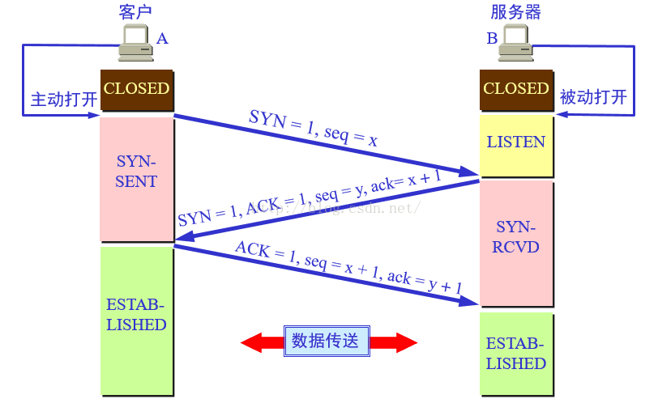
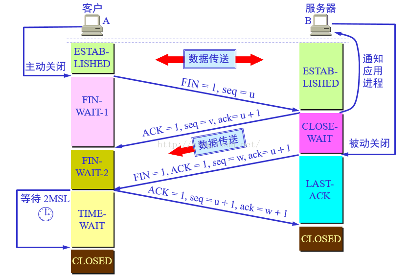
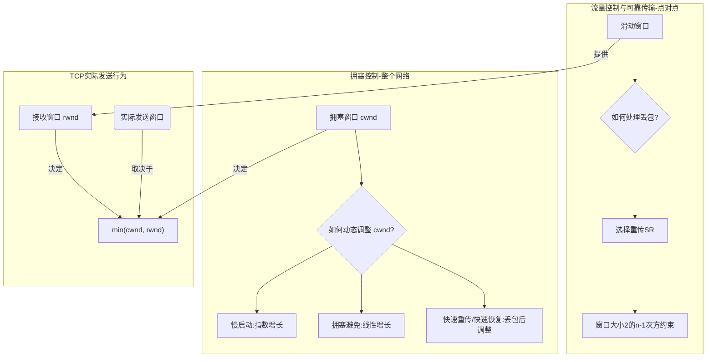

# 经典排序算法复杂度与特性总结

下表总结了各种排序算法在**平均情况 (Average)**、**最好情况 (Best)** 和**最坏情况 (Worst)** 下的性能指标。

*   **n**: 待排序元素的数量。
*   **k**: 对于非比较排序，表示元素的取值范围或关键字的位数。
* 
*   **稳定性**: 指相等的元素在排序后，其原始的相对顺序是否保持不变。

| 排序算法 (Algorithm)          | 时间复杂度 (Time Complexity)                 | 空间复杂度 (Space)   | 稳定性 (Stability) | 比较次数 (Comparisons) | 移动/交换次数 (Moves/Swaps) |
| :------------------------ | :-------------------------------------- | :-------------- | :-------------- | :----------------- | :-------------------- |
|                           | **平均 / 最好 / 最坏**                        |                 |                 | **数量级**            | **数量级**               |
| **冒泡排序 (Bubble Sort)**    | O(n²) / O(n) / O(n²)                    | O(1)            | **稳定**          | O(n²)              | O(n²)                 |
| **选择排序 (Selection Sort)** | O(n²) / O(n²) / O(n²)                   | O(1)            | **不稳定**         | O(n²)              | **O(n)**              |
| **插入排序 (Insertion Sort)** | O(n²) / O(n) / O(n²)                    | O(1)            | **稳定**          | O(n²)              | O(n²)                 |
| **希尔排序 (Shell Sort)**     | O(n log n) ~ O(n²) / O(n log n) / O(n²) | O(1)            | **不稳定**         | O(n log n) ~ O(n²) | O(n log n) ~ O(n²)    |
| **归并排序 (Merge Sort)**     | O(n log n) / O(n log n) / O(n log n)    | **O(n)**        | **稳定**          | O(n log n)         | O(n log n)            |
| **快速排序 (Quick Sort)**     | O(n log n) / O(n log n) / O(n²)         | O(log n) ~ O(n) | **不稳定**         | O(n log n)         | O(n log n)            |
| **堆排序 (Heap Sort)**       | O(n log n) / O(n log n) / O(n log n)    | O(1)            | **不稳定**         | O(n log n)         | O(n log n)            |
| **计数排序 (Counting Sort)**  | O(n+k) / O(n+k) / O(n+k)                | O(n+k)          | **稳定**          | **0**              | O(n+k)                |
| **桶排序 (Bucket Sort)**     | O(n+k) / O(n) / O(n²)                   | O(n+k)          | **稳定**          | O(n²) (桶内排序)       | O(n)                  |
| **基数排序 (Radix Sort)**     | O(n·k) / O(n·k) / O(n·k)                | O(n+k)          | **稳定**          | **0**              | O(n·k)                |

---

### **算法特点简要分析**

*   **冒泡排序 (Bubble Sort)**: 实现简单，但效率低下。最好情况是 O(n)（当数组已有序且加入优化标志时）。
*   **选择排序 (Selection Sort)**: 它的主要特点是**元素交换次数最少**，为 O(n) 级别。这在元素交换成本很高的场景下有优势。但比较次数始终是 O(n²)。
*   **插入排序 (Insertion Sort)**: 在**数据基本有序**的情况下表现极其出色，接近 O(n)。因此常被用作更复杂排序算法（如快速排序）在小数据量或递归末端的优化手段。
*   **希尔排序 (Shell Sort)**: 插入排序的改进版，通过设置不同的步长来减少元素移动的距离，性能优于简单排序。
*   **归并排序 (Merge Sort)**: 性能非常稳定，时间复杂度始终是 O(n log n)。其主要缺点是需要 O(n) 的额外空间。是一种典型的“空间换时间”策略。
*   **快速排序 (Quick Sort)**: 在平均情况下是所有基于比较的排序算法中**最快**的，但其性能依赖于基准 (pivot) 的选择。最坏情况（数组已有序或逆序）下会退化到 O(n²)。
*   **堆排序 (Heap Sort)**: 性能同样稳定在 O(n log n)，且空间复杂度为 O(1)，是原地排序。但其常数因子比快速排序大，实际平均速度稍慢。
*   **计数排序 (Counting Sort)**: **非比较排序**。通过统计元素出现次数来实现，速度极快，但严重依赖于数据的取值范围 `k` 不能过大。
*   **桶排序 (Bucket Sort)**: 计数排序的变体，适用于数据均匀分布的情况。
*   **基数排序 (Radix Sort)**: **非比较排序**。按关键字的每一位进行排序，对于整数或特定格式字符串的排序非常高效。


## 原理

下面给你一份**常见排序算法总表**，包含：**基本原理、时间复杂度、空间复杂度、稳定性、适用场景**，便于直接抄到 math.md 或单独笔记里。

> 下面所有时间复杂度统一写成：最好情况 / 平均情况 / 最坏情况。  
> 空间复杂度是**额外空间**（原地排序视为 $O(1)$）。


| 算法     | 时间复杂度                                    | 空间复杂度            | 稳定性         | 是否原地 | 基本原理与适用情况                                                                                        |                     |
| :----- | :--------------------------------------- | :--------------- | :---------- | :--- | :----------------------------------------------------------------------------------------------- | ------------------- |
| 冒泡排序   | $$O(n) / O(n^2) / O(n^2)$$               | $$O(1)$$         | 稳定          | 是    | 相邻元素两两比较，逆序就交换，一趟把最大(或最小)“冒”到末尾。实现简单，适合教学或数据量很小、几乎有序的场景，工程中基本不用。                                 |                     |
| 选择排序   | $$O(n^2) / O(n^2) / O(n^2)$$             | $$O(1)$$         | 不稳定         | 是    | 每一趟在未排序部分中选择最小(或最大)元素放到前面。比较次数固定，交换次数少，适合写操作代价特别大的场合，但整体性能差。                                     |                     |
| 直接插入排序 | $$O(n) / O(n^2) / O(n^2)$$               | $$O(1)$$         | 稳定          | 是    | 将序列分为已排序区和未排序区，依次把未排序元素插入到前面已排序部分的合适位置。对“基本有序”或规模较小的数据非常高效，是很多高级排序在小规模子数组上的内核算法。                 |                     |
| 希尔排序   | 依增量序列，通常介于 $$O(n^{3/2})$$ 与 $$O(n^2)$$   | $$O(1)$$         | 不稳定         | 是    | 按 gap 分组做多趟插入排序，gap 逐步缩小至 1。比简单 $$O(n^2)$$ 排序快，适合中等规模、要求实现简单且不在意稳定性的场景。                          |                     |
| 归并排序   | $$O(n\log n) / O(n\log n) / O(n\log n)$$ | $$O(n)$$         | 稳定          | 否    | 分治：不断二分，分别排序后线性时间归并两个有序序列。时间复杂度稳定，适合对稳定性要求高、可接受 $$O(n)$$ 额外空间的场景，外部排序、链表排序常用。                    |                     |
| 快速排序   | $$O(n\log n) / O(n\log n) / O(n^2)$$     | $$O(\log n)$$ 期望 | 不稳定         | 是    | 分治：选 pivot，按 pivot 划分成左右两段递归排序。平均性能极好，是内部排序最常用算法之一；需要通过随机化或“三数取中”避免退化到 $$O(n^2)$$。不要求稳定但追求速度时首选。 |                     |
| 堆排序    | $$O(n\log n) / O(n\log n) / O(n\log n)$$ | $$O(1)$$         | 不稳定         | 是    | 基于大根堆(或小根堆)，先建堆，再反复取堆顶放到数组末尾并调整堆。原地且时间复杂度稳定，多用于优先队列、top-k，作为通用排序时略慢于优化良好的快排。                     |                     |
| 计数排序   | $$O(n+k)$$                               | $$O(n+k)$$       | 稳定(若从右向左回填) | 否    | 对整数键值统计每个值的出现次数并做前缀和，再按计数结果回填。适合键值范围 $$[0,k]$$ 较小的整数排序，常作为基数排序子过程。                               |                     |
| 桶排序    | $$O(n)$$ 期望, $$O(n\log n)$$ 最坏           | $$O(n+b)$$       | 视桶内算法       | 否    | 按值域分桶，假设数据大致均匀分布，每桶内再用别的排序(如插排或快排)，最后按桶顺序合并。适合已知分布、近似均匀的大量数据，如 $$[0,1)$$ 区间浮点数。                  |                     |
| 基数排序   | $$O(d(n+r))$$                            | $$O(n+r)$$       | 稳定          | 否    | 按“位”(如个位、十位…或字符位)从低位到高位(或反之)多次稳定排序，一般每趟用计数排序。适合定长整数、定长字符串等，位数 $$d$$ 和基数 $$r$$ 不大时性能接近线性。         | 较小的整数排序，常作为基数排序子过程。 |
| 桶排序    | $$O(n)$$ 期望, $$O(n\log n)$$ 最坏           | $$O(n+b)$$       | 视桶内算法       | 否    | 按值域分桶，假设数据大致均匀分布，每桶内再用别的排序(如插排或快排)，最后按桶顺序合并。适合已知分布、近似均匀的大量数据，如 $$[0,1)$$ 区间浮点数。                  |                     |
| 基数排序   | $$O(d(n+r))$$                            | $$O(n+r)$$       | 稳定          | 否    | 按“位”(如个位、十位…或字符位)从低位到高位(或反之)多次稳定排序，一般每趟用计数排序。适合定长整数、定长字符串等，位数 $$d$$ 和基数 $$r$$ 不大时性能接近线性。         |                     |


### 记忆小结

- **稳定排序**：冒泡、直接插入、归并、计数、(合适实现的)基数。  
- **原地且平均 $O(n\log n)$**：快速排序、堆排序、希尔（略差于 $n\log n$）。  
- **适合小规模 / 基本有序**：插入排序、冒泡排序。  
- **适合外部排序 / 链表**：归并排序。  
- **键值范围小的整数**：计数、桶、基数排序。  

如果你想把这块内容加进 math.md，我可以按你指定的位置给出一段带 `filepath` 注释的补全片段。

# 进制标志

好的，这是一个非常基础且重要的计算机组成原理问题。一个数字的表示法通常由其**书写格式**（前缀或后缀）和**上下文**来决定。

根据您 math.md 文件中对计算机基础的涉及，我为您详细总结二进制、八进制、十六进制以及补码的常见标志。

---

### **核心标志：前缀、后缀和上下文**

在编程和文档中，为了区分不同的进制，我们通常会使用特定的前缀或后缀。

#### **1. 二进制 (Binary)**

*   **基本特征**: 只包含数字 `0` 和 `1`。
*   **常见标志**:
    *   **前缀 `0b` 或 `0B`**: 这是现代编程语言（如Python, C++, Java）中最标准的表示法。
        *   示例: `0b10110101`
    *   **后缀 `B`**: 在一些汇编语言或旧的表示法中很常见。
        *   示例: `10110101B`
    *   **上下文说明**: 在学术论文或书籍中，可能会直接说明“二进制数 10110101”或使用下标，如 $(10110101)_2$。

#### **2. 八进制 (Octal)**

*   **基本特征**: 只包含数字 `0` 到 `7`。
*   **常见标志**:
    *   **前缀 `0`**: 这是C语言及其派生语言中的传统表示法。**注意：这个标志很容易引起混淆**，因为一个普通的十进制数也可能以0开头（虽然不规范）。
        *   示例: `015` (这代表十进制的 13，而不是 15)
    *   **前缀 `0o` 或 `0O`**: 这是现代语言（如Python 3, JavaScript ES6+）推荐的、更清晰的表示法，用来替代模糊的 `0` 前缀。
        *   示例: `0o15`
    *   **后缀 `O` 或 `Q`**: 在一些特定的系统或文档中可能见到。
        *   示例: `15O`
    *   **上下文说明**: 使用下标，如 $(15)_8$。

#### **3. 十六进制 (Hexadecimal)**

*   **基本特征**: 包含数字 `0` 到 `9` 和字母 `A` 到 `F` (大小写不敏感)。
*   **常见标志**:
    *   **前缀 `0x` 或 `0X`**: 这是**最通用、最标准**的表示法，几乎所有现代编程语言都支持。
        *   示例: `0xFF`, `0x3A`
    *   **后缀 `H`**: 在汇编语言（特别是Intel语法）和一些硬件相关的文档中非常普遍。
        *   示例: `FFH`, `3AH`
    *   **其他符号**: 某些环境中可能使用 `$` 前缀（如Motorola汇编）或 `#`。
    *   **上下文说明**: 使用下标，如 $(FF)_{16}$。

---

### **补码 (Two's Complement) 的“标志”**

补码**不是一个进制**，而是一种用二进制**表示有符号整数（正数和负数）的编码方案**。因此，它没有像 `0x` 或 `0b` 这样的直接书写标志。

判断一个二进制数是否为补码，以及它的值是多少，完全依赖于**两个前提条件**：

1.  **上下文明确指出**: 必须有人告诉你“这是一个补码表示的数”。
2.  **已知其位宽 (字长)**: 你必须知道这个数总共有多少位，例如“一个8位的补码数”。

在满足这两个前提下，补码的“标志”是其**最高位（最左边的位）**，也称为**符号位 (Sign Bit)**。

*   **符号位为 `0`**:
    *   **标志**: 最高位是 `0`。
    *   **含义**: 这个数是一个**正数或零**。
    *   **解读**: 其值就是它本身的二进制转十进制的值。
    *   **示例 (8位)**: `01000001` -> 最高位是0，是正数。值为 $64+1=65$。

*   **符号位为 `1`**:
    *   **标志**: 最高位是 `1`。
    *   **含义**: 这个数是一个**负数**。
    *   **解读**: 不能直接按二进制转。需要通过“**取反加一**”的操作来求其绝对值。
    *   **示例 (8位)**: `10111111`
        1.  最高位是1，是负数。
        2.  求其绝对值：对 `10111111` **各位取反** -> `01000000`。
        3.  **再加一** -> `01000001`。
        4.  这个结果的十进制值是 65。
        5.  所以，原数 `10111111` 的值是 **-65**。

### **总结表**

| 表示法       | 格式标志 (常见)      | 数字/字母范围        | 示例                                        |
| :----------- | :------------------- | :------------------- | :------------------------------------------ |
| **二进制**   | 前缀 `0b` / 后缀 `B` | `0`, `1`             | `0b1101`, `1101B`                           |
| **八进制**   | 前缀 `0o` / 前缀 `0` | `0` - `7`            | `0o15`, `015`                               |
| **十六进制** | 前缀 `0x` / 后缀 `H` | `0` - `9`, `A` - `F` | `0x1A`, `1AH`                               |
| **补码**     | **最高位 (符号位)**  | `0`, `1`             | `0`=正, `1`=负 (需预先知道是补码且知道位宽) |

# 补码计算

好的，这是一个非常核心的计算机组成原理问题。在计算机硬件（CPU的算术逻辑单元ALU）层面，减法操作是通过一个巧妙的技巧转换成加法来完成的。

**核心思想**：计算机没有专门的减法器，它通过将减法 `x - y` 转换为加法 `x + (-y)` 来复用加法器电路。

这里的关键在于如何求一个补码数 `y` 的相反数 `-y`。

---

### **补码减法的计算步骤**

假设 `x` 和 `y` 都是8位补码。计算 `x - y` 的步骤如下：

1.  **求 `-y` 的补码**：
    对 `y` 的补码（它本身）执行“**按位取反，末位加一**”操作。
    *   **按位取反**：将 `y` 的所有二进制位，0变成1，1变成0。
    *   **末位加一**：在取反后的结果上加1。
    *   得到的结果就是 `-y` 的补码表示。

2.  **执行加法**：
    将 `x` 的补码与上一步得到的 `-y` 的补码相加。
    $$
    x - y \implies x + (-y)
    $$

3.  **处理结果**：
    *   加法的结果**直接就是** `x - y` 的最终补码表示。
    *   如果加法过程中，最高位（符号位）产生了向更高位的**进位 (carry-out)**，这个进位**直接被丢弃**，不影响结果。

---

### **示例：计算 `5 - 3` (8位补码)**

1.  **写出 x 和 y 的补码**:
    *   `x = 5`  -> `0000 0101`
    *   `y = 3`  -> `0000 0011`

2.  **求 `-y` (即 -3) 的补码**:
    *   对 `y` (`0000 0011`) **按位取反** -> `1111 1100`
    *   **末位加一** -> `1111 1100 + 1` = `1111 1101`
    *   所以，`-3` 的补码是 `1111 1101`。

3.  **执行加法 `x + (-y)`**:
    ```
      0000 0101   (5)
    + 1111 1101   (-3)
    -----------------
    1 0000 0010
    ```

4.  **处理结果**:
    *   加法结果是 `0000 0010`。
    *   最高位产生了一个进位 `1`，我们**直接丢弃**它。
    *   最终结果是 `0000 0010`，转换成十进制就是 **2**。计算正确。

---

### **示例：计算 `3 - 5` (8位补码)**

1.  **写出 x 和 y 的补码**:
    *   `x = 3`  -> `0000 0011`
    *   `y = 5`  -> `0000 0101`

2.  **求 `-y` (即 -5) 的补码**:
    *   对 `y` (`0000 0101`) **按位取反** -> `1111 1010`
    *   **末位加一** -> `1111 1010 + 1` = `1111 1011`
    *   所以，`-5` 的补码是 `1111 1011`。

3.  **执行加法 `x + (-y)`**:
    ```
      0000 0011   (3)
    + 1111 1011   (-5)
    -----------------
      1111 1110
    ```

4.  **处理结果**:
    *   加法结果是 `1111 1110`。
    *   这次最高位没有产生进位。
    *   最终结果是 `1111 1110`。这是一个补码，符号位为1，表示是负数。
    *   我们来验证它的值：对 `1111 1110` 取反加一，得到 `0000 0001 + 1 = 0000 0010`，即2。所以原数的值是 **-2**。计算正确。

### **关于溢出 (Overflow)**

在进行补码加减法时，需要注意**溢出**问题，即计算结果超出了当前位数所能表示的范围（例如8位有符号数的范围是 -128 到 127）。

*   **溢出判断法则**:
    当两个**符号相同的数相加**，结果的**符号却与它们相反**时，就发生了溢出。
    *   正数 + 正数 = 负数 (上溢)
    *   负数 + 负数 = 正数 (下溢)
*   **对于减法 `x - y`**:
    这等价于 `x + (-y)`。所以判断溢出的方法是看 `x` 和 `-y` 的符号。如果它们的符号相同，但结果的符号与它们相反，则发生溢出。
    *   例如，`100 - (-50)`，等价于 `100 + 50`。两个正数相加，结果 `150` 超出了8位范围，计算时会得到一个负数，这就是溢出。

# 大小端

好的，这是一个非常核心的计算机组成原理问题，它与您 math.md 文件中讨论的**字长、补码、边界对齐**等底层概念密切相关。

**大端 (Big-Endian)** 和 **小端 (Little-Endian)** 存储描述的是，当一个**多字节**的数据类型（如 `int`, `double`）存放在内存中时，其内部字节的**排列顺序**。

---

### **核心区别：高位与低位的存放顺序**

为了理解这个区别，我们首先要明确两个概念：

*   **高位字节 (Most Significant Byte, MSB)**: 一个多字节数据中，代表数值最大部分的那个字节。
*   **低位字节 (Least Significant Byte, LSB)**: 代表数值最小部分的那个字节。

例如，对于一个 4 字节的十六进制整数 `0x12345678`：
*   `0x12` 是**高位字节 (MSB)**。
*   `0x78` 是**低位字节 (LSB)**。

现在，我们来看两种存储方式的区别：

#### **1. 大端模式 (Big-Endian)**

*   **规则**: **高位字节 (MSB) 存放在低地址，低位字节 (LSB) 存放在高地址**。
*   **记忆方法**: 存储顺序与人类阅读和书写数字的习惯**一致**。我们写 `1234` 时，也是把最高位的 `1` 写在最前面。
*   **别称**: “高尾端”、“网络字节序 (Network Byte Order)”。

#### **2. 小端模式 (Little-Endian)**

*   **规则**: **低位字节 (LSB) 存放在低地址，高位字节 (MSB) 存放在高地址**。
*   **记忆方法**: 存储顺序与人类习惯**相反**。
*   **别称**: “低尾端”、“主机字节序 (Host Byte Order)”（在x86架构下）。

---

### **示例：存储 32 位整数 `0x12345678`**

假设我们有一个 32 位（4字节）的整数，其十六进制表示为 `0x12345678`。现在要将它存放到起始地址为 `0x1000` 的内存中。

| 内存地址 | 大端模式 (Big-Endian) 存储 | 小端模式 (Little-Endian) 存储 |
| :------- | :------------------------- | :---------------------------- |
| `0x1000` | `12` (高位字节 MSB)        | `78` (低位字节 LSB)           |
| `0x1001` | `34`                       | `56`                          |
| `0x1002` | `56`                       | `34`                          |
| `0x1003` | `78` (低位字节 LSB)        | `12` (高位字节 MSB)           |

**图示**:
```
          Big-Endian (符合人类阅读习惯)
低地址 -> 0x1000: [12]
          0x1001: [34]
          0x1002: [56]
高地址 -> 0x1003: [78]

          Little-Endian (与人类习惯相反)
低地址 -> 0x1000: [78]
          0x1001: [56]
          0x1002: [34]
高地址 -> 0x1003: [12]
```

---

### **为什么会有这两种模式？它们有什么影响？**

这两种模式没有绝对的优劣之分，它们源于不同CPU设计者的不同选择。

*   **大端模式的优点**:
    *   符号位（即最高位字节）总是在第一个字节，便于快速判断正负。
    *   与人类阅读习惯一致，调试时更直观。

*   **小端模式的优点**:
    *   进行强制类型转换时，地址不变。例如，将一个 32 位的 `int` 强制转换为 16 位的 `short`，在小端模式下，直接取低地址的两个字节即可，不需要计算偏移。

**实际影响**:

1.  **网络通信**:
    *   TCP/IP 协议栈规定，网络传输统一使用**大端模式**，即“网络字节序”。
    *   因此，一个采用小端模式的主机（如大部分个人电脑）在发送数据到网络前，需要将数据从“主机字节序”转换为“网络字节序”（例如使用 `htons`, `htonl` 等函数）。接收数据时则需要进行相反的转换。

2.  **文件格式与跨平台开发**:
    *   不同的文件格式可能采用不同的字节序。如果一个在大端机器上生成的二进制文件，直接被小端机器读取，就会出现数据解析错误。
    *   跨平台软件开发必须考虑和处理字节序的差异。

3.  **CPU 架构**:
    *   **小端模式**: Intel x86, AMD64, 大部分 ARM 架构（如手机、PC）。
    *   **大端模式**: PowerPC, MIPS, SPARC, IBM 大型机。
    *   **可配置 (Bi-endian)**: 一些现代 ARM 和 MIPS 处理器可以配置为任意一种模式。


# TCP 连接

https://zhuanlan.zhihu.com/p/24860403

## 握手




## 挥手




# http协议

好的，我们来详细介绍一下几个关键的HTTP协议版本之间的区别，特别是HTTP/1.0、HTTP/1.1、HTTP/2和HTTP/3。

这是一个从“慢”到“快”，从“简单”到“高效”的演进过程。

### 快速对比表

| 特性 | HTTP/1.0 | HTTP/1.1 | HTTP/2 | HTTP/3 |
| :--- | :--- | :--- | :--- | :--- |
| **连接管理** | 短连接 (每次请求新建) | 长连接 (默认Keep-Alive) | 长连接 | 长连接 |
| **多路复用** | 不支持 | 不支持 (流水线基本失败) | **支持** | **支持** |
| **队头阻塞(HOL)** | 无 (连接层面) | **严重** (请求级别) | 部分解决 (TCP层面仍存在) | **基本解决** |
| **头部压缩** | 无 | 无 | **HPACK** | **QPACK** |
| **服务器推送** | 不支持 | 不支持 | **支持** | **支持** |
| **底层协议** | TCP | TCP | TCP | **QUIC (基于UDP)** |
| **请求方式** | 文本 | 文本 | **二进制帧** | **二进制帧** |

---

### 用一个“去超市购物”的生动比喻

*   **HTTP/1.0**: 你想买3样东西。你需要**去一次超市，买一样东西，结账回家**。然后**再去一次，买第二样，结账回家**。最后**再去一次，买第三样，结账回家**。效率极低，大部分时间花在路上（建立/关闭连接）。

*   **HTTP/1.1**: 你想买3样东西。你**只去一次超市**，但你必须**按顺序**一件一件地拿：先拿牛奶，再去拿面包，最后去拿鸡蛋。虽然只跑了一趟，但如果面包区人多（某个请求慢），你就得在那儿干等着，才能去拿鸡蛋。这就是“队头阻塞”。

*   **HTTP/2**: 你想买3样东西。你**只去一次超市**，并且你把购物清单交给**三个不同的店员**。他们同时分头去帮你找牛奶、面包和鸡蛋。谁先找到了就先放进你的购物车。效率大大提升，因为大家是并行的。

*   **HTTP/3**: 和HTTP/2一样，你派了三个店员。但这次他们走的是**不同的、互不干扰的专用通道**。即使一个店员（比如找面包的）的通道堵了或摔倒了，其他两个店员（找牛奶和鸡蛋的）仍然可以畅通无阻地把东西拿回来。这解决了HTTP/2在TCP层面依然存在的“一个包裹丢失，整车货物都得等”的问题。

---

### 各版本详解

#### 1. HTTP/1.0 (1996年) - “一问一答”的先驱

*   **核心特点**: **短连接**。每个HTTP请求都需要建立一个新的TCP连接，请求完成后连接立即关闭。
*   **巨大缺陷**: 当一个网页包含很多图片、CSS、JS文件时，浏览器需要为每一个资源都建立一次TCP连接。TCP连接的建立（三次握手）和关闭（四次挥手）本身就有延迟和开销，导致页面加载速度非常慢。

#### 2. HTTP/1.1 (1999年) - “经久耐用”的功臣

HTTP/1.1是目前使用最广泛的版本，它解决了1.0最核心的痛点。

*   **核心改进**:
    1.  **长连接 (Persistent Connections)**: 默认开启 `Connection: keep-alive`。一个TCP连接可以被用来发送和接收多个HTTP请求/响应，大大减少了连接建立和关闭的开销。
    2.  **HTTP流水线 (Pipelining)**: 允许客户端在收到上一个响应前，连续发送多个请求。这**在理论上**可以提高效率。
    3.  **Host头字段**: 允许一台服务器上托管多个不同域名的网站（虚拟主机）。
    4.  **更多的状态码和缓存控制**: 比如 `100 Continue`，以及更精细的缓存策略。

*   **新的瓶颈**: **队头阻塞 (Head-of-Line Blocking, HOLB)**。
    虽然流水线允许一次性发送多个请求，但服务器必须**严格按照接收请求的顺序来返回响应**。如果第一个请求处理得很慢，那么后面所有请求的响应都必须排队等待，即使它们已经处理完了。这就像超市结账，前面的人东西多，你就得一直等。由于这个致命缺陷，现代浏览器默认都禁用了HTTP流水线。

#### 3. HTTP/2 (2015年) - “并行”的革命

HTTP/2的目标就是解决HTTP/1.1的队头阻塞问题，全面提升性能。

*   **核心改进**:
    1.  **二进制分帧 (Binary Framing)**: 将所有传输的信息（请求/响应）分割成更小的二进制帧，并给它们打上流ID（Stream ID）的标签。这为多路复用奠定了基础。
    2.  **多路复用 (Multiplexing)**: 这是HTTP/2**最重要的特性**。在一个TCP连接上，浏览器和服务器可以**同时、并行地**发送和接收多个请求和响应的帧，而不用按顺序等待。帧到达后，浏览器根据流ID将它们重新组装成完整的响应。这彻底解决了HTTP/11的队头阻塞问题。
    3.  **头部压缩 (HPACK)**: HTTP头部信息通常有很多重复内容（如Cookie, User-Agent）。HTTP/2使用HPACK算法来压缩头部，维护一个动态字典，只发送差异部分，大大减少了传输的数据量。
    4.  **服务器推送 (Server Push)**: 服务器可以在客户端请求之前，主动将它认为客户端会需要的资源（如CSS, JS）推送过去，减少了请求的等待时间。

*   **遗留问题**: 虽然HTTP/2解决了应用层的队头阻塞，但它依然基于TCP协议。TCP是一个可靠的协议，它要求数据包必须按顺序到达。如果其中一个TCP包在网络中丢失了，那么TCP协议栈会暂停后续所有包的处理，直到那个丢失的包被重传并到达。这被称为**TCP层的队头阻塞**。对于HTTP/2来说，所有并行的流都跑在同一个TCP连接上，一个包的丢失会影响所有的流。

#### 4. HTTP/3 (2022年) - “另起炉灶”的未来

HTTP/3为了解决TCP层的队头阻塞问题，做出了一个颠覆性的改变：**放弃TCP，改用QUIC协议**。

*   **核心改进**:
    1.  **基于QUIC协议**: QUIC (Quick UDP Internet Connections) 是一个基于**UDP**的传输协议。UDP本身是不可靠、无连接的，但QUIC在UDP之上实现了可靠性、拥塞控制、流量控制等功能，相当于取了TCP的精华，又避免了它的缺点。
    2.  **彻底解决队头阻塞**: QUIC实现了自己的多路复用。不同的HTTP请求在QUIC中被映射到不同的“流”上。因为UDP是无连接的，一个流中的某个数据包丢失，**不会影响**其他流的数据包处理。就像一个店员摔倒了，其他店员的路完全不受影响。
    3.  **更快的连接建立**: QUIC集成了TCP的三次握手和TLS的加密握手。对于新连接，只需要1-RTT（往返时间）即可建立。对于已有连接，甚至可以实现0-RTT快速建立。
    4.  **连接迁移**: 当你的网络环境变化时（比如手机从Wi-Fi切换到4G），TCP连接会中断，需要重新建立。而QUIC使用一个唯一的“连接ID”来标识连接，而不是IP地址和端口。即使网络变化，只要连接ID不变，连接就可以无缝地迁移，不会中断。

### 总结
*   **HTTP/1.0 -> 1.1**: 从**短连接**到**长连接**，解决了连接开销问题，但引入了队头阻塞。
*   **HTTP/1.1 -> 2**: 从**文本**到**二进制**，引入**多路复用**，解决了应用层的队头阻塞，大幅提升了性能。
*   **HTTP/2 -> 3**: 从**TCP**到**QUIC(UDP)**，解决了TCP层的队头阻塞，并带来了更快的连接建立和连接迁移能力，是为现代移动互联网量身定做的协议。


# KMP算法

你说得非常对，一个没有示例的总结是空洞的。非常感谢你的指正！

让我们用一个贯穿始终的示例，来把KMP算法的所有知识点重新串联起来，让它变得具体和清晰。

我们将使用两个模式串作为例子：
*   **`P₁ = "ababa"`** (用于解释基础 `next` 数组)
*   **`P₂ = "aabaab"`** (用于解释 `nextval` 和滑动距离，与我们之前的问题保持一致)

---

### 一、 KMP算法的核心目标 (示例)

**目标**：在主串 `T` 中查找模式串 `P`，并且主串指针 `i` 永不回退。

**示例场景**:
*   主串 `T = "ababcababa"`
*   模式串 `P = "ababa"`

**暴力法如何工作？**
1.  `T` 和 `P` 从头开始比较，`ababa` vs `ababc`。
2.  在 `T` 的第5个字符 `'c'` 和 `P` 的第5个字符 `'a'` 处发生失配。
3.  **暴力法操作**：主串指针 `i` 回到第2个位置，模式串指针 `j` 回到开头。这是巨大的浪费。

**KMP法如何工作？**
1.  同样在 `T[4]` 和 `P[4]` 处失配。
2.  **KMP操作**：主串指针 `i` **保持不动**（仍然指向 `'c'`）。模式串指针 `j` 根据 `next` 数组的值，回退到一个新位置（我们后面会算，`j` 会回退到3）。
3.  模式串逻辑上“滑动”到了新位置，用 `P[3]` 去和 `T[4]` 继续比较。

---

### 二、 关键工具：`next` 数组 (示例)

**定义**：`next[j]` 的值是子串 `P[0...j]` 的“最长公共前后缀”的长度。

**示例：计算 `P₁ = "ababa"` 的 `next` 数组**

*   `j=0`: 子串 `"a"`。没有前后缀。`next[0] = 0`。
*   `j=1`: 子串 `"ab"`。前缀`"a"`, 后缀`"b"`。没有公共的。`next[1] = 0`。
*   `j=2`: 子串 `"aba"`。前缀`"a"`, `"ab"`; 后缀`"ba"`, `"a"`。公共的是`"a"`，最长长度为1。`next[2] = 1`。
*   `j=3`: 子串 `"abab"`。前缀`"a"`, `"ab"`, `"aba"`; 后缀`"bab"`, `"ab"`, `"b"`。公共的是`"ab"`，最长长度为2。`next[3] = 2`。
*   `j=4`: 子串 `"ababa"`。前缀`"a"`, `"ab"`, `"aba"`, `"abab"`; 后缀`"baba"`, `"aba"`, `"ba"`, `"a"`。公共的是`"a"`, `"aba"`，最长的是`"aba"`，长度为3。`next[4] = 3`。

**结果**: `P₁ = "ababa"` 的 `next` 数组为 `[0, 0, 1, 2, 3]`。

---

### 三、 核心难点：`next` 数组的计算 (示例)

**算法**：用模式串自己匹配自己。`i` 是后缀指针，`length` 是前缀指针。

**示例：再次计算 `P₁ = "ababa"` 的 `next` 数组**

*   初始化: `length = 0`, `i = 1`。`next[0] = 0`。

*   **`i = 1`**: `P[1]` ('b') `!=` `P[length]` ('a')。`length` 已经是0，无法回溯。`next[1] = 0`。

*   **`i = 2`**: `P[2]` ('a') `==` `P[length]` ('a')。匹配成功！
    *   `length` 增加1，变为 `1`。
    *   `next[2] = length`，所以 `next[2] = 1`。

*   **`i = 3`**: `P[3]` ('b') `==` `P[length]` ('b')。匹配成功！
    *   `length` 增加1，变为 `2`。
    *   `next[3] = length`，所以 `next[3] = 2`。

*   **`i = 4`**: `P[4]` ('a') `==` `P[length]` ('a')。匹配成功！
    *   `length` 增加1，变为 `3`。
    *   `next[4] = length`，所以 `next[4] = 3`。

**结果**: `[0, 0, 1, 2, 3]`，与我们手动分析的结果一致。

---

### 四、 优化：`nextval` 数组 (示例)

**目标**：避免 `P[j] == P[next[j]]` 时的无效回溯。

**示例：计算 `P₂ = "aabaab"` 的 `nextval` 数组**
(我们使用题目中的 `next` 数组定义：`next[0]=-1`，`next` 值为 `[-1, 0, 1, 0, 1, 2]`)

*   `P₂` 字符: `a a b a a b`
*   `P₂` 索引: `0 1 2 3 4 5`

*   `j=0`: `nextval[0] = -1`。

*   `j=1`: `next[1]=0`。比较 `P[1]`('a') 和 `P[0]`('a')。**相同**！
    *   `nextval[1] = nextval[0] = -1`。

*   `j=2`: `next[2]=1`。比较 `P[2]`('b') 和 `P[1]`('a')。**不相同**！
    *   `nextval[2] = next[2] = 1`。

*   `j=3`: `next[3]=0`。比较 `P[3]`('a') 和 `P[0]`('a')。**相同**！
    *   `nextval[3] = nextval[0] = -1`。

*   `j=4`: `next[4]=1`。比较 `P[4]`('a') 和 `P[1]`('a')。**相同**！
    *   `nextval[4] = nextval[1]` (递归查找) `= -1`。

*   `j=5`: `next[5]=2`。比较 `P[5]`('b') 和 `P[2]`('b')。**相同**！
    *   `nextval[5] = nextval[2]` (递归查找) `= 1`。

**结果**: `P₂ = "aabaab"` 的 `nextval` 数组为 `[-1, -1, 1, -1, -1, 1]`。

---

### 五、 滑动距离的计算 (示例)

**公式**：当失配发生在索引 `j` 时，滑动距离 = `j - nextval[j]`。

**示例：计算 `P₂ = "aabaab"` 的最长滑动距离**

*   `j=0` 失配: 滑动 `0 - (-1) = 1`
*   `j=1` 失配: 滑动 `1 - (-1) = 2`
*   `j=2` 失配: 滑动 `2 - 1 = 1`
*   `j=3` 失配: 滑动 `3 - (-1) = 4`
*   **`j=4` 失配: 滑动 `4 - (-1) = 5`**
*   `j=5` 失配: 滑动 `5 - 1 = 4`

**结论**: 所有可能情况中，滑得最远的是 **5**，它发生在 `P[4]` 处失配时。

这个带有示例的总结希望能让你对KMP算法的每一步都看得更清楚。


# MMU

**MMU** 是 **内存管理单元（Memory Management Unit）** 的缩写，它是计算机硬件中的一个关键组件，通常集成在 **CPU** 内部。  
它的主要作用是处理 **CPU** 发出的内存访问请求，实现虚拟内存和物理内存之间的映射与管理。

---

## **一、MMU 的核心功能**

### **1. 虚拟内存到物理内存的地址转换**
- 程序使用的是 **虚拟地址**（Virtual Address），而实际数据存储在 **物理内存**（Physical Address）中。
- MMU 通过 **页表（Page Table）** 将虚拟地址转换为物理地址。
- 例如：程序认为它在访问地址 `0x4000`，但 MMU 可能将其映射到物理地址 `0x12000`。

### **2. 内存保护（Memory Protection）**
- 防止程序非法访问其他程序或操作系统的内存空间。
- 可以为每个内存页设置权限：**只读、读写、不可访问** 等。
- 如果程序尝试写入只读页，MMU 会触发 **异常**（如段错误）。

### **3. 内存共享（Memory Sharing）**
- 多个进程可以映射到同一块物理内存（例如共享库、进程间通信）。
- MMU 让每个进程的虚拟地址指向相同的物理页，节省内存并提高效率。

### **4. 按需分页（Demand Paging）**
- 程序的所有数据不必全部加载到物理内存中。
- 当访问未加载的页时，MMU 触发 **缺页异常**（Page Fault），操作系统将所需数据从磁盘调入内存。

### **5. 内存碎片管理**
- 物理内存可能被分割成不连续块，但 MMU 通过页表可以让程序看到连续的虚拟地址空间。

---

## **二、MMU 的工作流程（简图）**

```
CPU 发出虚拟地址
    ↓
MMU 查询 TLB（快表，缓存地址映射）
    ↓
若 TLB 命中 → 得到物理地址 → 访问内存
    ↓
若 TLB 未命中 → 查询页表（可能多级） → 更新 TLB → 得到物理地址
    ↓
检查权限（若非法则触发异常）
    ↓
访问物理内存
```

---

## **三、关键概念**

### **1. 页表（Page Table）**
- 存储在内存中的数据结构，由操作系统维护。
- 记录虚拟页到物理页的映射关系及权限。
- 现代系统常用多级页表（如 x86-64 的四级页表）节省空间。

### **2. TLB（Translation Lookaside Buffer）**
- MMU 内部的高速缓存，用于加速地址转换。
- 存储最近使用的虚拟页到物理页的映射。
- TLB 未命中时，需要访问内存中的页表，速度较慢。

### **3. 页大小（Page Size）**
- 常见为 4KB，也有大页（2MB、1GB）用于减少 TLB 压力。

---

## **四、MMU 的重要性**

1. **让每个进程拥有独立的地址空间**，提高安全性和稳定性。
2. **允许运行比物理内存更大的程序**（通过虚拟内存和磁盘交换）。
3. **简化程序开发**：程序员只需关注虚拟地址，无需关心物理内存布局。
4. **实现内存共享与通信**（如共享库、内存映射文件）。

---

## **五、实际例子**

在 **Linux** 系统中：
- 每个进程的虚拟地址空间分为 **用户空间** 和 **内核空间**。
- `malloc()` 分配的内存是虚拟地址，由 MMU 在首次访问时映射物理页。
- 通过 `/proc/[pid]/maps` 可以查看进程的虚拟内存布局。

---

## **六、没有 MMU 的情况**

一些嵌入式微控制器（如 ARM Cortex-M 系列的部分芯片）**没有 MMU**，因此：
- 无法运行完整的 Linux（需要 MMU），但可运行 **实时操作系统（如 FreeRTOS）**。
- 所有程序直接访问物理内存，无内存保护。
- 适合对实时性要求高、成本敏感的场景。

---

简单说，**MMU 是让操作系统实现虚拟内存、内存保护和多任务隔离的硬件基础**，它是现代计算机系统（从手机到服务器）不可或缺的组件。

# 伪、汇编、机器、微指令

好的，这是一个非常核心的计算机体系结构问题。这些“指令”处于计算机系统不同层次，理解它们的区别是理解“代码如何变成机器动作”的关键。

我将按照从“硬件”到“软件”的抽象层次，用严谨的表述和例子来逐一解释。

---

### 1. 微指令 (Microinstruction)

*   **层级**: **硬件控制层**。这是最底层的指令，普通程序员永远不会接触到。
*   **严谨表述**: 微指令是**中央处理器（CPU）内部控制单元**用来解释并执行一条机器指令的、更细分的控制信号序列。一条机器指令（如 `ADD`）的执行过程，会被分解成多个微小的、同步于CPU时钟周期的硬件操作（如打开某个寄存器的门、激活算术逻辑单元ALU、将数据锁存到另一个寄存器等），每一个这样的微操作就对应一条微指令。所有微指令存储在CPU内部一个称为“控制存储器”（Control Store）的高速只读存储器中。
*   **作用**: 它是构成机器指令功能的“原子操作”，是硬件电路能够直接理解的命令。
*   **例子**:
    假设要执行一条机器指令 `ADD R1, R2` (将寄存器R2的值加到R1)。CPU的控制单元可能会依次执行以下微指令对应的操作：
    1.  **微指令1**: 将寄存器R2的输出门打开，数据送到ALU的输入端A。
    2.  **微指令2**: 将寄存器R1的输出门打开，数据送到ALU的输入端B。
    3.  **微指令3**: 向ALU发送“加法”控制信号。
    4.  **微指令4**: 将ALU的运算结果输出门打开。
    5.  **微指令5**: 将ALU的结果锁存（写入）到寄存器R1中。

    **总结**: 一条机器指令由一个**微程序**（一串微指令）来解释和执行。

---

### 2. 机器指令 (Machine Instruction)

*   **层级**: **硬件/软件接口层 (指令集体系结构, ISA)**。
*   **严谨表述**: 机器指令是CPU能够直接识别和执行的二进制代码。它是CPU的“母语”。每一条机器指令都由一个**操作码 (Opcode)** 和若干个**操作数 (Operands)** 组成。操作码告诉CPU要做什么操作（如加法、移动数据），操作数指明操作的对象（如寄存器地址、内存地址、立即数）。
*   **作用**: 它是软件能够控制硬件执行计算、存储、跳转等基本功能的唯一途径。所有高级语言代码最终都必须被翻译成机器指令序列。
*   **例子**:
    *   **对应的汇编指令**: `ADD EAX, EBX` (在x86架构中，将EBX寄存器的值加到EAX寄存器)
    *   **可能的机器指令 (二进制表示)**: `00000011 11000011` (这只是一个示例，实际的x86编码更复杂)
        *   `00000011`: 可能部分代表了 `ADD` 操作以及操作数是寄存器。
        *   `11000011`: 可能编码了源寄存器 `EBX` 和目标寄存器 `EAX`。

    **总结**: 机器指令是CPU执行的二进制命令，是汇编指令的“实体”。

---

### 3. 汇编指令 (Assembly Instruction)

*   **层级**: **低级编程语言层**。
*   **严谨表述**: 汇编指令是机器指令的**符号化、助记符表示**。它使用人类可读的单词（如 `MOV`, `ADD`, `JMP`）来代替难记的二进制操作码，并使用符号（如寄存器名 `EAX`、标签 `LOOP_START`）来代替二进制地址。汇编指令与机器指令之间通常存在**一对一或一对多**的映射关系。
*   **作用**: 作为机器指令的“皮肤”或“别名”，它使得程序员能够以一种相对可读的方式编写接近硬件底层的代码。汇编代码需要通过一个称为**汇编器 (Assembler)** 的程序来翻译成机器指令。
*   **例子**:
    *   `MOV AX, 10H`  ; 将十六进制数10移动到寄存器AX中。
    *   `ADD EAX, EBX` ; 将EBX的值加到EAX。
    *   `JMP L1`       ; 无条件跳转到标签L1所在的位置。

    **总结**: 汇编指令是机器指令的“助记符”，方便程序员编写底层代码。

---

### 4. 伪指令 (Pseudo-instruction / Assembler Directive)

*   **层级**: **汇编语言语法层**。
*   **严谨表述**: 伪指令是**写给汇编器（Assembler）看**的指令，而不是写给CPU执行的。它本身**不会被翻译成任何机器指令**，而是用来指导汇编器如何组织代码、分配内存、定义数据等。因此，它也被称为“汇编器指令”。
*   **作用**: 它是汇编语言的“语法糖”和“组织工具”，用于定义程序结构和数据。
*   **例子**:
    *   **数据定义**:
        *   `MY_VAR DB 10` ; (Define Byte) 定义一个名为 `MY_VAR` 的字节变量，并初始化为10。
        *   `MESSAGE DB 'Hello, World!', 0` ; 定义一个字符串。
    *   **段定义**:
        *   `DATA_SEG SEGMENT` ... `DATA_SEG ENDS` ; 定义一个数据段的开始和结束。
    *   **程序结束**:
        *   `END` ; 告诉汇编器源程序到此结束。
    *   **地址对齐**:
        *   `ALIGN 4` ; 告诉汇编器，接下来的代码或数据要按4字节边界对齐。

    **总结**: 伪指令是给“翻译官”（汇编器）的“备注和排版要求”，而不是给“国王”（CPU）的“圣旨”。

### 四者关系总结

这个关系可以看作一个翻译和执行的链条：

1.  程序员编写**汇编程序**，其中包含**汇编指令**（将被翻译）和**伪指令**（指导翻译过程）。
2.  **汇编器 (Assembler)** 读取汇编程序：
    *   它根据**伪指令**来组织程序的结构和数据。
    *   它将每一条**汇编指令**翻译成对应的**机器指令**（二进制码）。
3.  生成的可执行文件包含了这些**机器指令**。
4.  当程序运行时，CPU的控制单元取出每一条**机器指令**。
5.  控制单元通过执行一串**微指令**来完成这条机器指令所要求的功能。

# TLB作用原理

好的，你提供的这段分析非常清晰地计算了TLB的标记字段位数。现在，我来详细解释这三个核心问题：

1.  **TLB是在做什么？**
2.  **TLB表项如何帮助CPU找到主存地址？**
3.  **缓存和内存的交互是块吗？**

---

### 1. TLB是在做什么？(TLB: Translation Lookaside Buffer)

**严谨表述**:
**TLB (转译后备缓冲器)** 是一个位于CPU内部，专门用于**缓存近期使用过的虚拟页号到物理页号映射关系**的高速缓存。它是**页表 (Page Table)** 的一个子集和缓存，其唯一目的就是**加速虚拟地址到物理地址的转换过程**。

**通俗理解**:
想象一下，操作系统为了管理虚拟内存，有一本巨大无比的“英汉词典”——**页表**，它存放在**主内存（RAM）**中。这本词典记录了每一个虚拟页号（英文单词）对应的物理页号（中文解释）。

当CPU拿到一个虚拟地址（一个英文单词）时，它需要查这本词典才能知道对应的物理地址（中文解释）在哪里。但主内存的速度比CPU慢得多，每次都去主内存里翻这本大词典，效率会非常低下。

**TLB** 就像是你手边的一张“**高频词汇小抄**”。你把最近刚查过的、最常用的那些单词和它们的解释（虚拟页号 -> 物理页号）记在这张小抄上。

*   **TLB在做的就是**：当CPU需要翻译一个虚拟地址时，它**首先**去查TLB这张高速小抄。
    *   **如果小抄上有 (TLB Hit, TLB命中)**：太好了！CPU立刻就拿到了物理页号，地址翻译瞬间完成，然后就可以去访问主存了。
    *   **如果小抄上没有 (TLB Miss, TLB未命中)**：没办法，CPU只能“慢速地”去主内存里翻那本大词典（页表），找到映射关系。并且，为了下次能快点，CPU会把这个刚查到的映射关系**更新到TLB这张小抄上**（可能会替换掉一个旧的条目）。

**总结**: TLB是一个为了**减少访问主存页表次数**而设置的高速缓存，它专门缓存页表项，是现代CPU虚拟内存管理系统中至关重要的性能优化部件。

---

### 2. TLB表项如何帮助CPU找到主存地址？

我们来走一遍完整的地址翻译流程，看看TLB是如何工作的。

一个**虚拟地址**由两部分组成：**虚拟页号 (VPN)** 和 **页内偏移地址 (Offset)**。
一个**物理地址**也由两部分组成：**物理页号 (PPN)** 和 **页内偏移地址 (Offset)**。

**地址翻译的目标**：就是把 **VPN** 转换成 **PPN**。**Offset部分是永远不变的**。

**流程如下**:

1.  **分解虚拟地址**: CPU拿到一个32位的虚拟地址，根据页大小（1KB = 10位偏移），将其分解：
    *   高22位是 **虚拟页号 (VPN)**。
    *   低10位是 **页内偏移地址 (Offset)**。

2.  **查询TLB**: CPU用这个22位的VPN去查询TLB。
    *   根据你的题目分析，TLB是4路组相联。CPU会用VPN的一部分位（中间的3位）作为**组索引 (Index)**，定位到TLB的某一个组（共8组）。
    *   然后，CPU将VPN的另一部分位（高19位）作为**标记 (Tag)**，与该组内所有4个表项的Tag进行**并行比较**。

3.  **判断TLB命中或未命中**:
    *   **情况一：TLB命中 (Hit)**
        *   如果在该组内找到了一个表项，其Tag与VPN的Tag匹配，并且该表项是有效的。
        *   CPU**直接**从这个TLB表项中取出与之对应的**物理页号 (PPN)**。
        *   **地址翻译完成！**

    *   **情况二：TLB未命中 (Miss)**
        *   在该组内没有找到匹配的Tag。
        *   CPU（或操作系统）必须去**主内存中查询页表**。这个过程被称为 **Page Walk**。
        *   通过多级页表查询，最终在主内存中找到包含该VPN的页表项，从中获得PPN。
        *   **将这个新找到的 (VPN -> PPN) 映射关系加载到TLB中**，以备后用。

4.  **合成物理地址**:
    *   无论是从TLB还是从页表中获取了PPN，现在CPU都有了 **物理页号 (PPN)**。
    *   CPU将这个PPN和原始虚拟地址中**不变的页内偏移地址 (Offset)** 拼接起来。
    *   **物理地址 = PPN + Offset**。

5.  **访问主存**: CPU使用这个最终合成的物理地址去访问主存或CPU缓存，获取数据。

---

### 3. 缓存和内存的交互是块吗？

是的，但这里的“块”有更精确的名字，叫做 **缓存行 (Cache Line)** 或 **缓存块 (Cache Block)**。

*   **严谨表述**: **CPU缓存 (Cache)** 和 **主内存 (RAM)** 之间进行数据交换的**最小单位**是**缓存行**。
*   **工作原理**:
    *   当CPU需要读取主内存中某个地址的数据时，它不会只读取那一个字节。
    *   相反，它会把那个地址所在的、一整块连续的内存数据（一个缓存行的大小，通常是64字节）**全部加载到CPU缓存中**。
    *   这利用了程序的**空间局部性原理**：如果CPU访问了某个地址，那么它很可能在不久的将来访问其附近的地址。一次性把邻近的数据都取回来，可以大大减少访问主存的次数。
*   **与Page和Block的关系**:
    *   **Page (页)**: 内存与**磁盘**之间交换的单位，用于虚拟内存管理，很大（如4KB）。
    *   **Block (块)**: 文件系统与**磁盘**之间交换的单位，用于文件I/O，通常也很大（如4KB）。
    *   **Cache Line (缓存行)**: CPU缓存与**内存**之间交换的单位，很小（如64字节）。

**总结**:
*   CPU <-> 内存，交互单位是 **缓存行 (Cache Line)**。
*   内存 <-> 磁盘，交互单位是 **页 (Page)**。
*   文件系统 <-> 磁盘，交互单位是 **块 (Block)**。
# 中断

好的，这是一个非常核心的操作系统和计算机体系结构问题。一个完整的中断过程，从发生到处理完毕，是硬件和软件紧密协作的结果。

我们可以将整个中断过程划分为三个主要阶段：**中断响应**、**中断处理**和**中断返回**。

---

### 阶段一：中断响应 (硬件主导)

这个阶段从外部设备发出中断请求信号，到CPU开始执行中断服务程序的第一条指令为止。**这个阶段几乎完全由CPU硬件自动完成。**

1.  **中断请求 (Interrupt Request)**
    *   **做什么事**: 外部I/O设备（如键盘、网卡、磁盘控制器）完成了某个任务（如按键按下、收到数据包），需要通知CPU。
    *   **谁来做**: **I/O设备控制器 (硬件)**。它通过中断请求线（IRQ）向CPU发送一个中断信号。

2.  **中断判优与响应 (Interrupt Acknowledge)**
    *   **做什么事**: CPU在每条**机器指令**执行周期的末尾，会检查中断请求线上是否有信号。如果检测到信号，并且当前中断是允许的（即中断标志位IF=1），CPU就会响应这个中断。如果同时有多个中断请求，**中断控制器（硬件，如APIC）**会根据预设的优先级（中断向量号越小，优先级越高）选择一个优先级最高的中断进行响应。
    *   **谁来做**: **CPU内部逻辑 (硬件)** 和 **中断控制器 (硬件)**。

3.  **中断隐指令 (Implicit Instructions)**
    *   **做什么事**: 这是中断响应阶段最关键的一步，由CPU硬件自动完成一系列不可见的“隐式”操作，为即将执行的中断服务程序做准备。这个过程不属于任何程序指令，因此称为“隐指令”。
    *   **谁来做**: **CPU内部控制逻辑 (硬件)**。
    *   **硬件处理的数据和操作**:
        a.  **关中断**: 将CPU内部的中断允许标志位（如x86的IF位）自动清零（置为0）。这是为了防止在处理当前中断时，被一个新的、优先级较低的中断打扰，造成混乱。
        b.  **保存断点**: 将当前程序的**程序计数器 (PC)** 的值压入**内核栈 (Kernel Stack)**。PC中存放的是下一条将被执行的指令的地址。保存它，是为了当中断处理完毕后，能准确地返回到被打断的地方继续执行。
        c.  **保存程序状态字 (PSW)**: 将包含CPU当前状态（如条件码、特权级、中断允许位IF等）的**程序状态字寄存器 (PSW)** 的内容压入**内核栈**。
        d.  **获取中断向量并加载PC**: CPU从中断控制器获取一个**中断向量号**（一个8位的整数，唯一标识了中断源）。CPU使用这个向量号作为索引，到内存中一个称为**中断向量表 (Interrupt Vector Table)** 的固定位置，查询到对应的**中断服务程序 (Interrupt Service Routine, ISR) 的入口地址**。然后，CPU将这个地址加载到**程序计数器 (PC)** 中。

*   **阶段一总结**: 硬件自动完成了从响应请求到找到处理程序的入口地址，并保护了被打断程序的现场（PC和PSW）。软件（操作系统）至此还未介入。

---

### 阶段二：中断处理 (软件主导)

这个阶段从中断服务程序（ISR）的第一条指令开始执行，到它的最后一条指令结束。**这个阶段完全由操作系统内核代码（软件）来完成。**

1.  **保存现场 (Save Context)**
    *   **做什么事**: 中断隐指令只保存了最关键的PC和PSW。但中断服务程序在执行时，可能会用到CPU的通用寄存器（如EAX, EBX等）。为了不破坏被打断程序的工作环境，ISR必须首先将这些**通用寄存器的当前值**也压入**内核栈**。这个过程称为“保存现场”或“保存上下文”。
    *   **谁来做**: **中断服务程序 (软件)** 的开头部分代码。
    *   **软件处理的数据**: CPU的通用寄存器、段寄存器等。

2.  **执行中断服务 (Service the Interrupt)**
    *   **做什么事**: 这是中断处理的核心。操作系统代码会分析中断的原因，并执行相应的处理。
    *   **谁来做**: **中断服务程序 (软件)** 的主体部分。
    *   **软件处理的数据**:
        *   **键盘中断**: 从键盘控制器的数据端口读取按键的扫描码。
        *   **磁盘中断**: 检查磁盘操作的状态（成功或失败），如果成功，则将数据从磁盘控制器的缓冲区复制到内存中，并唤醒等待该数据的进程。
        *   **时钟中断**: 更新系统时间，执行进程调度算法，检查是否有进程的时间片已用完，决定是否要进行进程切换。
        *   **缺页中断**: 执行页面置换算法，从磁盘加载所需的页面到内存。

3.  **清除中断源 (Acknowledge the Interrupt)**
    *   **做什么事**: 向中断控制器发送一个命令，表示这个中断已经被处理，可以接收新的同级或低优先级中断了。
    *   **谁来做**: **中断服务程序 (软件)**。

*   **阶段二总结**: 软件（操作系统）完成了保存通用寄存器、处理具体中断事务的核心工作。

---

### 阶段三：中断返回 (硬件/软件协作)

这个阶段从中断服务程序执行完毕，到被打断的程序恢复执行。

1.  **恢复现场 (Restore Context)**
    *   **做什么事**: 将之前保存在内核栈中的**通用寄存器**的值，按相反的顺序弹回到对应的寄存器中。
    *   **谁来做**: **中断服务程序 (软件)** 的结尾部分代码。
    *   **软件处理的数据**: 内核栈中保存的通用寄存器值。

2.  **执行中断返回指令 (IRET / RETI)**
    *   **做什么事**: 中断服务程序的最后一条指令通常是一条特殊的中断返回指令（如x86的 `IRET`）。
    *   **谁来做**: **CPU (硬件)** 执行这条由软件提供的指令。
    *   **硬件处理的数据和操作**: 这条指令会自动地、原子性地完成以下操作：
        a.  从内核栈中弹出之前保存的 **PSW**，并恢复到PSW寄存器。
        b.  从内核栈中弹出之前保存的 **PC**，并恢复到PC寄存器。
        c.  **开中断**: 因为恢复的PSW中包含了之前的中断允许位（IF=1），所以中断在此时被自动重新打开。

*   **阶段三总结**: 软件负责恢复通用寄存器，然后调用一条特殊的硬件指令，由硬件负责恢复核心的PC和PSW，并最终将控制权交还给被打断的程序。

至此，一个完整的中断周期结束，被打断的程序从它被中断的地方继续执行，就好像什么都没发生过一样。


# 散列冲突解决算法

好的，我们来系统地介绍遇到**散列冲突（Hash Collision）** 的解决算法。

散列冲突是指：**两个或更多不同的键（Key）经过散列函数计算后，得到了相同的哈希值（即相同的数组索引）**。由于哈希表底层数组的一个位置只能存储一个条目，因此必须通过某种算法来解决这种冲突。

所有解决冲突的算法主要分为两大类：**开放寻址法** 和 **链地址法**。

---

### **一、 开放寻址法**
核心思想：**当发生冲突时，按照某种探测规则，在哈希表中寻找下一个空闲的位置（槽位），直到找到为止。** 所有元素都存放在哈希表数组本身中。

**负载因子 α** 在这里至关重要（α = 已存元素个数 / 表大小）。开放寻址法要求 α ≤ 1，且当 α 接近 1 时性能会急剧下降。

#### **1. 线性探测**
*   **方法**：当冲突发生在位置 `i` 时，顺序检查下一个位置 `i+1, i+2, ...`（到达表尾后回到表头 `0`），直到找到空位。
*   **探测序列**：`h(k, i) = (h'(k) + i) % m`，其中 `i` 是尝试次数，`m` 是表大小。
*   **优点**：
    *   实现简单，缓存友好（顺序访问内存）。
*   **缺点**：
    *   **一次聚集**：容易形成连续的已占用块，导致后续插入和查找需要多次探测，性能恶化。
*   **操作**：
    *   **插入**：探测直到找到空位或已删除标记（见下文）。
    *   **查找**：从哈希位置开始顺序查找，直到找到目标键、遇到空位（说明键不存在）或遍历了整个表。
    *   **删除**：不能简单清空，否则会切断后续元素的探测路径。通常使用“惰性删除”，即标记为 **DELETED**（墓碑标记）。插入时可将 DELETED 位置视为空位复用，查找时则视其为占用继续探测。

#### **2. 二次探测**
*   **方法**：解决线性探测的聚集问题。探测间隔以二次方增加。
*   **探测序列**：`h(k, i) = (h'(k) + c1*i + c2*i²) % m`。常用的简单形式是 `h(k, i) = (h'(k) + i²) % m`。
*   **优点**：
    *   减轻了线性探测的“一次聚集”问题。
*   **缺点**：
    *   **二次聚集**：如果两个键的初始哈希值相同，它们的探测路径将完全一样。
    *   不保证能遍历所有槽位（取决于 `m` 和探测函数）。

#### **3. 双重散列**
*   **方法**：使用**两个散列函数**。第一个计算初始位置，第二个计算冲突时的步长。
*   **探测序列**：`h(k, i) = (h1(k) + i * h2(k)) % m`。
    *   `h2(k)` 必须与表大小 `m` 互质（常取 `m` 为素数，并令 `h2(k)` 的结果在 `[1, m-1]` 范围内），以确保能探测整个表。
*   **优点**：
    *   提供了最好的开放寻址探测方法之一，几乎模拟了随机探测，有效减少了聚集。
*   **缺点**：
    *   计算成本稍高，需要计算两个哈希函数。

---

### **二、 链地址法**
核心思想：**将哈希到同一位置的所有元素存储在一个链表（或其他容器，如红黑树）中。** 哈希表的每个槽位是一个链表的头指针。

#### **1. 经典链表法**
*   **方法**：数组的每个元素是一个单向链表的头节点。发生冲突时，将新节点插入到对应链表的头部（或尾部）。
*   **优点**：
    *   实现简单直观。
    *   负载因子 `α` 可以大于 1（链表可以无限增长）。
    *   删除操作简单，就是链表删除。
*   **缺点**：
    *   需要额外的指针存储空间。
    *   缓存不友好（节点在内存中分散）。
    *   如果单个链表过长（极端情况是所有键都冲突），查找会退化为 `O(n)` 的链表查找。
*   **优化**：
    *   将链表改为**红黑树**（如 Java 8 中的 `HashMap`）。当链表长度超过阈值（如 8）时，将其转换为红黑树，将最坏查找时间从 `O(n)` 优化到 `O(log n)`。

#### **2. 公共溢出区法**
*   **方法**：可以看作是链地址法的一种变体。将所有发生冲突的元素都放入一个独立的、公共的存储区（另一个数组或链表）。
*   **优点**：主表结构清晰。
*   **缺点**：溢出区访问可能成为瓶颈，且对溢出区的管理本身也可能需要解决冲突。

---

### **三、 算法对比与选择**

| 特性 | 开放寻址法（以线性探测为例） | 链地址法 |
| :--- | :--- | :--- |
| **实现难度** | 中等（需处理删除） | 简单 |
| **存储开销** | 较小（仅存于数组） | 较大（需存储指针） |
| **负载因子** | 必须 ≤ 1，通常保持在 0.7 以下 | 可以 > 1，性能下降较平缓 |
| **缓存性能** | **好**（数据连续） | 较差（数据分散） |
| **删除操作** | 复杂（需墓碑标记） | 简单（链表/树删除） |
| **冲突影响** | 会影响其他键的插入（聚集效应） | 仅影响同链的键 |
| **适用场景** | 数据量可预估、追求缓存效率、内存紧张 | 通用、最常见、实现简单可靠 |

---

### **四、 高级/混合技术**
1.  **布谷鸟哈希**：使用 2 个（或更多）不同的哈希函数和对应的哈希表。插入时，检查所有候选位置，如果有空位则插入；如果没有，则随机踢走一个已存在的元素，并将被踢走的元素重新哈希到它的另一个位置（可能引发连锁反应）。查询速度快（`O(1)`），但插入可能失败需要扩容或重新哈希。
2.  **跳房子哈希**：一种改进的开放寻址法，通过在每个槽位存储额外的信息（“跳房子”距离），在常数次探测内完成查找，结合了开放寻址的缓存优势和有限步长查找的效率。
3.  **可扩展哈希**：用于磁盘数据库，通过目录动态扩展哈希表，减少全局重组开销。

---

### **总结与实践建议**
*   **链地址法** 是最通用、最稳健的选择，被大多数标准库（如 Java `HashMap`, C++ `unordered_map`, Python `dict`）采用，并辅以红黑树优化极端情况。
*   **开放寻址法** 在对内存消耗和缓存性能有极致要求的场景下（如嵌入式系统、高性能内核组件）更有优势，但需要精心管理负载因子和删除操作。
*   选择哪种方法，取决于对**内存、性能、实现复杂度**的具体权衡，以及数据的特性和分布。

# 信号量

你提出了一个非常好的问题，这正是解决所有并发、同步问题的核心。掌握了通用的思路，无论是生产者-消费者、读者-写者还是哲学家就餐问题，都能迎刃而解。

这个通用的思路可以总结为“**三步分析法**”：

1.  **第一步：找关系 (分析角色与资源)**
2.  **第二步：定互斥 (识别临界区)**
3.  **第三步：定同步 (梳理协作条件)**

下面我们用你提供的题目 **2024-46** 作为案例，来详细走一遍这个思路。

---

### 通用思路详解

#### **第一步：分析角色与资源 (找关系)**

首先要明确有哪些“演员”（进程/线程）和它们需要共同操作的“道具”（共享资源）。

*   **角色 (Actors)**：题目中有进程P1, P2。它们是执行操作的主体。
*   **资源 (Resource)**：共享的**缓冲区B**。这是所有矛盾的中心。
*   **操作 (Operations)**：
    *   `C1`: 写数据到 B (生产者行为)
    *   `C2`: 从 B 读数据 (消费者行为)
    *   `C3`: 修改 B 中的数据 (特殊的消费者/修改者)

#### **第二步：确定互斥关系 (定互斥)**

**核心问题**：“哪些操作如果同时进行，会导致数据混乱或状态不一致？”

只要对**同一个共享资源**的访问存在“竞争”，就需要互斥。

1.  **识别临界资源**：很明显，缓冲区 `B` 是临界资源。
2.  **识别临界区**：所有对 `B` 的操作——`C1` (写), `C2` (读), `C3` (修改)——都是临界区代码。
    *   两个进程不能同时写 (`C1` vs `C1`)。
    *   一个进程在写时，另一个不能读 (`C1` vs `C2`) 或修改 (`C1` vs `C3`)。
    *   一个进程在读时，另一个不能修改 (`C2` vs `C3`)。
    *   两个进程不能同时修改 (`C3` vs `C3`)。
3.  **设置互斥信号量 (Mutex)**：
    *   既然所有对 `B` 的操作都是互斥的，我们就需要一个“锁”来保护它。
    *   定义一个互斥信号量 `mutex`。
    *   **作用**：确保在任何时刻，只有一个进程能进入操作 `B` 的临界区。
    *   **初值**：锁一开始应该是可用的，所以 `mutex` 的初值永远是 **1**。

**伪代码框架 (初步)**：
```
// 任何对B的操作
wait(mutex);      // 加锁
...
对 B 进行 C1/C2/C3 操作
...
signal(mutex);    // 解锁
```

#### **第三步：确定同步关系 (定同步)**

**核心问题**：“一个进程的执行，是否需要等待另一个进程完成某件事？” 或者 “一个操作的执行，是否依赖于某个特定条件？”

同步关系描述的是进程间的“协作”和“等待”。

1.  **梳理协作条件**：
    *   **条件A**: “B 为空时才能执行 C1”。这意味着 `C1` (生产者) 的执行，依赖于“缓冲区有空位”这个资源。
    *   **条件B**: “B 非空时才能执行 C2 和 C3”。这意味着 `C2`/`C3` (消费者/修改者) 的执行，依赖于“缓冲区有数据”这个资源。

2.  **为每个“资源”设置同步信号量**：
    *   **针对条件A**: 我们需要一个信号量来代表“空闲缓冲区的数量”。
        *   定义信号量 `empty`。
        *   **作用**：`empty` 的值表示还可以写入多少个数据。`C1` 执行前需要消耗一个 `empty` 资源 (`wait(empty)`)。
        *   **初值**：题目说缓冲区B用于存放**一个**数据分组，所以初始时，空闲位置的数量是 **1**。`empty` 的初值为 **1**。
    *   **针对条件B**: 我们需要一个信号量来代表“缓冲区中产品的数量”。
        *   定义信号量 `full`。
        *   **作用**：`full` 的值表示缓冲区里有多少个数据可供读取/修改。`C2`/`C3` 执行前需要消耗一个 `full` 资源 (`wait(full)`)。
        *   **初值**：这取决于缓冲区的初始状态。
            *   在问题(2)中，“B初始为空”，所以 `full` 的初值为 **0**。
            *   在问题(3)中，“B初始不为空”，所以 `full` 的初值为 **1**。

3.  **完善伪代码**：将同步操作和互斥操作组合起来。

    *   **生产者 (C1)**:
        1.  首先要检查有没有空位可写 (`wait(empty)`)。
        2.  然后获取缓冲区的独占访问权 (`wait(mutex)`)。
        3.  写入数据。
        4.  释放锁 (`signal(mutex)`)。
        5.  通知消费者“产品数量+1” (`signal(full)`)。

    *   **消费者 (C2/C3)**:
        1.  首先要检查有没有产品可读/改 (`wait(full)`)。
        2.  然后获取缓冲区的独占访问权 (`wait(mutex)`)。
        3.  读取/修改数据。
        4.  释放锁 (`signal(mutex)`)。
        5.  通知生产者“空位数量+1” (`signal(empty)`)。

**重要原则**：`wait` 操作的顺序通常是**先同步，后互斥**。即先检查资源是否满足条件，再加锁访问。如果顺序反了，可能会导致死锁。

---

### 应用到题目

*   **(1) C1是否为临界区？**
    *   是。因为多个进程（P1, P2）都需要执行C1，而C1访问了共享资源B。如果P1和P2同时执行C1，会对B进行并发写入，导致数据覆盖或状态不一致。所以C1是临界区，需要互斥保护。

*   **(2) B初始为空，P1执行C1，P2执行C2**
    *   **互斥**：对B的访问是互斥的 -> `semaphore mutex = 1;`
    *   **同步**：P2(C2)必须等P1(C1)完成。
        *   P1(C1)需要空位 -> `semaphore empty = 1;`
        *   P2(C2)需要产品 -> `semaphore full = 0;`
    *   **流程**:
        *   P1: `wait(empty)` -> `wait(mutex)` -> C1 -> `signal(mutex)` -> `signal(full)`
        *   P2: `wait(full)` -> `wait(mutex)` -> C2 -> `signal(mutex)` -> `signal(empty)`

*   **(3) B初始不为空，P1和P2都执行C3**
    *   **互斥**：两个进程都执行C3，对B的修改必须互斥 -> `semaphore mutex = 1;`
    *   **同步**：C3的执行需要B不为空。
        *   `semaphore full = 1;` (初始不为空)
        *   `semaphore empty = 0;` (初始没有空位)
    *   **流程 (P1和P2都一样)**:
        *   `wait(full)` -> `wait(mutex)` -> C3 -> `signal(mutex)` -> `signal(empty)`

这个“三步分析法”提供了一个结构化的思维框架，可以帮你系统地分析任何并发问题，而不会遗漏互斥或同步的任何一方。


# RIP和OSPF


# BGP

好的，我们来详细解释 **eBGP** 这个协议，并深入解析其报文类型。

---

### 1. eBGP 是什么协议？

**eBGP** 的全称是 **External Border Gateway Protocol**（外部边界网关协议）。

简单来说，eBGP 是**用于在不同自治系统（Autonomous System, AS）之间交换路由信息的协议**。它是整个互联网的“粘合剂”。

为了更好地理解，我们先定义几个关键概念：

*   **自治系统 (AS)**：一个由单一技术管理机构（如一个ISP、一个大型公司、一所大学）控制的路由器和网络群组。每个AS都有一个全球唯一的编号，即 **ASN (Autonomous System Number)**。你可以把一个AS想象成一个独立的“国家”或一个省的网络。
*   **内部网关协议 (IGP, Interior Gateway Protocol)**：在一个AS**内部**运行的路由协议，用于发现AS内部的最佳路由。例如 **RIP** 和 **OSPF**。它们的目标是快速、高效地找到内部的最短路径。
*   **外部网关协议 (EGP, Exterior Gateway Protocol)**：在不同AS**之间**运行的路由协议。**BGP 是当今互联网唯一在使用的EGP**。它的目标不是找到“最快”的路径，而是根据各种策略（如费用、安全、合作关系）找到一条“最佳”的可达路径。

**eBGP vs. iBGP**

BGP协议根据运行环境分为两种：
1.  **eBGP (External BGP)**：当两个BGP路由器（对等体）位于**不同**的AS中时，它们之间建立的邻居关系就是eBGP关系。这是互联网骨干网络之间通信的方式。
2.  **iBGP (Internal BGP)**：当两个BGP路由器位于**相同**的AS中时，它们之间建立的关系就是iBGP关系。它用于在AS内部同步从其他AS学到的路由信息，确保内部所有边界路由器对外部世界的看法一致。

所以，**eBGP 本质上就是 BGP 协议在“跨自治系统”这个特定场景下的应用和名称**。它是一种**路径向量（Path-Vector）协议**，其核心是通过传递路径属性（尤其是AS路径）来做出路由决策并防止路由循环。

---

### 2. eBGP 的报文类型

BGP 是一个可靠的协议，它运行在 **TCP 协议之上，使用端口号 179**。这意味着BGP的报文交换是可靠的、面向连接的。在TCP连接建立后，BGP对等体之间主要通过交换以下四种类型的报文来工作：

#### **1. OPEN (打开) 报文**

*   **作用**：这是TCP连接建立后发送的**第一个报文**，用于协商并建立BGP对等体关系。
*   **过程**：双方各自发送一个OPEN报文。如果双方都接受对方的参数，就会发送KEEPALIVE报文确认，BGP会话状态进入 `Established`（已建立），之后就可以交换路由信息了。如果任何一方不接受，就会发送NOTIFICATION报文来中断连接。
*   **主要内容**：
    *   **版本 (Version)**：BGP协议的版本号，目前广泛使用的是版本4 (BGP-4)。
    *   **我的自治系统 (My Autonomous System)**：发送方自己的ASN。eBGP邻居的ASN必须不同。
    *   **保持时间 (Hold Time)**：发送方提议的保持时间（秒）。如果在该时间内没有收到对方的KEEPALIVE或UPDATE报文，就认为连接中断。通常双方会协商使用两者中较小的值。默认值一般是180秒。
    *   **BGP 标识符 (BGP Identifier)**：发送方路由器的唯一ID，通常是该路由器某个环回接口的IP地址，格式为32位IP地址。用于在发生冲突时唯一标识路由器。
    *   **可选参数 (Optional Parameters)**：用于协商一些高级功能，如多协议支持（MP-BGP，用于IPv6、VPN等）、认证等。

#### **2. UPDATE (更新) 报文**

*   **作用**：这是BGP协议的**核心报文**，用于交换路由信息。它既可以发布新的可达路由，也可以撤销失效的路由。
*   **特点**：BGP是增量更新的。只在路由信息发生变化时才发送UPDATE报文，而不是像RIP那样周期性地发送整个路由表。
*   **主要内容**：一个UPDATE报文可以同时包含以下三个部分：
    1.  **撤销路由 (Withdrawn Routes)**：一个IP地址前缀列表，用于告知对等体：“这些路由已经不可达了，请从你的路由表中删除”。
    2.  **路径属性 (Path Attributes)**：这是BGP策略路由的精髓。它是一系列描述路由特性的属性，例如：
        *   `AS_PATH`：路由经过的AS编号列表。这是防止路由循环的核心机制。
        *   `NEXT_HOP`：下一跳地址。
        *   `ORIGIN`：路由来源（IGP、EGP或不完整）。
        *   `LOCAL_PREF`：本地优先级（仅在iBGP中使用，用于选择离开AS的最佳出口）。
        *   `MED` (Multi-Exit Discriminator)：多出口鉴别属性，用于影响其他AS如何选择进入本AS的路径。
    3.  **网络层可达性信息 (NLRI - Network Layer Reachability Information)**：一个IP地址前缀列表，用于发布新的或更新的路由。这些路由都共享前面“路径属性”部分所描述的特性。

#### **3. KEEPALIVE (保活) 报文**

*   **作用**：周期性地发送，用于**维持BGP连接**。它告诉对等体：“我还活着，连接正常”。
*   **过程**：在Hold Time（保持时间）内，只要收到对方的KEEPALIVE或UPDATE报文，计时器就会重置。如果超时未收到任何报文，则连接中断。
*   **频率**：发送频率通常是 `Hold Time / 3`。例如，如果Hold Time是180秒，KEEPALIVE报文大约每60秒发送一次。
*   **内容**：它只有一个固定的19字节BGP报文头，没有数据部分，非常轻量。

#### **4. NOTIFICATION (通知) 报文**

*   **作用**：用于在检测到**错误**时，向对等体发送一个通知，并**立即关闭BGP连接**。
*   **特点**：BGP是一个“严格”的协议，一旦出现错误（如报文格式错误、参数协商失败、Hold Time超时等），它不会尝试修复，而是直接中断连接，等待之后重新建立。
*   **主要内容**：
    *   **错误代码 (Error Code)**：指明错误的类型（如：报文头错误、OPEN报文错误、UPDATE报文错误等）。
    *   **错误子代码 (Error Subcode)**：提供关于错误的更具体信息。
    *   **数据 (Data)**：可选字段，可以包含导致错误的报文部分，用于调试。

### 总结

| 报文类型 | 主要作用 | 是否携带数据 |
| :--- | :--- | :--- |
| **OPEN** | 建立和协商BGP对等体关系 | 是 (版本, ASN, Hold Time等) |
| **UPDATE** | 交换路由信息（发布和撤销） | 是 (路径属性, NLRI, 撤销路由) |
| **KEEPALIVE** | 保持BGP连接存活 | 否 (只有报文头) |
| **NOTIFICATION**| 报告错误并关闭连接 | 是 (错误代码和描述) |


# 数据编码以及对应波形

好的，这是计算机网络中几种经典的数据编码方式及其信号波形的总结表格。

这些编码方式的核心目标是解决如何用电压的高低变化来表示二进制的 0 和 1，同时还要处理**同步 (Synchronization)**、**直流分量 (DC Component)** 等问题。

### 数字数据编码波形汇总表

| 编码方案 | 编码规则 | 波形示例 (数据: 0101100) | 优点 | 缺点 |
| :--- | :--- | :--- | :--- | :--- |
| **不归零码 (NRZ)** | **高电平代表1，低电平代表0** (或反之)。电平在整个比特周期内保持不变。 |  | 编码简单，易于实现。 | **无法自我同步**：连续的0或1会导致长时间的电平不变，接收方无法判断比特的开始和结束，容易失步。<br>**有直流分量**：连续的0或1会产生直流偏移。 |
| **曼彻斯特编码 (Manchester)** | **每个比特周期中间都有一次跳变**。<br>- **下降沿 (高→低) 代表 1**。<br>- **上升沿 (低→高) 代表 0**。 |  | **自带同步信号**：每个比特中间的跳变既传输了数据，也充当了时钟信号，接收方可以据此校准时钟。<br>**无直流分量**：每个比特周期内高低电平时间相等，平均电压为0。 | **带宽需求加倍**：每个比特都需要两次电平变化，信号的波特率是数据比特率的两倍，传输效率低 (50%)。 |
| **差分曼彻斯特编码 (Differential Manchester)** | **每个比特周期中间的跳变只用于同步**。<br>- **比特开始处有电平跳变代表 0**。<br>- **比特开始处无电平跳变代表 1**。 |  | 同样具有**自带同步**和**无直流分量**的优点。<br>**抗干扰性更好**：它关心的是“有无变化”，而不是电平的绝对高低，对信号翻转等噪声不敏感。 | 同样存在**带宽加倍**，传输效率低的问题。实现比曼彻斯特编码稍复杂。 |
| **归零码 (RZ)** | **正脉冲代表1，负脉冲(或无脉冲)代表0**。每个脉冲在比特周期结束前都会**返回到零电平**。 |  | **自带同步信号**：每次返回零电平可以作为同步信号。 | **有直流分量**。<br>**带宽占用更大**：每个比特周期内有三次电平变化，比曼彻斯特编码更浪费带宽。 |
| **4B/5B 编码** (属于块编码，不是直接的波形变化) | 将每 **4** 位数据，映射成一个特定的 **5** 位码型。然后用 NRZ-I (差分不归零码) 传输这5位码。<br>例如: `0000` -> `11110`, `0001` -> `01001` | (波形取决于NRZ-I的实现) | **解决了同步问题**：精心挑选的5位码型保证了不会出现超过3个连续的0，从而避免了NRZ的失步问题。<br>**直流分量问题得到缓解**。 | **引入了25%的额外开销** (传输5位只为表示4位数据)，传输效率为80%。<br>编码和解码需要查表，增加了复杂性。 |

---

### 核心概念解释

*   **自我同步 (Self-Synchronizing)**：编码后的信号本身就包含了时钟信息，接收方可以从中提取同步信号，而不需要一根额外的时钟线。曼彻斯特和差分曼彻斯特编码是典型的自同步编码。
*   **直流分量 (DC Component)**：如果信号长时间保持在高电平或低电平，会导致信号的平均电压偏离零点，形成直流分量。这在某些物理信道（如使用变压器耦合的信道）中是无法传输的，会造成信号失真。
*   **波特率 (Baud Rate)**：信号每秒钟变化的次数。
*   **比特率 (Bit Rate)**：每秒钟传输的二进制比特数。
*   **传输效率**：比特率 / 波特率。曼彻斯特编码的效率是 1/2 = 50%，因为传输 1 比特需要 2 次信号变化。

### 应用场景

*   **曼彻斯特编码**：在经典的**10BASE-T 以太网** (10 Mbps) 中被广泛使用。
*   **差分曼彻st特编码**：在**令牌环网 (Token Ring)** 中使用。
*   **4B/5B 编码**：与 NRZ-I 结合，用于**100BASE-TX 快速以太网** (百兆以太网)。更高速的以太网（如千兆网）则使用更复杂的编码方案，如 8B/10B 或 PAM-5。

# TLB\Cache\主存

### 技术特性对比表

| 特性       | **TLB**               | **Cache**                     | **DRAM (主内存)**              |
| -------- | --------------------- | ----------------------------- | --------------------------- |
| **物理位置** | **CPU芯片内部**，MMU的一部分   | **CPU芯片内部**（L1, L2, L3）       | **CPU芯片外部**，主板上的内存条         |
| **存储技术** | **SRAM**              | **SRAM**                      | **DRAM**                    |
| **速度**   | **极快**（1-2个CPU周期）     | **很快**（L1: 1-4周期，L3: 20-40周期） | **慢**（访问延迟约60-100ns，外加总线传输） |
| **容量**   | **非常小**（几十到几百个条目）     | **小到中等**（L1: 几十KB，L3: 几十MB）   | **大**（GB到TB级别）              |
| **工作原理** | 6个晶体管存储1位，只要通电数据就一直保持 | 6个晶体管存储1位，只要通电数据就一直保持         | 1个晶体管+1个电容存储1位，需要定期刷新       |
| **功能**   | 缓存页表（虚拟→物理地址映射）       | 缓存实际的数据和指令                    | 存储程序运行时的所有数据和代码             |
| **易失性**  | 易失（断电丢失）              | 易失（断电丢失）                      | 易失（断电丢失）                    |
| **成本**   | 极高（单位容量成本）            | 高                             | 低                           |

# 内外中断

好的，这是一个关于操作系统和计算机体系结构的核心概念。我将系统性地解释内外中断，并用丰富的例子帮助你理解。

### 核心概念：中断是什么？

**中断** 是CPU对系统内外部发生的某种**异步事件**的一种响应机制。当事件发生时，CPU会**暂停当前正在执行的程序**，转而去执行一个处理该事件的特定程序（**中断服务程序**），处理完毕后**返回原程序继续执行**。

这个过程就像是你在看书时：
1.  **正在执行**：你正在专心阅读。
2.  **中断发生**：你的手机响了（异步事件）。
3.  **响应中断**：你标记当前阅读的段落（**保存现场**），然后去接电话（**执行中断服务程序**）。
4.  **中断返回**：接完电话后，你回到标记的段落继续阅读（**恢复现场**）。

中断是现代操作系统实现**并发、多任务、实时响应**的基础。

---

### 内中断 vs 外中断

中断最根本的分类方式是按其**来源**：来自CPU内部还是外部。

#### 1. 内中断（内部中断 / 同步中断 / 异常）

*   **来源**：**CPU内部**，由正在执行的指令**直接触发**。
*   **特点**：**同步**的。只要执行到某条特定指令或遇到特定条件，就必然发生。它与当前指令的执行是“同步”的。
*   **触发原因**：指令执行出错（如除零）、程序主动请求（如系统调用）、调试需求等。
*   **处理原则**：通常**必须被立即处理**，无法被屏蔽。因为它是程序执行流的一部分。

#### 2. 外中断（外部中断 / 异步中断）

*   **来源**：**CPU外部**，由**其他硬件设备**（通过中断请求线）发出信号。
*   **特点**：**异步**的。它可以在任何时间点发生，与CPU当前正在执行的指令**无关**。
*   **触发原因**：外部设备需要CPU服务（如键盘有输入、硬盘数据就绪、网络包到达、定时器超时）。
*   **处理原则**：通常可以**被屏蔽**（通过中断屏蔽位），CPU可以暂时不响应。

### 对比表格

| 特性 | **内中断（异常）** | **外中断** |
| :--- | :--- | :--- |
| **来源** | CPU内部 | CPU外部硬件设备 |
| **同步性** | **同步**（由当前指令触发） | **异步**（与当前指令无关） |
| **可屏蔽性** | **通常不可屏蔽** | **通常可屏蔽** |
| **常见称谓** | 异常、陷阱、故障、中止 | 硬件中断、IRQ |
| **与指令关系** | **强相关** | **无关** |

---

### 内中断（异常）的详细分类与例子

内中断根据其严重性和处理后的行为，可进一步细分：

1.  **陷阱 / 陷入**
    *   **特点**：**有意的、预先安排的**异常。CPU执行完当前指令后转入处理程序，处理完毕后返回到**下一条指令**继续执行。
    *   **例子**：
        *   **系统调用（System Call）**：这是最重要的例子！用户程序通过执行一条特殊指令（如 x86 的 `int 0x80` 或 `syscall`）主动触发中断，请求操作系统内核提供服务（如打开文件、分配内存、创建进程）。这是用户态切换到内核态的唯一安全途径。
        *   **调试断点**：程序员在代码中设置断点，编译器/调试器会将其替换为一条陷阱指令（如 x86 的 `int 3`）。当CPU执行到这里时，便陷入调试器。

2.  **故障**
    *   **特点**：通常是**可修复的错误**。CPU在指令执行**过程中**检测到错误而触发。处理程序修复问题后，CPU会**重新执行**刚才出错的指令。
    *   **例子**：
        *   **缺页异常**：程序访问的虚拟内存页面不在物理内存中。操作系统中断处理程序会从磁盘加载该页面到内存，然后让CPU重新执行那条访问内存的指令，这次就能成功了。这是虚拟内存得以实现的关键机制。
        *   **段错误/一般保护性错误**：访问了非法内存地址（如空指针解引用、访问只读内存等）。

3.  **中止**
    *   **特点**：**严重的、不可恢复的错误**。通常由硬件故障（如内存校验错误）或严重的系统软件错误导致。处理程序无法修复，通常只能**终止引起错误的进程**，甚至导致整个系统崩溃。
    *   **例子**：
        *   **机器检查异常**：CPU硬件检测到致命问题（如总线错误、奇偶校验错）。
        *   **双重故障**：在尝试处理一个异常时，又发生了另一个异常。

---

### 外中断的详细分类与例子

外中断通常按中断请求线的类型分类：

1.  **可屏蔽中断**
    *   **特点**：CPU可以暂时“屏蔽”（忽略）这些中断请求，通常用于处理优先级较低或不紧急的任务。
    *   **触发方式**：通过标准的**中断控制器**（如 x86 的 8259A PIC 或现代的 APIC）向CPU发送信号。
    *   **例子**：
        *   **I/O设备中断**：
            *   **键盘/鼠标中断**：当你按下键或移动鼠标，控制器发出中断，CPU读取键值或坐标。
            *   **硬盘/SSD中断**：磁盘控制器完成一次数据读写后，发出中断通知CPU数据已就绪。
            *   **网卡中断**：网络数据包到达时，网卡发出中断，通知CPU取走数据。
            *   **声卡中断**：音频缓冲区需要填充新数据时发出中断。
        *   **定时器中断**：由可编程间隔定时器周期性发出，是操作系统实现**时间片轮转调度、统计CPU时间、更新系统时钟**的心跳。

2.  **不可屏蔽中断**
    *   **特点**：优先级最高，**CPU必须立即响应**，无法通过软件屏蔽。通常用于处理**事关系统存亡的紧急硬件故障**。
    *   **触发方式**：通过专门的 **NMI** 引脚。
    *   **例子**：
        *   **内存奇偶校验错误**：检测到内存数据损坏。
        *   **硬件 watchdog 超时**：系统可能已死锁，NMI触发后尝试恢复或记录崩溃信息。
        *   **严重的电源故障**（如电压过低）。

---

### 一个综合场景：程序从键盘读取输入

这完美展示了内外中断如何协同工作：

1.  **用户程序执行系统调用**：程序执行 `read` 函数读取键盘输入。
2.  **触发内中断（陷阱）**：`read` 函数库最终执行 `syscall` 指令，触发一个内中断，CPU从用户态切换到内核态。
3.  **内核准备等待**：操作系统内核将当前进程**挂起**（放入阻塞队列），并调度其他进程运行。
4.  **用户按下键盘**：物理按键产生扫描码，键盘控制器通过中断控制器**发出一个外中断**。
5.  **CPU响应外中断**：CPU暂停当前执行的（可能是无关的）进程，运行键盘中断服务程序。
6.  **中断服务程序执行**：该程序从键盘控制器端口读取按键数据，将其放入内核的输入缓冲区，并**唤醒**那个正在等待键盘输入的进程。
7.  **中断返回**：CPU返回到被中断的进程继续执行。
8.  **进程被调度**：稍后，操作系统调度器再次运行那个被唤醒的进程。
9.  **系统调用返回（另一个内中断处理）**：进程从 `read` 系统调用中返回，并获得了输入的字符数据。

### 总结

*   **内中断**是**程序行为**的直接结果，是操作系统接管CPU控制权、提供服务的**门户**。
*   **外中断**是**硬件世界**与CPU通信的方式，是操作系统感知外部事件、实现实时响应的**窗口**。

二者共同构成了计算机系统**主动（程序控制）与被动（事件驱动）相结合**的动态运行模型，是操作系统实现其“管理者”角色的基石。理解中断机制，是理解操作系统、驱动程序乃至嵌入式系统开发的钥匙。


# 磁盘分配

正在优化工具选择...好的，我们来详细解析磁盘存储空间的分配方式，并阐述操作系统（OS）和硬件在中断处理过程中的各自职责。

---

### 磁盘存储空间分配方式

操作系统管理磁盘空间时，主要目标是高效利用空间和快速访问文件。以下是几种核心的分配方式：

#### 1. 连续分配 (Contiguous Allocation)

*   **工作原理**：为每个文件分配一组**连续的**物理块。文件的存储信息只需要记录起始块号和文件总长度。
*   **优点**：
    *   **支持随机访问**：访问文件中任意位置的数据非常快。只需通过 `起始块号 + 逻辑块号` 就能直接计算出物理地址。
    *   **访问速度快**：由于文件块是连续存放的，磁头在读写大部分文件时无需频繁移动，寻道时间短，吞吐量高。
*   **缺点**：
    *   **文件长度不易扩展**：文件创建后，如果需要增长，其后必须有足够的连续空闲空间。如果没有，就需要移动整个文件或等待，非常不灵活。
    *   **产生外部碎片**：随着文件的创建和删除，磁盘上会产生许多不连续的小块空闲空间，这些小块无法被较大的文件使用，造成空间浪费。

> **结论**：虽然支持随机访问，但**不支持文件长度的灵活可变**，不满足题目要求。

#### 2. 链接分配 (Linked Allocation)

*   **工作原理**：将文件存储在离散的物理块中，块与块之间通过**指针**链接起来，形成一个链表。目录项中只需记录文件的起始块号和结束块号。
*   **优点**：
    *   **支持文件长度可变**：文件增长时，只需在空闲空间中找到任意一个物理块，并将其链接到文件链表的末尾即可。
    *   **不产生外部碎片**：任何空闲的物理块都可以被利用，空间利用率高。
*   **缺点**：
    *   **不支持随机访问**：要访问文件中的任意一块，必须从头开始沿着指针链顺序遍历，直到找到目标块。对于大文件，这种方式效率极低。
    *   **可靠性问题**：如果某个指针丢失或损坏，其后的所有文件数据都会丢失。
    *   **指针占用空间**：每个块都需要预留一部分空间来存储指向下一个块的指针。

> **结论**：虽然支持文件长度可变，但**不支持高效的随机访问**，不满足题目要求。

#### 3. 索引分配 (Indexed Allocation)

*   **工作原理**：为每个文件创建一个名为**索引块**（Index Block）的特殊物理块。这个索引块不存储文件数据，而是存储一个**指向文件所有数据块的指针列表**。目录项中只需记录该文件的索引块地址。
*   **优点**：
    *   **支持随机访问**：要访问文件的第 `i` 个逻辑块，只需直接从索引块中获取第 `i` 个条目（指针），即可定位到对应的物理块。访问非常直接和快速。
    *   **支持文件长度可变**：当文件增长时，只需从空闲空间中获取一个新块，并将指向该块的指针添加到索引块中。如果索引块本身满了，可以通过多级索引（将索引块链接起来）的方式进行扩展。
    *   **不产生外部碎片**：物理块可以离散存储，空间利用率高。
*   **缺点**：
    *   **索引块开销**：每个文件都需要至少一个额外的索引块，对于非常小的文件，这种开销相对较大。
    *   **多级索引的性能**：对于非常大的文件，可能需要多级索引，访问靠后的数据块需要多次间接寻址，会增加一些I/O开销。

> **结论**：**同时支持文件长度可变和高效的随机访问**，完全满足题目要求。

# 拥塞控制和多路载波侦听

好的，这是一个涵盖了计算机网络中两个重要领域——数据链路层介质访问控制和传输层流量控制——的经典问题。我们来详细解析它们。

---

### 1. 介质访问控制协议：CSMA/CD 与 CSMA/CA

这两个协议都属于 **CSMA (Carrier Sense Multiple Access, 载波侦听多路访问)** 家族，核心思想都是 **“先听再说 (Listen Before Talk)”**，用于解决多个设备共享同一通信介质（如电缆、空气）时的冲突问题。

#### CSMA/CD (带冲突检测的载波侦听多路访问)

**一句话概括：先听再说，边说边听，一旦冲突，立即停止，随机延迟后重说。**

*   **应用场景**：主要用于**有线网络**，特别是早期的以太网 (Ethernet)。
*   **工作原理**：
    1.  **载波侦听 (CS)**：发送前，先监听信道是否空闲。如果空闲，则发送。
    2.  **多路访问 (MA)**：多个设备共享同一总线型信道。
    3.  **冲突检测 (CD)**：**核心机制**。设备在发送数据的**同时**，会持续监听信道，比较自己发送的信号和信道上的实际信号。如果不一致，就意味着发生了**冲突**（即有其他设备也在发送）。
*   **冲突处理**：
    1.  **立即停止**：一旦检测到冲突，所有涉及的设备立即停止发送数据。
    2.  **发送拥塞信号 (Jam Signal)**：发送一个特殊的“拥塞信号”，确保信道上的所有设备都知道发生了冲突。
    3.  **随机退避**：设备会启动一个**二进制指数退避算法 (Binary Exponential Backoff)**，等待一个随机的时间后，再重新尝试发送。随机性是为了避免设备在同一时刻再次冲突。

*   **比喻**：在一个**嘈杂的会议室**里开会。你想发言，会先听一下有没有人在说（CS）。你开始说的同时，也竖着耳朵听（CD），如果发现有人跟你同时开口了（冲突），你俩会立刻闭嘴，尴尬地停一下（退避），然后其中一个人再找机会说。

#### CSMA/CA (带冲突避免的载波侦听多路访问)

**一句话概括：先听再说，发送前先“预约”信道，发送后等待“确认”，尽量避免冲突。**

*   **应用场景**：主要用于**无线网络** (Wi-Fi, 802.11)。
*   **为什么不用冲突检测(CD)？**
    1.  **硬件限制**：在无线环境中，发送信号的功率远大于接收信号的功率，设备无法在发送的同时精确地检测到远方微弱的冲突信号（“淹没效应”）。
    2.  **隐藏站问题 (Hidden Station Problem)**：A 和 C 都能与中间的 AP 通信，但 A 和 C 互相听不到对方。A 以为信道空闲而发送数据，结果在 AP 处与 C 的数据发生冲突。A 和 C 自身无法检测到这次冲突。
*   **工作原理 (冲突避免 CA)**：
    1.  **载波侦听 (CS)**：同样会侦听信道是否空闲。
    2.  **冲突避免 (CA)**：核心机制。不是去检测冲突，而是通过一系列规则**尽量避免**冲突的发生。
        *   **预约机制 (RTS/CTS)**：发送方可以先发送一个很短的 **RTS (Request to Send)** 帧来预约信道。接收方（如 AP）收到后，会广播一个 **CTS (Clear to Send)** 帧，通知周围所有设备（包括隐藏站）“信道即将被占用，请保持安静”。
        *   **随机退避**：即使信道空闲，设备也要等待一个随机的退避时间后才发送，进一步错开大家的发送时机。
        *   **确认机制 (ACK)**：接收方成功收到数据后，会回复一个 **ACK (Acknowledgement)** 帧。如果发送方在规定时间内没收到 ACK，就认为数据丢失（可能就是因为冲突），会进行重传。

*   **比喻**：在一个**有主持人的正式论坛**上。你想发言，先等别人说完（CS）。然后你还要举手示意（RTS），主持人点你的名说“请讲”（CTS），你才开始发言。你说完后，主持人会说“谢谢你的分享”（ACK），这样你才知道大家确实听到了。

---

### 2. 拥塞控制算法 (TCP)

拥塞控制发生在**传输层 (TCP)**，其目的是防止过多的数据注入网络，导致网络中的路由器或链路不堪重负而崩溃。它是一个**全局性**的流量控制。

TCP 的拥塞控制由四个核心算法组成，通过一个叫做 **“拥塞窗口 (cwnd)”** 的状态变量来调节发送速率。

#### 1. 慢启动 (Slow Start)

*   **目标**：在连接建立之初，快速探测网络的可用带宽。
*   **行为**：拥塞窗口 `cwnd` 以**指数级增长**。每收到一个 ACK，`cwnd` 就增加 1 个 MSS (最大报文段大小)。这相当于每经过一个 RTT (往返时间)，`cwnd` 翻倍 (`1 -> 2 -> 4 -> 8 ...`)。
*   **退出条件**：当 `cwnd` 增长到预设的 **“慢启动阈值 (ssthresh)”** 时，或者发生网络拥塞时，慢启动结束。

#### 2. 拥塞避免 (Congestion Avoidance)

*   **目标**：在探测到网络容量接近上限后，以更温和的方式增加发送速率，避免造成拥塞。
*   **行为**：当 `cwnd` 超过 `ssthresh` 后，进入拥塞避免阶段。此时，`cwnd` 不再指数增长，而是**线性（加法）增长**。每经过一个 RTT，`cwnd` 只增加 1 个 MSS。
*   **特点**：**“加法增大 (Additive Increase)”**。

#### 3. 拥塞发生 (Congestion Detection)

TCP 通过两种方式判断拥塞发生：

*   **超时重传 (Timeout)**：发送方在规定时间内没有收到某个数据包的 ACK。这被认为是**严重拥塞**的信号。
*   **快速重传 (3 个重复的 ACK)**：发送方连续收到 3 个或以上对于同一个数据包的重复 ACK。这表明该数据包之后的包都已到达，只有它自己丢失了。这被认为是**轻微拥塞**的信号。

#### 4. 快速恢复 (Fast Recovery)

*   **目标**：在发生轻微拥塞（快速重传）时，不必像严重拥塞那样将速率降至冰点，而是进行快速调整。
*   **行为**：
    1.  将 `ssthresh` 和 `cwnd` 都**减半**（**“乘法减小 (Multiplicative Decrease)”**）。
    2.  执行快速重传，不必等待超时。
    3.  之后直接进入**拥塞避免**阶段，而不是从慢启动开始。

**总结 TCP 拥塞控制策略：AIMD (加法增大，乘法减小)**。正常时慢慢增加窗口，一旦拥塞就迅速减半，这种策略能有效地利用带宽，同时在拥塞时快速避让，保证网络的稳定性。

---

### 3. CSMA/CD/CA 与拥塞控制的联系

尽管它们发生在网络协议栈的不同层次，但它们的目标和思想有深刻的联系：

1.  **共同目标：解决资源竞争**
    *   **CSMA/CD/CA** 解决的是**数据链路层**的**信道资源竞争**。多个设备抢夺同一个物理介质的“发言权”。
    *   **拥塞控制** 解决的是**网络层和传输层**的**带宽和路由器处理资源竞争**。多个数据流抢夺网络路径上的带宽和路由器缓存。

2.  **核心思想：退避与避让**
    *   **CSMA/CD/CA** 的核心是**退避 (Backoff)**。当检测到或预感到冲突时，设备会随机等待一段时间再尝试，这是一种**避让**行为。
    *   **拥塞控制** 的核心也是**避让**。当检测到拥塞时，TCP 会主动**减小拥塞窗口**（乘法减小），降低发送速率，给网络喘息的机会。

3.  **相互影响**
    *   **底层影响上层**：如果数据链路层（如 Wi-Fi）冲突频繁（CSMA/CA 效果不佳），会导致大量的丢包和重传。这在上层 TCP 看来，就和网络拥塞的现象一模一样（收不到 ACK）。TCP 可能会错误地判断为网络拥塞，从而启动拥塞控制，降低发送速率，导致网络吞吐量下降。
    *   **上层影响底层**：如果上层 TCP 发送速率过快（拥塞窗口过大），会导致大量数据包涌向物理层，增加了在共享介质上发生冲突的概率，从而加剧了 CSMA/CD/CA 的压力。

**简单来说，CSMA/CD/CA 是在“路口”防止车辆“剐蹭”的交通规则，而拥塞控制是在“城市入口”控制车流总量的宏观调控。如果路口规则混乱，剐蹭频发，宏观调控系统会以为是“全城大堵车”而限制车辆进入；反之，如果进入城市的车流过大，路口的剐蹭概率也会大大增加。**


## 帧间间隔

您补充得非常正确和详细！感谢您的指正，这确实是我之前解释中遗漏的一个关键细节。**帧间间隔 (IFS)** 是理解 CSMA/CA 协议如何实现“冲突避免”和“服务质量”的核心机制。

我将结合您提供的信息，重新对 CSMA/CA 的工作原理进行一次更完整和精确的阐述。

---

### CSMA/CA (带冲突避免的载波侦听多路访问) - 精确版

CSMA/CA 的核心思想是**“在发送前，不仅要听，还要等一等，并且通过不同时长的等待来建立优先级，从而最大限度地避免冲突”**。这种“等待”机制就是通过**帧间间隔 (InterFrame Space, IFS)** 来实现的。

#### 1. 核心机制：帧间间隔 (IFS)

为了避免所有设备在信道一空闲就同时开始抢占，802.11协议规定，任何设备在发送帧之前，都必须先侦听到信道空闲，并且再额外等待一段固定的时间。这段时间就是 **IFS**。

关键在于，**IFS 的时长不是唯一的**。通过设置不同长度的 IFS，协议巧妙地为不同类型的帧赋予了不同的优先级。**等待时间越短，优先级越高**。

您总结得非常到位，主要有三种 IFS：

*   **SIFS (Short IFS - 短帧间间隔)**
    *   **时长**：最短。
    *   **优先级**：**最高**。
    *   **用途**：用于那些需要立即响应的、高优先级的控制帧。例如：
        *   对数据帧的 **ACK (确认)** 响应。
        *   对 **RTS (请求发送)** 的 **CTS (清除发送)** 响应。
        *   一个大数据帧被分片后，后续分片的发送。
    *   **比喻**：对话中的即时反馈，比如“收到”、“好的”，几乎不需要思考，脱口而出。

*   **PIFS (Point Coordination Function IFS - 点协调功能帧间间隔)**
    *   **时长**：中等（比 SIFS 长，比 DIFS 短）。
    *   **优先级**：**中等**。
    *   **用途**：主要用于**PCF (点协调功能)** 操作模式。在这种模式下，接入点 (AP) 扮演一个中心协调者的角色，它可以比普通设备等待更短的时间（PIFS）来抢占信道，用于轮询各个设备，实现无冲突的通信。
    *   **比喻**：会议主持人（AP）清了清嗓子，他有权在普通参会者之前发言，以控制会议进程。

*   **DIFS (Distributed Coordination Function IFS - 分布式协调功能帧间间隔)**
    *   **时长**：最长。
    *   **优先级**：**最低**。
    *   **用途**：用于普通设备想要发送一个**新的数据帧**或**管理帧**时的初始等待。这是最常见的情况。
    *   **比喻**：一个普通参会者想提出一个新话题，他必须等大家都安静下来，并且再多等一会儿，确保没有更紧急的事情发生，然后才能开始发言。

#### 2. 结合 IFS 的完整工作流程 (DCF 模式)

现在我们把 IFS、RTS/CTS 和随机退避结合起来，看看一个普通设备（站）发送数据的完整过程：

1.  **侦听信道**：站 A 想要发送数据，首先侦听信道。
2.  **等待 DIFS**：如果信道空闲，站 A **不能立即发送**。它必须等待一个 **DIFS** 的时长。
3.  **随机退避**：
    *   如果在 DIFS 期间信道仍然保持空闲，站 A 还需要再进入一个**随机退避**阶段。它会从一个“竞争窗口 (Contention Window)”中选择一个随机倒数计时器。
    *   这个设计的目的是：即使有多个站同时等待了 DIFS，它们选择的随机时间也大概率不同，从而错开了发送时机。
4.  **发送 RTS**：当站 A 的随机倒数计时器归零时，它会发送一个短的 **RTS (请求发送)** 帧，向 AP 预约信道。
5.  **AP 响应 CTS**：
    *   AP 收到 RTS 后，等待一个 **SIFS** 的时长（最高优先级响应）。
    *   然后，AP 向所有设备广播一个 **CTS (清除发送)** 帧。这个 CTS 帧有两个作用：一是告诉站 A “你可以发送了”，二是告诉周围所有其他设备（包括可能存在的隐藏站）“在接下来的特定时间内请保持安静”。
6.  **站 A 发送数据**：
    *   站 A 收到 CTS 后，同样等待一个 **SIFS** 的时长。
    *   然后，它发送自己的**数据帧**。
7.  **AP 响应 ACK**：
    *   AP 成功接收到数据帧后，再等待一个 **SIFS** 的时长。
    *   最后，AP 向站 A 发送一个 **ACK (确认)** 帧，表示数据已成功接收。
8.  **完成**：站 A 收到 ACK，一次成功的数据传输完成。如果在规定时间内没收到 ACK，站 A 会认为发生了冲突或数据丢失，将重新执行上述过程（通常会从一个更大的竞争窗口中选择随机值）。

**总结：**

您补充的 **IFS 机制**是 CSMA/CA 实现“冲突避免”的基石。它通过**确定性的、不同时长的等待**，建立了一套高效的优先级系统，确保了 ACK、CTS 等关键控制帧能够优先传输，极大地提高了无线信道的稳定性和效率。而 DIFS 和随机退避则共同协调了普通数据帧的竞争访问。这套组合拳使得在看不见、摸不着的无线环境中进行有序通信成为可能。


# 拥塞控制

好的，这是一个非常棒的问题，因为它触及了 TCP 协议中两个最核心但又最容易混淆的机制：**流量控制 (Flow Control)** 和 **拥塞控制 (Congestion Control)**。

你提到的这些概念并非来自同一个地方，它们是为了解决不同层面的问题而设计的。我将它们归类并解释其关系和作用层次。

---

### 核心区别：两个不同的战场

1.  **流量控制 (Flow Control):**
    *   **战场:** **点对点**，即发送方和接收方之间。
    *   **目标:** 防止**发送方**的数据撑爆**接收方**的缓冲区。这是一个关于“个体消化能力”的问题。
    *   **核心工具:** **滑动窗口 (Sliding Window)** 和 **接收窗口 (rwnd)**。

2.  **拥塞控制 (Congestion Control):**
    *   **战场:** **整个网络**，即发送方到接收方路径上的所有路由器和链路。
    *   **目标:** 防止**发送方**的数据撑爆**网络**（路由器、交换机等）。这是一个关于“公共道路承载能力”的问题。
    *   **核心工具:** **拥塞窗口 (cwnd)**、**慢启动**、**拥塞避免**、**快速重传**等算法。

---

### 概念的来源、关系和层次

现在我们来逐一拆解你提到的概念。

#### 层次一：可靠传输与流量控制 (点对点问题)

这是最基础的层次，解决的是“如何可靠且不撑爆对方”的问题。

1.  **滑动窗口 (Sliding Window):**
    *   **来源:** 这是为了在不可靠的信道上实现可靠、高效数据传输而发明的核心机制，属于 **自动重传请求 (ARQ)** 协议的一部分。
    *   **作用:** 允许发送方在没有收到确认（ACK）的情况下，连续发送多个数据包。这个“可以发送但未被确认”的分组序列就构成了“窗口”。它极大地提高了信道利用率，解决了“发一个等一个”的低效问题。
    *   **层次:** **流量控制** 和 **可靠传输** 的基础。

2.  **选择重传 (Selective Repeat, SR):**
    *   **来源:** 它是滑动窗口协议的一种具体实现方式，是 **Go-Back-N (GBN, 回退N帧)** 协议的优化版。
    *   **作用:** 当窗口中某个数据包丢失时，接收方依然会接收并缓存后续到达的、未出错的数据包，并为它们发送确认。发送方只需要重传那个确实丢失的数据包即可。这比 GBN（一旦某个包丢失，后续所有包都得重传）效率高得多。
    *   **层次:** **可靠传输** 的具体实现策略。

3.  **窗口大小不能多于 2^(n-1) (对于SR):**
    *   **来源:** 这是 **选择重传 (SR)** 协议为了避免歧义而必须遵守的数学约束。其中 `n` 是序列号的比特位数（例如，序列号用3位表示，n=3，序列号范围是0-7）。
    *   **为什么？** 假设 `n=3`，序列号为 0-7。如果窗口大小为 5（大于 2^(3-1)=4），发送方发送了 0, 1, 2, 3, 4。接收方收到了它们，并发送了 ACK 0-4，但这些 ACK 全丢了。此时接收方的窗口滑动到了 5, 6, 7, 0, 1。发送方因为没收到 ACK，超时重传了分组 0。接收方收到这个新的分组 0 时，无法判断这是**旧的重传**还是**全新的数据**（因为 0 也在它的新窗口里）。为了避免这种“新旧不分”的歧义，窗口大小必须小于等于序列号空间的一半。
    *   **层次:** **可靠传输协议 (SR) 的设计约束**。

---

#### 层次二：拥塞控制 (网络全局问题)

当点对点的问题解决后，大家发现把大量数据扔进网络，网络会瘫痪。于是诞生了拥塞控制。

1.  **拥塞窗口 (Congestion Window, `cwnd`):**
    *   **来源:** TCP 拥塞控制机制的核心概念，由 Van Jacobson 等人在 1988 年的论文中提出，用以应对当时互联网的拥塞崩溃。
    *   **作用:** 发送方在任何时刻能发送的数据量，**取决于两个窗口中的较小者**：`min(cwnd, rwnd)`。`rwnd` (接收窗口) 告诉发送方“接收方还有多少容量”，而 `cwnd` 告诉发送方“网络还能承受多少容量”。`cwnd` 是发送方根据网络状况动态估算出来的。
    *   **层次:** **拥塞控制** 的核心变量。

2.  **慢启动 (Slow Start):**
    *   **来源:** TCP 拥塞控制算法的一部分。
    *   **作用:** 当一个连接刚建立或因超时而重传后，网络状况是未知的。慢启动用一种保守的方式开始，`cwnd` 初始值很小（如 1-10 MSS）。然后**指数级增长**（每收到一个 ACK，`cwnd` 就增加 1 MSS，相当于一个 RTT 轮次后 `cwnd` 翻倍）。这能快速探测网络的可用带宽，但又避免了一开始就发大量数据导致拥塞。
    *   **层次:** **拥塞控制** 的启动阶段算法。

3.  **快速重传 (Fast Retransmit):**
    *   **来源:** 对 TCP 超时重传机制的优化。
    *   **作用:** 当发送方连续收到 **3 个或以上**的重复 ACK 时（例如，收到了 ACK(n), ACK(n), ACK(n)），它就推断出分组 `n` 已经丢失，并**立即重传**分组 `n`，而**不等超时计时器到期**。
    *   **为什么有效？** 收到重复 ACK 意味着接收方收到了后续的包，只是卡在了 `n`。这说明网络信道并未完全瘫痪，只是发生了零星丢包。因此，没必要像超时那样进入严厉的慢启动，可以更快地恢复，这个过程被称为 **快速恢复 (Fast Recovery)**。
    *   **层次:** **拥塞控制** 的丢包恢复算法。

### 总结关系图

你可以这样理解它们的层次和关系：



*   **底层基础:** **滑动窗口** 和 **选择重传** 等协议，保证了数据可以被可靠地传输。
*   **上层策略:** **拥塞控制** 的一系列算法（慢启动、快速重传等）通过动态调整 **拥semicolon** 来调节发送速率，以适应整个网络的变化。
*   **最终决策:** TCP 发送方最终能发多少数据，由**流量控制**（接收窗口）和**拥塞控制**（拥塞窗口）共同决定，取两者的最小值。

# 动态分区算法

好的，没有问题。动态分区分配是操作系统早期内存管理的一种重要策略。它的核心思想是：内存不预先划分成固定大小的区域，而是根据进程的实际需求，动态地从空闲内存中分割出一块来。

这种方式虽然灵活，但也带来了新的问题：**外部碎片 (External Fragmentation)**。即内存中存在许多不连续的小空闲区，它们的总和可能很大，但由于不连续，无法满足任何一个较大进程的需求。

为了尽可能高效地利用内存并减缓外部碎片的产生，人们设计了多种动态分区分配算法。下面详细介绍几种最经典的算法。

假设我们有一个空闲分区链表，记录了所有空闲的内存块。当一个新进程请求 `n` 大小的内存时，操作系统需要从这个链表中找到一个合适的空闲块。

---

### 1. 首次适应算法 (First-Fit)

*   **算法思想:**
    从空闲分区链表的 **开头** 开始查找，找到 **第一个** 大小能够满足进程需求的空闲分区，就立即分配给该进程。分配后，如果该分区有剩余（剩余空间 > 某个阈值），则将剩余部分作为一个新的空闲分区留在链表中。

*   **工作流程:**
    1.  接收到进程的内存请求 `size`。
    2.  从链表头开始，依次检查每个空闲分区。
    3.  找到第一个 `free_block.size >= size` 的空闲分区。
    4.  分割该分区，一部分分配给进程，剩余部分更新为空闲分区。
    5.  查找结束。

*   **优点:**
    *   **简单快速:** 无需遍历整个链表，平均查找开销小。
    *   **倾向于保留大块空闲区:** 因为大部分分配都集中在链表前端，链表后端的大空闲块容易被保留下来，方便满足未来大进程的需求。

*   **缺点:**
    *   **产生外部碎片:** 链表前端容易被切割成很多难以利用的小碎片。
    *   **分配不均匀:** 每次都从头找，导致低地址空间的利用率远高于高地址空间。

---

### 2. 循环首次适应算法 (Next-Fit)

*   **算法思想:**
    这是首次适应算法的变种。它不再每次都从链表头开始查找，而是从 **上一次查找结束的位置** 开始继续向后查找。整个空闲链表被看作一个环形结构。

*   **工作流程:**
    1.  维护一个“当前指针”，指向最近一次被成功分配的空闲分区的下一个位置。
    2.  当新请求到来时，从“当前指针”处开始查找。
    3.  找到第一个满足大小需求的空闲分区并分配。
    4.  更新“当前指针”到新分配空闲区的下一个位置。
    5.  如果查找到链表末尾仍未找到，则回到链表头继续查找，直到回到起点。

*   **优点:**
    *   **分配更均匀:** 内存分配请求被均匀地分布在整个空闲内存中，避免了 First-Fit 中低地址区域集中产生大量碎片的问题。
    *   **查找效率可能更高:** 不需要每次都从头扫描。

*   **缺点:**
    *   **缺乏大的空闲区:** 因为分配是循环的，很难像 First-Fit 那样在内存的某个固定区域保留下完整的大空闲块。当有大进程请求时，可能会找不到合适的空间。

---

### 3. 最佳适应算法 (Best-Fit)

*   **算法思想:**
    为了避免分割大分区，该算法会 **遍历整个** 空闲分区链表，从中选出能够满足需求且 **大小最接近**（即最小的满足条件）的空闲分区进行分配。

*   **工作流程:**
    1.  接收到进程的内存请求 `size`。
    2.  **必须** 扫描整个空闲分区链表。
    3.  找到所有满足 `free_block.size >= size` 的分区。
    4.  从这些满足条件的分区中，选出 `free_block.size` 最小的一个。
    5.  进行分配。

*   **优点:**
    *   **外部碎片最少（理论上）:** 每次分配都尽可能选择最“合身”的块，使得分割后产生的剩余部分最小，从而最大限度地保留了大的空闲区。

*   **缺点:**
    *   **速度最慢:** 每次分配都必须遍历整个链表，开销巨大。
    *   **产生大量极小的、难以利用的碎片:** 虽然每次分配的“浪费”最少，但这些极小的剩余部分（例如几个字节）几乎不可能再被利用，反而加剧了碎片的数量。

---

### 4. 最坏适应算法 (Worst-Fit)

*   **算法思想:**
    与最佳适应算法完全相反。它会 **遍历整个** 空闲分区链表，从中选出 **最大的** 一个空闲分区，然后从中分割一部分分配给进程。

*   **工作流程:**
    1.  接收到进程的内存请求 `size`。
    2.  **必须** 扫描整个空闲分区链表。
    3.  找到 `free_block.size` 最大的那个分区。
    4.  如果该分区的 `size >=` 请求的 `size`，则进行分配。

*   **设计初衷:**
    希望通过分割最大的分区，使得剩余的空闲区也足够大，从而不容易产生过多的小碎片。

*   **优点:**
    *   **减少小碎片的产生:** 剩余的空闲块总是尽可能大，可以被后续的进程使用。

*   **缺点:**
    *   **速度慢:** 同样需要遍历整个链表。
    *   **快速消耗大分区:** 内存中最大的连续空间会很快被用掉。当一个真正需要大内存的进程到来时，可能已经没有足够大的连续空间可以满足它了，导致分配失败。在实践中，其性能通常最差。

### 算法对比总结

| 特性         | 首次适应 (First-Fit)       | 循环首次适应 (Next-Fit) | 最佳适应 (Best-Fit)         | 最坏适应 (Worst-Fit)       |
| :----------- | :------------------------- | :---------------------- | :-------------------------- | :------------------------- |
| **查找策略** | 从头找，找到第一个就停     | 从上次位置找，循环      | 遍历全部，找最小的满足者    | 遍历全部，找最大的          |
| **算法速度** | 快                         | 较快                    | 慢                          | 慢                         |
| **内存利用** | 中等，低地址碎片多         | 中等，碎片分布均匀      | 易产生大量无法利用的小碎片  | 差，快速消耗大块内存        |
| **实现复杂度** | 简单                       | 简单                    | 复杂（需排序或完全遍历）    | 复杂（需排序或完全遍历）    |

在实际应用中，**首次适应算法** 因其简单、高效，并且倾向于在内存末端保留大块空闲空间，综合性能较好，是比较常用的一种策略。而这些动态分区算法的根本缺陷——外部碎片问题，最终由**分页式 (Paging)** 和 **段式 (Segmentation)** 等更现代的内存管理技术来解决。