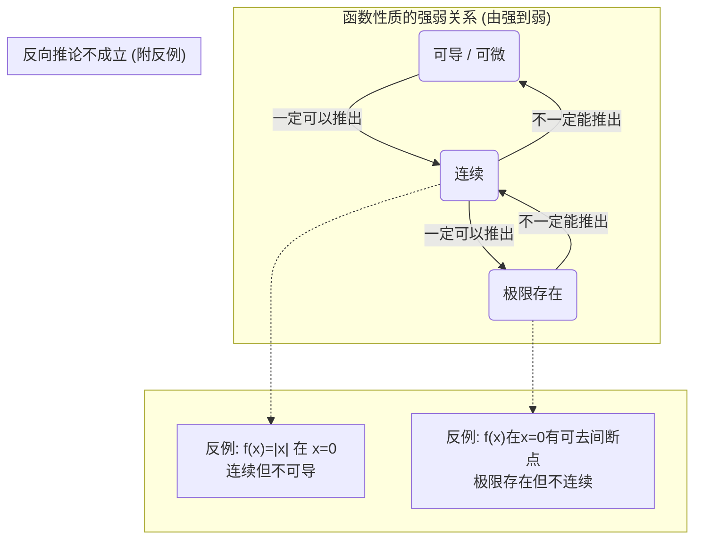

# 常系数线性微分方程解法的完善与归纳

### **常系数线性微分方程求解方法归纳 (完善版)**

#### **核心思想：叠加原理 (Superposition Principle)**

对于一个线性微分方程，其解的结构遵循叠加原理。对于一个非齐次线性微分方程：

**非齐次方程的通解 = 对应的齐次方程的通解 + 非齐次方程的一个特解**

用公式表达为：
$$
y(x) = y_h(x) + y_p(x) 
$$

*   $y_h(x)$ (Homogeneous Solution): **齐次通解**。这是通过将方程右侧设为0求得的解，它包含任意常数（如 $C_1, C_2$），代表了一族函数。
*   $y_p(x)$ (Particular Solution): **非齐次特解**。这是满足完整非齐次方程的任意一个特定解，它不包含任意常数。

因此，求解非齐次方程的核心步骤分为两步：
1.  求解对应的齐次方程的通解 $y_h$。
2.  求解非齐次方程的一个特解 $y_p$。

### **一、一阶常系数线性微分方程**

标准形式为：$y' + py = Q(x)$，其中 $p$ 为常数。

#### **1. 齐次方程：$y' + py = 0$**
*   **解法**：分离变量法。
*   **通解公式**：
    $$
    y_h = C e^{-px} 
    $$

#### **2. 非齐次方程：$y' + py = Q(x)$**
*   **解法**：常数变易法或套用官方积分公式。
*   **通解公式**：
    $$
    y = e^{-px} \left( \int Q(x) e^{px} dx + C \right) 
    $$
    这个公式已经完美地体现了叠加原理：$y = \underbrace{C e^{-px}}_{y_h} + \underbrace{e^{-px} \int Q(x) e^{px} dx}_{y_p}$。

---

### **二、二阶（及高阶）常系数线性微分方程**

标准形式为：$y'' + py' + qy = f(x)$，其中 $p, q$ 为常数。

#### **1. 齐次方程：$y'' + py' + qy = 0$**

**解法**：特征方程法。
1.  写出特征方程：$r^2 + pr + q = 0$。
2.  求解特征方程的根 $r_1$ 和 $r_2$。
3.  根据根的不同情况，写出通解 $y_h$。

**通解 $y_h$ 总结**：

| 特征方程 $r^2 + pr + q = 0$ 的根 | 通解 $y_h$ |
| :--- | :--- |
| **两个不相等的实根** $r_1 \neq r_2$ | $y_h = C_1 e^{r_1 x} + C_2 e^{r_2 x}$ |
| **两个相等的实根** $r_1 = r_2 = r$ | $y_h = (C_1 + C_2 x) e^{rx}$ |
| **一对共轭复根** $r = \alpha \pm i\beta$ | $y_h = e^{\alpha x} (C_1 \cos(\beta x) + C_2 \sin(\beta x))$ |

*注：对于 n 阶齐次方程，就有 n 个特征根，通解是 n 个线性无关解的线性组合。规则与二阶类似。*

---

#### **2. 非齐次方程：$y'' + py' + qy = f(x)$**

**解法**：待定系数法 (Method of Undetermined Coefficients)。
此方法仅适用于 $f(x)$ 是**多项式、指数函数、正弦/余弦函数以及它们的乘积和**的特定形式。

**求解步骤**：
1.  先求出齐次通解 $y_h$。
2.  根据 $f(x)$ 的形式，**猜测**特解 $y_p$ 的形式。
3.  **检查共振**：如果猜测的 $y_p$ 中的某一项已经出现在 $y_h$ 中，则需要对猜测的 $y_p$ 进行修正。
4.  将修正后的 $y_p$ 代入原方程，解出待定系数。

**特解 $y_p$ 形式与修正规则总结**：
 
| $f(x)$ 的形式 | $y_p$ 的猜测形式 | 修正规则 (共振检查) |
| :--- | :--- | :--- |
| **多项式型** $f(x) = P_m(x)$ ($m$次多项式) | $Q_m(x)$ (同次的$m$次多项式) | 如果 $0$ 是特征方程的 $k$ 重根，则 $y_p = x^k Q_m(x)$。 |
| **指数型** $f(x) = A e^{\lambda x}$ | $B e^{\lambda x}$ | 如果 $\lambda$ 是特征方程的 $k$ 重根，则 $y_p = x^k (B e^{\lambda x})$。 |
| **三角函数型** $f(x) = A \cos(\beta x) + B \sin(\beta x)$ | $D \cos(\beta x) + E \sin(\beta x)$ | 如果 $\pm i\beta$ 是特征根，则 $y_p = x (D \cos(\beta x) + E \sin(\beta x))$。 |
| **组合型** $f(x) = e^{\alpha x} P_m(x) \cos(\beta x)$ 或 $f(x) = e^{\alpha x} P_m(x) \sin(\beta x)$ | $e^{\alpha x} [Q_m(x) \cos(\beta x) + R_m(x) \sin(\beta x)]$ | 如果 $\alpha \pm i\beta$ 是特征方程的 $k$ 重根，则 $y_p = x^k \times (\text{上述猜测形式})$。 |

**“修正规则”的本质**：你猜测的特解形式，本质上是想构造一个函数空间，使得它在微分运算下是封闭的且能生成 $f(x)$。如果这个函数空间中的基函数（如 $e^{rx}$）已经是齐次方程的解了，那么它代入左侧算子后会得到0，无法匹配右侧的 $f(x)$。此时需要乘以因子 $x^k$ 来提升其“独立性”，使其不再是齐次方程的解。

---

### **三、常数变易法 (Variation of Parameters)**

当 $f(x)$ 的形式不适用待定系数法时（例如 $f(x) = \tan(x)$ 或 $\frac{1}{x}$），常数变易法是一种更通用的求解特解 $y_p$ 的方法。

对于二阶方程 $y'' + py' + qy = f(x)$，如果齐次解为 $y_h = C_1 y_1(x) + C_2 y_2(x)$，则可以设特解为：
$$ y_p = u_1(x) y_1(x) + u_2(x) y_2(x) $$
其中 $u_1(x)$ 和 $u_2(x)$ 是待求函数，可以通过求解以下方程组得到：

$$
\begin{cases} u_1' y_1 + u_2' y_2 = 0 \\ u_1' y_1' + u_2' y_2' = f(x) \end{cases}
$$

解出 $u_1'$ 和 $u_2'$ 后积分，即可得到 $u_1$ 和 $u_2$，从而构造出 $y_p$。此方法虽然计算复杂，但适用性更广。

# 各类型积分公式与应用归纳

好的，根据您 math.md 文件中的内容，我为您将一重、二重、三重积分以及两类线、面积分的计算公式和核心定理总结在一个表格中，以便于对比和查阅。

---

### **多重积分与场论积分核心公式与定理汇总表**

| 积分类型                 | 基本形式                                                                                 | 物理/几何意义        | 计算公式 (化为低维积分)                                                                                                                                                                 | 核心定理                                                                                                                                                                                                                                                                                                                                               |
| :------------------- | :----------------------------------------------------------------------------------- | :------------- | :---------------------------------------------------------------------------------------------------------------------------------------------------------------------------- | :------------------------------------------------------------------------------------------------------------------------------------------------------------------------------------------------------------------------------------------------------------------------------------------------------------------------------------------------- |
| **一重积分**             | $\int_a^b f(x) \, dx$                                                                | 平面图形面积、变力做功    | 直接计算或使用牛顿-莱布尼茨公式                                                                                                                                                              | **微积分基本定理**                                                                                                                                                                                                                                                                                                                                        |
| **二重积分**             | $\iint_D f(x,y) \, dA$                                                               | 曲顶柱体体积、平面薄片质量  | **直角坐标**: $\iint_D f(x,y) \, dx dy$ **极坐标**: $\iint_{D^*} f(r\cos\theta, r\sin\theta) \, r \, dr d\theta$                                                                  | **Fubini定理** (交换积分次序)                                                                                                                                                                                                                                                                                                                              |
| **三重积分**             | $\iiint_\Omega f(x,y,z) \, dV$                                                       | 空间体体积、物体质量     | **直角坐标**: $\iiint_\Omega f \, dx dy dz$ **柱面坐标**: $\iiint_{\Omega^*} f \, r \, dr d\theta dz$ **球面坐标**: $\iiint_{\Omega^*} f \, \rho^2 \sin\phi \, d\rho d\phi d\theta$ | **Fubini定理** (交换积分次序)                                                                                                                                                                                                                                                                                                                              |
| **第一类线积分** (对弧长)  | $\int_L f(x,y,z) \, ds$                                                              | 曲线构件的质量、曲线弧长   | **参数方程** $L: \mathbf{r}(t), t \in [\alpha, \beta]$ $\int_\alpha^\beta f(\mathbf{r}(t)) \|\mathbf{r}'(t)\| \, dt$                                                           | (无特殊定理)                                                                                                                                                                                                                                                                                                                                            |
| **第二类线积分** (对坐标)  | $\int_L \mathbf{F} \cdot d\mathbf{r}$ 或 $\int_L Pdx+Qdy+Rdz$                   | 变力沿路径所做的**功**  | **参数方程** $L: \mathbf{r}(t), t \in [\alpha, \beta]$ $\int_\alpha^\beta \mathbf{F}(\mathbf{r}(t)) \cdot \mathbf{r}'(t) \, dt$                                                | **格林公式** (平面) $\oint_L Pdx+Qdy = \iint_D (\frac{\partial Q}{\partial x} - \frac{\partial P}{\partial y}) dA$  **斯托克斯公式** (空间) $\oint_L \mathbf{F} \cdot d\mathbf{r} = \iint_\Sigma (\nabla \times \mathbf{F}) \cdot d\mathbf{S}$  **曲线积分基本定理** 若 $\mathbf{F}=\nabla f$, 则 $\int_A^B \mathbf{F} \cdot d\mathbf{r} = f(B)-f(A)$ |
| **第一类曲面积分** (对面积) | $\iint_\Sigma f(x,y,z) \, dS$                                                        | 曲面薄片的质量、曲面面积   | **曲面方程** $\Sigma: z=z(x,y)$ $\iint_{D_{xy}} f(x,y,z(x,y)) \sqrt{1+z_x^2+z_y^2} \, dx dy$                                                                                   | (无特殊定理)                                                                                                                                                                                                                                                                                                                                            |
| **第二类曲面积分** (对坐标) | $\iint_\Sigma \mathbf{F} \cdot d\mathbf{S}$ 或 $\iint_\Sigma Pdydz+Qdzdx+Rdxdy$ | 向量场穿过曲面的**通量** | **曲面方程** $\Sigma: z=z(x,y)$, 法向量 $\mathbf{n}$ $\iint_{D_{xy}} \mathbf{F} \cdot \mathbf{n} \, dx dy$ 或 $\iint_{D_{xy}} (-P z_x - Q z_y + R) \, dx dy$                 | **高斯公式** $\oiint_\Sigma \mathbf{F} \cdot d\mathbf{S} = \iiint_\Omega (\nabla \cdot \mathbf{F}) \, dV$                                                                                                                                                                                                                                           |

#### **核心思想：积分是“无限求和”**
从一维到三维，从直线到曲面，积分的本质都是将研究对象（长度、面积、体积、质量等）分割成无穷多个微元，然后将这些微元的贡献累加起来。不同类型的积分对应着不同维度和形状的微元。

### 一、一重积分 (Single Integral)

*   **基本形式**: $\int_a^b f(x) \, dx$
*   **微元**: 一维线段 $dx$。

| 应用类型 | 直角坐标公式 | 参数方程公式 $x=x(t), y=y(t)$ |
| :--- | :--- | :--- |
| **平面面积** | $A = \int_a^b f(x) \, dx$ | $A = \int_{\alpha}^{\beta} y(t) x'(t) \, dt$ |
| **平面曲线弧长** | $L = \int_a^b \sqrt{1 + [f'(x)]^2} \, dx$ | $L = \int_{\alpha}^{\beta} \sqrt{[x'(t)]^2 + [y'(t)]^2} \, dt$ |
| **旋转体体积** (绕 x 轴) | $V_x = \pi \int_a^b [f(x)]^2 \, dx$ | $V_x = \pi \int_{\alpha}^{\beta} [y(t)]^2 x'(t) \, dt$ |
| **旋转曲面面积** (绕 x 轴) | $S_x = 2\pi \int_a^b f(x) \sqrt{1 + [f'(x)]^2} \, dx$ | $S_x = 2\pi \int_{\alpha}^{\beta} y(t) \sqrt{[x'(t)]^2 + [y'(t)]^2} \, dt$ |

---

### **二、二重积分 (Double Integral)**

*   **基本形式**: $\iint_D f(x,y) \, dA$
*   **微元**: 二维面积元 $dA$。在直角坐标系下为 $dx dy$，在极坐标系下为 $r dr d\theta$。

| 应用类型 | 直角坐标公式 | 极坐标公式 |
| :--- | :--- | :--- |
| **平面区域面积** | $A = \iint_D 1 \, dx dy$ | $A = \iint_{D^*} r \, dr d\theta$ |
| **曲顶柱体体积** (顶为 $z=f(x,y)$) | $V = \iint_D f(x,y) \, dx dy$ | $V = \iint_{D^*} f(r\cos\theta, r\sin\theta) \, r \, dr d\theta$ |
| **空间曲面面积** (曲面为 $z=z(x,y)$) | $S = \iint_D \sqrt{1 + (\frac{\partial z}{\partial x})^2 + (\frac{\partial z}{\partial y})^2} \, dx dy$ | (将 $x,y$ 替换为极坐标) |
| **平面薄片质心** (密度为 $\rho(x,y)$) | **质量**: $M = \iint_D \rho(x,y) \, dA$ **质心**: $\bar{x} = \frac{1}{M}\iint_D x \rho(x,y) \, dA$ $\bar{y} = \frac{1}{M}\iint_D y \rho(x,y) \, dA$ | (将 $x,y,\rho$ 替换为极坐标，并使用 $r dr d\theta$) |

---

### **三、三重积分 (Triple Integral)**

*   **基本形式**: $\iiint_\Omega f(x,y,z) \, dV$
*   **微元**: 三维体积元 $dV$。在直角坐标系下为 $dx dy dz$，柱面坐标系下为 $r dr d\theta dz$，球面坐标系下为 $\rho^2 \sin\phi \, d\rho d\phi d\theta$。

| 应用类型                            | 直角坐标                                                                                                                                                                                                      | 柱面坐标 ($x=r\cos\theta, y=r\sin\theta, z=z$) | 球面坐标 ($x=\rho\sin\phi\cos\theta, \dots$)                       |
| :------------------------------ | :-------------------------------------------------------------------------------------------------------------------------------------------------------------------------------------------------------- | :----------------------------------------- | :------------------------------------------------------------- |
| **空间体体积**                       | $V = \iiint_\Omega 1 \, dx dy dz$                                                                                                                                                                         | $V = \iiint_{\Omega^*} r \, dr d\theta dz$ | $V = \iiint_{\Omega^*} \rho^2 \sin\phi \, d\rho d\phi d\theta$ |
| **空间体质心** (密度为 $\mu(x,y,z)$) | **质量**: $M = \iiint_\Omega \mu \, dV$ **质心**: $\bar{x} = \frac{1}{M}\iiint_\Omega x \mu \, dV$ $\bar{y} = \frac{1}{M}\iiint_\Omega y \mu \, dV$ $\bar{z} = \frac{1}{M}\iiint_\Omega z \mu \, dV$ | (替换为柱面坐标变量和体积元)                            | (替换为球面坐标变量和体积元)                                                |

---

### **四、曲线积分 (Line Integral)**

#### **1. 第一类曲线积分 (对弧长的积分)**
*   **物理意义**: 曲线构件的质量（若 $f$ 为线密度）。
* **基本形式**: $\int_L f(x,y,z) \, ds$​

  

*   **计算方法**: 化为定积分。
    *   **平面参数方程** $L: \begin{cases} x=x(t) \\ y=y(t) \end{cases}, t \in [\alpha, \beta]$
        $$
        \int_L f(x,y) \, ds = \int_\alpha^\beta f(x(t), y(t)) \sqrt{[x'(t)]^2 + [y'(t)]^2} \, dt
        $$
    *   **空间参数方程** $L: \begin{cases} x=x(t) \\ y=y(t) \\ z=z(t) \end{cases}, t \in [\alpha, \beta]$
        $$
        \int_L f(x,y,z) \, ds = \int_\alpha^\beta f(x(t), \dots) \sqrt{[x'(t)]^2 + [y'(t)]^2 + [z'(t)]^2} \, dt 
        $$
*   **应用**:
    *   **弧长**: $L = \int_L 1 \, ds$
    *   **曲线质心**: $\bar{x} = \frac{1}{L} \int_L x \, ds$, $\bar{y} = \frac{1}{L} \int_L y \, ds$, $\bar{z} = \frac{1}{L} \int_L z \, ds$ (假设密度均匀)

#### **2. 第二类曲线积分 (对坐标的积分)**
*   **物理意义**: 变力沿路径所做的功。
*   **基本形式**: $\int_L P(x,y,z) \, dx + Q(x,y,z) \, dy + R(x,y,z) \, dz$
*   **计算方法**: 化为定积分，使用参数方程代入，注意积分方向。
*   
    $$
    \int_\alpha^\beta [P(x(t),\dots)x'(t) + Q(x(t),\dots)y'(t) + R(x(t),\dots)z'(t)] \, dt
    $$
    
*   **重要定理**:
    *   **格林公式 (平面)**: $\oint_L P dx + Q dy = \iint_D \left( \frac{\partial Q}{\partial x} - \frac{\partial P}{\partial y} \right) \, dx dy$ (L为D的正向边界)
    *   **斯托克斯公式 (空间)**: $\oint_L P dx + Q dy + R dz = \iint_\Sigma \left( \frac{\partial R}{\partial y} - \frac{\partial Q}{\partial z} \right) dy dz + \dots$ (L为Σ的正向边界)

---

### **五、曲面积分 (Surface Integral)**

#### **1. 第一类曲面积分 (对面积的积分)**
*   **物理意义**: 曲面薄片的质量（若 $f$ 为面密度）。
*   **基本形式**: $\iint_\Sigma f(x,y,z) \, dS$
*   **计算方法**: 化为二重积分。
    
    *   **曲面方程** $\Sigma: z=z(x,y)$, 投影到 $D_{xy}$
        $$
        \iint_\Sigma f(x,y,z) \, dS = \iint_{D_{xy}} f(x,y,z(x,y)) \sqrt{1 + (\frac{\partial z}{\partial x})^2 + (\frac{\partial z}{\partial y})^2} \, dx dy
        $$
*   **应用**:
    *   **曲面面积**: $S = \iint_\Sigma 1 \, dS$
    *   **曲面质心**: $\bar{x} = \frac{1}{S} \iint_\Sigma x \, dS$, $\bar{y} = \frac{1}{S} \iint_\Sigma y \, dS$, $\bar{z} = \frac{1}{S} \iint_\Sigma z \, dS$ (假设密度均匀)

#### **2. 第二类曲面积分 (对坐标的积分)**
*   **物理意义**: 向量场穿过曲面的通量。
*   **基本形式**: $\iint_\Sigma P \, dy dz + Q \, dz dx + R \, dx dy$
*   **计算方法**: 核心思想是**化为二重积分**。通常有以下两种等价的计算路径：

    **方法一：统一投影法 (推荐)**
    这是最通用和系统的方法。它将三个分量积分合并为一个关于曲面法向量的二重积分。

    1.  **确定曲面方程与法向量**：
        将曲面 $\Sigma$ 表示为显式方程，例如 $z = z(x,y)$。其法向量为 $\mathbf{n} = \pm (-\frac{\partial z}{\partial x}, -\frac{\partial z}{\partial y}, 1)$。根据题目要求的曲面侧（如上侧、下侧、外侧、内侧）来确定法向量的正负号。例如，取上侧时，法向量的 $z$ 分量应为正，故取 $\mathbf{n} = (-\frac{\partial z}{\partial x}, -\frac{\partial z}{\partial y}, 1)$。

    2.  **构造被积函数**：
        将向量场 $\mathbf{F} = (P, Q, R)$ 与法向量 $\mathbf{n}$ 进行点乘。

    3.  **化为二重积分**：
        在曲面在 $xy$ 平面的投影区域 $D_{xy}$ 上进行积分。
        $$
        \iint_\Sigma P dy dz + Q dz dx + R dx dy = \iint_{D_{xy}} \left[ -P \frac{\partial z}{\partial x} - Q \frac{\partial z}{\partial y} + R \right] \, dx dy 
        $$
        *注意：公式中的 $P, Q, R$ 和偏导数都需要代入曲面方程 $z=z(x,y)$。*

    **方法二：分别投影法 (分步计算)**
    这是将总积分拆成三个部分，分别计算每个分量对相应坐标平面的通量。

    4.  **计算对 $xy$ 平面的通量**:
        $$
        \iint_\Sigma R(x,y,z) \, dx dy = \pm \iint_{D_{xy}} R(x,y,z(x,y)) \, dx dy 
        $$
        **符号规则**: 曲面法向量与 $z$ 轴正向的夹角为锐角（指向 $z$ 轴正向）时取 `+`，为钝角时取 `-`。

    5.  **计算对 $yz$ 平面的通量**:
        $$
        \iint_\Sigma P(x,y,z) \, dy dz = \pm \iint_{D_{yz}} P(x(y,z),y,z) \, dy dz 
        $$
        **符号规则**: 曲面法向量与 $x$ 轴正向的夹角为锐角时取 `+`，为钝角时取 `-`。

    6.  **计算对 $zx$ 平面的通量**:
        $$
        \iint_\Sigma Q(x,y,z) \, dz dx = \pm \iint_{D_{zx}} Q(x,y(z,x),z) \, dz dx 
        $$
        **符号规则**: 曲面法向量与 $y$ 轴正向的夹角为锐角时取 `+`，为钝角时取 `-`。

    7.  **求和**: 将三部分结果相加。如果曲面在某个坐标平面上的投影退化为一条线或一个点（例如垂直于该坐标平面的柱面），则该分量的积分为0。

*   **重要定理**:
    
    *   **高斯公式**: $\oiint_\Sigma P \, dy dz + Q \, dz dx + R \, dx dy = \iiint_\Omega \left( \frac{\partial P}{\partial x} + \frac{\partial Q}{\partial y} + \frac{\partial R}{\partial z} \right) \, dV$ (Σ为Ω的封闭外侧曲面)

### 六、向量微积分基本定理与核心算子

这部分内容将曲线积分和曲面积分与微分算子（梯度、散度、旋度）联系起来，构成了向量微积分的核心。

#### 1. 梯度 (Gradient)

*   **定义**: 梯度作用于一个**标量场** $f(x,y,z)$，返回一个**向量场**。
*   **物理意义**: 梯度向量指向标量场 $f$ **增长最快**的方向，其大小为该方向上的变化率。
*   **公式**:
    $$
    \nabla f = \text{grad} \, f = \frac{\partial f}{\partial x} \mathbf{i} + \frac{\partial f}{\partial y} \mathbf{j} + \frac{\partial f}{\partial z} \mathbf{k} 
    $$
    其中 $\nabla = \frac{\partial}{\partial x} \mathbf{i} + \frac{\partial}{\partial y} \mathbf{j} + \frac{\partial}{\partial z} \mathbf{k}$ 是Nabla算子。

#### 2. 散度 (Divergence)

*   **定义**: 散度作用于一个**向量场** $\mathbf{F} = P\mathbf{i} + Q\mathbf{j} + R\mathbf{k}$，返回一个**标量场**。
*   **物理意义**: 散度衡量了向量场在某一点的“源”或“汇”的强度。正散度表示该点是源头（向外发散），负散度表示该点是汇点（向内汇聚），零散度表示无源无汇。
*   **公式**:
    $$
    \nabla \cdot \mathbf{F} = \text{div} \, \mathbf{F} = \frac{\partial P}{\partial x} + \frac{\partial Q}{\partial y} + \frac{\partial R}{\partial z} 
    $$
*   **与高斯公式的联系**: 高斯公式 $\oiint_\Sigma \mathbf{F} \cdot d\mathbf{S} = \iiint_\Omega (\nabla \cdot \mathbf{F}) \, dV$ 表明：一个区域的**散度之和**（体积内的总源汇强度）等于穿过该区域边界的**总通量**。

#### 3. 旋度 (Curl)

*   **定义**: 旋度作用于一个**向量场** $\mathbf{F} = P\mathbf{i} + Q\mathbf{j} + R\mathbf{k}$，返回另一个**向量场**。
*   **物理意义**: 旋度衡量了向量场在某一点的**旋转程度**。旋度向量的方向是旋转轴的方向（遵循右手定则），其大小表示旋转的快慢。
*   **公式**:
    $$
    \nabla \times \mathbf{F} = \text{curl} \, \mathbf{F} = \begin{vmatrix} \mathbf{i} & \mathbf{j} & \mathbf{k} \\ \frac{\partial}{\partial x} & \frac{\partial}{\partial y} & \frac{\partial}{\partial z} \\ P & Q & R \end{vmatrix} = \left(\frac{\partial R}{\partial y} - \frac{\partial Q}{\partial z}\right)\mathbf{i} + \left(\frac{\partial P}{\partial z} - \frac{\partial R}{\partial x}\right)\mathbf{j} + \left(\frac{\partial Q}{\partial x} - \frac{\partial P}{\partial y}\right)\mathbf{k} 
    $$
*   **与斯托克斯公式的联系**: 斯托克斯公式 $\oint_L \mathbf{F} \cdot d\mathbf{r} = \iint_\Sigma (\nabla \times \mathbf{F}) \cdot d\mathbf{S}$ 表明：一个曲面上的**旋度之和**（曲面上的总旋转效应）等于向量场沿该曲面边界的**环流量**。

#### 4. 曲线积分基本定理 (Fundamental Theorem for Line Integrals)

该定理是微积分基本定理向多维空间的推广，它将一个**梯度场**（也称**保守场**）的路径积分与路径端点的标量势函数值联系起来。

*   **定理内容**: 如果向量场 $\mathbf{F}$ 是一个连续的梯度场，即存在一个标量函数 $f$ 使得 $\mathbf{F} = \nabla f$，那么 $\mathbf{F}$ 沿任意分段光滑曲线 $L$ 从点 $A$ 到点 $B$ 的线积分只与起点和终点有关，而与路径无关。
*   **公式**:
    $$
    \int_L \mathbf{F} \cdot d\mathbf{r} = \int_L \nabla f \cdot d\mathbf{r} = f(B) - f(A) 
    $$
*   **保守场判据**: 在单连通区域内，一个连续可微的向量场 $\mathbf{F}$ 是保守场的充分必要条件是其**旋度为零**，即 $\nabla \times \mathbf{F} = \mathbf{0}$。

是的，对于两个同阶的方阵 A 和 B，如果 `AB = C`，那么可以推出 `|A||B| = |C|`。

这是一个非常重要的行列式定理，通常被称为**行列式乘法定理**或**柯西-比内公式 (Binet-Cauchy Theorem)**。

**定理：设 A, B 均为 n 阶方阵，则 `det(AB) = det(A) * det(B)`。**

---

# 矩阵行列式性质与定理

1. **转置行列式**
   *   **定理**: 矩阵的行列式与其转置矩阵的行列式相等。
   *   **公式**: $|A^T| = |A|$

2. **逆矩阵行列式**
   *   **定理**: 如果矩阵 A 可逆，那么其逆矩阵的行列式等于其原行列式的倒数。
   *   **公式**: $|A^{-1}| = \frac{1}{|A|}$ 或 $|A^{-1}| = |A|^{-1}$
   *   **推导**: 因为 $A A^{-1} = I$ (单位矩阵)，所以 $|A||A^{-1}| = |I| = 1$。

3. **数乘行列式**
   *   **定理**: n 阶方阵 A 乘以一个数 k，其行列式等于 $k^n$ 乘以原行列式。
   *   **公式**: $|kA| = k^n |A|$
   *   **理解**: 这是因为矩阵的数乘是每个元素都乘以 k，相当于行列式的每一行（或每一列）都提出了一个因子 k，总共有 n 行（或 n 列）。

4. **行列式与行/列变换**
   *   **互换两行/列**: 行列式的值变号。
   *   **某一行/列乘以 k**: 行列式的值也乘以 k。
   *   **将某一行/列的倍数加到另一行/列**: 行列式的值**不变**。这是计算行列式时最常用的性质。

5. **行列式为零的条件**
   *   **定理**: 矩阵 A 可逆（非奇异）的充分必要条件是 $|A| \neq 0$。反之，矩阵 A 不可逆（奇异）的充分必要条件是 $|A| = 0$。
   *   **其他推论**:
       *   若矩阵有两行/列成比例或完全相同，则其行列式为零。
       *   若矩阵有一行/列为零向量，则其行列式为零。
       *   若矩阵的行向量组或列向量组线性相关，则其行列式为零。

6. **三角矩阵的行列式**

   *   **定理**: 上三角矩阵或下三角矩阵的行列式等于其主对角线上所有元素的乘积。

7. **分块矩阵的行列式**
   *   **定理**: 对于特定形式的分块矩阵，有简便的计算公式。例如：
       $$
       \begin{vmatrix} A & B \\ 0 & D \end{vmatrix} = |A||D| \quad \text{或} \quad \begin{vmatrix} A & 0 \\ C & D \end{vmatrix} = |A||D|
       $$
       其中 A 和 D 必须是方阵。

8. 乘法定理:根据您文件中的内容，您所指的**行列式乘法定理**（也称柯西-比内公式）是关于方阵行列式的一个核心性质。

   1.  **定理内容**：对于两个同阶的 n 阶方阵 A 和 B，它们乘积的行列式，等于它们各自的行列式的乘积。
   2.  **公式表示**：如果 $A$ 和 $B$ 都是 n 阶方阵，则：

   $$
   \det(AB) = \det(A) \cdot \det(B) 
   $$

   3. 或者用 `| |` 符号表示：
   $$
   |AB| = |A| |B|
   $$

   ---
   
   # 拐点、极值点、驻点、鞍点的定义与判定
   
   这些概念都是用来描述函数局部性质的关键点。驻点是基础，极值点和鞍点是驻点的细分，而拐点则描述了曲线的凹凸性变化。
   
   #### **1. 驻点 (Stationary Point)**
   
   *   **定义**:
       *   **一元函数 $y=f(x)$**: 使一阶导数 $f'(x) = 0$ 的点。
       *   **二元函数 $z=f(x,y)$**: 使两个一阶偏导数同时为零的点，即 $\frac{\partial f}{\partial x} = 0$ 且 $\frac{\partial f}{\partial y} = 0$。
   *   **几何意义**: 函数在该点的切线（或切平面）是水平的。
   *   **重要性**: 驻点是函数**可能**取得极值的地方，因此是寻找极值的**候选点**。但驻点不一定是极值点。
   
   #### **2. 极值点 (Extremum Point)**
   
   *   **定义**: 函数在一个点的函数值是其附近所有点中最大（极大值）或最小（极小值）的点。
   *   **关系**: 可导函数的极值点**必定是驻点**。但驻点不一定是极值点（例如 $y=x^3$ 在 $x=0$ 处是驻点但不是极值点）。
   *   **判定方法 (一元函数)**:
       1.  **第一步**: 找到所有驻点（令 $f'(x)=0$）和一阶导数不存在的点。这些是极值嫌疑点。
       2.  **第二步**: 使用以下方法之一进行检验：
           *   **第一充分条件 (一阶导数法)**: 设 $x_0$ 是一个嫌疑点。
               *   若在 $x_0$ 左侧 $f'(x) > 0$，右侧 $f'(x) < 0$（由正变负），则 $f(x_0)$ 是**极大值**。
               *   若在 $x_0$ 左侧 $f'(x) < 0$，右侧 $f'(x) > 0$（由负变正），则 $f(x_0)$ 是**极小值**。
               *   若两侧符号不改变，则不是极值点。
           *   **第二充分条件 (二阶导数法)**: 设 $x_0$ 是一个**驻点**（$f'(x_0)=0$）。
               *   若 $f''(x_0) < 0$，则 $f(x_0)$ 是**极大值**。
               *   若 $f''(x_0) > 0$，则 $f(x_0)$ 是**极小值**。
               *   若 $f''(x_0) = 0$，此方法失效，需用第一充分条件判断。
   
   #### **3. 拐点 (Inflection Point)**
   
   *   **定义**: 连续曲线上**凹凸性发生改变**的点。
   *   **几何意义**: 曲线在该点从“向上弯曲”变为“向下弯曲”，或者反之。切线在该点会“穿过”曲线。
   *   **判定方法 (一元函数)**:
       1.  **第一步 (必要条件)**: 找出所有使二阶导数 $f''(x) = 0$ 或 $f''(x)$ 不存在的点。这些是拐点的嫌疑点。
       2.  **第二步 (充分条件)**: 设 $x_0$ 是一个嫌疑点。
           *   检查 $x_0$ 两侧 $f''(x)$ 的符号。如果符号**相反**，则 $(x_0, f(x_0))$ 是一个拐点。
           *   如果 $f''(x_0)=0$ 且三阶导数 $f'''(x_0) \neq 0$，则 $(x_0, f(x_0))$ 是一个拐点。
   
   #### **4. 鞍点 (Saddle Point)**
   
   *   **定义**: 鞍点是**二元（或多元）函数**的一个**驻点**，但它**不是极值点**。
   *   **几何意义**: 在这个点，函数在一个方向上（例如沿着x轴）看起来像是一个极小值点，而在另一个方向上（例如沿着y轴）看起来像是一个极大值点。曲面形状酷似一个马鞍，因此得名。
   *   **判定方法 (二元函数)**:
       1.  **第一步**: 找到驻点 $(x_0, y_0)$，即解方程组 $\frac{\partial f}{\partial x} = 0, \frac{\partial f}{\partial y} = 0$。
       2.  **第二步**: 计算在驻点 $(x_0, y_0)$ 处的三个二阶偏导数的值：
           $$ A = \frac{\partial^2 f}{\partial x^2}, \quad B = \frac{\partial^2 f}{\partial x \partial y}, \quad C = \frac{\partial^2 f}{\partial y^2} $$
       3.  **第三步**: 计算判别式 $\Delta = AC - B^2$。
           *   若 $\Delta > 0$ 且 $A > 0$，则 $(x_0, y_0)$ 是**极小值点**。
           *   若 $\Delta > 0$ 且 $A < 0$，则 $(x_0, y_0)$ 是**极大值点**。
           *   若 $\Delta < 0$，则 $(x_0, y_0)$ 是**鞍点**。
           *   若 $\Delta = 0$，此方法失效，需要用其他方法（如直接观察该点邻域的函数值）来判断。

# 奇函数的所有原函数都是偶函数

这是一个非常重要的定积分性质。我们从意思、证明和特例三个方面来理解它。

*   **奇函数 (Odd Function)**: 函数图像关于原点对称，满足 $f(-x) = -f(x)$。例如 $y=x, y=\sin(x)$。
*   **偶函数 (Even Function)**: 函数图像关于 y 轴对称，满足 $F(-x) = F(x)$。例如 $y=x^2, y=\cos(x)$。
*   **原函数 (Antiderivative)**: 如果 $F'(x) = f(x)$，则 $F(x)$ 是 $f(x)$ 的一个原函数。

这句话的完整、严谨的表述应该是：**奇函数在对称区间 `[-a, a]` 上的定积分结果为0；并且，如果一个奇函数的原函数存在，那么在它所有的原函数中，有且仅有一个是偶函数。**

让我们来分析这个更精确的说法：
1.  **为什么不是“所有”原函数都是偶函数？**
    *   一个函数的原函数有无穷多个，它们之间只相差一个常数 $C$，即 $F(x) + C$。
    *   例如，$f(x) = x$ 是一个奇函数。它的原函数是 $F(x) = \frac{1}{2}x^2 + C$。
    *   只有当常数 $C=0$ 时，$F(x) = \frac{1}{2}x^2$ 是一个偶函数。如果 $C=1$，那么 $F(x) = \frac{1}{2}x^2 + 1$ 也是偶函数。
    *   **修正与澄清**：实际上，如果 $F(x)$ 是偶函数，那么 $F(x)+C$ 也是偶函数，因为常数项不影响对称性。所以更准确的说法是：**奇函数的原函数族 $F(x)+C$ 中，只要有一个是偶函数，则所有原函数都是偶函数。** 关键在于证明至少存在一个偶函数的原函数。

2.  **如何证明存在一个偶函数的原函数？**
    *   我们构造一个变上限积分函数作为它的一个特定原函数：$F(x) = \int_0^x f(t) \, dt$。
    *   要证明 $F(x)$ 是偶函数，我们只需证明 $F(-x) = F(x)$。
    *   $F(-x) = \int_0^{-x} f(t) \, dt$。
    *   做变量代换，令 $t = -u$，则 $dt = -du$。积分上下限变为：当 $t=0$ 时 $u=0$；当 $t=-x$ 时 $u=x$。
    *   代入得：$F(-x) = \int_0^x f(-u) \, (-du)$。
    *   因为 $f$ 是奇函数，所以 $f(-u) = -f(u)$。
    *   $F(-x) = \int_0^x (-f(u)) \, (-du) = \int_0^x f(u) \, du = F(x)$。
    *   证明完毕。$F(x) = \int_0^x f(t) \, dt$ 是一个偶函数。因此，该奇函数的所有原函数 $F(x)+C$ 都是偶函数。

**结论总结**：
*   **性质1**: 奇函数在对称区间的定积分为0。$\int_{-a}^a f(x) \, dx = 0$。
*   **性质2**: 奇函数的所有原函数均为偶函数。
*   **类似地**: 偶函数在对称区间的定积分等于半区间积分的两倍。其原函数中，有且仅有一个是奇函数（即常数项C为0的那个）。

---

# 级数

## 关于级数收敛、条件收敛和绝对收敛的性质与判别方法的归纳总结

.
当判断 $g''(x)$ 在 $x=0$ 附近的符号时，如果直接看很复杂，可以将其在 $x=0$ 处进行泰勒展开，通过观察展开式的前几项（低阶项）来判断其在 $x=0$ 附近的符号，这是一种常用的高级技巧。

---

### **级数的敛散性、性质与判别法**

#### **1. 基本概念与关系**

对于一个无穷级数 $\sum_{n=1}^{\infty} u_n$：

*   **收敛 (Convergence)**:
    *   **定义**: 级数的部分和序列 $S_n = \sum_{k=1}^{n} u_k$ 存在一个有限的极限 $S$，即 $\lim_{n \to \infty} S_n = S$。
    *   **性质**: 收敛级数的通项必须趋于0 ($\lim_{n \to \infty} u_n = 0$)。这是级数收敛的**必要条件**，但不是充分条件（例如调和级数 $\sum \frac{1}{n}$ 发散，但通项趋于0）。

*   **绝对收敛 (Absolute Convergence)**:
    *   **定义**: 将级数的每一项取绝对值后，得到的新级数 $\sum_{n=1}^{\infty} |u_n|$ 收敛。
    *   **性质**:
        1.  **绝对收敛必定收敛**。
        2.  绝对收敛的级数可以**任意调换求和次序**，其和不变。
        3.  绝对收敛级数的运算性质更接近有限和。

*   **条件收敛 (Conditional Convergence)**:
    *   **定义**: 级数 $\sum_{n=1}^{\infty} u_n$ 本身收敛，但其绝对值级数 $\sum_{n=1}^{\infty} |u_n|$ 发散。
    *   **性质**:
        1.  条件收敛级数**不能任意调换求和次序**。调换次序可能导致和改变，甚至发散（黎曼重排定理）。
        2.  通常出现在正负项交错的级数中。

**三者关系总结**:
*   一个级数收敛，它要么是**绝对收敛**，要么是**条件收敛**。
*   判断一个级数 $\sum u_n$ 的收敛类型，通常分两步：
    1.  先判断 $\sum |u_n|$ 是否收敛。若是，则原级数**绝对收敛**。
    2.  若 $\sum |u_n|$ 发散，再判断 $\sum u_n$ 本身是否收敛（通常用莱布尼茨判别法）。若是，则原级数**条件收敛**；若否，则原级数**发散**。

#### **2. 级数收敛的判别方法**

| 判别法名称           | 适用对象                            | 方法与结论                                                                                                                                                                                | 备注                                        |
| :-------------- | :------------------------------ | :----------------------------------------------------------------------------------------------------------------------------------------------------------------------------------- | :---------------------------------------- |
| **发散检验法**（必要条件） | 任意级数                            | 若 $\lim_{n\to\infty} u_n \neq 0$ 或极限不存在，则级数**发散**。                                                                                                                                   | 只能用于证明发散，不能证明收敛。                          |
| **几何级数**        | $\sum ar^{n-1}$                 | 当 $\|r\|<1$ 时**收敛**，和为 $\dfrac{a}{1-r}$；当 $\|r\|\ge 1$ 时**发散**。                                                                                                                      | 基本模型，非常重要。                                |
| **p-级数**        | $\sum \dfrac{1}{n^p}$           | 当 $p>1$ 时**收敛**；当 $p\le 1$ 时**发散**。                                                                                                                                                  | 常用于比较判别法的参考级数。                            |
| **比较判别法**       | 正项级数                            | 若 $0\le u_n\le v_n$，则： 1. 若 $\sum v_n$ 收敛，则 $\sum u_n$ **收敛**（大收小必收）。 2. 若 $\sum u_n$ 发散，则 $\sum v_n$ **发散**（小发大必发）。                                                           | 需要找到合适的已知级数进行比较。                          |
| **极限比较法**       | 正项级数                            | 设 $L=\lim_{n\to\infty}\dfrac{u_n}{v_n}$。 1. 若 $0<L<\infty$，则两者**同敛散**。 2. 若 $L=0$ 且 $\sum v_n$ 收敛，则 $\sum u_n$ **收敛**。 3. 若 $L=\infty$ 且 $\sum v_n$ 发散，则 $\sum u_n$ **发散**。 | 比比较判别法更常用、更方便。                            |
| **比值判别法**（达朗贝尔） | 任意级数（常用于判断绝对收敛）                 | 设 $\rho=\lim_{n\to\infty}\left\|\dfrac{u_{n+1}}{u_n}\right\|$。 1. 若 $\rho<1$，级数**绝对收敛**。 2. 若 $\rho>1$，级数**发散**。 3. 若 $\rho=1$，判别法**无结论**。                                  | 对含阶乘 $n!$ 或指数 $a^n$ 的级数特别有效。              |
| **根值判别法**（柯西）   | 任意级数（常用于判断绝对收敛）                 | 设 $\rho=\lim_{n\to\infty}\sqrt[n]{\|u_n\|}$。 1. 若 $\rho<1$，级数**绝对收敛**。 2. 若 $\rho>1$，级数**发散**。 3. 若 $\rho=1$，判别法**无结论**。                                                    | 对含 $u_n=(\dots)^n$ 形式的级数特别有效。             |
| **积分判别法**       | 正项级数                            | 设 $f(x)$ 在 $[1,\infty)$ 上连续、正值、单调递减，且 $f(n)=u_n$。则 $\sum_{n=1}^\infty u_n$ 与反常积分 $\int_1^\infty f(x)\,dx$ **同敛散**。                                                                   | 常用于证明 p-级数的敛散性。                           |
| **交错级数法**（莱布尼茨） | 交错级数 $\sum (-1)^n u_n$（$u_n>0$） | 若 $u_{n+1}\le u_n$（单调递减）且 $\lim_{n\to\infty}u_n=0$，则级数**收敛**。                                                                                                                        | 只能证明条件收敛；若 $\sum u_n$ 也收敛，则为绝对收敛，否则为条件收敛。 |

### 常见敛散级数

### **等价无穷小、p-级数与常见敛散级数归纳**

#### **1. `n/(n^2+1)` 的等价无穷小为什么是 `1/n`？**

这个问题涉及到在 $n \to \infty$ 时，如何抓取无穷小量的“主要部分”。

*   **直观理解（抓大头）**:
    当 $n$ 变得非常非常大时，分母 `n^2 + 1` 中的 `+1` 相比于 `n^2` 来说就无足轻重了，可以忽略不计。
    *   分母：$n^2 + 1 \approx n^2$
    *   所以，整个式子：$\frac{n}{n^2+1} \approx \frac{n}{n^2} = \frac{1}{n}$
    这种“抓大头”的方法在处理多项式比值时非常有效。

*   **严格数学证明**:
    根据等价无穷小的定义，我们需要证明 $\lim_{n \to \infty} \frac{\frac{n}{n^2+1}}{\frac{1}{n}} = 1$。
    $$
    \lim_{n \to \infty} \frac{\frac{n}{n^2+1}}{\frac{1}{n}} = \lim_{n \to \infty} \frac{n}{n^2+1} \cdot \frac{n}{1} = \lim_{n \to \infty} \frac{n^2}{n^2+1}
    $$
    分子分母同时除以 $n^2$：
    $$
    = \lim_{n \to \infty} \frac{\frac{n^2}{n^2}}{\frac{n^2}{n^2}+\frac{1}{n^2}} = \lim_{n \to \infty} \frac{1}{1+\frac{1}{n^2}} = \frac{1}{1+0} = 1
    $$
    因为极限为1，所以当 $n \to \infty$ 时，$\frac{n}{n^2+1} \sim \frac{1}{n}$。

#### **2. p-级数收敛判断**

**p-级数**是指形如 $\sum_{n=1}^{\infty} \frac{1}{n^p}$ 的级数。它的敛散性完全由指数 $p$ 的值决定，是判断其他级数敛散性的一个重要“标尺”。

*   **判别法则**:
    *   当 **$p > 1$** 时，p-级数**收敛**。
    *   当 **$p \le 1$** 时，p-级数**发散**。

*   **记忆技巧**:
    你可以把 $p=1$ 的情况，即**调和级数** $\sum \frac{1}{n}$，作为分界线。调和级数是发散的，所以任何比它“更发散”（$p<1$）的级数也一定是发散的。只有比它“更收敛”（$p>1$）的级数才可能收敛。

#### **3. 常见收敛与发散级数举例**

掌握一些典型的敛散级数模型，对于使用比较判别法和极限比较法至关重要。

| 类型       | 敛散性      | 例子                                                                                      |     |                    |
| :------- | :------- | :-------------------------------------------------------------------------------------- | --- | ------------------ |
| **收敛级数** |          |                                                                                         |     |                    |
| 几何级数     | **收敛**   | $\sum_{n=1}^{\infty} (\frac{1}{2})^n$ (公比 $\|r\|=\frac{1}{2} < 1$) |
| p-级数     | **收敛**   | $\sum_{n=1}^{\infty} \frac{1}{n^2}$ (p=2 > 1)                                           |     |                    |
| 交错级数     | **条件收敛** | $\sum_{n=1}^{\infty} \frac{(-1)^{n-1}}{n}$ (交错调和级数，满足莱布尼茨判别法)                           |     |                    |
| 泰勒级数     | **绝对收敛** | $\sum_{n=0}^{\infty} \frac{x^n}{n!}$ (对于任意固定的x)                                         |     |                    |
| **发散级数** |          |                                                                                         |     |                    |
| 通项不为0    | **发散**   | $\sum_{n=1}^{\infty} \frac{n}{n+1}$ (因为 $\lim_{n \to \infty} \frac{n}{n+1} = 1 \neq 0$) |     |                    |
| 几何级数     | **发散**   | $\sum_{n=1}^{\infty} 2^n$ (公比 $\|r\|=2 \ge 1$)|
| p-级数     | **发散**   | $\sum_{n=1}^{\infty} \frac{1}{n}$ (调和级数, p=1)                                           |     |                    |
| p-级数     | **发散**   | $\sum_{n=1}^{\infty} \frac{1}{\sqrt{n}}$ (p=1/2 < 1)                                    |     |                    |

## **泰勒展开 (Taylor Expansion) **

### 基本通式

泰勒展开是一个用**多项式函数**去逼近一个光滑函数的方法。其核心思想是，只要一个函数足够光滑（即有足够多阶的导数），那么在某一点附近，它的值可以由该点的函数值以及各阶导数值来唯一确定。

#### **(1) 泰勒公式的通式**

设函数 $f(x)$ 在点 $x_0$ 的某个邻域内具有直到 $n+1$ 阶的导数，则对该邻域内的任意一点 $x$，有：
$$
f(x) = \sum_{k=0}^{n} \frac{f^{(k)}(x_0)}{k!} (x-x_0)^k + R_n(x)
$$
这个公式被称为 **$f(x)$ 在点 $x_0$ 处的 n 阶泰勒公式**。

*   **展开式部分**:
    $$
    f(x_0) + \frac{f'(x_0)}{1!}(x-x_0) + \frac{f''(x_0)}{2!}(x-x_0)^2 + \dots + \frac{f^{(n)}(x_0)}{n!}(x-x_0)^n
    $$
    这部分是一个 $n$ 次多项式，称为**泰勒多项式**。
    *   $f^{(k)}(x_0)$ 表示函数 $f(x)$ 在点 $x_0$ 处的 $k$ 阶导数。($f^{(0)}(x_0)$ 就是 $f(x_0)$ 本身)。
    *   $k!$ 表示 $k$ 的阶乘。

*   **余项部分 $R_n(x)$**:
    这是用 $n$ 阶多项式近似 $f(x)$ 时产生的误差。余项有多种形式，最常用的是**拉格朗日余项**：
    $$
    R_n(x) = \frac{f^{(n+1)}(\xi)}{(n+1)!} (x-x_0)^{n+1}
    $$
    其中 $\xi$ 是介于 $x_0$ 和 $x$ 之间的某个值。

#### **(2) 麦克劳林公式 (Maclaurin's Formula)**

当泰勒展开的中心点 $x_0 = 0$ 时，就得到一个特殊而常用的形式，称为**麦克劳林公式**。
$$
f(x) = \sum_{k=0}^{n} \frac{f^{(k)}(0)}{k!} x^k + R_n(x)
$$
展开式为：
$$
f(x) = f(0) + \frac{f'(0)}{1!}x + \frac{f''(0)}{2!}x^2 + \dots + \frac{f^{(n)}(0)}{n!}x^n + \frac{f^{(n+1)}(\xi)}{(n+1)!}x^{n+1}
$$
其中 $\xi$ 介于 $0$ 和 $x$ 之间。

**例如，图片中分析 $g(x)$ 的拐点时，就用到了泰勒展开的思想。**
当判断 $g''(x)$ 在 $x=0$ 附近的符号时，如果直接看很复杂，可以将其在 $x=0$ 处进行泰勒展开，通过观察展开式的前几项（低阶项）来判断其在 $x=0$ 附近的符号，这是一种常用的高级技巧。

### 常见函数的麦克劳林展开式

以下是一些在求解极限、近似计算和级数问题时非常重要的函数的麦克劳林展开式。在求极限时，它们常被用来处理“0/0”型未定式，作为等价无穷小的推广。

| 函数 (Function)   | 麦克劳林级数 (通项)                                                                 | 展开式                                                            | 收敛域                  |     |
| :-------------- | :-------------------------------------------------------------------------- | :------------------------------------------------------------- | :------------------- | --- |
| $e^x$           | $\sum_{n=0}^{\infty} \frac{x^n}{n!}$                                        | $1 + x + \frac{x^2}{2!} + \frac{x^3}{3!} + \dots$              | $(-\infty, +\infty)$ |     |
| $\sin x$        | $\sum_{n=0}^{\infty} \frac{(-1)^n}{(2n+1)!} x^{2n+1}$                       | $x - \frac{x^3}{3!} + \frac{x^5}{5!} - \frac{x^7}{7!} + \dots$ | $(-\infty, +\infty)$ |     |
| $\cos x$        | $\sum_{n=0}^{\infty} \frac{(-1)^n}{(2n)!} x^{2n}$                           | $1 - \frac{x^2}{2!} + \frac{x^4}{4!} - \frac{x^6}{6!} + \dots$ | $(-\infty, +\infty)$ |     |
| $\ln(1+x)$      | $\sum_{n=1}^{\infty} \frac{(-1)^{n-1}}{n} x^n$                              | $x - \frac{x^2}{2} + \frac{x^3}{3} - \frac{x^4}{4} + \dots$    | $(-1, 1]$            |     |
| $\frac{1}{1-x}$ | $\sum_{n=0}^{\infty} x^n$                                                   | $1 + x + x^2 + x^3 + \dots$                                    | $(-1, 1)$            |     |
| $\frac{1}{1+x}$ | $\sum_{n=0}^{\infty} (-1)^n x^n$                                            | $1 - x + x^2 - x^3 + \dots$                                    | $(-1, 1)$            |     |
| $(1+x)^\alpha$  | $1 + \sum_{n=1}^{\infty} \frac{\alpha(\alpha-1)\cdots(\alpha-n+1)}{n!} x^n$ | $1 + \alpha x + \frac{\alpha(\alpha-1)}{2!}x^2 + \dots$        | $(-1, 1)$            |     |

# 常用等价无穷小

### **常用等价无穷小总结**

等价无穷小是求解极限，特别是处理 "0/0" 型未定式时的强大工具。当 $x \to 0$ 时，如果 $\lim_{x \to 0} \frac{f(x)}{g(x)} = 1$，则称 $f(x)$ 与 $g(x)$ 是等价无穷小，记作 $f(x) \sim g(x)$。

**替换原理**: 在求极限的**乘除运算**中，一个无穷小量因子可以被其等价无穷小量替换。**注意**：在加减运算中，除非能确保替换后不为零（即不是高阶无穷小的相减），否则不能随意替换，否则可能导致错误。

以下所有等价关系均在 $x \to 0$ 的条件下成立。

| 函数 (Function)                      | 等价无穷小 (Equivalent Infinitesimal) | 备注 (来自于泰勒展开的前几项)                                                       |
| :--------------------------------- | :------------------------------- | :--------------------------------------------------------------------- |
| $\sin x$                           | $x$                              | $\sin x = x - \frac{x^3}{6} + o(x^3)$                                  |
| $\tan x$                           | $x$                              | $\tan x = x + \frac{x^3}{3} + o(x^3)$                                  |
| $\arcsin x$                        | $x$                              | $\arcsin x = x + \frac{x^3}{6} + o(x^3)$                               |
| $\arctan x$                        | $x$                              | $\arctan x = x - \frac{x^3}{3} + o(x^3)$                               |
| $1 - \cos x$                       | $\frac{1}{2}x^2$                 | $\cos x = 1 - \frac{x^2}{2} + \frac{x^4}{24} + o(x^4)$                 |
| $\ln(1+x)$                         | $x$                              | $\ln(1+x) = x - \frac{x^2}{2} + o(x^2)$                                |
| $e^x - 1$                          | $x$                              | $e^x = 1 + x + \frac{x^2}{2} + o(x^2)$                                 |
| $a^x - 1$                          | $x \ln a$                        | $a^x = e^{x \ln a} \sim 1 + x \ln a$                                   |
| $(1+x)^\alpha - 1$                 | $\alpha x$                       | $(1+x)^\alpha = 1 + \alpha x + \frac{\alpha(\alpha-1)}{2}x^2 + o(x^2)$ |
| $(1+bx)^\alpha - 1$                | $\alpha b x$                     | 是上一条的推广                                                                |
| $\log_a(1+x)$                      | $\frac{x}{\ln a}$                | $\log_a(1+x) = \frac{\ln(1+x)}{\ln a} \sim \frac{x}{\ln a}$            |
| $x - \sin x$                       | $\frac{1}{6}x^3$                 | 泰勒展开式相减                                                                |
| $x - \tan x$                       | $-\frac{1}{3}x^3$                | 泰勒展开式相减                                                                |
| $x - \arcsin x$                    | $-\frac{1}{6}x^3$                | 泰勒展开式相减                                                                |
| $x - \arctan x$                    | $\frac{1}{3}x^3$                 | 泰勒展开式相减                                                                |
| $x - \ln(1+x) \sim \frac{x^2}{2}.$ | $\frac{x^2}{2}$                  |                                                                        |
|                                    |                                  |                                                                        |

# 极限、可微、可导、连续

---

### **极限、连续、可导、可微的定义与关系**

这四个概念是微积分的基石，描述了函数性质从弱到强的递进关系。

#### **1. 极限存在 (Limit Exists)**

*   **定义**: 当自变量 $x$ 从点 $x_0$ 的两侧无限逼近 $x_0$ 时，函数值 $f(x)$ 无限逼近于一个**确定的常数** $L$。
*   **判定 (充要条件)**: 函数在某点的极限存在的充分必要条件是，该点的**左极限**和**右极限**都存在且**相等**。
    $$
    \lim_{x \to x_0} f(x) = L \iff \lim_{x \to x_0^-} f(x) = \lim_{x \to x_0^+} f(x) = L 
    $$
*   **几何意义**: 函数图像在 $x_0$ 点附近，从左右两边都“汇聚”到同一个高度，但这一点本身**可以没有定义**（即图像上可能是一个空心点）。

#### **2. 连续 (Continuous)**

*   **定义**: 函数在点 $x_0$ 处连续，需满足以下**三个条件**：
    1.  $f(x)$ 在 $x_0$ 点**有定义**，即 $f(x_0)$ 存在。
    2.  $f(x)$ 在 $x_0$ 点的**极限存在**，即 $\lim_{x \to x_0} f(x)$ 存在。
    3.  极限值**等于**函数值，即 $\lim_{x \to x_0} f(x) = f(x_0)$。
*   **判定**: 同时检验以上三个条件。
*   **几何意义**: 函数图像在 $x_0$ 点是**没有断开**的，可以“一笔画”过去。它不仅汇聚到一点，而且该点是实心的。

#### **3. 可导 (Differentiable)**

*   **定义**: 函数在点 $x_0$ 处的导数存在。导数定义为函数增量与自变量增量之比的极限，即：
    $$ f'(x_0) = \lim_{\Delta x \to 0} \frac{f(x_0 + \Delta x) - f(x_0)}{\Delta x} $$
*   **判定 (充要条件)**: 函数在某点可导的充分必要条件是，该点的**左导数**和**右导数**都存在且**相等**。
    *   左导数: $f'_{-}(x_0) = \lim_{\Delta x \to 0^-} \frac{f(x_0 + \Delta x) - f(x_0)}{\Delta x}$
    *   右导数: $f'_{+}(x_0) = \lim_{\Delta x \to 0^+} \frac{f(x_0 + \Delta x) - f(x_0)}{\Delta x}$
*   **几何意义**: 函数图像在 $x_0$ 点存在**唯一且不垂直的切线**。这意味着图像在该点是“光滑”的，没有尖点或拐角。

#### **4. 可微 (Differentiable)**

*   **定义**: 函数在点 $x_0$ 的增量 $\Delta y = f(x_0 + \Delta x) - f(x_0)$ 可以表示为一个关于自变量增量 $\Delta x$ 的**线性主部**和一个比 $\Delta x$ 更高阶的无穷小 $o(\Delta x)$ 之和。
    $$
    \Delta y = A \cdot \Delta x + o(\Delta x) 
    $$
    其中 $A$ 是一个不依赖于 $\Delta x$ 的常数。
*   **判定**: 对于一元函数，**可微与可导是完全等价的概念**。
    *   如果函数可导，那么上述定义中的常数 $A$ 就是导数 $f'(x_0)$。
    *   反之，如果函数可微，那么它的导数也必定存在且等于 $A$。

---

### **四者关系总结**

这是一个从强到弱的单向链条：

**可导 (可微) $\implies$ 连续 $\implies$ 极限存在**

*   **可导一定连续**:
    *   **证明**: 如果一个函数可导，那么它的图像在某点是光滑的，必然是连续不断的。
    *   **反例**: 连续不一定可导。最经典的例子是 $f(x) = |x|$ 在 $x=0$ 点。它在该点是连续的，但图像有一个尖点，左导数为-1，右导数为1，两者不相等，故不可导。

*   **连续一定极限存在**:
    *   **证明**: 这是由连续的定义直接决定的。连续的三个条件中就包含了“极限存在”这一条。
    *   **反例**: 极限存在不一定连续。例如，函数 $f(x) = \begin{cases} x^2, & x \neq 0 \\ 1, & x=0 \end{cases}$。在 $x=0$ 点，极限 $\lim_{x \to 0} f(x) = 0$ 存在，但函数值 $f(0)=1$，极限不等于函数值，所以不连续。

**总结图示**:

好的，这是一个非常核心且重要的微积分概念，被称为**变上限积分函数**。我将为您详细解释它的含义和求导方法。

---

### **变上限积分 $\int_0^x f(t) \, dt$ 的含义与求导**

#### **1. 这是什么意思？**

表达式 $\int_0^x f(t) \, dt$ 定义了一个**新的函数**。我们通常可以把它记作 $F(x)$，即：
$$ F(x) = \int_0^x f(t) \, dt $$

*   **数学含义**:
    这个新函数 $F(x)$ 的功能是：对于你输入的每一个 $x$ 值，它会计算出函数 $f(t)$ 从下限 $0$ 到这个 $x$ 值的定积分。
    *   $t$ 是**积分变量**（也叫哑变量），它只在积分的计算过程中有意义，计算完毕后就消失了。
    *   $x$ 是这个新函数 $F(x)$ 的**自变量**。随着 $x$ 的变化，积分的上限在变，因此积分的结果（函数值 $F(x)$）也在变。

*   **几何含义 (更直观)**:
    如果 $f(t)$ 在区间 $[0, x]$ 上非负，那么 $F(x)$ 就代表了由曲线 $y=f(t)$、t轴、以及直线 $t=0$ 和 $t=x$ 所围成的**曲边梯形的面积**。
    *   你可以想象，当 $x$ 从 0 开始慢慢增大的时候，这个面积也在不断地累积和变化。因此，这个**面积本身就是关于上限 $x$ 的一个函数**。

    
    *(上图直观地展示了当 x 增加一个小量 Δx 时，面积函数 F(x) 的增量 ΔA)*

#### **2. 如何对它求导？**

对变上限积分函数求导是**微积分基本定理 (Fundamental Theorem of Calculus)** 的核心内容之一。这个定理揭示了微分和积分是一对互逆的运算。

**基本公式**:
$$
\frac{d}{dx} \left( \int_a^x f(t) \, dt \right) = f(x)
$$
其中 $a$ 是一个常数。

**规则解释**:
对一个“下限为常数，上限为自变量 $x$”的积分函数求导，结果就是**直接把被积函数中的积分变量 $t$ 换成上限 $x$**。

**示例**:
*   若 $F(x) = \int_0^x t^2 \, dt$，则 $F'(x) = x^2$。
*   若 $G(x) = \int_2^x \sin(t) \, dt$，则 $G'(x) = \sin(x)$。

---

#### **推广：更复杂情况的求导**

如果积分的上下限不是简单的 $x$，而是关于 $x$ 的函数，比如 $\int_{a(x)}^{b(x)} f(t) \, dt$，则需要使用链式法则。

令 $H(x) = \int_{a(x)}^{b(x)} f(t) \, dt$，并设 $F(t)$ 是 $f(t)$ 的一个原函数，则：
$H(x) = F(b(x)) - F(a(x))$

根据链式法则对两边求导：
$H'(x) = F'(b(x)) \cdot b'(x) - F'(a(x)) \cdot a'(x)$

因为 $F'(t) = f(t)$，所以我们得到**通用求导公式**：
$$
\frac{d}{dx} \left( \int_{a(x)}^{b(x)} f(t) \, dt \right) = f(b(x)) \cdot b'(x) - f(a(x)) \cdot a'(x)
$$

**规则解释**:
(被积函数代入**上限**) $\times$ (**上限的导数**) - (被积函数代入**下限**) $\times$ (**下限的导数**)

**示例**:
*   求 $\frac{d}{dx} \left( \int_1^{x^2} \cos(t) \, dt \right)$
    *   上限是 $x^2$，其导数为 $2x$。
    *   下限是 $1$，其导数为 $0$。
    *   结果为: $\cos(x^2) \cdot (2x) - \cos(1) \cdot (0) = 2x \cos(x^2)$。

好的，这是一个非常核心且重要的微积分概念，被称为**变上限积分函数**。我将为您详细解释它的含义和求导方法。

---

### **变上限积分 $\int_0^x f(t) \, dt$ 的含义与求导**

#### **1. 这是什么意思？**

表达式 $\int_0^x f(t) \, dt$ 定义了一个**新的函数**。我们通常可以把它记作 $F(x)$，即：
$$ F(x) = \int_0^x f(t) \, dt $$

*   **数学含义**:
    这个新函数 $F(x)$ 的功能是：对于你输入的每一个 $x$ 值，它会计算出函数 $f(t)$ 从下限 $0$ 到这个 $x$ 值的定积分。
    *   $t$ 是**积分变量**（也叫哑变量），它只在积分的计算过程中有意义，计算完毕后就消失了。
    *   $x$ 是这个新函数 $F(x)$ 的**自变量**。随着 $x$ 的变化，积分的上限在变，因此积分的结果（函数值 $F(x)$）也在变。

*   **几何含义 (更直观)**:
    如果 $f(t)$ 在区间 $[0, x]$ 上非负，那么 $F(x)$ 就代表了由曲线 $y=f(t)$、t轴、以及直线 $t=0$ 和 $t=x$ 所围成的**曲边梯形的面积**。
    *   你可以想象，当 $x$ 从 0 开始慢慢增大的时候，这个面积也在不断地累积和变化。因此，这个**面积本身就是关于上限 $x$ 的一个函数**。

    
    *(上图直观地展示了当 x 增加一个小量 Δx 时，面积函数 F(x) 的增量 ΔA)*

#### **2. 如何对它求导？**

对变上限积分函数求导是**微积分基本定理 (Fundamental Theorem of Calculus)** 的核心内容之一。这个定理揭示了微分和积分是一对互逆的运算。

**基本公式**:
$$
\frac{d}{dx} \left( \int_a^x f(t) \, dt \right) = f(x)
$$
其中 $a$ 是一个常数。

**规则解释**:
对一个“下限为常数，上限为自变量 $x$”的积分函数求导，结果就是**直接把被积函数中的积分变量 $t$ 换成上限 $x$**。

**示例**:
*   若 $F(x) = \int_0^x t^2 \, dt$，则 $F'(x) = x^2$。
*   若 $G(x) = \int_2^x \sin(t) \, dt$，则 $G'(x) = \sin(x)$。

---

#### **推广：更复杂情况的求导**

如果积分的上下限不是简单的 $x$，而是关于 $x$ 的函数，比如 $\int_{a(x)}^{b(x)} f(t) \, dt$，则需要使用链式法则。

令 $H(x) = \int_{a(x)}^{b(x)} f(t) \, dt$，并设 $F(t)$ 是 $f(t)$ 的一个原函数，则：
$H(x) = F(b(x)) - F(a(x))$

根据链式法则对两边求导：
$H'(x) = F'(b(x)) \cdot b'(x) - F'(a(x)) \cdot a'(x)$

因为 $F'(t) = f(t)$，所以我们得到**通用求导公式**：
$$
\frac{d}{dx} \left( \int_{a(x)}^{b(x)} f(t) \, dt \right) = f(b(x)) \cdot b'(x) - f(a(x)) \cdot a'(x)
$$

**规则解释**:
(被积函数代入**上限**) $\times$ (**上限的导数**) - (被积函数代入**下限**) $\times$ (**下限的导数**)

**示例**:
*   求 $\frac{d}{dx} \left( \int_1^{x^2} \cos(t) \, dt \right)$
    *   上限是 $x^2$，其导数为 $2x$。
    *   下限是 $1$，其导数为 $0$。
    *   结果为: $\cos(x^2) \cdot (2x) - \cos(1) \cdot (0) = 2x \cos(x^2)$。
*   

好的，这是一个非常核心且重要的微积分概念，被称为**变上限积分函数**。我将为您详细解释它的含义和求导方法。

---

### **变上限积分 $\int_0^x f(t) \, dt$ 的含义与求导**

#### **1. 这是什么意思？**

表达式 $\int_0^x f(t) \, dt$ 定义了一个**新的函数**。我们通常可以把它记作 $F(x)$，即：
$$ F(x) = \int_0^x f(t) \, dt $$

*   **数学含义**:
    这个新函数 $F(x)$ 的功能是：对于你输入的每一个 $x$ 值，它会计算出函数 $f(t)$ 从下限 $0$ 到这个 $x$ 值的定积分。
    *   $t$ 是**积分变量**（也叫哑变量），它只在积分的计算过程中有意义，计算完毕后就消失了。
    *   $x$ 是这个新函数 $F(x)$ 的**自变量**。随着 $x$ 的变化，积分的上限在变，因此积分的结果（函数值 $F(x)$）也在变。

*   **几何含义 (更直观)**:
    如果 $f(t)$ 在区间 $[0, x]$ 上非负，那么 $F(x)$ 就代表了由曲线 $y=f(t)$、t轴、以及直线 $t=0$ 和 $t=x$ 所围成的**曲边梯形的面积**。
    *   你可以想象，当 $x$ 从 0 开始慢慢增大的时候，这个面积也在不断地累积和变化。因此，这个**面积本身就是关于上限 $x$ 的一个函数**。

    
    *(上图直观地展示了当 x 增加一个小量 Δx 时，面积函数 F(x) 的增量 ΔA)*

#### **2. 如何对它求导？**

对变上限积分函数求导是**微积分基本定理 (Fundamental Theorem of Calculus)** 的核心内容之一。这个定理揭示了微分和积分是一对互逆的运算。

**基本公式**:
$$
\frac{d}{dx} \left( \int_a^x f(t) \, dt \right) = f(x)
$$
其中 $a$ 是一个常数。

**规则解释**:
对一个“下限为常数，上限为自变量 $x$”的积分函数求导，结果就是**直接把被积函数中的积分变量 $t$ 换成上限 $x$**。

**示例**:
*   若 $F(x) = \int_0^x t^2 \, dt$，则 $F'(x) = x^2$。
*   若 $G(x) = \int_2^x \sin(t) \, dt$，则 $G'(x) = \sin(x)$。

---

#### **推广：更复杂情况的求导**

如果积分的上下限不是简单的 $x$，而是关于 $x$ 的函数，比如 $\int_{a(x)}^{b(x)} f(t) \, dt$，则需要使用链式法则。

令 $H(x) = \int_{a(x)}^{b(x)} f(t) \, dt$，并设 $F(t)$ 是 $f(t)$ 的一个原函数，则：
$H(x) = F(b(x)) - F(a(x))$

根据链式法则对两边求导：
$H'(x) = F'(b(x)) \cdot b'(x) - F'(a(x)) \cdot a'(x)$

因为 $F'(t) = f(t)$，所以我们得到**通用求导公式**：
$$
\frac{d}{dx} \left( \int_{a(x)}^{b(x)} f(t) \, dt \right) = f(b(x)) \cdot b'(x) - f(a(x)) \cdot a'(x)
$$

**规则解释**:
(被积函数代入**上限**) $\times$ (**上限的导数**) - (被积函数代入**下限**) $\times$ (**下限的导数**)

**示例**:
*   求 $\frac{d}{dx} \left( \int_1^{x^2} \cos(t) \, dt \right)$
    *   上限是 $x^2$，其导数为 $2x$。
    *   下限是 $1$，其导数为 $0$。
    *   结果为: $\cos(x^2) \cdot (2x) - \cos(1) \cdot (0) = 2x \cos(x^2)$。

# 统计特征

*   **自由度 $d = n - r$** 代表了解在满足所有约束后，“剩余的自由度”。
    *   0个剩余自由度 $\implies$ 被锁定在一个点上。
    *   1个剩余自由度 $\implies$ 可以在一条直线上自由移动。
    *   2个剩余自由度 $\implies$ 可以在一个平面上自由移动。

---

# 概率论与数理统计核心

### **随机变量的数字特征：期望、方差、协方差与相关系数**

这些数字特征是描述一个或多个随机变量概率分布的“概况”的关键指标。

#### **1. 期望 (Expectation)**

期望是随机变量取值的“加权平均值”，反映了随机变量取值的中心趋势。

*   **基本性质**:
    *   $E[c] = c$ (常数的期望是其本身)
    *   $E[cX] = cE[X]$ (常数可以提出)
    *   $E[X+Y] = E[X] + E[Y]$ (和的期望等于期望的和，**此性质与独立性无关**)
*   **乘法性质**:
    *   **若 $X, Y$ 相互独立**，则 $E[XY] = E[X]E[Y]$。
    *   反之不一定成立。

#### **2. 方差 (Variance)**

方差衡量了随机变量取值与其期望值的偏离程度，即“离散程度”。

*   **定义**: $\text{Var}(X) = E\left[ (X - E[X])^2 \right]$
*   **计算公式 (常用)**: $\text{Var}(X) = E[X^2] - (E[X])^2$
*   **基本性质**:
    *   $\text{Var}(c) = 0$ (常数没有波动)
    *   $\text{Var}(X+c) = \text{Var}(X)$ (平移不改变离散程度)
    *   $\text{Var}(cX) = c^2\text{Var}(X)$ (常数以平方倍提出)

#### **3. 协方差 (Covariance)**

协方差衡量了两个随机变量的**线性相关程度**和方向。

*   **定义**: $\text{Cov}(X, Y) = E\left[ (X - E[X])(Y - E[Y]) \right]$
*   **计算公式 (常用)**: $\text{Cov}(X, Y) = E[XY] - E[X]E[Y]$
*   **含义**:
    *   $\text{Cov}(X, Y) > 0$: $X$ 和 $Y$ 倾向于向**相同方向**变化（正相关）。
    *   $\text{Cov}(X, Y) < 0$: $X$ 和 $Y$ 倾向于向**相反方向**变化（负相关）。
    *   $\text{Cov}(X, Y) = 0$: $X$ 和 $Y$ **线性不相关**。
*   **重要性质**:
    *   **若 $X, Y$ 相互独立**，则 $\text{Cov}(X, Y) = 0$。反之不一定成立（不相关不一定独立）。
    *   $\text{Cov}(X, X) = \text{Var}(X)$ (变量与自身的协方差是其方差)。
    *   $\text{Cov}(aX, bY) = ab\text{Cov}(X, Y)$。

#### **4. 方差的和差公式 (核心关系)**

这是连接单个变量方差与多个变量方差的桥梁。

*   **通用公式**:
    $$
    \text{Var}(aX \pm bY) = a^2\text{Var}(X) + b^2\text{Var}(Y) \pm 2ab\text{Cov}(X, Y)
    $$
    *   **加法**: $\text{Var}(X + Y) = \text{Var}(X) + \text{Var}(Y) + 2\text{Cov}(X, Y)$
    *   **减法**: $\text{Var}(X - Y) = \text{Var}(X) + \text{Var}(Y) - 2\text{Cov}(X, Y)$

*   **重要特例：当 X 和 Y 相互独立 (或不相关) 时**
    此时 $\text{Cov}(X, Y) = 0$，公式极大简化：
    $$
    \text{Var}(aX \pm bY) = a^2\text{Var}(X) + b^2\text{Var}(Y)
    $$
    **注意**: 只要变量相互独立，和的方差等于方差的和，差的方差**也等于**方差的和。

#### **5. 相关系数 (Correlation Coefficient)**

相关系数是“标准化”的协方差，它消除了量纲的影响，更纯粹地度量两个变量之间的**线性相关性强弱**。

*   **定义与公式**:
    $$
    \rho_{XY} = \frac{\text{Cov}(X, Y)}{\sqrt{\text{Var}(X)}\sqrt{\text{Var}(Y)}}
    $$
*   **性质与含义**:
    *   **取值范围**: $-1 \le \rho_{XY} \le 1$。
    *   $|\rho_{XY}|$ 越接近 1，表示线性关系越强。
    *   $|\rho_{XY}|$ 越接近 0，表示线性关系越弱。
    *   $\rho_{XY} = 1$: 完全正线性相关。
    *   $\rho_{XY} = -1$: 完全负线性相关。
    *   $\rho_{XY} = 0$: 线性不相关。
*   

# **常用概率分布 (Common Probability Distributions)**

### **1. 离散型随机变量分布**

| 分布名称                     | 符号与参数               | 概率质量函数 (PMF)                                 | 期望 E(X)       | 方差 Var(X)         | 典型应用场景                        |
| :----------------------- | :------------------ | :------------------------------------------- | :------------ | :---------------- | :---------------------------- |
| **0-1分布** (Bernoulli) | $X \sim B(1, p)$    | $P(X=k) = p^k(1-p)^{1-k}$ ($k=0,1$)       | $p$           | $p(1-p)$          | 单次试验的成功与失败，如抛一次硬币。            |
| **二项分布** (Binomial)   | $X \sim B(n, p)$    | $P(X=k) = C_n^k p^k (1-p)^{n-k}$             | $np$          | $np(1-p)$         | n次独立重复试验中成功k次的概率。             |
| **泊松分布** (Poisson)    | $X \sim P(\lambda)$ | $P(X=k) = \frac{\lambda^k e^{-\lambda}}{k!}$ | $\lambda$     | $\lambda$         | 单位时间/空间内某事件发生的次数，如一小时内到达的顾客数。 |
| **几何分布** (Geometric)  | $X \sim G(p)$       | $P(X=k) = (1-p)^{k-1}p$                      | $\frac{1}{p}$ | $\frac{1-p}{p^2}$ | 在独立重复试验中，首次成功发生在第k次的概率。       |

**分布间的关系与性质**:
*   **二项分布与0-1分布**: 二项分布是n个独立的、服从同一0-1分布的随机变量之和。
*   **泊松分布近似二项分布**: 当二项分布的 $n$ 很大，$p$ 很小时（通常 $n \ge 20, p \le 0.05$），可以用泊松分布近似，其中 $\lambda = np$。

---

### **2. 连续型随机变量分布**

| 分布名称 | 符号与参数 | 概率密度函数 (PDF) | 期望 E(X) | 方差 Var(X) | 典型应用场景 |
| :--- | :--- | :--- | :--- | :--- | :--- |
| **均匀分布** (Uniform) | $X \sim U(a, b)$ | $f(x) = \begin{cases} \frac{1}{b-a}, & a < x < b \\ 0, & \text{其他} \end{cases}$ | $\frac{a+b}{2}$ | $\frac{(b-a)^2}{12}$ | 在一个区间内取值的概率是均等的，如随机数生成。 |
| **指数分布** (Exponential) | $X \sim E(\lambda)$ | $f(x) = \begin{cases} \lambda e^{-\lambda x}, & x > 0 \\ 0, & x \le 0 \end{cases}$ | $\frac{1}{\lambda}$ | $\frac{1}{\lambda^2}$ | 独立事件发生的时间间隔，如电子元件的寿命、两次电话呼叫的间隔。 |
| **正态分布** (Normal/Gaussian) | $X \sim N(\mu, \sigma^2)$ | $f(x) = \frac{1}{\sqrt{2\pi}\sigma} e^{-\frac{(x-\mu)^2}{2\sigma^2}}$ | $\mu$ | $\sigma^2$ | 自然界和社会科学中大量现象的分布模型，如身高、测量误差。 |

**分布间的关系与性质**:
* **指数分布的无记忆性**: 指数分布的一个关键特性是“无记忆性”，即 $P(X > s+t | X > s) = P(X > t)$。例如，一个已经工作了s小时的灯泡，还能继续工作t小时的概率，与一个新灯泡能工作t小时的概率相同。

*   **正态分布的标准化**:
    *   任何一个服从 $N(\mu, \sigma^2)$ 的正态分布，都可以通过线性变换 $Z = \frac{X-\mu}{\sigma}$ 转化为**标准正态分布** $Z \sim N(0, 1)$。
    *   标准正态分布的密度函数为 $\phi(z) = \frac{1}{\sqrt{2\pi}} e^{-z^2/2}$。
    
*   **正态分布的线性组合**:
    
    *   若 $X \sim N(\mu_1, \sigma_1^2)$，$Y \sim N(\mu_2, \sigma_2^2)$，且 $X, Y$ 相互独立，则它们的线性组合仍然服从正态分布：
    
        $$
        aX + bY \sim N(a\mu_1 + b\mu_2, a^2\sigma_1^2 + b^2\sigma_2^2)
        $$

好的，根据您 math.md 文件中的内容，这里是对泊松分布近似二项分布方法的简要总结。

---

### **泊松分布近似二项分布方法总结**

当二项分布 $B(n, p)$ 的计算因 $n$ 过大而复杂时，可用泊松分布 $P(\lambda)$ 进行简化计算。

*   **使用条件**:
    *   试验次数 **n 很大** (通常 $n \ge 20$)
    *   单次成功概率 **p 很小** (通常 $p \le 0.05$)

*   **核心方法**:
    1.  确定泊松分布的参数 $\lambda$。
    2.  该参数的值等于原二项分布的期望值：
        $$
        \lambda = np
        $$
    3.  然后使用泊松分布的概率公式进行近似计算：
        $$
        P(X=k) \approx \frac{\lambda^k e^{-\lambda}}{k!}
        $$

---

### **区间估计 (Interval Estimation)**

区间估计是参数估计的两种基本类型之一（另一种是点估计）。它不是给出一个参数的估计值，而是提供一个**区间范围**，并给出一个**置信水平**（如95%），表明我们有多大的信心相信这个区间包含了真实的、未知的总体参数。

#### **核心思想与步骤**

1.  **寻找一个合适的枢轴量 (Pivotal Quantity)**:
    *   枢轴量是一个包含样本统计量和待估参数的函数。
    *   最关键的是，这个枢轴量的**概率分布是已知的**，并且**不依赖于任何未知参数**。常见的枢轴量服从正态分布、t分布或$\chi^2$分布。

2.  **确定置信水平与临界值**:
    *   给定置信水平 $1-\alpha$（例如，95%时 $\alpha=0.05$）。
    *   根据枢轴量的分布，找到两个临界值，使得枢轴量落在这两个临界值之间的概率为 $1-\alpha$。例如，对于标准正态分布，我们找 $z_{\alpha/2}$ 使得 $P(-z_{\alpha/2} < Z < z_{\alpha/2}) = 1-\alpha$。

3.  **反解不等式**:
    *   从上一步得到的不等式中，通过代数变换，将待估参数分离出来，使其位于不等式的中间。这样得到的就是待估参数的置信区间。

#### **常用参数的区间估计公式总结**

假设样本来自正态总体 $N(\mu, \sigma^2)$，样本大小为 $n$，样本均值为 $\bar{X}$，样本方差为 $S^2$。

| 待估参数                | 已知/未知条件       | 枢轴量及其分布                                          | 置信水平为 $1-\alpha$ 的置信区间                             |
| :---------------------- | :------------------ | :------------------------------------------------------ | :----------------------------------------------------------- |
| **总体均值 $\mu$**      | **$\sigma^2$ 已知** | $Z = \frac{\bar{X} - \mu}{\sigma/\sqrt{n}} \sim N(0,1)$ | $\left( \bar{X} - z_{\alpha/2} \frac{\sigma}{\sqrt{n}}, \ \bar{X} + z_{\alpha/2} \frac{\sigma}{\sqrt{n}} \right)$ |
| **总体均值 $\mu$**      | **$\sigma^2$ 未知** | $T = \frac{\bar{X} - \mu}{S/\sqrt{n}} \sim t(n-1)$      | $\left( \bar{X} - t_{\alpha/2}(n-1) \frac{S}{\sqrt{n}}, \ \bar{X} + t_{\alpha/2}(n-1) \frac{S}{\sqrt{n}} \right)$ |
| **总体方差 $\sigma^2$** | **$\mu$ 未知**      | $\chi^2 = \frac{(n-1)S^2}{\sigma^2} \sim \chi^2(n-1)$   | $\left( \frac{(n-1)S^2}{\chi^2_{\alpha/2}(n-1)}, \ \frac{(n-1)S^2}{\chi^2_{1-\alpha/2}(n-1)} \right)$ |

**符号说明**:

*   $z_{\alpha/2}$: 标准正态分布的上 $\alpha/2$ 分位数，满足 $P(Z > z_{\alpha/2}) = \alpha/2$。
*   $t_{\alpha/2}(n-1)$: t分布（自由度为 $n-1$）的上 $\alpha/2$ 分位数。
*   $\chi^2_{\alpha/2}(n-1)$: $\chi^2$分布（自由度为 $n-1$）的上 $\alpha/2$ 分位数。

**记忆要点**:

*   估计均值 $\mu$ 时，看方差 $\sigma^2$ 是否已知：**已知用Z分布，未知用t分布**。
*   估计方差 $\sigma^2$ 时，用 **$\chi^2$分布**。
*   置信区间的通用形式是：**点估计量 $\pm$ 临界值 $\times$ 标准误**（对于均值估计）。
*   $\chi^2$分布是不对称的，所以其置信区间的两个临界值需要分别查找，并且公式是除法形式，分子是样本方差相关的量，分母是临界值。

// ...existing code...
*   $\chi^2$分布是不对称的，所以其置信区间的两个临界值需要分别查找，并且公式是除法形式，分子是样本方差相关的量，分母是临界值。

---

# 傅里叶级数 (Fourier Series)

傅里叶级数的核心思想是：任何一个周期为 $2L$ 的周期函数 $f(x)$（或定义在 $[-L, L]$ 上的函数），只要满足一定条件（狄利克雷条件），就可以展开成一个由正弦和余弦函数组成的无穷级数。

### **一、傅里叶级数基本公式 (周期为 $2L$)**

$$
f(x) \sim \frac{a_0}{2} + \sum_{n=1}^{\infty} \left( a_n \cos\left(\frac{n\pi x}{L}\right) + b_n \sin\left(\frac{n\pi x}{L}\right) \right)
$$

其中，傅里叶系数 $a_0, a_n, b_n$ 由以下积分公式确定：

*   **直流分量 $a_0$**:
    $$
    a_0 = \frac{1}{L} \int_{-L}^{L} f(x) \, dx
    $$

*   **余弦分量系数 $a_n$**:
    $$
    a_n = \frac{1}{L} \int_{-L}^{L} f(x) \cos\left(\frac{n\pi x}{L}\right) \, dx \quad (n=1, 2, 3, \dots)
    $$

*   **正弦分量系数 $b_n$**:
    $$
    b_n = \frac{1}{L} \int_{-L}^{L} f(x) \sin\left(\frac{n\pi x}{L}\right) \, dx \quad (n=1, 2, 3, \dots)
    $$

> **注意**：如果周期是 $2\pi$，则 $L=\pi$，上述公式中的 $\frac{n\pi x}{L}$ 就简化为 $nx$。

### **二、如何求解分段函数的傅里叶级数**

对于分段函数，其傅里叶系数的计算方法不变，关键在于**将积分区间分段进行计算**。

**求解步骤**:

1.  **确定周期和 L**:
    *   如果函数是周期函数，确定其周期 $2L$。
    *   如果函数只在 $[-L, L]$ 上有定义，则直接使用该 $L$。

2.  **计算系数 $a_0, a_n, b_n$**:
    *   根据函数的分段点，将上述三个积分公式拆分成几段定积分之和。
    *   例如，如果 $f(x) = \begin{cases} f_1(x), & -L < x < 0 \\ f_2(x), & 0 < x < L \end{cases}$，那么计算 $a_n$ 的积分就需要拆分：
        $$
        a_n = \frac{1}{L} \left[ \int_{-L}^{0} f_1(x) \cos\left(\frac{n\pi x}{L}\right) \, dx + \int_{0}^{L} f_2(x) \cos\left(\frac{n\pi x}{L}\right) \, dx \right]
        $$
    *   分别计算这几段积分，然后求和，得到最终的系数。

### **三、利用奇偶性简化计算**

这是求解傅里-叶级数时**最重要、最常用的技巧**。如果定义在对称区间 $[-L, L]$ 上的函数具有奇偶性，可以极大简化计算。

**判别依据**:
*   **偶函数 $\times$ 偶函数 = 偶函数**  ($\cos \times \cos$)
*   **奇函数 $\times$ 奇函数 = 偶函数**  ($\sin \times \sin$)
*   **偶函数 $\times$ 奇函数 = 奇函数**  ($\cos \times \sin$)

**积分性质**:
*   奇函数在对称区间的积分为 0: $\int_{-L}^{L} (\text{奇函数}) \, dx = 0$
*   偶函数在对称区间的积分等于半区间积分的2倍: $\int_{-L}^{L} (\text{偶函数}) \, dx = 2 \int_{0}^{L} (\text{偶函数}) \, dx$

#### **1. 当 $f(x)$ 是偶函数时**

*   $f(x)$ 是偶函数，$\cos(\frac{n\pi x}{L})$ 也是偶函数，所以 $f(x)\cos(\frac{n\pi x}{L})$ 是**偶函数**。
*   $f(x)$ 是偶函数，$\sin(\frac{n\pi x}{L})$ 是奇函数，所以 $f(x)\sin(\frac{n\pi x}{L})$ 是**奇函数**。

**结论 (偶函数展开为余弦级数)**:
*   $b_n = \frac{1}{L} \int_{-L}^{L} (\text{奇函数}) \, dx = 0$  (**所有正弦项系数为0**)
*   $a_0 = \frac{2}{L} \int_{0}^{L} f(x) \, dx$
*   $a_n = \frac{2}{L} \int_{0}^{L} f(x) \cos\left(\frac{n\pi x}{L}\right) \, dx$

#### **2. 当 $f(x)$ 是奇函数时**

*   $f(x)$ 是奇函数，$\cos(\frac{n\pi x}{L})$ 是偶函数，所以 $f(x)\cos(\frac{n\pi x}{L})$ 是**奇函数**。
*   $f(x)$ 是奇函数，$\sin(\frac{n\pi x}{L})$ 也是奇函数，所以 $f(x)\sin(\frac{n\pi x}{L})$ 是**偶函数**。

结论 (奇函数展开为正弦级数)：

*   $a_0 = \frac{1}{L} \int_{-L}^{L} (\text{奇函数}) \, dx = 0$
*   $a_n = \frac{1}{L} \int_{-L}^{L} (\text{奇函数}) \, dx = 0$  (**所有余弦项系数和直流分量为0**)
*   $b_n = \frac{2}{L} \int_{0}^{L} f(x) \sin\left(\frac{n\pi x}{L}\right) \, dx$

### **示例：求解方波信号的傅里叶级数**

求函数 $f(x) = \begin{cases} -1, & -\pi < x < 0 \\ 1, & 0 < x < \pi \end{cases}$ 的傅里叶级数，其周期为 $2\pi$。

1.  **确定周期和L**: 周期 $2L = 2\pi$，所以 $L=\pi$。

2.  **判断奇偶性**:
    *   $f(-x) = -f(x)$，所以 $f(x)$ 是一个**奇函数**。

3.  **利用奇偶性简化计算**:
    *   因为是奇函数，我们直接得出：$a_0 = 0$ 且 $a_n = 0$。
    *   我们只需要计算 $b_n$：
        $$
        b_n = \frac{2}{L} \int_{0}^{L} f(x) \sin\left(\frac{n\pi x}{L}\right) \, dx = \frac{2}{\pi} \int_{0}^{\pi} (1) \cdot \sin(nx) \, dx
        $$
    *   进行积分计算：
        $$
        b_n = \frac{2}{\pi} \left[ -\frac{1}{n}\cos(nx) \right]_0^\pi = -\frac{2}{n\pi} (\cos(n\pi) - \cos(0))
        $$
    *   我们知道 $\cos(n\pi) = (-1)^n$ 且 $\cos(0)=1$。
        $$
        b_n = -\frac{2}{n\pi} ((-1)^n - 1) = \frac{2}{n\pi} (1 - (-1)^n)
        $$
    *   分析 $b_n$ 的值：
        *   当 $n$ 是偶数时，$1 - (-1)^n = 1 - 1 = 0$，所以 $b_n = 0$。
        *   当 $n$ 是奇数时，$1 - (-1)^n = 1 - (-1) = 2$，所以 $b_n = \frac{2}{n\pi} \cdot 2 = \frac{4}{n\pi}$。

4.  **写出傅里叶级数**:
    将求得的系数代入通式，只保留 $n$ 为奇数的项：
    $$
    f(x) \sim \sum_{n=1,3,5,\dots}^{\infty} \frac{4}{n\pi} \sin(nx) = \frac{4}{\pi} \left( \sin(x) + \frac{1}{3}\sin(3x) + \frac{1}{5}\sin(5x) + \dots \right)
    $$

**结论 (奇函数展开为正弦级数)**:

*   $a_0 = \frac{1}{L} \int_{-L}^{L} (\text{奇函数}) \, dx = 0$
*   $a_n = \frac{1}{L} \int_{-L}^{L} (\text{奇函数}) \, dx = 0$  (**所有余弦项系数和直流分量为0**)
*   $b_n = \frac{2}{L} \int_{0}^{L} f(x) \sin\left(\frac{n\pi x}{L}\right) \, dx$

### **四、周期延拓与半幅展开 (奇偶延拓)**

在很多物理和工程问题中，函数 $f(x)$ 可能只在有限区间 $[0, L]$ 上有定义。为了能用傅里-叶级数来表示它，我们需要先将其“延拓”成一个定义在对称区间 $[-L, L]$ 上的周期函数。这个过程就是周期延拓，最常用的方法是**奇延拓**和**偶延拓**，这也被称为**半幅展开 (Half-range expansion)**。

#### **1. 偶延拓 (Even Extension) -> 余弦级数**

*   **方法**: 将定义在 $[0, L]$ 上的函数 $f(x)$ 延拓成一个定义在 $[-L, L]$ 上的**偶函数** $g(x)$。
    $$
    g(x) = \begin{cases} f(x), & 0 \le x \le L \\ f(-x), & -L \le x < 0 \end{cases}
    $$
*   **结果**: 延拓后的函数 $g(x)$ 是一个偶函数，其傅里叶级数中只包含余弦项（和直流分量），称为**傅里叶余弦级数**。
*   **系数公式**:
    *   $b_n = 0$
    *   $a_0 = \frac{2}{L} \int_{0}^{L} f(x) \, dx$
    *   $a_n = \frac{2}{L} \int_{0}^{L} f(x) \cos\left(\frac{n\pi x}{L}\right) \, dx$

#### **2. 奇延拓 (Odd Extension) -> 正弦级数**

*   **方法**: 将定义在 $[0, L]$ 上的函数 $f(x)$ 延拓成一个定义在 $[-L, L]$ 上的**奇函数** $h(x)$。
    $$
    h(x) = \begin{cases} f(x), & 0 < x \le L \\ 0, & x=0 \\ -f(-x), & -L \le x < 0 \end{cases}
    $$
*   **结果**: 延拓后的函数 $h(x)$ 是一个奇函数，其傅里叶级数中只包含正弦项，称为**傅里叶正弦级数**。
*   **系数公式**:
    *   $a_0 = 0$ 且 $a_n = 0$
    *   $b_n = \frac{2}{L} \int_{0}^{L} f(x) \sin\left(\frac{n\pi x}{L}\right) \, dx$

**核心要点**: 对于一个只在 $[0, L]$ 上定义的函数，我们可以根据需要，自由选择将其展开成只含余弦项的级数（通过偶延拓），或者只含正弦项的级数（通过奇延拓）。这两种级数在 $[0, L]$ 区间内都收敛于原函数 $f(x)$。

好的，根据您 math.md 文件中关于傅里叶级数的内容，狄利克雷收敛定理并没有一个单一的、包罗万象的公式，而是根据函数在某一点的性质，给出了其傅里叶级数在该点收敛到的值的**分情况公式**。

我们用 $S(x)$ 表示函数 $f(x)$ 的傅里叶级数。狄利克雷收敛定理的核心公式如下：

---

### **狄利克雷收敛定理对应的公式**

#### **1. 在函数的连续点 $x$ 处**

如果函数 $f(x)$ 在点 $x$ 处是连续的，那么它的傅里叶级数就收敛于该点的函数值本身。

*   **公式**:
    $$
    S(x) = f(x)
    $$

#### **2. 在函数的第一类间断点（跳跃间断点）$x_0$ 处**

如果函数 $f(x)$ 在点 $x_0$ 处是间断的，但其左、右极限都存在，那么它的傅里叶级数收敛于该点**左、右极限的算术平均值**。

*   **公式**:
    $$
    S(x_0) = \frac{f(x_0^-) + f(x_0^+)}{2}
    $$
    其中：
    *   $f(x_0^-) = \lim_{t \to x_0^-} f(t)$ 是点 $x_0$ 的**左极限**。
    *   $f(x_0^+) = \lim_{t \to x_0^+} f(t)$ 是点 $x_0$ 的**右极限**。

#### **3. 在定义区间的端点处**

对于定义在 $[-L, L]$ 上的函数，其傅里叶级数在两个端点 $x = \pm L$ 处收敛于端点内外侧极限的平均值。

*   **公式**:
    $$
    S(\pm L) = \frac{f(-L^+) + f(L^-)}{2}
    $$

**总结**:
最核心、最常考的公式是**针对间断点**的。它明确了傅里叶级数在函数“跳跃”的地方会取一个“折中”的值，即跳跃点的中点。在函数光滑连续的地方，级数则与原函数完全一致。

# 梯度和方向导数

---

### **梯度 (Gradient)**

梯度是您文件中已经明确定义的核心算子之一。

*   **定义**: 梯度作用于一个**标量场** $f(x,y,z)$，返回一个**向量场**。
*   **物理/几何意义**: 在标量场中的任意一点，梯度向量都指向该点**函数值增长最快**的方向，并且该向量的**模（大小）**就是这个最快方向上的变化率。
*   **公式**:
    $$
    \nabla f = \text{grad} \, f = \frac{\partial f}{\partial x} \mathbf{i} + \frac{\partial f}{\partial y} \mathbf{j} + \frac{\partial f}{\partial z} \mathbf{k}
    $$

**简单来说**：如果你站在一座山上（山的高度是标量场），你的梯度向量会指向最陡峭的上山方向。

---

### **方向导数 (Directional Derivative)**

方向导数是梯度的自然延伸，它衡量的是函数沿**任意指定方向**的变化率，而不仅仅是最快的方向。

*   **定义**: 函数 $f(x,y,z)$ 在点 $P_0$ 处，沿着某个特定方向（由单位向量 $\mathbf{u} = (u_x, u_y, u_z)$ 指定）的变化率。
*   **物理/几何意义**: 如果说梯度指向的是“最陡峭”的上山方向，那么方向导数就是你朝着**任意一个你选定的方向**（比如正东、北偏东30度）前进时，高度的变化率（坡度）。
*   **计算公式**:
    $$
    D_{\mathbf{u}}f = \frac{\partial f}{\partial x} u_x + \frac{\partial f}{\partial y} u_y + \frac{\partial f}{\partial z} u_z
    $$

---

### **梯度与方向导数的核心关系**

观察上述两个公式，您会发现方向导数的计算公式，正好是**梯度向量**与**方向单位向量**的**点积 (Dot Product)**。

$$
D_{\mathbf{u}}f = (\frac{\partial f}{\partial x}, \frac{\partial f}{\partial y}, \frac{\partial f}{\partial z}) \cdot (u_x, u_y, u_z) = \nabla f \cdot \mathbf{u}
$$

这个关系式是理解两者的关键，它揭示了：

1.  **方向导数是梯度在特定方向上的投影**。
    根据点积的几何意义，$D_{\mathbf{u}}f = \nabla f \cdot \mathbf{u} = |\nabla f| |\mathbf{u}| \cos\theta = |\nabla f| \cos\theta$ (因为 $\mathbf{u}$ 是单位向量，模为1)，其中 $\theta$ 是梯度方向与指定方向的夹角。

2.  **梯度方向是方向导数取最大值的方向**。
    *   当指定方向 $\mathbf{u}$ 与梯度方向 $\nabla f$ **相同时** ($\theta = 0, \cos\theta = 1$)，方向导数取得**最大值**，其值恰好为梯度的模 $|\nabla f|$。
    *   当指定方向 $\mathbf{u}$ 与梯度方向 $\nabla f$ **相反时** ($\theta = \pi, \cos\theta = -1$)，方向导数取得**最小值**，其值为 $-|\nabla f|$（即下降最快的方向）。
    *   当指定方向 $\mathbf{u}$ 与梯度方向 $\nabla f$ **垂直时** ($\theta = \pi/2, \cos\theta = 0$)，方向导数为 0。这表示沿着该方向移动，函数值瞬时不变，这个方向就是**等值线/等值面**的切线方向。

**总结**

| 特征       | 梯度 (Gradient) $\nabla f$         | 方向导数 (Directional Derivative) $D_{\mathbf{u}}f$  |
| :------- | :------------------------------- | :----------------------------------------------- |
| **数据类型** | **向量 (Vector)**                  | **标量 (Scalar)**                                  |
| **含义**   | 函数在某点**所有方向**变化率的信息集合，指向增长最快的方向。 | 函数在某点沿**一个特定方向**的变化率。                            |
| **关系**   | \multicolumn{2}{c                | }{$D_{\mathbf{u}}f = \nabla f \cdot \mathbf{u}$} |
| **应用**   | 寻找最优方向（如机器学习中的梯度下降法）。            | 计算在特定约束方向下的变化情况。                                 |

# rank、可逆、解

好的，这些是线性代数中非常核心且紧密相连的概念。根据您 math.md 文件中已有的知识点，我为您进行梳理和总结。

---

### **一、A 可逆，A² 可逆吗？为什么？**

**结论：是的，如果方阵 A 可逆，那么 A² 也一定可逆。**

您可以用您笔记中的**行列式乘法定理**来轻松证明这一点，这是最直接的方法。

*   **证明思路**:
    一个矩阵可逆的充分必要条件是其行列式不为零。我们只需要证明，如果 $|A| \neq 0$，那么 $|A^2|$ 也一定不为零。

*   **证明过程**:
    1.  根据前提，矩阵 **A 可逆**。
    2.  根据您笔记中的“行列式为零的条件”，这意味着 A 的行列式不为零，即 **$|A| \neq 0$**。
    3.  我们来计算 $A^2$ 的行列式 $|A^2|$。根据定义，$A^2 = A \cdot A$。
    4.  应用您笔记中的**行列式乘法定理** $|AB| = |A||B|$，我们得到：
        $$ |A^2| = |A \cdot A| = |A| \cdot |A| = (|A|)^2 $$
    5.  因为我们已知 $|A|$ 是一个非零的数，所以它的平方 $(|A|)^2$ 也必然是一个**非零的数**。
    6.  因此，我们得出 $|A^2| \neq 0$。
    7.  根据可逆的行列式判据，既然 $A^2$ 的行列式不为零，所以 **$A^2$ 一定可逆**。

*   **从逆矩阵角度理解**:
    如果 A 可逆，其逆矩阵为 $A^{-1}$。那么 $A^2$ 的逆矩阵就是 $(A^{-1})^2$。因为我们可以找到 $A^2$ 的逆矩阵，所以 $A^2$ 是可逆的。
    验证：$A^2 \cdot (A^{-1})^2 = (A \cdot A) \cdot (A^{-1} \cdot A^{-1}) = A \cdot (A \cdot A^{-1}) \cdot A^{-1} = A \cdot I \cdot A^{-1} = A \cdot A^{-1} = I$。

---

### **二、可逆和 rank (秩) 的关系是什么？**

**核心关系**：对于一个 n 阶方阵 A，**A 可逆的充分必要条件是 A 是满秩的**。

*   **满秩 (Full Rank)**: 指的是矩阵的秩等于其阶数 n，即 **rank(A) = n**。

*   **详细解释**:
    *   **如果 A 可逆**：
        这意味着齐次方程 `Ax=0` 只有唯一的零解。这表明 A 的列向量组是线性无关的。一个 n 阶方阵的 n 个列向量线性无关，其充要条件就是矩阵的秩为 n。所以 `rank(A) = n`。
    *   **如果 A 满秩 (rank(A) = n)**：
        这意味着 A 的行向量和列向量都是线性无关的。通过一系列初等行变换，可以将 A 化为单位矩阵 I。由于只有可逆矩阵才能通过行变换得到单位矩阵，所以 A 是可逆的。

**一句话总结：对于 n 阶方阵，可逆 $\iff$ 满秩 $\iff$ rank(A) = n。**

---

### **三、总结**

| 概念维度       | A 可逆的等价条件                                                                |     |
| :--------- | :----------------------------------------------------------------------- | --- |
| **行列式**    | **$\| A \| \neq 0$** (行列式不为零)                                            |     |
| **秩**      | **rank(A) = n** (矩阵满秩)                                                   |     |
| **齐次方程组**  | `Ax=0` **只有唯一的零解** $\mathbf{x}=\mathbf{0}$。                              |     |
| **非齐次方程组** | 对于**任意**向量 $\mathbf{b}$，`Ax=b` **总有唯一的解** $\mathbf{x}=A^{-1}\mathbf{b}$。 |     |
| **特征值**    | A 的所有特征值**均不为零**。                                                        |     |
| **向量组**    | A 的行向量组是**线性无关**的；A 的列向量组也是**线性无关**的。                                    |     |
| **初等变换**   | A 可以通过一系列初等行变换化为**单位矩阵 I**。                                              |     |

# 概率计算公式

### **概率交并运算核心公式总结**

这些公式是计算复合事件概率的基础。

#### **1. 加法公式 (用于求并集 $A \cup B$ 的概率)**

加法公式用来计算“事件 A **或** 事件 B 发生”的概率。

*   **通用加法公式**:
    对于任意两个事件 A 和 B，它们并集的概率等于它们各自概率的和，减去它们交集的概率。
    $$
    P(A \cup B) = P(A) + P(B) - P(A \cap B)
    $$

*   **对于三个事件的加法公式 (容斥原理)**:
    $$
    P(A \cup B \cup C) = P(A) + P(B) + P(C) - P(A \cap B) - P(A \cap C) - P(B \cap C) + P(A \cap B \cap C)
    $$

*   **重要特例：当事件 A 和 B 互斥 (Mutually Exclusive) 时**:
    如果事件 A 和 B 不可能同时发生，即 $A \cap B = \emptyset$，那么 $P(A \cap B) = 0$。此时公式简化为：
    $$
    P(A \cup B) = P(A) + P(B)
    $$

#### **2. 乘法公式 (用于求交集 $A \cap B$ 的概率)**

乘法公式用来计算“事件 A **和** 事件 B 同时发生”的概率。它与**条件概率**密切相关。

*   **条件概率定义**: 在事件 B 已经发生的条件下，事件 A 发生的概率为：
    $$
    P(A|B) = \frac{P(A \cap B)}{P(B)}
    $$

*   **通用乘法公式**:
    由条件概率公式变形得到：
    $$
    P(A \cap B) = P(A|B) \cdot P(B) = P(B|A) \cdot P(A)
    $$

*   **重要特例：当事件 A 和 B 相互独立 (Independent) 时**:
    如果事件 A 的发生不影响事件 B 发生的概率（反之亦然），即 $P(A|B) = P(A)$，那么公式简化为：
    $$
    P(A \cap B) = P(A) \cdot P(B)
    $$
    **注意**: 这是您 math.md 文件中计算期望 $E[XY]=E[X]E[Y]$ 和方差 $\text{Var}(X+Y)=\text{Var}(X)+\text{Var}(Y)$ 时“独立性”假设的概率论基础。

#### **3. 减法公式 (用于求差事件 $A-B$ 的概率)**

减法公式用来计算“事件 A 发生 **但** 事件 B 不发生”的概率。

*   **公式**:
    $$
    P(A - B) = P(A) - P(A \cap B)
    $$

#### **4. 德摩根定律 (De Morgan's Laws)**

德摩根定律在处理事件的补集时非常有用，它可以将并集与交集进行转换。

*   **公式**:
    $$
    \overline{A \cup B} = \bar{A} \cap \bar{B} \quad \implies \quad P(\overline{A \cup B}) = P(\bar{A} \cap \bar{B})
    $$
    $$
    \overline{A \cap B} = \bar{A} \cup \bar{B} \quad \implies \quad P(\overline{A \cap B}) = P(\bar{A} \cup \bar{B})
    $$
    结合补集公式 $P(\bar{E}) = 1 - P(E)$，可以解决很多“至少有一个不发生”或“不全都发生”的概率问题。

# 分式拆分

好的，您问到的是一个在微积分（尤其是积分计算）中非常关键的技巧，它的通用套路叫做**部分分式分解 (Partial Fraction Decomposition)**。

这个方法的目的是将一个分母为多项式乘积的复杂有理分式，拆解成多个结构更简单的分式之和，从而让积分等运算变得可行。

根据您 math.md 文件中对微积分的详细总结，这个方法是处理有理函数积分的基础，我为您总结其通用套路。

---

### **部分分式分解的通用套路**

#### **前提条件：检查分子分母的次数**

在开始拆分之前，必须确保分式的分子多项式的次数**严格小于**分母多项式的次数。

*   **如果满足**: 直接进入第一步。
*   **如果不满足**: 需要先使用**多项式长除法**，将原分式化为一个多项式与一个满足条件的真分式之和。然后只对这个真分式进行部分分式分解。

---

### **分解步骤**

#### **第一步：完全分解分母**

将分母多项式进行因式分解，直到得到最简的**线性因子**和**不可约二次因子**的乘积。分解结果通常包含以下四种形式的因子：

1.  **不同的线性因子**: $(x-a_1)(x-a_2)\dots$
2.  **重复的线性因子**: $(x-a)^k$
3.  **不同的不可约二次因子**: $(x^2+bx+c)\dots$ (其中 $b^2-4c < 0$)
4.  **重复的不可约二次因子**: $(x^2+bx+c)^k$

#### **第二步：根据分母因子形式，设定待定系数的分式**

这是最核心的规则部分。根据分母中每一种类型的因子，在拆分后的表达式中设定对应形式的分式：

| 分母中的因子类型                                  | 对应的部分分式形式                                           |
| :------------------------------------------------ | :----------------------------------------------------------- |
| **1. 单个的、不重复的线性因子 $(x-a)$**           | $$\frac{A}{x-a}$$                                            |
| **2. 重复 $k$ 次的线性因子 $(x-a)^k$**            | $$\frac{A_1}{x-a} + \frac{A_2}{(x-a)^2} + \dots + \frac{A_k}{(x-a)^k}$$ (从1次到k次都要有) |
| **3. 单个的、不可约的二次因子 $(x^2+bx+c)$**      | $$\frac{Bx+C}{x^2+bx+c}$$ (分子是**一次多项式**)             |
| **4. 重复 $k$ 次的不可约二次因子 $(x^2+bx+c)^k$** | $$\frac{B_1x+C_1}{x^2+bx+c} + \frac{B_2x+C_2}{(x^2+bx+c)^2} + \dots + \frac{B_kx+C_k}{(x^2+bx+c)^k}$$ |

**示例**:
对于分式 $\frac{x^2+1}{(x-1)(x+2)^2(x^2+x+1)}$，其部分分式设定为：
$$ 
\frac{A}{x-1} + \frac{B}{x+2} + \frac{C}{(x+2)^2} + \frac{Dx+E}{x^2+x+1} 
$$

#### **第三步：求解待定系数 (A, B, C...)**

将设定好的部分分式通分，使其分母与原分式相同。此时，等式两边的分子应该是恒等的。有两种常用方法求解系数：

1.  **待定系数法 (比较系数法)**:
    *   将通分后的分子展开，整理成关于 $x$ 的多项式。
    *   令其与原分式的分子多项式中**对应次幂的系数相等**，得到一个关于待定系数的线性方程组。
    *   解这个方程组，求出所有系数。
    *   **优点**: 方法通用，一定能解出。
    *   **缺点**: 计算量可能很大。

2.  **代入特殊值法 (Heaviside 遮盖法)**:
    *   在通分后的分子恒等式中，代入一些特殊的 $x$ 值来简化计算。
    *   最有效的特殊值是分母中**线性因子的根**。例如，如果分母有因子 $(x-a)$，就代入 $x=a$，这会使得很多项变为0，从而快速解出某个系数。
    *   **优点**: 对于线性因子，计算极其迅速。
    *   **缺点**: 对于重复因子和二次因子，能代入的特殊值有限，无法解出所有系数。

**最佳实践**: **混合使用两种方法**。先用“代入特殊值法”快速解出部分系数，然后对于剩下的未知系数，再使用“比较系数法”（例如，比较最高次项或常数项的系数）来求解。

#### **第四步：写出最终结果**

将解出的系数代回到第二步设定的分式中，得到最终的分解结果。如果目标是求积分，此时就可以对这些简单的分式分别进行积分了。
 