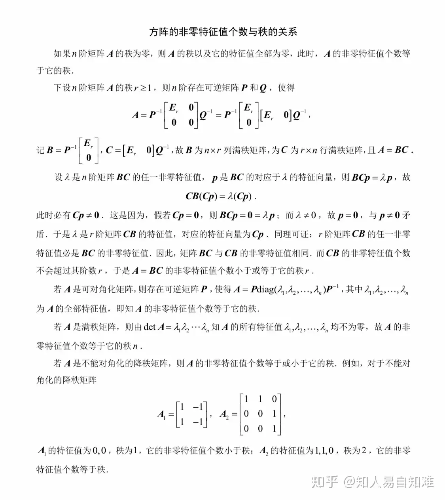

# 曲线、曲面

好的，您指出了非常关键的一点。我之前的回答确实不够全面，没有包含空间曲线作为两曲面交线的表示形式。现在我将对该部分进行补充和完善，并按照您的要求，增加关于矩阵特征值求解方法的总结。

---

### **空间曲面与空间曲线的法向量/切向量通用公式 (补充完善版)**

#### **一、 空间曲面 (Surface)**

(这部分与之前回答相同，保持不变)

##### **1. 隐式方程表示的曲面: $F(x, y, z) = c$**

*   **法向量**: $\mathbf{n} = \nabla F(x_0, y_0, z_0) = \left( \frac{\partial F}{\partial x}, \frac{\partial F}{\partial y}, \frac{\partial F}{\partial z} \right)\bigg|_{(x_0, y_0, z_0)}$
*   **切平面**: $\frac{\partial F}{\partial x}(x-x_0) + \frac{\partial F}{\partial y}(y-y_0) + \frac{\partial F}{\partial z}(z-z_0) = 0$

##### **2. 显式方程表示的曲面: $z = f(x, y)$**

*   **法向量**: $\mathbf{n} = \left( -\frac{\partial f}{\partial x}, -\frac{\partial f}{\partial y}, 1 \right)$ (代表上侧)
*   **切平面**: $\frac{\partial f}{\partial x}(x-x_0) + \frac{\partial f}{\partial y}(y-y_0) - (z-z_0) = 0$

---

#### **二、 空间曲线 (Space Curve)**

对于空间曲线，我们主要关心其**切向量**和**法平面**。

##### **1. 参数方程表示的曲线: $\mathbf{r}(t) = (x(t), y(t), z(t))$**

*   **切向量 (Tangent Vector)**:
    $$
    \mathbf{v} = \mathbf{r}'(t_0) = (x'(t_0), y'(t_0), z'(t_0))
    $$
*   **法平面 (Normal Plane)**:
    法平面以切向量为法向量。
    $$
    x'(t_0)(x - x_0) + y'(t_0)(y - y_0) + z'(t_0)(z - z_0) = 0
    $$

##### **2. 作为两曲面交线表示的曲线 (新增内容)**

当空间曲线由两个曲面的交集定义时，其方程组形式为：
$$
\begin{cases} F(x, y, z) = 0 \\ G(x, y, z) = 0 \end{cases}
$$

*   **切向量 (Tangent Vector)**:
    在曲线上的任意一点，其切线方向必须**同时垂直于**两个曲面在该点的法向量。
    *   曲面 $F$ 的法向量: $\mathbf{n}_F = \nabla F = (\frac{\partial F}{\partial x}, \frac{\partial F}{\partial y}, \frac{\partial F}{\partial z})$
    *   曲面 $G$ 的法向量: $\mathbf{n}_G = \nabla G = (\frac{\partial G}{\partial x}, \frac{\partial G}{\partial y}, \frac{\partial G}{\partial z})$
    *   曲线的切向量 $\mathbf{v}$ 与 $\mathbf{n}_F$ 和 $\mathbf{n}_G$ 都垂直，因此它平行于这两个法向量的**叉积 (Cross Product)**。
    $$
    \mathbf{v} \parallel \mathbf{n}_F \times \mathbf{n}_G = \begin{vmatrix} \mathbf{i} & \mathbf{j} & \mathbf{k} \\ \frac{\partial F}{\partial x} & \frac{\partial F}{\partial y} & \frac{\partial F}{\partial z} \\ \frac{\partial G}{\partial x} & \frac{\partial G}{\partial y} & \frac{\partial G}{\partial z} \end{vmatrix}
    $$
    计算出叉积的结果，即为曲线在该点的切向量。

*   **法平面 (Normal Plane)**:
    法平面仍然是以切向量 $\mathbf{v}=(A, B, C)$ 为法向量的平面。设切点为 $P_0(x_0, y_0, z_0)$，则法平面方程为：
    $$
    A(x-x_0) + B(y-y_0) + C(z-z_0) = 0
    $$

---

# **矩阵特征值的求解方法**

根据您 `math.md` 文件中关于矩阵和行列式的内容，求解矩阵特征值是线性代数的核心计算之一。

#### **1. 定义与核心思想**

对于一个 n 阶方阵 $A$，如果存在一个数 $\lambda$ 和一个非零向量 $\mathbf{x}$，使得下面的关系成立：
$$
A\mathbf{x} = \lambda\mathbf{x}
$$
那么，$\lambda$ 称为矩阵 $A$ 的一个**特征值 (Eigenvalue)**，$\mathbf{x}$ 称为对应于特征值 $\lambda$ 的**特征向量 (Eigenvector)**。

#### **2. 求解步骤**

求解特征值的核心是利用“**齐次线性方程组有非零解的条件是其系数矩阵的行列式为零**”。

1.  **构造特征方程**:
    将定义式 $A\mathbf{x} = \lambda\mathbf{x}$ 变形：
    $$
    A\mathbf{x} - \lambda\mathbf{x} = \mathbf{0}
    $$
    $$
    A\mathbf{x} - \lambda I \mathbf{x} = \mathbf{0} \quad (\text{其中 } I \text{ 是单位矩阵})
    $$
    $$
    (A - \lambda I)\mathbf{x} = \mathbf{0}
    $$
    这是一个关于 $\mathbf{x}$ 的齐次线性方程组。根据定义，特征向量 $\mathbf{x}$ 必须是非零向量，所以这个方程组必须有**非零解**。

2.  **利用行列式建立方程**:
    齐次方程组 $(A - \lambda I)\mathbf{x} = \mathbf{0}$ 有非零解的充分必要条件是其系数矩阵 $(A - \lambda I)$ **不可逆**，即其行列式为零。
    $$
    \det(A - \lambda I) = 0 \quad \text{或} \quad |A - \lambda I| = 0
    $$
    这个方程被称为矩阵 $A$ 的**特征方程 (Characteristic Equation)**。

3.  **求解方程**:
    *   计算行列式 $|A - \lambda I|$。对于 n 阶矩阵 A，这将得到一个关于 $\lambda$ 的 **n 次多项式**，称为特征多项式。
    *   解这个 n 次多项式方程，求出的所有根 $\lambda_1, \lambda_2, \dots, \lambda_n$ 就是矩阵 $A$ 的全部特征值。

#### **示例**

求矩阵 $A = \begin{pmatrix} 2 & 1 \\ 1 & 2 \end{pmatrix}$ 的特征值。

1.  **构造 $A - \lambda I$**:
    $$
    A - \lambda I = \begin{pmatrix} 2 & 1 \\ 1 & 2 \end{pmatrix} - \lambda \begin{pmatrix} 1 & 0 \\ 0 & 1 \end{pmatrix} = \begin{pmatrix} 2-\lambda & 1 \\ 1 & 2-\lambda \end{pmatrix}
    $$

2.  **计算行列式并令其为零**:
    $$
    |A - \lambda I| = (2-\lambda)(2-\lambda) - 1 \cdot 1 = 0
    $$
    $$
    (2-\lambda)^2 - 1 = 0
    $$

3.  **求解关于 $\lambda$ 的方程**:
    $$
    \lambda^2 - 4\lambda + 4 - 1 = 0
    $$
    $$
    \lambda^2 - 4\lambda + 3 = 0
    $$
    因式分解得：
    $$
    (\lambda - 1)(\lambda - 3) = 0
    $$
    解得特征值为 $\lambda_1 = 1, \lambda_2 = 3$。

# 期望计算

好的，这是一个非常核心的概率论问题。根据您 math.md 文件中关于**随机变量数字特征**的详细总结，计算期望 (Expectation) 的方法主要取决于随机变量是离散型还是连续型。

**核心思想**：期望是随机变量所有可能取值的“加权平均值”，这个“权”就是对应取值的概率（或概率密度）。

---

### **一、离散型随机变量 (Discrete Random Variables)**

对于离-散型随机变量，其期望是通过将**每个可能的取值**与其**对应的概率**相乘，然后将所有结果**求和**得到的。

#### **通用公式**

如果随机变量 $X$ 的概率质量函数 (PMF) 为 $P(X=x_i) = p_i$，那么它的期望为：
$$
E[X] = \sum_{i=1}^{\infty} x_i p_i
$$

**计算步骤**：
1.  列出随机变量所有可能的取值 $x_i$。
2.  找出每个取值对应的概率 $p_i$。
3.  计算每一项“取值 × 概率”的乘积。
4.  将所有乘积相加。

#### **示例：二项分布**

根据您笔记中的二项分布 $X \sim B(n, p)$，其期望可以直接使用结论 $E[X] = np$。这个结论的推导正是利用了期望的性质：
*   一个二项分布变量可以看作是 n 个独立的、服从同一 0-1 分布的随机变量之和：$X = X_1 + X_2 + \dots + X_n$，其中 $X_i \sim B(1, p)$。
*   对于单个 0-1 分布，$E[X_i] = 1 \cdot p + 0 \cdot (1-p) = p$。
*   利用期望的可加性 $E[X+Y] = E[X] + E[Y]$，我们得到：
    $$
    E[X] = E[X_1] + E[X_2] + \dots + E[X_n] = np
    $$

---

### **二、连续型随机变量 (Continuous Random Variables)**

对于连续型随机变量，其期望是通过将被积函数 **$x \cdot f(x)$** 在整个实数轴上进行**积分**得到的。

#### **通用公式**

如果随机变量 $X$ 的概率密度函数 (PDF) 为 $f(x)$，那么它的期望为：
$$
E[X] = \int_{-\infty}^{\infty} x f(x) \, dx
$$

**计算步骤**：
1.  写出概率密度函数 $f(x)$。
2.  构造新的被积函数 $x \cdot f(x)$。
3.  在 $f(x)$ 的非零区间上进行定积分。

#### **示例：指数分布**

根据您笔记中的指数分布 $X \sim E(\lambda)$，其概率密度函数为 $f(x) = \lambda e^{-\lambda x}$ (当 $x>0$ 时)。我们来计算它的期望：
$$
E[X] = \int_{-\infty}^{\infty} x f(x) \, dx = \int_{0}^{\infty} x (\lambda e^{-\lambda x}) \, dx
$$
这是一个典型的需要使用**分部积分法**的积分：
*   令 $u = x$, $dv = \lambda e^{-\lambda x} dx$
*   则 $du = dx$, $v = -e^{-\lambda x}$
$$
E[X] = \left[ -x e^{-\lambda x} \right]_0^\infty - \int_0^\infty (-e^{-\lambda x}) \, dx
$$
$$
= (0 - 0) + \int_0^\infty e^{-\lambda x} \, dx
$$
$$
= \left[ -\frac{1}{\lambda} e^{-\lambda x} \right]_0^\infty = (0 - (-\frac{1}{\lambda})) = \frac{1}{\lambda}
$$
这与您笔记中给出的结论 $E[X] = \frac{1}{\lambda}$ 完全一致。

---

### **三、函数期望的计算**

如果需要计算的不是 $E[X]$，而是 $X$ 的某个函数 $g(X)$ 的期望，例如 $E[X^2]$ 或 $E[\sin(X)]$，只需将公式中的 $x$ 替换为 $g(x)$ 即可。

*   **离散型**: $E[g(X)] = \sum_{i=1}^{\infty} g(x_i) p_i$
*   **连续型**: $E[g(X)] = \int_{-\infty}^{\infty} g(x) f(x) \, dx$

例如，计算方差时需要用到的 $E[X^2]$，对于连续型变量就是通过计算 $\int_{-\infty}^{\infty} x^2 f(x) \, dx$ 得到的。

# 初等变换和初等矩阵

好的，这是一个非常核心的线性代数概念。根据您 math.md 文件中对矩阵秩、可逆性、行列式等内容的总结，我为您梳理出初等变换与初等矩阵的关系。

---

## **核心关系：操作的矩阵化**

初等变换和初等矩阵的关系是**一种操作（变换）与其代数实现（矩阵乘法）之间的等价关系**。

简单来说：
**对一个矩阵 `A` 进行一次初等行变换，其效果等同于用一个相应的初等矩阵从左侧乘以 `A`。**

---

## **1. 什么是初等变换 (Elementary Transformation)？**

您笔记中提到的行/列变换就是初等变换，共有三种类型：
1.  **交换 (Swap)**: 互换矩阵的两行（或两列）。
2.  **倍乘 (Scale)**: 用一个非零常数 $k$ 乘以矩阵的某一行（或某一列）。
3.  **倍加 (Pivot)**: 将矩阵的某一行（或某一列）的 $k$ 倍加到另一行（或另一列）上。

## **2. 什么是初等矩阵 (Elementary Matrix)？**

**定义**：由**单位矩阵 `I`** 经过**一次**初等变换得到的矩阵，称为初等矩阵。

*   **交换矩阵 $E_{ij}$**: 将单位矩阵 `I` 的第 $i$ 行和第 $j$ 行互换得到。
*   **倍乘矩阵 $E_i(k)$**: 将单位矩阵 `I` 的第 $i$ 行乘以非零常数 $k$ 得到。
*   **倍加矩阵 $E_{ij}(k)$**: 将单位矩阵 `I` 的第 $j$ 行的 $k$ 倍加到第 $i$ 行上得到。

## **3. 两者的关系与应用**

| 初等行变换 (对矩阵 A)               | 等价的矩阵乘法           | 示例 (3阶)                                                   |
|------------------------------------- |-------------------------- |-------------------------------------------------------------- |
| **交换第 $i, j$ 行**                | 左乘交换矩阵 $E_{ij}$    | $E_{12}A = \begin{pmatrix} 0 & 1 & 0 \\ 1 & 0 & 0 \\ 0 & 0 & 1 \end{pmatrix} A$ |
| **第 $i$ 行乘以 $k$**               | 左乘倍乘矩阵 $E_i(k)$    | $E_2(k)A = \begin{pmatrix} 1 & 0 & 0 \\ 0 & k & 0 \\ 0 & 0 & 1 \end{pmatrix} A$ |
| **第 $j$ 行的 $k$ 倍加到第 $i$ 行** | 左乘倍加矩阵 $E_{ij}(k)$ | $E_{12}(k)A = \begin{pmatrix} 1 & k & 0 \\ 0 & 1 & 0 \\ 0 & 0 & 1 \end{pmatrix} A$ |

> **注意**：如果是**初等列变换**，则等价于用相应的初等矩阵从**右侧**乘以 `A`。

## **4. 初等矩阵的性质**

1.  **所有初等矩阵都是可逆的**，且它们的逆矩阵也是同类型的初等矩阵。
    *   $E_{ij}^{-1} = E_{ij}$ (交换两次等于没换)
    *   $E_i(k)^{-1} = E_i(1/k)$ (乘以 $k$ 的逆操作是乘以 $1/k$)
    *   $E_{ij}(k)^{-1} = E_{ij}(-k)$ (加上 $k$ 倍的逆操作是减去 $k$ 倍)

2.  **初等矩阵的行列式**：
    *   $|E_{ij}| = -1$
    *   $|E_i(k)| = k$
    *   $|E_{ij}(k)| = 1$

3.  **与矩阵秩的关系**:
    用任意初等矩阵乘以一个矩阵 `A`（即对 `A` 进行初等变换），**不会改变 `A` 的秩**。这是求解矩阵秩时使用行变换方法的基础。

4.  **与求解线性方程组的关系**:
    求解线性方程组 `Ax=b` 时，我们对方程组的增广矩阵 `[A|b]` 进行一系列初等行变换，这等价于用一系列初等矩阵 $E_1, E_2, \dots, E_m$ 左乘该增广矩阵。因为初等变换是可逆的，所以变换后的方程组与原方程组同解。

5.  **与求逆矩阵的关系**:
    如果一个 n 阶方阵 `A` 可逆，那么它一定可以表示为一系列初等矩阵的乘积。求 `A` 的逆矩阵的过程，就是找到一系列初等矩阵 $E_1, \dots, E_m$ 使得 $(E_m \cdots E_2 E_1)A = I$。此时，`A` 的逆矩阵就是这些初等矩阵的乘积：$A^{-1} = E_m \cdots E_2 E_1$。

好的，这是一个非常核心的线性代数问题，它将**非齐次线性方程组**的解的结构与**系数矩阵的秩**紧密联系起来。根据您 math.md 文件中关于秩和方程组解的总结，我为您进行详细的梳理。

---

# 解矩阵

## 线性无关系数矩阵

### 核心问题：非齐次线性方程组 `Ax=b`

首先，我们必须明确一个关键点：**非齐-次线性方程组的解集本身不构成一个向量空间**（因为它不包含零向量），所以我们**不讨论其解的“线性无关”问题**。

我们讨论的是其**对应的齐次方程组 `Ax=0`** 的解。这个齐次方程组的解集构成一个向量空间，称为**解空间**，我们讨论的是这个**解空间的维度**，也就是其**基础解系**中所包含的线性无关解向量的数量。

---

### **一、线性无关解的数量 (解空间的维度)**

对于一个 `m x n` 的矩阵 A（即 m 个方程，n 个未知数）构成的方程组 `Ax=b`：

**结论**：其对应的齐次方程组 `Ax=0` 的解空间的维度（即基础解系中线性无关解向量的个数）等于 **未知数的个数 `n` 减去系数矩阵的秩 `r`**。

*   **公式**:
    $$
    \text{解空间维度} = n - \text{rank}(A)
    $$
    其中 `rank(A)` 是系数矩阵 A 的秩。

*   **直观理解 (自由度的角度)**:
    *   `n` 代表了未知数的总数，可以看作是“总自由度”。
    *   `rank(A) = r` 代表了方程组中“有效约束”的数量。秩为 `r` 意味着这 `m` 个方程中，只有 `r` 个是真正独立的、起约束作用的。
    *   `n - r` 就代表了解在满足所有约束后，“剩余的自由度”。
        *   0个剩余自由度 $\implies$ 被锁定在一个点上（零解）。
        *   1个剩余自由度 $\implies$ 可以在一条直线上自由移动（解空间是一维的）。
        *   2个剩余自由度 $\implies$ 可以在一个平面上自由移动（解空间是二维的）。

---

### **二、秩与非齐次方程组解的判定**

现在我们回到非齐次方程组 `Ax=b` 本身。它的解的存在性和唯一性完全由**系数矩阵 A 的秩**和**增广矩阵 [A|b] 的秩**共同决定。

设 `rank(A) = r`，`rank([A|b]) = r'`，未知数个数为 `n`。

| 条件关系         | 结论           | 解的结构                                                     |
|------------------ |---------------- |-------------------------------------------------------------- |
| **$r \neq r'$**  | **无解**       | 方程组的约束是矛盾的。                                       |
| **$r = r' = n$** | **有唯一解**   | 秩等于未知数个数，没有自由变量，解被唯一确定。               |
| **$r = r' < n$** | **有无穷多解** | 秩小于未知数个数，存在 `n-r` 个自由变量，可以取任意值，从而产生无穷多解。 |

**核心定理 (克罗内克-卡佩利定理)**:
线性方程组 `Ax=b` 有解的**充分必要条件**是，系数矩阵的秩等于增广矩阵的秩，即 `rank(A) = rank([A|b])`。

---

### **三、解的结构**

当非齐次方程组 `Ax=b` 有无穷多解时（即 $r = r' < n$），其通解的结构完美地体现了齐次解与特解的关系，这与您 `math.md` 文件中微分方程的解结构完全一致：

**非齐次方程组的通解 = 对应齐次方程组的通解 + 非齐次方程组的一个特解**

用公式表达为：
$$
\mathbf{x} = \mathbf{x}_p + \mathbf{x}_h
$$
其中：
*   $\mathbf{x}_p$ 是满足 `Ax=b` 的任意一个**特解**。
*   $\mathbf{x}_h$ 是满足 `Ax=0` 的**齐次通解**，它可以表示为基础解系中 `n-r` 个线性无关解向量的线性组合：
    $$
    \mathbf{x}_h = c_1 \boldsymbol{\eta}_1 + c_2 \boldsymbol{\eta}_2 + \dots + c_{n-r} \boldsymbol{\eta}_{n-r}
    $$
    这里的 $c_1, c_2, \dots$ 是任意常数，$\boldsymbol{\eta}_1, \boldsymbol{\eta}_2, \dots$ 就是构成基础解系的线性无关的解向量。


## 阶梯阵求解

好的，这是一个非常连贯且核心的线性代数问题，它涵盖了从矩阵化简到求解线性方程组的完整流程。根据您 math.md 文件中关于秩、可逆和方程组解的详细内容，我为您系统地梳理这些操作和概念。

---

### **一、什么是初等行变换？**

初等行变换是指对矩阵进行以下三种基本操作，这些操作**不会改变方程组的解**，也**不会改变矩阵的秩**。

1.  **交换 (Interchange)**：交换矩阵的两行。
    *   记作：$R_i \leftrightarrow R_j$ (交换第 i 行和第 j 行)

2.  **倍乘 (Scaling)**：将矩阵的某一行乘以一个**非零**常数 $k$。
    *   记作：$k \cdot R_i \to R_i$ (第 i 行乘以 k)

3.  **倍加 (Replacement)**：将矩阵的某一行的 $k$ 倍加到另一行上。
    *   记作：$R_i + k \cdot R_j \to R_i$ (将第 j 行的 k 倍加到第 i 行上)

这三种操作是进行所有矩阵化简的基础。

---

### **二、如何化为阶梯形矩阵？**

将一个矩阵化为**阶梯形矩阵 (Row Echelon Form)** 的过程，通常称为**高斯消元法 (Gaussian Elimination)**。目标是让矩阵呈现出“阶梯”的形状。

**化简步骤 (从左到右，从上到下)**：

1.  **处理第一列**:
    *   **选定主元**: 确保第一行第一列的元素（主元）不为零。如果为零，就从下面的行中找一个该列元素不为零的行，与第一行进行**交换**。
    *   **制造零**: 利用**倍加**变换，将第一列中，从第二行开始的所有元素都变为 0。具体操作是：对于第 i 行 ($i>1$)，用 $R_i - k \cdot R_1 \to R_i$ 的操作来消元。

2.  **处理第二列**:
    *   **忽略第一行**，现在关注子矩阵。
    *   **选定主元**: 确保第二行第二列的元素不为零。如果为零，从它下面的行中找一个该列元素不为零的行进行**交换**。
    *   **制造零**: 利用新的主元（第二行第二列的元素），通过**倍加**变换，将第二列中，从第三行开始的所有元素都变为 0。

3.  **重复过程**:
    *   依次处理第三列、第四列……直到所有行都被处理完毕，或者剩下的行全部是零行。

**阶梯形矩阵的特征**:
*   所有非零行都在零行的上方。
*   下一行非零行的第一个非零元素（主元）的位置，必须在上一行主元的右边。

---

### **三、什么是最简阶梯形矩阵？**

**最简阶梯形矩阵 (Reduced Row Echelon Form, RREF)** 是在阶梯形矩阵的基础上，进行了进一步的化简。它满足两个额外条件：

1.  **主元归一**: 每个非零行的第一个非零元素（主元）都必须是 **1**。
2.  **主元列纯净**: 每个主元所在的列，除了主元 1 本身，其他所有元素都必须是 **0**（包括主元上方的元素）。

**如何从阶梯形化为最简阶梯形？**
1.  **主元归一**: 从下往上，将每个非零行的主元通过**倍乘**变换变成 1。
2.  **向上消元**: 从下往上，利用每一行的主元 1，通过**倍加**变换，将该主元**上方**的所有元素都变为 0。

---

### **四、如何从阶梯阵中快速获知基础解向量？**

这是求解齐次线性方程组 `Ax=0` 的核心步骤。一旦将系数矩阵 A 化为**最简阶梯形矩阵**，就可以非常直观地写出基础解系。

**步骤**:

1.  **确定主元变量和自由变量**:
    *   在最简阶梯形矩阵中，**主元 (1) 所在的列**对应的变量，称为**主元变量**。
    *   **没有主元的列**对应的变量，称为**自由变量**。
    *   自由变量的数量就是 `n - r` (未知数总数 - 秩)，也就是您 `math.md` 文件中提到的解空间维度。

2.  **构建基础解向量**:
    *   基础解向量的**个数**等于**自由变量的个数**。
    *   为每一个自由变量构建一个对应的基础解向量。方法如下：
        *   让**当前考虑的自由变量**取值为 **1**。
        *   让**所有其他自由变量**取值为 **0**。
        *   将这些值代入化简后的方程组，反解出所有**主元变量**的值。
        *   将所有变量的值组合起来，就得到了一个基础解向量。

**示例**:
假设一个方程组化简后的最简阶梯形矩阵为：
$$
\begin{pmatrix}
1 & 0 & -2 & 0 & 5 \\
0 & 1 & 3 & 0 & -1 \\
0 & 0 & 0 & 1 & 4 \\
0 & 0 & 0 & 0 & 0
\end{pmatrix}
$$
对应的方程组为：
$$
\begin{cases}
x_1 - 2x_3 + 5x_5 = 0 \\
x_2 + 3x_3 - x_5 = 0 \\
x_4 + 4x_5 = 0
\end{cases}
$$

1.  **确定变量类型**:
    *   主元在第1, 2, 4列，所以**主元变量**是 $x_1, x_2, x_4$。
    *   第3, 5列没有主元，所以**自由变量**是 $x_3, x_5$。
    *   有两个自由变量，所以基础解系包含两个线性无关的解向量。

2.  **构建第一个基础解向量 $\boldsymbol{\eta}_1$ (对应自由变量 $x_3$)**:
    *   令 $x_3 = 1$, $x_5 = 0$。
    *   代入方程组：
        *   $x_1 - 2(1) + 5(0) = 0 \implies x_1 = 2$
        *   $x_2 + 3(1) - 0 = 0 \implies x_2 = -3$
        *   $x_4 + 4(0) = 0 \implies x_4 = 0$
    *   得到第一个基础解向量：$\boldsymbol{\eta}_1 = (2, -3, 1, 0, 0)^T$。

3.  **构建第二个基础解向量 $\boldsymbol{\eta}_2$ (对应自由变量 $x_5$)**:
    *   令 $x_3 = 0$, $x_5 = 1$。
    *   代入方程组：
        *   $x_1 - 2(0) + 5(1) = 0 \implies x_1 = -5$
        *   $x_2 + 3(0) - 1 = 0 \implies x_2 = 1$
        *   $x_4 + 4(1) = 0 \implies x_4 = -4$
    *   得到第二个基础解向量：$\boldsymbol{\eta}_2 = (-5, 1, 0, -4, 1)^T$。

**最终结论**:
齐次方程组 `Ax=0` 的通解为 $\mathbf{x} = c_1 \boldsymbol{\eta}_1 + c_2 \boldsymbol{\eta}_2$，其中 $c_1, c_2$ 为任意常数。


## 非齐次和齐次关系

好的，非常抱歉，是我之前的理解太宽泛了。您提出的这个题型非常经典，我完全明白您的意思了。

这是一个非常具体的线性代数解题技巧，专门用来从已知的非齐次解反推出对应的齐次解。

---

### **核心原理**

**任意两个不同的非齐次线性方程组的解，它们的差一定是其对应的齐次线性方程组的一个解。**

*   **证明**:
    假设 $\boldsymbol{\alpha}_1$ 和 $\boldsymbol{\alpha}_2$ 都是非齐次方程组 $A\mathbf{x}=\mathbf{b}$ 的解。
    那么必然满足：
    1.  $A\boldsymbol{\alpha}_1 = \mathbf{b}$
    2.  $A\boldsymbol{\alpha}_2 = \mathbf{b}$

    现在我们考察它们的差向量 $\boldsymbol{\eta} = \boldsymbol{\alpha}_1 - \boldsymbol{\alpha}_2$：
    $$
    A\boldsymbol{\eta} = A(\boldsymbol{\alpha}_1 - \boldsymbol{\alpha}_2) = A\boldsymbol{\alpha}_1 - A\boldsymbol{\alpha}_2 = \mathbf{b} - \mathbf{b} = \mathbf{0}
    $$
    因为 $A\boldsymbol{\eta} = \mathbf{0}$，所以差向量 $\boldsymbol{\eta}$ 必然是对应的齐次方程组 $A\mathbf{x}=\mathbf{0}$ 的一个解。

---

### **解题步骤：从三个非齐次解求两个齐次解**

假设题目给出了非齐次方程组 $A\mathbf{x}=\mathbf{b}$ 的三个线性无关的解，我们称之为 $\boldsymbol{\alpha}_1, \boldsymbol{\alpha}_2, \boldsymbol{\alpha}_3$。

**目标**：求对应的齐次方程组 $A\mathbf{x}=\mathbf{0}$ 的两个线性无关的解。

**方法**：

1.  **作差构造齐次解**:
    从已知的三个非齐次解中，任意选两个作差，就可以得到一个齐次解。为了构造两个齐次解，我们可以这样做：
    *   取 $\boldsymbol{\eta}_1 = \boldsymbol{\alpha}_2 - \boldsymbol{\alpha}_1$
    *   取 $\boldsymbol{\eta}_2 = \boldsymbol{\alpha}_3 - \boldsymbol{\alpha}_1$

    现在，我们已经得到了两个齐次方程组的解 $\boldsymbol{\eta}_1$ 和 $\boldsymbol{\eta}_2$。

2.  **证明这两个齐次解线性无关**:
    这是最关键的一步。我们需要证明 $\boldsymbol{\eta}_1$ 和 $\boldsymbol{\eta}_2$ 是线性无关的。
    *   **使用反证法**: 假设 $\boldsymbol{\eta}_1$ 和 $\boldsymbol{\eta}_2$ **线性相关**。
    *   那么，根据线性相关的定义，必然存在一个不为零的常数 $k$，使得 $\boldsymbol{\eta}_2 = k \boldsymbol{\eta}_1$。
    *   将 $\boldsymbol{\eta}_1$ 和 $\boldsymbol{\eta}_2$ 的定义代入：
        $$
        \boldsymbol{\alpha}_3 - \boldsymbol{\alpha}_1 = k (\boldsymbol{\alpha}_2 - \boldsymbol{\alpha}_1)
        $$
    *   整理这个式子，把 $\boldsymbol{\alpha}_3$ 表示出来：
        $$
        \boldsymbol{\alpha}_3 = k \boldsymbol{\alpha}_2 - k \boldsymbol{\alpha}_1 + \boldsymbol{\alpha}_1 = (1-k)\boldsymbol{\alpha}_1 + k\boldsymbol{\alpha}_2
        $$
    *   这个结果表明，$\boldsymbol{\alpha}_3$ 可以由 $\boldsymbol{\alpha}_1$ 和 $\boldsymbol{\alpha}_2$ 线性表示。
    *   但这与题目给出的**已知条件“$\boldsymbol{\alpha}_1, \boldsymbol{\alpha}_2, \boldsymbol{\alpha}_3$ 是线性无关的”** 发生了**矛盾**！
    *   因此，我们最初的假设“$\boldsymbol{\eta}_1$ 和 $\boldsymbol{\eta}_2$ 线性相关”是错误的。

**结论**：
通过作差得到的 $\boldsymbol{\eta}_1 = \boldsymbol{\alpha}_2 - \boldsymbol{\alpha}_1$ 和 $\boldsymbol{\eta}_2 = \boldsymbol{\alpha}_3 - \boldsymbol{\alpha}_1$ **必然是线性无关的**。

所以，您所求的两个线性无关的齐次解就是 $\boldsymbol{\alpha}_2 - \boldsymbol{\alpha}_1$ 和 $\boldsymbol{\alpha}_3 - \boldsymbol{\alpha}_1$。
(当然，您也可以选择 $\boldsymbol{\alpha}_3 - \boldsymbol{\alpha}_2$ 等其他组合，它们同样是线性无关的齐次解)。


## k阶子式

正在收集工作区信息好的，这是一个非常核心的线性代数问题。对于非方阵，我们无法直接计算其“行列式”，但其秩的定义正是通过其**子式**来确定的。

根据您工作区中 `math.md` 文件里关于秩和行列式的内容，我为您归纳如何通过求解多阶子式来判定非方阵的秩。

### **核心定义**

一个矩阵（无论方阵与否）的**秩 (Rank)** 被定义为其**最高阶非零子式的阶数**。

*   **k阶子式 (k-th order minor)**: 从一个 $m \times n$ 的矩阵 $A$ 中，任意选取 $k$ 行和 $k$ 列，由这些行列交叉位置的元素构成的 $k \times k$ 方阵的行列式，就称为矩阵 $A$ 的一个 $k$ 阶子式。

### **判定秩的通用步骤**

这个过程是一个从高到低的“搜索”过程，一旦找到非零子式，就立刻停止。

1.  **确定最大可能的秩**
    对于一个 $m \times n$ 的矩阵 $A$，其秩不可能超过它的行数或列数。
    $$
    rank(A) \le \min(m, n)
    $$
    令 $k_{max} = \min(m, n)$。这就是我们要开始检查的最高阶。

2.  **从最高阶开始，检查所有子式**
    计算矩阵所有 $k_{max}$ 阶子式。
    *   **如果**：能找到**至少一个** $k_{max}$ 阶子式不为零。
    *   **结论**：那么矩阵的秩就是 $k_{max}$，即 $rank(A) = k_{max}$。判定结束。
    *   **如果**：所有 $k_{max}$ 阶子式**全部为零**。
    *   **行动**：说明秩小于 $k_{max}$，需要降一阶，去检查 $k_{max}-1$ 阶子式。

3.  **逐阶降低，重复检查**
    如果在上一步中所有最高阶子式都为零，现在就计算所有 $(k_{max}-1)$ 阶子式。
    *   **如果**：能找到**至少一个** $(k_{max}-1)$ 阶子式不为零。
    *   **结论**：那么矩阵的秩就是 $k_{max}-1$，即 $rank(A) = k_{max}-1$。判定结束。
    *   **如果**：所有 $(k_{max}-1)$ 阶子式**仍然全部为零**。
    *   **行动**：继续降阶，检查 $(k_{max}-2)$ 阶子式。

4.  **直到找到非零子式或降至1阶**
    持续这个过程，直到找到第一个不为零的子式阶数 $r$，那么 $rank(A) = r$。
    *   如果矩阵不是零矩阵，这个过程最终总能找到一个非零子式（最差也是1阶的非零元素）。
    *   如果矩阵是零矩阵，那么它没有任何非零子式，其秩定义为0。

---

### **示例**

假设有矩阵 $A = \begin{pmatrix} 1 & 2 & 3 & 4 \\ 2 & 4 & 6 & 8 \\ 3 & 5 & 7 & 9 \end{pmatrix}$，这是一个 $3 \times 4$ 的矩阵。

1.  **最大可能秩**: $k_{max} = \min(3, 4) = 3$。

2.  **检查3阶子式**: 我们需要从4列中选3列，来构成 $3 \times 3$ 的方阵并计算其行列式。
    *   选第1, 2, 3列: $\begin{vmatrix} 1 & 2 & 3 \\ 2 & 4 & 6 \\ 3 & 5 & 7 \end{vmatrix}$。因为第一行和第二行成比例（第2行 = 2 * 第1行），所以此行列式为0。
    *   选第1, 2, 4列: $\begin{vmatrix} 1 & 2 & 4 \\ 2 & 4 & 8 \\ 3 & 5 & 9 \end{vmatrix}$。同样，第一行和第二行成比例，行列式为0。
    *   ...检查所有可能的3阶子式，会发现它们都为0。
    *   **结论**: 所有3阶子式都为0，所以 $rank(A) < 3$。

3.  **降阶，检查2阶子式**:
    *   我们随便找一个2阶子式，比如选取第1, 3行和第1, 2列：
        $$
        \begin{vmatrix} 1 & 2 \\ 3 & 5 \end{vmatrix} = 1 \cdot 5 - 2 \cdot 3 = 5 - 6 = -1
        $$
    *   我们找到了一个不为零的2阶子式！
    *   **最终结论**: 不再需要检查其他2阶子式。矩阵的最高阶非零子式是2阶，因此 $rank(A) = 2$。判定结束。


## 特征值/向量/矩阵解关系

好的，这是一个非常核心的线性代数问题，它将特征向量、秩、自由变量这三个关键概念紧密地联系在一起。根据您 math.md 文件中关于线性方程组解、秩和特征值的详细内容，我为您进行系统性的梳理。

---

### **核心关系：一个公式贯穿所有**

对于一个 n 阶方阵 A 和它的一个特定特征值 $\lambda$，以下所有概念的数量都是**相等**的：

**与特征值 $\lambda$ 对应的线性无关特征向量的个数**
$$ = $$
**特征空间 $E_\lambda$ 的维度**
$$ = $$
**齐次方程组 $(A - \lambda I)\mathbf{x} = \mathbf{0}$ 的基础解系中向量的个数**
$$ = $$
**齐次方程组 $(A - \lambda I)\mathbf{x} = \mathbf{0}$ 中自由变量的个数**
$$ = $$
**$n - \text{rank}(A - \lambda I)$**

---

### **关系详解：一步步推导**

我们来拆解这个关系链条，看看它是如何建立起来的。

#### **1. 特征向量与齐次方程的解**

*   **出发点**: 特征向量的定义是 $A\mathbf{x} = \lambda \mathbf{x}$。
*   **变形**: 将其转化为一个标准的齐次线性方程组：
    $$ (A - \lambda I)\mathbf{x} = \mathbf{0} $$
*   **结论**: 对应于特征值 $\lambda$ 的**所有特征向量**，就是这个齐次方程组的**所有非零解**。

#### **2. 线性无关的特征向量与基础解系**

*   **出发点**: 我们通常关心的是一个特征值对应了“多少个”线性无关的特征向量。
*   **关系**: 齐次方程组 $(A - \lambda I)\mathbf{x} = \mathbf{0}$ 的所有解构成一个向量空间（称为**解空间**，在这里也就是**特征空间**）。这个空间的一组基，就是该方程组的**基础解系**。
*   **结论**: 对应于特征值 $\lambda$ 的**线性无关特征向量的个数**，正好等于其对应齐次方程组**基础解系的向量个数**。

#### **3. 基础解系与自由变量**

*   **出发点**: 如何确定基础解系中有多少个向量？
*   **关系**: 在求解齐次方程组时，我们通过行变换将其化为阶梯形。没有主元的列对应的变量就是**自由变量**。基础解系中向量的个数，完全由自由变量的个数决定。
*   **结论**: **基础解系的向量个数 = 自由变量的个数**。

#### **4. 自由变量与秩**

*   **出发点**: 如何确定自由变量的个数？
*   **关系**: 这是您 math.md 文件中记录的核心公式 `d = n - r`。对于一个有 `n` 个未知数的齐次方程组，其系数矩阵的秩为 `r`，那么自由变量的个数就是 `n - r`。
*   **结论**: 在我们的场景中，系数矩阵是 $(A - \lambda I)$，未知数个数是 `n`。所以，**自由变量的个数 = $n - \text{rank}(A - \lambda I)$**。

---

### **总结与应用**

通过以上四步，我们完美地将“线性无关特征向量的个数”与“秩”和“自由变量”联系了起来。

**应用示例**：
假设一个 3x3 矩阵 A 有一个特征值 $\lambda = 2$。你想知道它对应了几个线性无关的特征向量。

1.  **构造矩阵**: 计算 $B = A - 2I$。
2.  **求秩**: 通过初等行变换，求出矩阵 B 的秩 `rank(B)`。
3.  **计算个数**:
    *   假设你求出 `rank(B) = 2`。
    *   那么线性无关特征向量的个数 = $3 - \text{rank}(B) = 3 - 2 = 1$。
    *   这意味着对应于 $\lambda=2$ 的只有一个线性无关的特征向量。
    *   这也意味着在求解 $(A - 2I)\mathbf{x} = \mathbf{0}$ 时，你会发现只有一个自由变量。

    *   假设你求出 `rank(B) = 1`。
    *   那么线性无关特征向量的个数 = $3 - \text{rank}(B) = 3 - 1 = 2$。
    *   这意味着对应于 $\lambda=2$ 有两个线性无关的特征向量。
    *   这也意味着在求解时，你会发现有两个自由变量。


# 对角矩阵-正交化

### **一、对角矩阵 (Diagonal Matrix)**

#### **1. 是什么？**

**对角矩阵**是一个方阵，除了主对角线上的元素外，所有其他位置的元素都为零。

*   **形式**:
    $$
    D = \begin{pmatrix}
    d_1 & 0 & \dots & 0 \\
    0 & d_2 & \dots & 0 \\
    \vdots & \vdots & \ddots & \vdots \\
    0 & 0 & \dots & d_n
    \end{pmatrix}
    $$

*   **优点**: 对角矩阵的运算非常简单。例如，计算其 $k$ 次幂，只需将对角线上的每个元素进行 $k$ 次幂即可。

#### **2. 如何求解？(即矩阵的对角化)**

我们通常不是“求解”一个对角矩阵，而是将一个给定的方阵 $A$ **对角化**，即找到一个可逆矩阵 $P$ 和一个对角矩阵 $D$，使得：
$$
P^{-1}AP = D \quad \text{或等价地} \quad A = PDP^{-1}
$$
这个过程的步骤如下：

1.  **求特征值**: 计算矩阵 $A$ 的所有特征值 $\lambda_1, \lambda_2, \dots, \lambda_n$。
2.  **求特征向量**: 对**每一个**特征值 $\lambda_i$，求解齐次方程组 $(A - \lambda_i I)\mathbf{x} = \mathbf{0}$，得到其对应的线性无关的特征向量 $\mathbf{p}_i$。
3.  **构造矩阵 D 和 P**:
    *   **对角矩阵 D**: 将求出的特征值 $\lambda_1, \lambda_2, \dots, \lambda_n$ 依次放在主对角线上。
    *   **可逆矩阵 P**: 将与特征值顺序**一一对应**的特征向量 $\mathbf{p}_1, \mathbf{p}_2, \dots, \mathbf{p}_n$ 作为列向量，构成矩阵 $P$。

---

### **二、正交矩阵 (Orthogonal Matrix)**

#### **1. 是什么？**

**正交矩阵**是一个方阵 $P$，其转置等于其逆，即：
$$
P^T = P^{-1} \quad \text{或等价地} \quad P^T P = I
$$
*   **核心特征**: 正交矩阵的**所有列向量**构成一个**标准正交基**。
    *   **标准 (Normal)**: 每个列向量都是单位向量（长度为1）。
    *   **正交 (Orthogonal)**: 任意两个不同的列向量相互正交（点积为0）。
*   **几何意义**: 正交矩阵对应的线性变换是保长度、保角度的**刚体变换**，如旋转和反射。

#### **2. 如何求解？**

我们通常不是孤立地求解一个正交矩阵，而是在**正交对角化**一个**实对称矩阵**时得到它。

如果一个矩阵 $A$ 是实对称的，那么在上述对角化步骤的基础上，我们需要对特征向量做进一步处理：

1.  **施密特正交化 (Gram-Schmidt Orthogonalization)**:
    *   对于**不同特征值**对应的特征向量，它们**天然正交**。
    *   对于**有重根的特征值**，其对应的多个线性无关的特征向量不一定正交。需要对它们进行施密特正交化，使它们变为相互正交的向量组。
2.  **单位化 (Normalization)**:
    *   将所有已经正交化的特征向量全部**单位化**，即每个向量都除以它自身的模（长度）。
    *   这样得到的特征向量组就构成了**标准正交基**。
3.  **构造正交矩阵 P**:
    *   将这些单位化的、相互正交的特征向量作为列向量，构成矩阵 $P$。这个 $P$ 就是一个正交矩阵。

---

### **三、如何知道是否存在？(可对角化判据)**

这是最关键的问题，它决定了我们是否能进行上述操作。

#### **1. 是否一定有对角矩阵？(即矩阵是否可对角化)**

**不一定**。一个 n 阶方阵 $A$ **可对角化**的充分必要条件是：

*   **条件1 (几何重数法)**: 对 $A$ 的**每一个**特征值，其**几何重数**（线性无关特征向量的个数）都等于其**代数重数**（特征方程根的重复次数）。
*   **条件2 (向量法)**: 矩阵 $A$ 有 **n 个线性无关的特征向量**。

**两个充分（但非必要）的简单判据**:
*   如果 n 阶方阵 $A$ 有 n 个**互不相同**的特征值，则 $A$ **一定可以**对角化。
*   如果 $A$ 是一个**实对称矩阵**，则 $A$ **一定可以**对角化。

#### **2. 是否一定有正交矩阵？(即矩阵是否可正交对角化)**

**不一定**。一个 n 阶方阵 $A$ **可正交对角化**的充分必要条件是：

*   **$A$ 是一个实对称矩阵 ($A^T = A$)**。

这是线性代数中一个非常深刻和优美的定理，称为**谱定理 (Spectral Theorem)**。

**总结**

| 问题                        | 答案                                                                                        |
| ------------------------- | ----------------------------------------------------------------------------------------- |
| **一个矩阵 A 是否可对角化？**        | **不一定**。需要检查它是否有 n 个线性无关的特征向量。                                                            |
| **一个矩阵 A 是否可被一个正交矩阵对角化？** | **不一定**。当且仅当 **A 是实对称矩阵**时，才存在一个正交矩阵 P，使得 $P^T A P = D$。                                  |
| **如果 A 是实对称矩阵，会发生什么？**    | 那么它**一定可以**被正交对角化。这意味着：<br>1. 它的特征值都是实数。<br>2. 它一定有 n 个线性无关的特征向量。<br>3. 不同特征值对应的特征向量天然正交。 |
|                           |                                                                                           |

好的，您所询问的是对一个**对称矩阵**进行**正交对角化**的过程。一个 n 阶实对称矩阵 $A$ 一定可以被正交对角化，即找到一个正交矩阵 $P$ 和一个对角矩阵 $D$，使得：
$$
A = PDP^T \quad (\text{或 } P^T A P = D)
$$
其中：
*   $D$ 是由 $A$ 的特征值组成的对角矩阵。
*   $P$ 是由 $A$ 对应的标准正交特征向量组成的**正交矩阵**。

好的，这是一个非常核心的线性代数问题，它结合了特征值、特征向量、向量正交化等多个关键概念。根据您 math.md 文件中关于实对称矩阵、特征值和特征向量的详细内容，我为您提供一个完整的求解步骤、一个具体的例子，并详细解释施密特正交化。

---

### **核心前提：什么样的矩阵可以被正交对角化？**

在开始之前，必须明确一个最重要的前提：一个矩阵可以被**正交对角化**（即找到一个正交矩阵 P 和一个对角矩阵 D）的充分必要条件是，该矩阵必须是一个**实对称矩阵**。

*   **实对称矩阵**: $A^T = A$。
*   **正交矩阵 P**: $P^T = P^{-1}$，其列向量是单位向量且相互正交。
*   **对角矩阵 D**: 主对角线元素是特征值，其余为0。
*   **目标关系**: $P^T A P = D$

---

### **一、求解步骤**

1.  **验证矩阵**: 检查给定的矩阵 $A$ 是否为实对称矩阵。如果不是，则无法进行正交对角化。

2.  **求特征值**: 计算特征方程 $|A - \lambda I| = 0$ 的所有根 $\lambda_1, \lambda_2, \dots, \lambda_n$。

3.  **求特征向量**:
    *   对**每一个不同**的特征值 $\lambda_i$，求解其对应的齐次方程组 $(A - \lambda_i I)\mathbf{x} = \mathbf{0}$，得到基础解系。
    *   **关键点**:
        *   如果一个特征值是**单根**，你会得到一个基础解系向量。
        *   如果一个特征值是 **k 重根**，你必须求出 k 个线性无关的基础解系向量。

4.  **正交化特征向量 (核心步骤)**:
    *   **对于不同特征值对应的特征向量**: 它们天然就是相互正交的，无需处理。
    *   **对于相同（重根）特征值对应的多个特征向量**: 它们不一定正交，必须使用**施密特正交化 (Gram-Schmidt Orthogonalization)** 方法将它们处理成一组正交向量。

5.  **单位化所有特征向量**:
    将第4步得到的所有相互正交的特征向量，逐个进行单位化（每个向量除以它自身的模/长度），得到一组**标准正交基**。

6.  **构造正交矩阵 P 和对角矩阵 D**:
    *   **正交矩阵 P**: 将第5步得到的 n 个标准正交基向量作为列向量，构成矩阵 P。
    *   **对角矩阵 D**: 将与 P 中列向量**一一对应**的特征值放在主对角线上，构成矩阵 D。

---

### **二、施密特正交化解释**

施密特正交化的核心思想是“**投影与减法**”。假设你有一组线性无关的向量 $\{\mathbf{v}_1, \mathbf{v}_2, \dots, \mathbf{v}_k\}$，你想把它们变成一组正交向量 $\{\mathbf{u}_1, \mathbf{u}_2, \dots, \mathbf{u}_k\}$。

*   **第一步**: 第一个向量不动，直接作为新的正交基的第一个成员。
    $$ \mathbf{u}_1 = \mathbf{v}_1 $$

*   **第二步**: 处理第二个向量 $\mathbf{v}_2$。将 $\mathbf{v}_2$ 向已经确定的正交基 $\mathbf{u}_1$ 上做投影，然后从 $\mathbf{v}_2$ 中**减去这个投影分量**。剩下的部分就必然与 $\mathbf{u}_1$ 正交。
    $$ \mathbf{u}_2 = \mathbf{v}_2 - \text{proj}_{\mathbf{u}_1}(\mathbf{v}_2) = \mathbf{v}_2 - \frac{\mathbf{v}_2 \cdot \mathbf{u}_1}{\mathbf{u}_1 \cdot \mathbf{u}_1} \mathbf{u}_1 $$

*   **第三步**: 处理第三个向量 $\mathbf{v}_3$。将 $\mathbf{v}_3$ 分别向已经确定的正交基 $\mathbf{u}_1$ 和 $\mathbf{u}_2$ 上做投影，然后从 $\mathbf{v}_3$ 中**减去这两个投影分量**。
    $$ \mathbf{u}_3 = \mathbf{v}_3 - \frac{\mathbf{v}_3 \cdot \mathbf{u}_1}{\mathbf{u}_1 \cdot \mathbf{u}_1} \mathbf{u}_1 - \frac{\mathbf{v}_3 \cdot \mathbf{u}_2}{\mathbf{u}_2 \cdot \mathbf{u}_2} \mathbf{u}_2 $$

*   **以此类推**，直到处理完所有向量。

---

### **三、举例：正交对角化一个矩阵**

**问题**: 求矩阵 $A = \begin{pmatrix} 2 & -1 & -1 \\ -1 & 2 & -1 \\ -1 & -1 & 2 \end{pmatrix}$ 的正交矩阵 P 和对角矩阵 D。

**1. 验证矩阵**: $A^T = A$，是实对称矩阵，可以正交对角化。

**2. 求特征值**:
$|A - \lambda I| = \begin{vmatrix} 2-\lambda & -1 & -1 \\ -1 & 2-\lambda & -1 \\ -1 & -1 & 2-\lambda \end{vmatrix} = \dots = (3-\lambda)^2(-\lambda) = 0$
解得特征值为 $\lambda_1 = 0$ (单根)，$\lambda_2 = \lambda_3 = 3$ (二重根)。

**3. 求特征向量**:
*   **对于 $\lambda_1 = 0$**:
    解方程 $(A - 0I)\mathbf{x} = \mathbf{0}$，即 $A\mathbf{x} = \mathbf{0}$。
    $A \to \begin{pmatrix} 1 & 0 & -1 \\ 0 & 1 & -1 \\ 0 & 0 & 0 \end{pmatrix}$，得到 $x_1=x_3, x_2=x_3$。
    取基础解系为一个向量：$\mathbf{p}_1 = (1, 1, 1)^T$。

*   **对于 $\lambda_2 = \lambda_3 = 3$**:
    解方程 $(A - 3I)\mathbf{x} = \mathbf{0}$。
    $A - 3I = \begin{pmatrix} -1 & -1 & -1 \\ -1 & -1 & -1 \\ -1 & -1 & -1 \end{pmatrix} \to \begin{pmatrix} 1 & 1 & 1 \\ 0 & 0 & 0 \\ 0 & 0 & 0 \end{pmatrix}$，得到 $x_1+x_2+x_3=0$。
    这是一个有2个自由变量的方程。取基础解系为两个线性无关的向量：
    $\mathbf{p}_2 = (-1, 1, 0)^T$
    $\mathbf{p}_3 = (-1, 0, 1)^T$

**4. 正交化特征向量**:
*   $\mathbf{p}_1$ (对应 $\lambda=0$) 与 $\mathbf{p}_2, \mathbf{p}_3$ (对应 $\lambda=3$) 天然正交，无需处理。
*   $\mathbf{p}_2$ 和 $\mathbf{p}_3$ 对应同一特征值，它们不一定正交。我们检查一下：$\mathbf{p}_2 \cdot \mathbf{p}_3 = (-1)(-1) + (1)(0) + (0)(1) = 1 \neq 0$。它们确实不正交。
*   **对 $\{\mathbf{p}_2, \mathbf{p}_3\}$ 进行施密特正交化**:
    *   令第一个正交向量 $\mathbf{u}_2 = \mathbf{p}_2 = (-1, 1, 0)^T$。
    *   计算第二个正交向量 $\mathbf{u}_3$:
        $$
        \begin{aligned}
        \mathbf{u}_3 &= \mathbf{p}_3 - \frac{\mathbf{p}_3 \cdot \mathbf{u}_2}{\mathbf{u}_2 \cdot \mathbf{u}_2} \mathbf{u}_2 \\
        &= (-1, 0, 1)^T - \frac{1}{(-1)^2+1^2+0^2} (-1, 1, 0)^T \\
        &= (-1, 0, 1)^T - \frac{1}{2}(-1, 1, 0)^T \\
        &= (-1, 0, 1)^T - (-\frac{1}{2}, \frac{1}{2}, 0)^T \\
        &= (-\frac{1}{2}, -\frac{1}{2}, 1)^T
        \end{aligned}
        $$
        为了计算方便，我们可以取 $\mathbf{u}_3$ 的整数倍，例如 $2\mathbf{u}_3 = (-1, -1, 2)^T$。
*   现在我们得到了一组正交的特征向量基：$\{\mathbf{p}_1, \mathbf{u}_2, \mathbf{u}_3\} = \{(1, 1, 1)^T, (-1, 1, 0)^T, (-1, -1, 2)^T\}$。

**5. 单位化所有特征向量**:
*   $|\mathbf{p}_1| = \sqrt{1^2+1^2+1^2} = \sqrt{3} \implies \mathbf{q}_1 = (\frac{1}{\sqrt{3}}, \frac{1}{\sqrt{3}}, \frac{1}{\sqrt{3}})^T$
*   $|\mathbf{u}_2| = \sqrt{(-1)^2+1^2+0^2} = \sqrt{2} \implies \mathbf{q}_2 = (-\frac{1}{\sqrt{2}}, \frac{1}{\sqrt{2}}, 0)^T$
*   $|\mathbf{u}_3| = \sqrt{(-1)^2+(-1)^2+2^2} = \sqrt{6} \implies \mathbf{q}_3 = (-\frac{1}{\sqrt{6}}, -\frac{1}{\sqrt{6}}, \frac{2}{\sqrt{6}})^T$

**6. 构造 P 和 D**:
*   **对角矩阵 D**:
    $$
    D = \begin{pmatrix} \lambda_1 & 0 & 0 \\ 0 & \lambda_2 & 0 \\ 0 & 0 & \lambda_3 \end{pmatrix} = \begin{pmatrix} 0 & 0 & 0 \\ 0 & 3 & 0 \\ 0 & 0 & 3 \end{pmatrix}
    $$
*   **正交矩阵 P**:
    $$
    P = (\mathbf{q}_1, \mathbf{q}_2, \mathbf{q}_3) = \begin{pmatrix}
    \frac{1}{\sqrt{3}} & -\frac{1}{\sqrt{2}} & -\frac{1}{\sqrt{6}} \\
    \frac{1}{\sqrt{3}} & \frac{1}{\sqrt{2}} & -\frac{1}{\sqrt{6}} \\
    \frac{1}{\sqrt{3}} & 0 & \frac{2}{\sqrt{6}}
    \end{pmatrix}
    $$

这样，我们就找到了满足 $P^T A P = D$ 的正交矩阵 P 和对角矩阵 D。


## 似然估计

好的，这是一个非常核心的统计学问题。根据您 math.md 文件中关于概率分布、求导、极值和对数运算的详细内容，我为您系统地解释最大似然估计 (MLE)。

---

### **一、最大似然估计的意义理解 (What is it?)**

最大似然估计的核心思想非常直观，可以概括为一句话：

**“既然事情已经发生了，那我们就认为，让这件事发生的概率最大的那个参数，就是最接近真实情况的参数。”**

让我们用一个简单的例子来理解：
假设你有一个硬币，但你不知道它是否均匀，你想估计它正面朝上（H）的概率 $p$。

1.  **做实验（收集数据）**: 你抛了10次，结果是：`H, T, H, H, H, T, H, H, T` (7次正面，3次反面)。
2.  **提出假设**:
    *   **假设1**: 如果这枚硬币是完全均匀的 ($p=0.5$)，那么出现“7正3反”这个结果的概率是多少？（是一个很小的数）
    *   **假设2**: 如果这枚硬币的正面朝上概率是 $p=0.7$，那么出现“7正3反”这个结果的概率又是多少？（会比假设1的概率大）
    *   **假设3**: 如果正面朝上概率是 $p=0.2$ 呢？（概率会更小）
3.  **最大似然思想**:
    我们现在已经**实际观测到了“7正3反”**这个结果。在所有可能的 $p$（从0到1）中，哪一个 $p$ 的取值，能让“7正3反”这个结果出现的**可能性（概率）达到最大**呢？
    直觉上，既然10次里出现了7次正面，那么把参数 $p$ 设为 $0.7$ 似乎是最合理的，因为它最能“解释”我们观测到的数据。

**总结**: 最大似然估计就是这样一种“反推”的方法。我们不是用参数去预测结果，而是用已经发生的结果，去反推出一个能让这个结果出现概率最大的参数值，并将其作为真实参数的估计。

---

### **二、通用公式 (The Formula)**

假设我们从一个已知分布形式（但参数 $\theta$ 未知）的总体中，抽取了一个独立的样本 $(x_1, x_2, \dots, x_n)$。

1.  **似然函数 (Likelihood Function) $L(\theta)$**:
    似然函数就是这组样本数据**同时发生**的联合概率。由于样本是独立同分布的，它等于每个观测值概率的乘积。
    *   **对于离散型分布 (PMF为 $P(x;\theta)$)**:
        $$
        L(\theta) = P(X_1=x_1, \dots, X_n=x_n) = \prod_{i=1}^{n} P(x_i; \theta)
        $$
    *   **对于连续型分布 (PDF为 $f(x;\theta)$)**:
        $$
        L(\theta) = f(x_1, \dots, x_n) = \prod_{i=1}^{n} f(x_i; \theta)
        $$
        **注意**: 此时，我们将样本值 $(x_1, \dots, x_n)$ 看作**已知常数**，而将未知参数 $\theta$ 看作**自变量**。

2.  **对数似然函数 (Log-Likelihood Function) $\ln L(\theta)$**:
    由于连乘的求导非常复杂，而对数函数是单调递增的（最大化 $L(\theta)$ 等价于最大化 $\ln L(\theta)$），所以我们通常将其转化为对数形式，把连乘变成连加。
    $$
    \ln L(\theta) = \sum_{i=1}^{n} \ln f(x_i; \theta)
    $$

我们的目标就是找到一个 $\theta$ 值，使得这个 $\ln L(\theta)$ 最大。

---

### **三、解题过程 (How to Solve)**

求解最大似然估计值的过程，就是您 `math.md` 文件中总结的**求函数极值**的过程。

#### **步骤1：写出似然函数和对数似然函数**

根据题目给出的总体分布和样本，写出 $L(\theta)$ 和 $\ln L(\theta)$ 的表达式。

#### **步骤2：对参数求导**

将对数似然函数 $\ln L(\theta)$ 对未知参数 $\theta$ 求偏导数。如果存在多个未知参数（如正态分布的 $\mu$ 和 $\sigma^2$），则需要分别对每个参数求偏导。

#### **步骤3：令导数为零，解似然方程**

建立方程（或方程组），令所有偏导数等于零：
$$
\frac{d}{d\theta} \ln L(\theta) = 0
$$
解这个方程（组），得到的解就是参数 $\theta$ 的最大似然估计量，记作 $\hat{\theta}_{MLE}$。

---

### **示例：求指数分布参数的最大似然估计**

**问题**: 设总体 $X$ 服从参数为 $\lambda$ 的指数分布，其概率密度函数为 $f(x) = \lambda e^{-\lambda x}$ ($x>0$)。现有一组样本 $(x_1, x_2, \dots, x_n)$，求参数 $\lambda$ 的最大似然估计量。

**解**:

**1. 写出似然函数和对数似然函数**:
*   **似然函数**:
    $$
    L(\lambda) = \prod_{i=1}^{n} f(x_i; \lambda) = \prod_{i=1}^{n} (\lambda e^{-\lambda x_i}) = \lambda^n e^{-\lambda \sum_{i=1}^{n} x_i}
    $$
*   **对数似然函数**:
    $$
    \ln L(\lambda) = \ln(\lambda^n e^{-\lambda \sum x_i}) = \ln(\lambda^n) + \ln(e^{-\lambda \sum x_i}) = n \ln \lambda - \lambda \sum_{i=1}^{n} x_i
    $$

**2. 对参数 $\lambda$ 求导**:
$$
\frac{d}{d\lambda} \ln L(\lambda) = \frac{d}{d\lambda} \left( n \ln \lambda - \lambda \sum_{i=1}^{n} x_i \right) = \frac{n}{\lambda} - \sum_{i=1}^{n} x_i
$$

**3. 令导数为零，解方程**:
$$
\frac{n}{\lambda} - \sum_{i=1}^{n} x_i = 0
$$
$$
\frac{n}{\lambda} = \sum_{i=1}^{n} x_i
$$
解得：
$$
\hat{\lambda} = \frac{n}{\sum_{i=1}^{n} x_i} = \frac{1}{\frac{1}{n}\sum_{i=1}^{n} x_i} = \frac{1}{\bar{x}}
$$

**结论**: 参数 $\lambda$ 的最大似然估计量是样本均值 $\bar{x}$ 的倒数。这与指数分布的期望 $E[X] = 1/\lambda$ 的直觉是相符的。


# 渐近线

### **一、渐近线是什么？(意义理解)**

**渐近线 (Asymptote)** 是一条直线，当函数图像上的点沿着某个方向无限延伸时，图像会**无限地逼近**这条直线，但永远不会与它相交（在无限远处）。

简单来说，渐近线描述了函数图像在“无穷远处”的趋势和形状。它就像是函数图像的一个“引导轨道”或“边界”。

渐近线主要分为三类：

1.  **垂直渐近线 (Vertical Asymptote)**: 一条垂直的线，函数图像在它附近会趋向于正无穷或负无穷。
2.  **水平渐近线 (Horizontal Asymptote)**: 一条水平的线，当 x 趋向于正无穷或负无穷时，函数图像会逼近它。
3.  **斜渐近线 (Slant/Oblique Asymptote)**: 一条倾斜的直线，当 x 趋向于正无穷或负无穷时，函数图像会逼近它。

---

### **二、如何计算求解？**

求解渐近线的过程，本质上就是求解**极限**的过程。

#### **1. 垂直渐近线 (Vertical Asymptote)**

*   **核心思想**: 寻找那些能让函数值“爆炸”到无穷大的 $x$ 值。对于分式函数，这通常发生在**分母为零**的地方。
*   **求解步骤**:
    1.  对于一个函数 $y = f(x)$（通常是分式形式），找到所有使**分母为零**的 $x$ 值，记为 $x=a$。
    2.  检查在这些点上，**分子是否也为零**。
        *   如果分母为零，而**分子不为零**，那么 $x=a$ 就是一条垂直渐近线。
        *   如果分母和分子**同时为零**，那么 $x=a$ 处可能是一个“孔”（可去间断点），而不是渐近线。需要先化简分式再判断。
    3.  **严格定义 (用极限验证)**:
        如果满足以下四个条件中至少一个，则直线 $x=a$ 是垂直渐近线：
        $$
        \lim_{x \to a^+} f(x) = \pm\infty \quad \text{或} \quad \lim_{x \to a^-} f(x) = \pm\infty
        $$

#### **2. 水平渐近线 (Horizontal Asymptote)**

*   **核心思想**: 考察当 $x$ 趋向于正无穷和负无穷时，函数值 $y$ 是否会趋近于一个**有限的常数**。
*   **求解步骤**:
    1.  计算极限 $\lim_{x \to +\infty} f(x)$。如果结果是一个有限的常数 $b_1$，那么 $y=b_1$ 就是一条水平渐近线。
    2.  计算极限 $\lim_{x \to -\infty} f(x)$。如果结果是一个有限的常数 $b_2$，那么 $y=b_2$ 就是一条水平渐近线。
    *   **注意**: 一个函数可能有一条、两条或没有水平渐近线。例如，$y=e^x$ 在 $x \to -\infty$ 时有水平渐近线 $y=0$，但在 $x \to +\infty$ 时没有。

*   **对于有理函数（多项式除以多项式）的快速判别法**:
    设分子最高次项为 $ax^n$，分母最高次项为 $bx^m$。
    *   若 $n < m$ (分母次数高)，则水平渐近线是 $y=0$。
    *   若 $n = m$ (次数相同)，则水平渐近线是 $y = \frac{a}{b}$ (最高次项系数之比)。
    *   若 $n > m$ (分子次数高)，则**没有**水平渐近线。（但可能有斜渐近线）

#### **3. 斜渐近线 (Slant Asymptote)**

*   **核心思想**: 当 $x \to \infty$ 时，函数图像逼近一条形如 $y=kx+b$ 的斜线。这通常发生在分式函数的**分子次数恰好比分母次数高 1** 的情况。
*   **求解步骤**:
    假设斜渐近线为 $y = kx + b$。
    1.  **求斜率 k**:
        $$
        k = \lim_{x \to \infty} \frac{f(x)}{x}
        $$
        如果这个极限存在且不为零，则进行下一步。如果极限为0或不存在，则没有斜渐近线。

    2.  **求截距 b**:
        $$
        b = \lim_{x \to \infty} [f(x) - kx]
        $$
        如果这个极限也存在，那么 $y=kx+b$ 就是所求的斜渐近线。

    *   **注意**: 需要分别对 $x \to +\infty$ 和 $x \to -\infty$ 进行计算，可能会得到两条不同的斜渐近线。
    *   **对于有理函数**: 如果分子次数比分母次数高1，可以直接用**多项式长除法**，得到的**商**就是斜渐近线的方程。

---

### **示例**

求函数 $f(x) = \frac{x^2 - 2x + 2}{x - 1}$ 的所有渐近线。

1.  **垂直渐近线**:
    *   令分母为零：$x - 1 = 0 \implies x = 1$。
    *   检查分子：当 $x=1$ 时，分子为 $1^2 - 2(1) + 2 = 1 \neq 0$。
    *   所以，**垂直渐近线是 $x=1$**。

2.  **水平渐近线**:
    *   分子次数为2，分母次数为1。因为分子次数 > 分母次数，所以**没有水平渐近线**。

3.  **斜渐近线**:
    *   **方法一：极限法**
        *   求斜率 k:
            $$
            k = \lim_{x \to \infty} \frac{f(x)}{x} = \lim_{x \to \infty} \frac{x^2 - 2x + 2}{x(x - 1)} = \lim_{x \to \infty} \frac{x^2 - 2x + 2}{x^2 - x} = 1
            $$
        *   求截距 b:
            $$
            b = \lim_{x \to \infty} [f(x) - kx] = \lim_{x \to \infty} \left[ \frac{x^2 - 2x + 2}{x - 1} - 1 \cdot x \right]
            $$
            $$
            = \lim_{x \to \infty} \frac{(x^2 - 2x + 2) - x(x-1)}{x - 1} = \lim_{x \to \infty} \frac{x^2 - 2x + 2 - x^2 + x}{x - 1} = \lim_{x \to \infty} \frac{-x + 2}{x - 1} = -1
            $$
        *   所以，**斜渐近线是 $y = 1x - 1$，即 $y = x - 1$**。

    *   **方法二：多项式长除法**
        对 $\frac{x^2 - 2x + 2}{x - 1}$ 进行长除法：
        
        ```
              x   - 1
            _________
        x-1 | x^2 - 2x + 2
            -(x^2 -  x)
            ---------
                  -x + 2
                -(-x + 1)
                ---------
                       1
        ```
        除法结果是：$f(x) = (x-1) + \frac{1}{x-1}$。
        *   商是 $x-1$。当 $x \to \infty$ 时，余项 $\frac{1}{x-1} \to 0$。
        *   因此，函数图像逼近直线 $y = x-1$。**斜渐近线是 $y = x - 1$**。

# 矩阵运算律

好的，根据您 math.md 文件中关于矩阵、行列式和逆矩阵的详细内容，我为您系统地归纳和总结矩阵运算所满足的所有核心运算律。

---

### **矩阵运算基本定律总结**

矩阵的运算律与我们熟悉的实数运算律有相似之处，但也有非常关键的区别（尤其是在乘法上）。

#### **一、矩阵加法与标量乘法运算律**

这些运算律与向量的运算律非常相似，因为同尺寸的矩阵构成了向量空间。假设 A, B, C 是同维度的矩阵，k, l 是标量（实数）。

| 运算律名称             | 公式表示                    | 说明                                         |
|------------------------ |----------------------------- |---------------------------------------------- |
| **加法交换律**         | $A + B = B + A$             | 矩阵相加的顺序可以任意交换。                 |
| **加法结合律**         | $(A + B) + C = A + (B + C)$ | 多个矩阵相加时，可以任意组合。               |
| **标量乘法结合律**     | $k(lA) = (kl)A$             | 多个标量相继乘以一个矩阵，可以先把标量相乘。 |
| **标量乘法分配律 (1)** | $k(A + B) = kA + kB$        | 标量可以分配到矩阵和的每一项。               |
| **标量乘法分配律 (2)** | $(k + l)A = kA + lA$        | 标量和可以分配到矩阵上。                     |

#### **二、矩阵乘法运算律**

这是最需要注意的部分，因为它不完全符合我们的直觉。假设 A, B, C 的维度使其乘法有意义。

| 运算律名称           | 公式表示                | 说明                                           |
|---------------------- |------------------------- |------------------------------------------------ |
| **乘法结合律**       | $(AB)C = A(BC)$         | 多个矩阵相乘时，只要不改变顺序，可以任意组合。 |
| **左分配律**         | $A(B + C) = AB + AC$    | 矩阵可以从左侧分配到和的每一项。               |
| **右分配律**         | $(A + B)C = AC + BC$    | 矩阵可以从右侧分配到和的每一项。               |
| **与标量乘法的结合** | $k(AB) = (kA)B = A(kB)$ | 标量可以在矩阵乘积中自由移动。                 |
| **单位矩阵的作用**   | $AI = A$ 且 $IA = A$    | 单位矩阵 I 在矩阵乘法中扮演着数字 "1" 的角色。 |

#### **三、矩阵转置运算律**

转置运算有一些独特的、非常重要的性质。

| 运算律名称            | 公式表示                | 说明                                                         |
|----------------------- |------------------------- |-------------------------------------------------------------- |
| **双重转置**          | $(A^T)^T = A$           | 对一个矩阵转置两次，会变回它自身。                           |
| **和的转置**          | $(A + B)^T = A^T + B^T$ | 和的转置等于转置的和。                                       |
| **标量乘法的转置**    | $(kA)^T = kA^T$         | 标量在转置运算中可以直接提出。                               |
| **乘积的转置 (核心)** | $(AB)^T = B^T A^T$      | **顺序反转！** 两个矩阵乘积的转置，等于它们各自转置后**反序**相乘。 |

#### **四、矩阵求逆运算律**

这些定律只对**可逆方阵**成立。

| 运算律名称          | 公式表示                         | 说明                                                         |
|--------------------- |---------------------------------- |-------------------------------------------------------------- |
| **双重逆**          | $(A^{-1})^{-1} = A$              | 逆矩阵的逆矩阵是原矩阵。                                     |
| **乘积的逆 (核心)** | $(AB)^{-1} = B^{-1} A^{-1}$      | **顺序反转！** 两个矩阵乘积的逆，等于它们各自的逆**反序**相乘。 |
| **转置的逆**        | $(A^T)^{-1} = (A^{-1})^T$        | 转置和求逆的顺序可以交换。                                   |
| **标量乘法的逆**    | $(kA)^{-1} = \frac{1}{k} A^{-1}$ | 标量变为其倒数。                                             |

---

### **警告：矩阵运算不满足的定律 (非常重要！)**

以下是初学者最容易犯错的地方，这些定律在实数运算中成立，但在矩阵运算中**通常不成立**。

1.  **矩阵乘法不满足交换律 (No Commutative Law for Multiplication)**
    $$
    AB \neq BA \quad (\text{在绝大多数情况下})
    $$
    这是矩阵代数与实数代数最根本的区别。

2.  **矩阵乘法不满足消去律 (No Cancellation Law)**
    *   如果 $AB = AC$ 且 $A \neq 0$，**不能**得出 $B=C$。
    *   只有当 $A$ 是**可逆矩阵**时，才可以两边同时左乘 $A^{-1}$ 来消去 $A$。

3.  **没有“零因子”性质 (Zero Product Property Fails)**
    *   如果 $AB = 0$（这里的 0 是零矩阵），**不能**得出 $A=0$ 或 $B=0$。
    *   两个非零矩阵的乘积完全可能是零矩阵。

# 联合密度

好的，这是一个非常核心的概率论问题，它涉及到多维随机变量的描述。根据您 math.md 文件中关于概率密度函数 (PDF)、分布函数 (CDF) 以及二重积分的详细内容，我为您系统地解释这些概念。

---

### **一、联合密度函数 (Joint Probability Density Function)**

#### **1. 是什么？**

对于两个连续型随机变量 $X$ 和 $Y$，**联合密度函数** $f(x,y)$ 描述了这对随机变量 $(X,Y)$ 在平面上某一点 $(x,y)$ 附近取值的**相对可能性**。

*   **类比**: 如果说一维的概率密度函数 $f(x)$ 是一条曲线，那么二维的联合密度函数 $f(x,y)$ 就是一个**曲面**。
*   **几何意义**: 在点 $(x,y)$ 处，曲面的高度 $f(x,y)$ 代表了随机变量对 $(X,Y)$ 取值落在该点附近的“密度”。
*   **核心性质**:
    1.  $f(x,y) \ge 0$ (概率密度非负)。
    2.  $\iint_{\mathbb{R}^2} f(x,y) \, dx dy = 1$ (整个曲面下方的**总体积**为1)。
    3.  计算 $(X,Y)$ 落在某个区域 $D$ 内的概率，就是计算 $f(x,y)$ 在该区域上的**二重积分**：
        $$ P((X,Y) \in D) = \iint_D f(x,y) \, dx dy $$

#### **2. 如何求解？**

您问的“如何求解”通常指的是**如何构造**一个联合密度函数。你一般不会像解方程一样“解”出一个联合密度函数，而是根据已知条件来**确定**它。最常见的情况就是当两个变量相互独立时。

---

### **二、当 X 和 Y 相互独立时，如何求解联合密度函数？**

这是最简单也是最重要的一种情况。

*   **核心法则**: 如果两个随机变量 $X$ 和 $Y$ **相互独立**，那么它们的联合密度函数就等于它们各自**边缘密度函数 (Marginal PDF) 的乘积**。

*   **公式**:
    $$
    f(x,y) = f_X(x) \cdot f_Y(y)
    $$
    其中，$f_X(x)$ 是 $X$ 的边缘密度函数，$f_Y(y)$ 是 $Y$ 的边缘密度函数。

*   **反向判断**:
    这个关系也是判断两个变量是否独立的关键。如果你求出了边缘密度函数 $f_X(x)$ 和 $f_Y(y)$，发现它们的乘积**恒等于**联合密度函数 $f(x,y)$，那么你就可以断定 $X$ 和 $Y$ 是相互独立的。

---

### **三、边缘密度函数 (Marginal Probability Density Function)**

#### **1. 是什么？**

**边缘密度函数**是从联合密度函数中提取出的**单个随机变量**的概率密度函数。

*   **直观理解**: 想象一下联合密度函数 $f(x,y)$ 是一座“概率山”。
    *   $X$ 的边缘密度函数 $f_X(x)$，就相当于你站在 $y$ 轴的无穷远处，看向这座山，看到的山的“轮廓投影”在 $x$ 轴上。
    *   $Y$ 的边缘密度函数 $f_Y(y)$，就相当于你站在 $x$ 轴的无穷远处，看向这座山，看到的山的“轮廓投影”在 $y$ 轴上。

*   **名字来源**: 这个名字来源于离散概率表。为了得到某一行的总概率，我们会把这一行所有格子的概率加起来，写在表格的“边缘 (margin)”处。连续型随机变量的“求和”操作就是**积分**。

#### **2. 如何求解？**

求解边缘密度函数的方法就是“**积分掉另一个变量**”。

*   **求 X 的边缘密度函数 $f_X(x)$**:
    将联合密度函数 $f(x,y)$ 对**所有可能**的 $y$ 值进行积分。
    $$
    f_X(x) = \int_{-\infty}^{+\infty} f(x,y) \, dy
    $$
    在积分过程中，将 $x$ 视为一个常数。

*   **求 Y 的边缘密度函数 $f_Y(y)$**:
    将联合密度函数 $f(x,y)$ 对**所有可能**的 $x$ 值进行积分。
    $$
    f_Y(y) = \int_{-\infty}^{+\infty} f(x,y) \, dx
    $$
    在积分过程中，将 $y$ 视为一个常数。

---

### **示例**

假设随机变量 $(X,Y)$ 的联合密度函数为：
$$
f(x,y) = \begin{cases} 6xy^2, & 0 \le x \le 1, 0 \le y \le 1 \\ 0, & \text{其他} \end{cases}
$$

**1. 求 X 的边缘密度函数 $f_X(x)$**:
(只在 $0 \le x \le 1$ 区间内有意义)
$$
f_X(x) = \int_{-\infty}^{+\infty} f(x,y) \, dy = \int_0^1 6xy^2 \, dy = 6x \left[ \frac{1}{3}y^3 \right]_0^1 = 6x \cdot \frac{1}{3} = 2x
$$
所以，$f_X(x) = 2x, \quad 0 \le x \le 1$。

**2. 求 Y 的边缘密度函数 $f_Y(y)$**:
(只在 $0 \le y \le 1$ 区间内有意义)
$$
f_Y(y) = \int_{-\infty}^{+\infty} f(x,y) \, dx = \int_0^1 6xy^2 \, dx = 6y^2 \left[ \frac{1}{2}x^2 \right]_0^1 = 6y^2 \cdot \frac{1}{2} = 3y^2
$$
所以，$f_Y(y) = 3y^2, \quad 0 \le y \le 1$。

**3. 判断 X 和 Y 是否独立**:
我们来计算边缘密度函数的乘积：
$$
f_X(x) \cdot f_Y(y) = (2x) \cdot (3y^2) = 6xy^2
$$
这个结果与给定的联合密度函数 $f(x,y)$ 完全相同。因此，**X 和 Y 是相互独立的**。


# 矩阵、秩、特征值关系

## 矩阵运算和特征值和特征向量的关系

好的，根据您 math.md 文件中关于线性代数的内容，这里为您总结了各种常见矩阵运算对其特征值和特征向量影响的公式，并整理成表格。

假设矩阵 **A** 的一个特征值为 **λ**，其对应的特征向量为 **x**，即满足基本关系式：$A\mathbf{x} = \lambda\mathbf{x}$。

---

### **矩阵运算对特征值和特征向量的影响**

| 矩阵运算 (Operation) | 新的特征值 (New Eigenvalue) | 新的特征向量 (New Eigenvector) | 条件与备注 (Conditions & Notes) |
| :--- | :--- | :--- | :--- |
| **原矩阵** (Identity) <br> $A$ | $\lambda$ | $\mathbf{x}$ | 这是所有推导的基础定义。 |
| **数乘** (Scalar Multiplication) <br> $kA$ | $k\lambda$ | $\mathbf{x}$ | 特征向量**不变**。 |
| **矩阵的幂** (Matrix Power) <br> $A^k$ | $\lambda^k$ | $\mathbf{x}$ | 特征向量**不变**。$k$ 为正整数。 |
| **逆矩阵** (Inverse Matrix) <br> $A^{-1}$ | $\lambda^{-1}$ 或 $\frac{1}{\lambda}$ | $\mathbf{x}$ | 矩阵 A 必须**可逆**，这意味着 $\lambda \neq 0$。特征向量**不变**。 |
| **矩阵多项式** (Matrix Polynomial) <br> $p(A) = c_k A^k + \dots + c_1 A + c_0 I$ | $p(\lambda) = c_k \lambda^k + \dots + c_1 \lambda + c_0$ | $\mathbf{x}$ | 特征向量**不变**。这是前面几条的推广。 |
| **平移** (Shift) <br> $A + kI$ | $\lambda + k$ | $\mathbf{x}$ | 特征向量**不变**。$I$ 是单位矩阵。 |
| **转置** (Transpose) <br> $A^T$ | $\lambda$ | **不确定** (Generally different) | 特征值**不变**，但特征向量通常会改变。对于**实对称矩阵**，因为 $A=A^T$，所以特征向量也不变。 |
| **矩阵和** (Matrix Sum) <br> $A+B$ | **不确定** (No simple formula) | **不确定** | 一般没有简单的关系。**例外**：如果 A 和 B 共享同一个特征向量 $\mathbf{x}$，则 $A+B$ 的特征值为 $\lambda_A + \lambda_B$，特征向量仍为 $\mathbf{x}$。 |
| **矩阵积** (Matrix Product) <br> $AB$ | **不确定** (No simple formula) | **不确定** | 一般没有简单的关系。**例外**：如果 A 和 B 共享同一个特征向量 $\mathbf{x}$，则 $AB$ 的特征值为 $\lambda_A \lambda_B$，特征向量仍为 $\mathbf{x}$。 |

**核心结论**:
对于单个矩阵的线性组合、幂、求逆等运算，特征向量通常是**稳定不变**的，而特征值则会进行相应的运算。这使得计算 $A^{2024}\boldsymbol{\gamma}$ 这类问题变得非常简便。

## 图解



### **第一部分：求 $A = \mathbf{u}\mathbf{u}^T$ 的特征值**

#### **1. 定义与分析**

*   设 $\mathbf{u}$ 是一个三维单位列向量，即 $\mathbf{u} = \begin{pmatrix} u_1 \\ u_2 \\ u_3 \end{pmatrix}$，并且满足 $\|\mathbf{u}\|^2 = \mathbf{u}^T\mathbf{u} = u_1^2 + u_2^2 + u_3^2 = 1$。
*   矩阵 $A$ 是 $\mathbf{u}$ 与其转置 $\mathbf{u}^T$ 的乘积：
    $$ A = \mathbf{u}\mathbf{u}^T = \begin{pmatrix} u_1 \\ u_2 \\ u_3 \end{pmatrix} \begin{pmatrix} u_1 & u_2 & u_3 \end{pmatrix} = \begin{pmatrix} u_1^2 & u_1u_2 & u_1u_3 \\ u_2u_1 & u_2^2 & u_2u_3 \\ u_3u_1 & u_3u_2 & u_3^2 \end{pmatrix} $$
    这是一个 3x3 的方阵。

#### **2. 求解特征值 (巧妙方法)**

直接计算特征方程 $\det(A-\lambda I)=0$ 会非常复杂。我们可以利用矩阵的性质来巧妙求解。

*   **方法一：利用秩 (Rank)**
    1.  观察矩阵 $A$ 的列向量：第一列是 $u_1\mathbf{u}$，第二列是 $u_2\mathbf{u}$，第三列是 $u_3\mathbf{u}$。
    2.  所有列向量都是向量 $\mathbf{u}$ 的倍数。因为 $\mathbf{u}$ 是单位向量（非零向量），所以 $A$ 的列空间仅由 $\mathbf{u}$ 这一个向量张成。
    3.  因此，矩阵 $A$ 的秩为1，即 **rank(A) = 1**。
    4.  根据您 `math.md` 文件中的核心关系 `n - r`，对于一个 n 阶方阵，其特征值 0 的几何重数（线性无关特征向量的个数）等于 $n - \text{rank}(A)$。
    5.  在这里，$n=3, \text{rank}(A)=1$，所以特征值 0 的几何重数是 $3 - 1 = 2$。这意味着 $A$ **至少有两个特征值为 0**。
    6.  矩阵的迹（主对角线元素之和）等于其所有特征值之和。
        $$ \text{tr}(A) = u_1^2 + u_2^2 + u_3^2 = 1 $$
        $$ \text{tr}(A) = \lambda_1 + \lambda_2 + \lambda_3 $$
    7.  我们已经知道其中两个特征值为0，设为 $\lambda_1=0, \lambda_2=0$。代入迹的公式：
        $$ 1 = 0 + 0 + \lambda_3 \implies \lambda_3 = 1 $$

*   **方法二：利用特征向量的定义**
    1.  考虑将矩阵 $A$ 乘以向量 $\mathbf{u}$：
        $$ A\mathbf{u} = (\mathbf{u}\mathbf{u}^T)\mathbf{u} = \mathbf{u}(\mathbf{u}^T\mathbf{u}) $$
    2.  因为 $\mathbf{u}$ 是单位向量，所以 $\mathbf{u}^T\mathbf{u} = 1$。
    3.  代入上式得到：
        $$ A\mathbf{u} = \mathbf{u} \cdot 1 = 1 \cdot \mathbf{u} $$
    4.  这个结果 $A\mathbf{u} = 1 \cdot \mathbf{u}$ 完美地符合特征值和特征向量的定义 $A\mathbf{x} = \lambda\mathbf{x}$。这表明，**$\mathbf{u}$ 本身就是 $A$ 的一个特征向量，其对应的特征值为 1**。
    5.  结合方法一中 `rank(A)=1` 可知另外两个特征值为0。

**结论**：矩阵 $A = \mathbf{u}\mathbf{u}^T$ 的三个特征值为 **1, 0, 0**。

---

### **第二部分：求 $B = I - A$ 的秩**

#### **1. 求解方法**

我们同样可以使用特征值或秩的性质来求解。

*   **方法一：利用特征值与秩的关系**
    1.  设 $A$ 的特征值为 $\lambda_A$，对应特征向量为 $\mathbf{x}$。则 $A\mathbf{x} = \lambda_A\mathbf{x}$。
    2.  我们来计算 $B\mathbf{x}$：
        $$ B\mathbf{x} = (I-A)\mathbf{x} = I\mathbf{x} - A\mathbf{x} = \mathbf{x} - \lambda_A\mathbf{x} = (1-\lambda_A)\mathbf{x} $$
    3.  这表明，如果 $\lambda_A$ 是 $A$ 的特征值，那么 $(1-\lambda_A)$ 就是 $B$ 的特征值，且它们对应相同的特征向量。
    4.  我们已经知道 $A$ 的特征值为 (1, 0, 0)。因此，$B$ 的特征值为：
        *   $1 - 1 = 0$
        *   $1 - 0 = 1$
        *   $1 - 0 = 1$
    5.  所以，$B$ 的特征值为 **(0, 1, 1)**。
    6.  一个矩阵的秩等于其**非零特征值的个数**（对于可对角化矩阵，如这里的对称矩阵，此结论成立）。
    7.  矩阵 $B$ 有两个非零特征值（1 和 1）。

*   **方法二：利用秩的性质**
    1.  矩阵 $A$ 是一个**投影矩阵**，它将任意向量投影到由 $\mathbf{u}$ 张成的直线上。
    2.  矩阵 $B = I - A$ 也是一个投影矩阵，它将任意向量投影到与 $\mathbf{u}$ **正交的平面**上。
    3.  这个正交平面的维度是 2。一个投影矩阵的秩等于其投影空间的维度。

**结论**：矩阵 $B = I - A$ 的秩为 **2**。

---

### **第三部分：本题所用到的“矩阵-秩-特征值”关系总结**

在上述解答过程中，我们综合运用了您 `math.md` 文件中多个核心定理，它们之间的关系如下：

1.  **秩与零特征值 (Rank and Zero Eigenvalues)**
    *   **关系**: 对于一个 n 阶方阵 $M$，其秩 `rank(M)` 与其特征值 0 的几何重数（即对应特征空间的维度）`dim(E₀)` 之间存在直接关系：
        $$ \text{rank}(M) + \text{dim}(E_0) = n $$
    *   **应用**: 我们通过计算出 `rank(A)=1`，立刻推断出 $A$ 必有两个特征值为0。这是解决第一部分问题的关键。

2.  **迹与特征值之和 (Trace and Sum of Eigenvalues)**
    *   **关系**: 任何一个方阵的主对角线元素之和（迹）恒等于其所有特征值之和。
        $$ \text{tr}(M) = \sum \lambda_i $$
    *   **应用**: 在确定了 $A$ 有两个特征值为0之后，我们通过计算 `tr(A)=1`，轻松求出了第三个特征值为1。

3.  **矩阵变换与特征值变换 (Matrix Transformation and Eigenvalue Transformation)**
    *   **关系**: 如果矩阵 $A$ 的特征值为 $\lambda$，那么对 $A$ 进行多项式运算得到的新矩阵 $p(A)$（例如 $kI \pm cA$），其特征值为 $p(\lambda)$。
        $$ A\mathbf{x} = \lambda\mathbf{x} \implies p(A)\mathbf{x} = p(\lambda)\mathbf{x} $$
    *   **应用**: 我们利用这个性质，从 $A$ 的特征值 (1, 0, 0) 直接推导出了 $B = I - A$ 的特征值为 (0, 1, 1)，极大地简化了第二部分的计算。

4.  **秩与非零特征值个数 (Rank and Number of Non-zero Eigenvalues)**
    *   **关系**: 对于可对角化的矩阵（所有对称矩阵都可对角化），其秩等于非零特征值的个数。
    *   **应用**: 在求出 $B$ 的特征值为 (0, 1, 1) 后，我们通过数出非零特征值的个数（2个），直接确定了 `rank(B)=2`。


## 0度

好的，您提出的问题非常好，它触及了线性代数中几个核心概念的内在联系。您引用的结论是完全正确的，它源于著名的**秩-零度定理 (Rank-Nullity Theorem)**。

根据您 math.md 文件中关于秩、线性无关和特征向量的详细内容，我们来一步步梳理它们之间的关系。

---

### **核心关系链条**

对于一个 n 阶方阵 A，以下所有概念所代表的**数量**都是**完全相等**的：

**与特征值 0 对应的线性无关特征向量的个数**
$$ = $$
**特征值 0 对应的特征空间 $E_0$ 的维度 (即几何重数)**
$$ = $$
**齐次方程组 $A\mathbf{x} = \mathbf{0}$ 的解空间的维度**
$$ = $$
**齐次方程组 $A\mathbf{x} = \mathbf{0}$ 的基础解系的向量个数**
$$ = $$
**齐次方程组 $A\mathbf{x} = \mathbf{0}$ 中自由变量的个数**
$$ = $$
**$n - \text{rank}(A)$**

---

### **关系详解：一步步拆解**

我们来详细解释这个链条中的每一步是如何连接起来的。

#### **1. 特征向量与齐次方程的解**

*   **出发点**: 特征向量的定义是 $A\mathbf{x} = \lambda\mathbf{x}$。
*   **当 $\lambda = 0$ 时**: 定义变为 $A\mathbf{x} = 0\mathbf{x}$，即 $A\mathbf{x} = \mathbf{0}$。
*   **结论**: 对应于特征值 0 的**所有特征向量**，就是齐次线性方程组 $A\mathbf{x} = \mathbf{0}$ 的**所有非零解**。

#### **2. 线性无关特征向量的个数与“极大线性无关组”**

*   **出发点**: 我们关心的不是特征向量的总数（因为有无穷多个），而是其中**线性无关**的特征向量有几个。
*   **关系**:
    *   所有满足 $A\mathbf{x} = \mathbf{0}$ 的解向量构成一个向量空间，称为**解空间**（在这里也就是特征值0的**特征空间**）。
    *   根据您 math.md 文件中的定义，一个向量空间的**极大线性无关组**就是这个空间的**一组基**。
    *   这个极大线性无关组中所包含的**向量的个数**，就是这个空间的**维度**。
*   **结论**:
    *   与特征值 0 对应的**线性无关特征向量的个数**，就是其解空间（特征空间）的维度。
    *   这个数量也等于解空间的**任意一个极大线性无关组**中所含向量的个数。
    *   在求解齐次方程组时，我们求出的**基础解系**，就是解空间的一个**极大线性无关组**。

#### **3. 极大线性无关组与 `n - rank(A)`**

*   **出发点**: 如何确定解空间的维度，或者说基础解系里有几个向量？
*   **关系 (秩-零度定理)**:
    *   对于齐次方程组 $A\mathbf{x} = \mathbf{0}$，其解空间的维度（也称为矩阵 A 的**零度 (Nullity)**）等于**未知数的个数 (n) 减去系数矩阵的秩 (rank(A))**。
    *   这个 `n - rank(A)` 的值，也正好等于我们在求解方程组时遇到的**自由变量的个数**。
*   **结论**: 解空间的维度 = 基础解系的向量个数 = 自由变量的个数 = $n - \text{rank}(A)$。

---

### **总结**

*   **特征向量的个数**: 我们通常说的是“线性无关的特征向量的个数”。对于特征值 0，这个数量就是其特征空间的维度，也就是它的**几何重数**。
*   **极大线性无关组**: 求解 $A\mathbf{x} = \mathbf{0}$ 得到的基础解系，就是对应于特征值 0 的所有特征向量构成空间的一个**极大线性无关组**。这个组里有几个向量，线性无关的特征向量就有几个。
*   **`n - rank(A)`**: 这是计算这个“个数”的**具体公式**。它直接告诉我们，解空间的维度是多少，基础解系里会有几个向量，也就是有多少个线性无关的特征向量。

**一句话概括**:
对于特征值 0，其**线性无关特征向量的个数**（即几何重数），就是由这些特征向量所构成的解空间的**极大线性无关组**中的向量个数，而这个个数的**计算公式**就是 $n - \text{rank}(A)$。

# 矩阵运算性质

## AA的转置

好的，这是两个非常核心的线性代数问题。我们来逐一分析。

---

### **1. A 乘以 A 的转置 (A Aᵀ) 一定是对称矩阵吗？**

**结论：是的，一定是对称矩阵。**

这个结论与矩阵 A 本身的维度或元素无关，它永远成立。我们可以通过对称矩阵的定义来证明。

*   **对称矩阵的定义**: 如果一个矩阵 `M` 等于它自身的转置 `Mᵀ`，即 `M = Mᵀ`，那么 `M` 就是对称矩阵。

*   **证明过程**:
    1.  我们令矩阵 `M = A Aᵀ`。
    2.  现在，我们来计算 `M` 的转置 `Mᵀ`：
        $$ M^T = (A A^T)^T $$
    3.  根据您 math.md 文件中总结的**矩阵转置性质** `(XY)ᵀ = YᵀXᵀ`，我们得到：
        $$ (A A^T)^T = (A^T)^T (A)^T $$
    4.  再根据转置的性质 `(Xᵀ)ᵀ = X`，我们得到：
        $$ (A^T)^T (A)^T = A A^T $$
    5.  我们将结果与原始矩阵比较：
        $$ M^T = A A^T = M $$
    6.  因为 `Mᵀ = M`，所以矩阵 `A Aᵀ` **永远是对称矩阵**。

---

### **2. A Aᵀ 一定相似于一个对角矩阵吗？**

**结论：是的，一定相似于一个对角矩阵。**

这个问题实际上是在问：“矩阵 `A Aᵀ` 是否一定可以被**对角化**？” 答案是肯定的。

这源于线性代数中一个非常重要的定理——**谱定理 (Spectral Theorem)**。

*   **谱定理的核心内容**: 任何一个**实对称矩阵**都**一定可以被正交对角化**。

*   **推导过程**:
    1.  从第一个问题的结论我们知道，`A Aᵀ` **一定是一个对称矩阵**。
    2.  根据谱定理，既然 `A Aᵀ` 是一个对称矩阵，那么它就**一定可以被对角化**。
    3.  “可以被对角化”的数学含义就是，存在一个可逆矩阵 P，使得 $P^{-1}(A A^T)P = D$，其中 D 是一个对角矩阵。这个过程就叫做**相似对角化**。
    4.  对角矩阵 D 的主对角线上的元素，正是矩阵 `A Aᵀ` 的所有**特征值**。

所以，您问题中的“相似于一个特征值的矩阵”，准确的说法就是“相似于一个由其特征值构成的对角矩阵”，这个结论是正确的。

---

### **总结**

| 问题                                       | 答案 | 核心依据                                                     |
| :----------------------------------------- | :--- | :----------------------------------------------------------- |
| **A Aᵀ 一定是对称矩阵吗？**                | **是** | 矩阵乘积的转置性质：$(XY)^T = Y^T X^T$。                      |
| **A Aᵀ 一定可以被对角化吗？**<br>(相似于对角矩阵) | **是** | **谱定理**：因为 `A Aᵀ` 是对称矩阵，而所有实对称矩阵都保证可以被对角化。 |

此外，`A Aᵀ` 还有一个非常好的性质：它是一个**半正定矩阵**，这意味着它的所有特征值都大于或等于0。

## 逆矩阵

$$ A = [E(1,3)]^{-1} \cdot [E(2,1(-2))]^{-1} $$

### 重要公式：

$$ (A B)^{-1} = B^{-1} A^{-1} $$

所以： $$ A = X \cdot Y \quad \Rightarrow \quad A^{-1} = Y^{-1} \cdot X^{-1} $$

## 伴随矩阵

### 关键知识点回顾：

1. **初等矩阵**：对单位矩阵做一次初等变换得到
2. **初等变换与矩阵乘法关系**：
   - 左乘 → 行变换
   - 右乘 → 列变换
3. **伴随矩阵性质**：
   $$
   (A^*)^* = |A|^{n-2} A
   $$
4. **行列式性质**：$ \det(AB) = \det A \cdot \det B $
5. **逆矩阵**：若 $ PAP^{-1} = B $，则 $ A $ 与 $ B $ 相似

---

### 最终结论：

尽管最后矩阵数值可能存在书写误差，但整个解题思路**完全正确**：

> 从初等变换推出 $ A $ 的表达式 → 求 $ |A| $ → 利用 $ (A^*)^* = |A|^{n-2}A $ → 化简目标表达式 → 求逆 → 得到结果


## 转置

您的理解是正确的！

---

### 1. **初等矩阵列变换与右乘的关系**

- 对一个矩阵 $A$ 做**初等列变换**，等价于对单位矩阵 $E$ 做相同的列变换，得到初等矩阵 $P$，然后**右乘**：$A P$。
- 换句话说，**初等列变换 = 右乘对应的初等矩阵**。

---

### 2. **两个矩阵相乘与行列式的关系**

- 对于两个同阶方阵 $A$ 和 $B$，有**行列式乘法定理**：
  $$
  |AB| = |A| \cdot |B|
  $$
- 即，两个矩阵相乘的行列式，等于它们各自行列式的乘积。

---

**总结**：  
- 初等列变换 = 右乘初等矩阵；
- $|AB| = |A||B|$（方阵）。

## 转置操作的运算性质

1. **双重转置**：  
   $$(A^T)^T = A$$

2. **加法转置**：  
   $$(A+B)^T = A^T + B^T$$

3. **数乘转置**：  
   $$(kA)^T = kA^T$$

4. **乘法转置**：  
   $$(AB)^T = B^T A^T$$  
   （注意顺序反了）

5. **逆矩阵转置**（A可逆）：  
   $$(A^{-1})^T = (A^T)^{-1}$$

6. **行列式转置**：  
   $$|A^T| = |A|$$


# 合同

## 举例

### 原文回顾：

 由于 $A, B$ 为 $n$ 阶可逆的实对称矩阵，故 $A, B$ 的 $n$ 个特征值均非零，进而对称阵 $A^2$ 与对称阵 $B^2$ 均有 $n$ 个正特征值，则 $x^\top A^2 x$ 与 $x^\top B^2 x$ 的正惯性指数均为 $n$，即 $A^2$ 与 $B^2$ 合同，即存在可逆矩阵 $P$，使
> $$ P^\top A^2 P = B^2. $$
> 故③正确。

------

我们一步步拆解、解释每一个概念和推理逻辑。

### 第一步：理解前提条件

#### 已知：

-  $A$ 和 $B$ 是 **$n$ 阶可逆的实对称矩阵**

这意味着：

1. $A^\top = A$ $，$$B^\top = B$
2. $\det A \neq 0$，$\det B \neq 0$
3. 所有特征值都是**实数**
4. 可对角化（谱定理）

------

### 第二步：为什么 $A$ 和 $B$ 的特征值都非零？

因为它们是**可逆的**！

> ✅ 实对称矩阵可逆 ⇔ 所有特征值 ≠ 0

> （因为行列式是特征值的乘积，若有一个为0，则不可逆）

所以：

- $A$ 有 $n$ 个非零实特征值
- $B$ 也有 $n$ 个非零实特征值

------

### 第三步：考虑 $A^2$ 和 $B^2$

#### 关键性质：**实对称矩阵的平方仍为实对称矩阵**

因为：

- $A^\top = A \Rightarrow (A^2)^\top = (A^\top)^2 = A^2$

所以 $A^2$ 是实对称矩阵。

同理 $B^2$ 也是实对称矩阵。

------

#### 更重要的是：**$A^2$ 的特征值是什么？**

设 $\lambda$ 是 $A$ 的一个特征值，对应特征向量 $ v $，则： $$ A v = \lambda v \Rightarrow A^2 v = A(\lambda v) = \lambda A v = \lambda^2 v $$

所以 $A^2$ 的特征值是 $\lambda^2$，即 $A$ 的特征值的平方。

由于 $\lambda \in \mathbb{R}$ 且 $\lambda \neq 0$，所以 $\lambda^2 > 0$

✅ 所以 $A^2$ 的所有特征值都是**正实数**

同理：$B^2$ 的所有特征值也都是**正实数**

------

### 第四步：正惯性指数

#### 定义：**正惯性指数**

对于一个实对称矩阵 $M$，其对应的二次型 $x^\top M x$ 的**正惯性指数**是指：

> 在标准形中，正系数的个数（即正特征值的个数）

根据**惯性定理（Sylvester's Law of Inertia）**：

> 两个实对称矩阵合同 ⇔ 它们的正、负、零惯性指数相同

------

#### 回到问题：

- $A^2$ 是实对称矩阵，所有特征值 > 0 ⇒ 正惯性指数 = $n$
- $B^2$ 是实对称矩阵，所有特征值 > 0 ⇒ 正惯性指数 = $n$

所以：

> $A^2$ 和 $B^2$ 的正惯性指数都是 $n$

→ 说明它们在合同意义下“一样”！

------

### 第五步：什么是“合同”？

#### 定义：

两个实对称矩阵 $ M $ 和 $ N $ 称为**合同**，如果存在一个**可逆矩阵 $ P $**，使得： $$ P^\top M P = N $$

这表示：它们代表的二次型在某个坐标变换下是等价的。

------

#### 结论：

因为 $A^2$ 和 $B^2$ 都是 $n \times n$ 实对称矩阵，且都有 $ n $ 个正特征值 ⇒ 正惯性指数都是 $ n $，所以：

> ✅ $A^2$ 与 $B^2$ 合同

即存在可逆矩阵 $P$，使得： $$ P^\top A^2 P = B^2 $$

------

### 补充说明：为什么能推出这个结论？

这是由**惯性定理**保证的：

> 任意实对称矩阵都可以通过合同变换化为对角形： $$ P^\top M P = \text{diag}(1,1,\dots,1,-1,\dots,-1,0,\dots,0) $$ 其中正、负、零的个数分别是正、负、零惯性指数。

而这里 $ A^2 $ 和 $ B^2 $ 的正惯性指数都是 $ n $，没有负或零特征值 ⇒ 它们都合同于单位矩阵 $ I_n $

所以： $$ A^2 \sim I_n, \quad B^2 \sim I_n \quad \Rightarrow \quad A^2 \sim B^2 $$

即 $A^2$ 与 $B^2$ 合同。

------

### 总结：整个推理链

| 步骤  | 推理                                                   |
| --- | ---------------------------------------------------- |
| 1️⃣ | $ A, B $ 是可逆实对称矩阵 ⇒ 特征值全为非零实数                        |
| 2️⃣ | $ A^2, B^2 $ 是实对称矩阵 ⇒ 可对角化                           |
| 3️⃣ | $ A^2 $ 的特征值是 $\lambda_i^2 > 0$ ⇒ 全正 ⇒ 正惯性指数 = $ n $ |
| 4️⃣ | 同理 $B^2$ 正惯性指数 = $n$                                 |
| 5️⃣ | 惯性定理：正惯性指数相同 ⇒ 合同                                    |
| 6️⃣ | 所以存在可逆 $P$，使得 $P^\top A^2 P = B^2$                   |

✅ 因此命题③正确。

------

### 重点概念总结

| 概念             | 解释                                            |
| -------------- | --------------------------------------------- |
| **实对称矩阵**      | $A^\top = A$，特征值为实数，可对角化                      |
| **可逆性**        | 所有特征值 ≠ 0                                     |
| **$A^2$ 的特征值** | 是 $A $ 的特征值的平方 ⇒ 若 $ A $ 可逆，则 $ A^2 $ 的特征值全为正 |
| **正惯性指数**      | 二次型 $x^\top M x$ 中正系数的个数，等于正特征值的个数            |
| **合同**         | 存在可逆 $P$，使 $P^\top M P = N$，表示二次型等价           |
| **惯性定理**       | 合同矩阵具有相同的正、负、零惯性指数                            |

------

### 小技巧记忆

> “**正惯性指数 = 正特征值个数**”
>
> “**两个正定矩阵一定合同**”（因为都合同于 $I$）
>
> “**正定矩阵 ⇔ 所有特征值 > 0**”

所以：

- $A$ 可逆实对称 ⇒ $A^2$ 正定 ⇒ 合同于 $I$
- $B^2$ 同理 ⇒ 两者都合同于 $I$ ⇒ 相互合同

------

### 最终结论

由于 $A, B$ 是可逆实对称矩阵 ⇒ $A^2, B^2$ 都是正定实对称矩阵 ⇒ 正惯性指数均为 $n$ ⇒ 它们合同 ⇒ 存在可逆 $ P $ 使得 $P^\top A^2 P = B^2$

因此，**命题③正确**。

------

如果你还有后续选项或想了解“如何构造这样的 $P$”，也可以继续问我！

## 合同判定

关于**转置操作的运算性质**和**矩阵合同判别**，总结如下：

**定义**：
矩阵 $A$ 和 $B$ 称为**合同矩阵**，如果存在可逆矩阵 $P$，使得  
$$
B = P^T A P
$$

**判别方法**：

1. **规范型判别**：  
   - 将 $A$ 和 $B$ 都通过合同变换化为规范型（即对角阵，主对角线只含 $1$、$-1$、$0$）。
   - 若规范型完全相同，则 $A$ 和 $B$ 合同。

2. **惯性定理**：  
   - 合同矩阵的正、负、零惯性指数（即规范型中 $1$、$-1$、$0$ 的个数）完全相同。

3. **实际操作**：  
   - 用初等行列变换（合同变换）将两个矩阵化为规范型，比较其对角元符号和数量。

---

**总结**：  
- 转置运算有交换、逆序、保持行列式等性质。
- 判断合同，关键是规范型（惯性指数）是否一致。


# 相似对角和正交对角化

相似对角化和正交对角化是线性代数中将矩阵转化为更简单形式的重要方法，它们都属于**对角化**的范畴。核心思想是通过一个可逆矩阵（或正交矩阵）进行坐标变换，使得原矩阵在新坐标系下表示为一个对角矩阵，从而简化计算和分析。

## 判断对角化

好的，这是一个线性代数中非常核心的问题。根据您 math.md 文件中对线性代数知识的归纳风格，我为您进行系统性的总结。

**核心结论**：一个 n 阶方阵 A 可对角化的**最根本的充分必要条件**是：**矩阵 A 有 n 个线性无关的特征向量**。

所有其他的判别条件都是围绕着“如何判断是否存在 n 个线性无关的特征向量”这一核心展开的。

---

### **可对角化的充分必要条件总结**

| 条件编号 | 条件描述                                                                                             | 解释与理解                                                                                                                                                                                                                                                                                                                                                                                                                                                                                                                                                                                                                                                                                                                                                                                                                                                                                                                                                                                                                                                                                                                                                                                                                                                                                                                                                                                                                                                                                                                                                                                                                                                                                                                                                                                                                                                                                                                                                                                                                                                                                                                                                                                                                                                                                                                                                                                                                                                                                                                                                                                                                                                                                                                                                                                                                                                                                                                                                                                                                                                                                                                                                                                                                                                                                                                                                                                                                                                                                                                                                                                                                                                                                                                                                                                                                                                                                                                                                                                                                                                                                                                                                                                                                                                                                                                                                                                                                                                                                                                                                                                                                                                                                                                                                                                                                                                                                                                                                                                                                                                                                                                                                                                                                                                                                                                                                                                                                                                                                                                                                                                                                                                                                                                                                                                                                                                                                                                                                                                                                                                                                                                                                                                                                                                                                                                                                                                                                                                                                                                                                                                                                                                                                                                                                                                                                                                                                                                                                                                                                                                                                                                                                                                                                                                                                                                                                                                                                                                                                                                                                                                                                                                                                                                                                                                                                                                                                                                                                                                                                                                                                                                                                                                                                                                                                                                                                                                                                                                                                                                                                                                                                                                                                                                                                                                                                                                                                                                                                                                                                                                                                                                                                                                                                                                                                                                                                                                                                                                                                                                                                                                                                                                                                                                                                                                                                                                                                                                                                                                                                                                                                                                                                                                                                                                                                                                                                                                                                                                                                                                                                                                                                                                                                                                                                                                                                                                                                                                                                                                                                                                                                                                                                                                                                                                                                                                                                                                                                                                                                                                                                                                                                                                                                                                                                                                                                                                                                                                                                                                                                                                                                                                                                                                                                                                                                                                                                                                                                                                                                                                                                                                                                                                                                                                                                                                                                                                                                                                                                                                                                                                                                                                                                                                                                                                                                                                                                                                                                                                                                                                                                                                                                                                                                                                                                                                                                                                                                                                                                                                                                                                                                                                                                                                                                                                                                                                                                                                                                                                                                                                                                                                                                                                                                                                                                                                                                                                                                                                                                                                                                                                                                                                                                                                                                                                                                                                                                                                                                                                                                                                                                                                                                                                                                                                                                                                                                                                                                                                                                                                                                                                                                                                                                                                                                                                                                                                                                                                                                                                                                                                                                                                                                                                                                                                                                                                                                                                                                                                                                                                                                                                                                                                                                                                                                                                                                                                                                                                                                                                                                                                                                                                                                                                                                                                                                                                                                                                                                                                                                                                                                                                                                                                                                                                                                                                                                                                                                                                                                                                                                                                                                                                                                                                                                                                                                                                                                                                                                                                                                                                                                                                                                                                                                                                                                                                                                                                                                                                                                                                                                                                                                                                                                                                                                                                                                                                                                                                                                                                                                                                                                                                                                                                                                                                                              - |
| :------- | :--------------------------------------------------------------------------------------------------- | :----------------------------------------------------------------------------------------------------------------------------------------------------------------------------------------------------------------------------------------------------------------------------------------------------------------------------------------------------------------------------------------------------------------------------------------------------------------------------------------------------------------------------------------------------------------------------------------------------------------------------------------------------------------------------------------------------------------------------------------------------------------------------------------------------------------------------------------------------------------------------------------------------------------------------------------------------------------------------------------------------------------------------------------------------------------------------------------------------------------------------------------------------------------------------------------------------------------------------------------------------------------------------------------------------------------------------------------------------------------------------------------------------------------------------------------------------------------------------------------------------------------------------------------------------------------------------------------------------------------------------------------------------------------------------------------------------------------------------------------------------------------------------------------------------------------------------------------------------------------------------------------------------------------------------------------------------------------------------------------------------------------------------------------------------------------------------------------------------------------------------------------------------------------------------------------------------------------------------------------------------------------------------------------------------------------------------------------------------------------------------------------------------------------------------------------------------------------------------------------------------------------------------------------------------------------------------------------------------------------------------------------------------------------------------------------------------------------------------------------------------------------------------------------------------------------------------------------------------------------------------------------------------------------------------------------------------------------------------------------------------------------------------------------------------------------------------------------------------------------------------------------------------------------------------------------------------------------------------------------------------------------------------------------------------------------------------------------------------------------------------------------------------------------------------------------------------------------------------------------------------------------------------------------------------------------------------------------------------------------------------------------------------------------------------------------------------------------------------------------------------------------------------------------------------------------------------------------------------------------------------------------------------------------------------------------------------------------------------------------------------------------------------------------------------------------------------------------------------------------------------------------------------------------------------------------------------------------------------------------------------------------------------------------------------------------------------------------------------------------------------------------------------------------------------------------------------------------------------------------------------------------------------------------------------------------------------------------------------------------------------------------------------------------------------------------------------------------------------------------------------------------------------------------------------------------------------------------------------------------------------------------------------------------------------------------------------------------------------------------------------------------------------------------------------------------------------------------------------------------------------------------------------------------------------------------------------------------------------------------------------------------------------------------------------------------------------------------------------------------------------------------------------------------------------------------------------------------------------------------------------------------------------------------------------------------------------------------------------------------------------------------------------------------------------------------------------------------------------------------------------------------------------------------------------------------------------------------------------------------------------------------------------------------------------------------------------------------------------------------------------------------------------------------------------------------------------------------------------------------------------------------------------------------------------------------------------------------------------------------------------------------------------------------------------------------------------------------------------------------------------------------------------------------------------------------------------------------------------------------------------------------------------------------------------------------------------------------------------------------------------------------------------------------------------------------------------------------------------------------------------------------------------------------------------------------------------------------------------------------------------------------------------------------------------------------------------------------------------------------------------------------------------------------------------------------------------------------------------------------------------------------------------------------------------------------------------------------------------------------------------------------------------------------------------------------------------------------------------------------------------------------------------------------------------------------------------------------------------------------------------------------------------------------------------------------------------------------------------------------------------------------------------------------------------------------------------------------------------------------------------------------------------------------------------------------------------------------------------------------------------------------------------------------------------------------------------------------------------------------------------------------------------------------------------------------------------------------------------------------------------------------------------------------------------------------------------------------------------------------------------------------------------------------------------------------------------------------------------------------------------------------------------------------------------------------------------------------------------------------------------------------------------------------------------------------------------------------------------------------------------------------------------------------------------------------------------------------------------------------------------------------------------------------------------------------------------------------------------------------------------------------------------------------------------------------------------------------------------------------------------------------------------------------------------------------------------------------------------------------------------------------------------------------------------------------------------------------------------------------------------------------------------------------------------------------------------------------------------------------------------------------------------------------------------------------------------------------------------------------------------------------------------------------------------------------------------------------------------------------------------------------------------------------------------------------------------------------------------------------------------------------------------------------------------------------------------------------------------------------------------------------------------------------------------------------------------------------------------------------------------------------------------------------------------------------------------------------------------------------------------------------------------------------------------------------------------------------------------------------------------------------------------------------------------------------------------------------------------------------------------------------------------------------------------------------------------------------------------------------------------------------------------------------------------------------------------------------------------------------------------------------------------------------------------------------------------------------------------------------------------------------------------------------------------------------------------------------------------------------------------------------------------------------------------------------------------------------------------------------------------------------------------------------------------------------------------------------------------------------------------------------------------------------------------------------------------------------------------------------------------------------------------------------------------------------------------------------------------------------------------------------------------------------------------------------------------------------------------------------------------------------------------------------------------------------------------------------------------------------------------------------------------------------------------------------------------------------------------------------------------------------------------------------------------------------------------------------------------------------------------------------------------------------------------------------------------------------------------------------------------------------------------------------------------------------------------------------------------------------------------------------------------------------------------------------------------------------------------------------------------------------------------------------------------------------------------------------------------------------------------------------------------------------------------------------------------------------------------------------------------------------------------------------------------------------------------------------------------------------------------------------------------------------------------------------------------------------------------------------------------------------------------------------------------------------------------------------------------------------------------------------------------------------------------------------------------------------------------------------------------------------------------------------------------------------------------------------------------------------------------------------------------------------------------------------------------------------------------------------------------------------------------------------------------------------------------------------------------------------------------------------------------------------------------------------------------------------------------------------------------------------------------------------------------------------------------------------------------------------------------------------------------------------------------------------------------------------------------------------------------------------------------------------------------------------------------------------------------------------------------------------------------------------------------------------------------------------------------------------------------------------------------------------------------------------------------------------------------------------------------------------------------------------------------------------------------------------------------------------------------------------------------------------------------------------------------------------------------------------------------------------------------------------------------------------------------------------------------------------------------------------------------------------------------------------------------------------------------------------------------------------------------------------------------------------------------------------------------------------------------------------------------------------------------------------------------------------------------------------------------------------------------------------------------------------------------------------------------------------------------------------------------------------------------------------------------------------------------------------------------------------------------------------------------------------------------------------------------------------------------------------------------------------------------------------- |
| **1 (根本条件)** | n 阶方阵 A 有 **n 个线性无关的特征向量**。                                                           | 这是可对角化定义 $A = P^{-1}DP$ 的直接推论。矩阵 P 的列向量由 A 的特征向量构成，要使 P 可逆，其列向量必须线性无关。                                                                                                                                                                                                                                                                                                                                                                                                                                                                                                                                                                                                                                                                                                                                                                                                                                                                                                                                                                                                                                                                                                                                                                                                                                                                                                                                                                                                                                                                                                                                                                                                                                                                                                                                                                                                                                                                                                                                                                                                                                                                                                                                                                                                                                                                                                                                                                                                                                                                                                                                                                                                                                                                                                                                                                                                                                                                                                                                                                                                                                                                                                                                                                                                                                                                                                                                                                                                                                                                                                                                                                                                                                                                                                                                                                                                                                                                                                                                                                                                                                                                                                                                                                                                                                                                                                                                                                                                                                                                                                                                                                                                                                                                                                                                                                                                                                                                                                                                                                                                                                                                                                                                                                                                                                                                                                                                                                                                                                                                                                                                                                                                                                                                                                                                                                                                                                                                                                                                                                                                                                                                                                                                                                                                                                                                                                                                                                                          - |
| **2 (常用判据)** | 对 A 的**每一个特征值** $\lambda_i$，其**代数重数**等于其**几何重数**。                               | 这是最实用、最严格的判别方法。<br>**代数重数**: 特征值 $\lambda_i$ 作为特征方程 $|\lambda E - A|=0$ 的根的重数。<br>**几何重数**: 对应于特征值 $\lambda_i$ 的线性无关特征向量的个数，即特征空间 $E_{\lambda_i}$ 的维数，其值为 $n - \text{rank}(\lambda_i E - A)$。                                                                                                                                                                                                                                                        - |
| **3 (等价条件)** | A 的所有特征空间的维数之和等于 n。即 $\sum_{i=1}^{k} \dim(E_{\lambda_i}) = n$。 | 这其实是条件2的另一种说法。因为不同特征值对应的特征向量必定线性无关，所以只要把每个特征值能提供的线性无关特征向量（即几何重数）加起来，总数达到 n 即可。 |

---

### **两个重要的充分（但不必要）条件**

在实际解题中，如果遇到以下情况，可以直接判断矩阵可对角化，无需进行复杂计算。

1.  **n 阶方阵 A 有 n 个互不相同的特征值**
    *   **原因**: 每个特征值至少对应一个线性无关的特征向量。如果 n 个特征值都不同，那么它们各自对应的 n 个特征向量必定是线性无关的。这就满足了根本条件1。
    *   **注意**: 这是**充分条件**，不是必要条件。即使有重复的特征值，矩阵也**可能**可以对角化（例如单位矩阵 I）。

2.  **A 是实对称矩阵**
    *   **原因**: 实对称矩阵有一个非常优美的性质（谱定理）：它**一定**可以对角化，并且其特征向量两两正交。这意味着总能找到 n 个线性无关的（甚至是正交的）特征向量。
    *   **注意**: 这也是**充分条件**。可对角化的矩阵不一定是实对称的。

---

### **如何判断一个矩阵能否对角化？(完整步骤)**

1.  **求特征值**: 计算特征方程 $|\lambda E - A| = 0$，解出所有特征值 $\lambda_1, \lambda_2, \dots, \lambda_n$。

2.  **检查特征值**:
    *   如果所有特征值都是**单根**（互不相同），则**可以直接断定 A 可对角化**。
    *   如果存在**重根**，则进入下一步。

3.  **对每个重根进行检验**:
    *   假设 $\lambda_i$ 是一个 k 重根（即代数重数为 k）。
    *   计算矩阵 $(\lambda_i E - A)$ 的秩，即 $\text{rank}(\lambda_i E - A)$。
    *   计算其对应的几何重数：$n - \text{rank}(\lambda_i E - A)$。
    *   **比较**:
        *   如果几何重数**等于**代数重数 k，则这个重根是“合格”的。
        *   如果几何重数**小于**代数重数 k，则说明无法为这个特征值找到足够多的线性无关特征向量，**A 不可对角化**。

4.  **得出结论**:
    *   如果**所有**重根都通过了检验（即代数重数=几何重数），则 **A 可对角化**。
    *   只要有**任何一个**重根检验失败，则 **A 不可对角化**。

## 一、相似对角化 (Similar Diagonalization)

#### 1. 定义

一个 $ n \times n $ 的方阵 $ A $ 被称为**可相似对角化的**，如果存在一个可逆矩阵 $ P $ 和一个对角矩阵 $ D $，使得：

$$ P^{-1} A P = D $$

这个过程称为**相似对角化**，记作 $A \sim D$（$A$与 $D$ 相似）。

#### 2. 几何意义

- 矩阵 $ A $ 表示一个线性变换。
- 相似对角化意味着：存在一组新的基（由 $ P $ 的列向量构成），在这个新基下，线性变换 $ A $ 的作用变得非常简单——它只是对每个基向量进行**伸缩**（scaling），而不改变方向。
- 对角矩阵 $ D $ 的对角元素就是这些伸缩的比例，也就是 $ A $ 的**特征值**。

#### 3. 条件

矩阵 $A$ 可相似对角化的**充要条件**是：

> $A$ 有 $n$ 个**线性无关**的特征向量。

换句话说，如果 $A$ 的特征值的**几何重数**之和等于 $n$，则 $A$ 可对角化。

#### 4. 构造方法

1. 求 $A$ 的所有特征值 $\lambda_1, \lambda_2, \dots, \lambda_n$（可能有重复）。
2. 对每个特征值 $\lambda_i$，求其对应的特征向量 $\mathbf{v}_i$。
3. 如果能找出 $n$ 个线性无关的特征向量，将它们作为列向量组成矩阵 $P$。
4. 则 $D = P^{-1} A P$ 是对角矩阵，其对角线元素是 $A$ 的特征值（顺序与 $P$ 中特征向量的顺序一致）。

------

## 二、正交对角化 (Orthogonal Diagonalization)

#### 1. 定义

一个 $n \times n$ 的实对称矩阵 $A$ 被称为**可正交对角化的**，如果存在一个**正交矩阵** $Q$（即 $Q^T Q = I$，且 $Q^{-1} = Q^T$）和一个对角矩阵 $D$，使得：

$$ Q^T A Q = D \quad \text{或等价地} \quad Q^{-1} A Q = D $$

#### 2. 关键区别

- 正交对角化是相似对角化的一个**特例**。
- 区别在于：相似对角化使用任意可逆矩阵 $ P $，而正交对角化要求变换矩阵 $ Q $ 是**正交矩阵**，即它的列向量是**标准正交基**（两两正交且单位长度）。

#### 3. 条件

一个实矩阵 $A$ 可正交对角化的**充要条件**是：

> $A$ 是**实对称矩阵**，即 $A = A^T$。

这是谱定理（Spectral Theorem）的核心内容。

#### 4. 构造方法

1. 验证 $ A $ 是否为实对称矩阵。
2. 求 $ A $ 的特征值和特征向量。
3. 对于每个特征值，求出其特征空间的一组基。
4. 使用**施密特正交化**（Gram-Schmidt）将这些基向量正交化并单位化，得到一组**标准正交的特征向量**。
5. 将这些标准正交特征向量作为列向量组成矩阵 $ Q $。
6. 则 $ D = Q^T A Q $ 是对角矩阵。

------

## 三、两者的关系与对比

| 特性     | 相似对角化              | 正交对角化                    |
| ------ | ------------------ | ------------------------ |
| 变换矩阵   | 可逆矩阵 $ P $         | 正交矩阵 $Q （ Q^T = Q^{-1}$） |
| 适用矩阵   | 有 $n$ 个线性无关特征向量的矩阵 | 实对称矩阵                    |
| 特征向量要求 | 线性无关               | 标准正交                     |
| 计算复杂度  | 一般需要求 $ P^{-1} $   | 只需转置 $ Q^T $，计算更简便       |
| 应用场景   | 一般矩阵分析、动力系统        | 主成分分析（PCA）、二次型、物理中的惯量张量等 |

------

## 四、直观理解

- **相似对角化**：就像换了一个“斜”的坐标系，让变换变得简单（只沿坐标轴拉伸）。
- **正交对角化**：换了一个“正交”的坐标系（像笛卡尔坐标系），不仅让变换简单，还保持了长度和角度不变，更符合几何直觉。

------

### 总结

- 所有可正交对角化的矩阵都可相似对角化，但反之不成立。
- 实对称矩阵一定可以正交对角化，这是其最重要的性质之一。
- 正交对角化在数值计算和物理应用中更受青睐，因为它保持了内积结构，避免了数值不稳定问题。


# 联合分布和边缘分布

## 正态联合

### **为什么方法中认为 X 和 Y 都服从标准正态分布？**

这个结论并不是直接“认为”的，而是通过题目给出的条件**推导**出来的。我们一步步来看：

#### **1. 已知条件分析**

题目给出了两个核心条件：
1.  **Y 的边缘分布**: $Y \sim N(0, 1)$。这直接说明了 Y 是一个标准正态分布的随机变量。
2.  **X 的条件分布**: 在给定 $Y=y$ 的条件下，$X \sim N(\frac{y}{2}, \frac{3}{4})$。

解法中的结论 `X ~ N(0,1)` 并不是题目直接给的，而是需要我们从这两个条件中求出 X 的**边缘分布**。

#### **2. 求解 X 的边缘分布**

根据概率论公式，一个变量的边缘概率密度函数等于联合概率密度函数对另一个变量的全域积分。
$$
f_X(x) = \int_{-\infty}^{+\infty} f(x,y) \, dy
$$
而联合密度函数 $f(x,y)$ 可以写成条件密度与边缘密度的乘积：
$$
f(x,y) = f_{X|Y}(x|y) \cdot f_Y(y)
$$
所以，我们只需要将已知的两个分布的密度函数代入并积分即可。

1.  **写出密度函数**:
    *   $f_Y(y) = \frac{1}{\sqrt{2\pi}} e^{-\frac{y^2}{2}}$
    *   $f_{X|Y}(x|y) = \frac{1}{\sqrt{2\pi \cdot \frac{3}{4}}} e^{-\frac{(x - y/2)^2}{2 \cdot (3/4)}} = \frac{1}{\sqrt{3\pi/2}} e^{-\frac{2(x - y/2)^2}{3}}$

2.  **构造联合密度函数**:
    $$
    f(x,y) = \left( \frac{1}{\sqrt{3\pi/2}} e^{-\frac{2(x - y/2)^2}{3}} \right) \cdot \left( \frac{1}{\sqrt{2\pi}} e^{-\frac{y^2}{2}} \right)
    $$

3.  **积分求 $f_X(x)$**:
    对 $f(x,y)$ 中的 $y$ 进行积分。这个积分过程比较复杂，需要对指数部分进行**配方**，将其凑成一个关于 $y$ 的正态分布密度函数的形式，然后利用正态分布密度函数全域积分为1的性质来简化计算。

    经过配方和积分（这是一个典型的二维正态分布的计算），最终可以得到：
    $$
    f_X(x) = \frac{1}{\sqrt{2\pi}} e^{-\frac{x^2}{2}}
    $$

4.  **得出结论**:
    这个结果 $f_X(x)$ 正是**标准正态分布 $N(0,1)$ 的概率密度函数**。

---

### **总结**

因此，解法中直接写出 `X ~ N(0,1)` 并不是凭空猜测，而是省略了上述较为繁琐的**推导过程**。这个推导过程证明了：当一个变量的边缘分布和另一个变量的条件分布都是正态分布时，它们的联合分布是二维正态分布，进而可以求出另一个变量的边缘分布也服从正态分布。

**简单来说**：
*   **$Y \sim N(0,1)$ 是题目直接给的。**
*   **$X \sim N(0,1)$ 是通过积分和配方法，由已知条件推导出来的。**


# 合同和相似比较

好的，这是一个非常经典且容易混淆的线性代数概念。根据您 math.md 文件中关于矩阵运算和性质的总结，我为您整理出相似矩阵和合同矩阵的详细对比表格。

---

### **相似矩阵 vs 合同矩阵**

这两个概念都描述了矩阵之间的一种等价关系，但它们源于完全不同的几何背景，因此它们所保持的“不变量”也大相径庭。

| 特征/性质 (Property)       | 相似矩阵 (Similar Matrices)                | 合同矩阵 (Congruent Matrices)              | 备注 / 核心区别                                   |
| :--------------------- | :------------------------------------- | :------------------------------------- | :------------------------------------------ |
| **定义 (Definition)**    | 存在可逆矩阵 **P**，使得 **$P^{-1}AP = B$**     | 存在可逆矩阵 **P**，使得 **$P^T A P = B$**      | **核心公式区别**：一个是逆矩阵 $P^{-1}$，一个是转置矩阵 $P^T$。   |
| **核心几何意义**             | 描述**同一个线性变换**在**不同基**下的矩阵表示。           | 描述**同一个二次型**在**不同基**下的矩阵表示。            | 这是两者最本质的区别：**线性变换 vs 二次型**。                 |
| **矩阵 P 的要求**           | P 必须是**可逆矩阵** (非奇异)。                   | P 必须是**可逆矩阵** (非奇异)。                   | **相同点**：都要求变换矩阵 P 可逆。                       |
| **传递性**                | 满足传递性 (若 A~B, B~C, 则 A~C)。是一种**等价关系**。 | 满足传递性 (若 A≅B, B≅C, 则 A≅C)。是一种**等价关系**。 | **相同点**：两者都是等价关系。                           |
| **秩 (Rank)**           | `rank(A) = rank(B)`                    | `rank(A) = rank(B)`                    | **相同点**：两者都保持矩阵的秩不变。                        |
| **行列式 (Determinant)**  | `det(A) = det(B)`                      | `det(B) = (det(P))² det(A)`            | **不同点**：相似保持行列式值不变；合同只保持行列式**符号**不变（对于实矩阵）。 |
| **迹 (Trace)**          | `tr(A) = tr(B)`                        | **不一定相等**                              | **不同点**：相似保持迹不变，合同不保持。                      |
| **特征值 (Eigenvalues)**  | **完全相同** (有相同的特征多项式)                   | **不一定相同**                              | **巨大区别**：这是相似关系最重要的不变量。合同矩阵的特征值通常会改变。       |
| **惯性指数**               | **不一定相同**                              | **完全相同** (正、负惯性指数不变，即正、负特征值的个数不变)      | **巨大区别**：这是合同关系最重要的不变量（西尔维斯特惯性定理）。          |
| **对称性 (Symmetry)**     | 若 A 对称，B **不一定**对称。                    | 若 A 对称，B **一定**对称。                     | **不同点**：合同关系保持对称性。                          |
| **正定性 (Definiteness)** | **不一定相同**                              | **完全相同** (若 A 正定，则 B 也正定)              | **不同点**：合同关系保持正定性。                          |
| **对角化**                | **可对角化**：任何与对角矩阵相似的矩阵都可对角化。            | **可合同对角化**：任何**实对称矩阵**都合同于一个对角矩阵。      | 相似对角化更苛刻；而所有实对称矩阵都可以通过合同变换化为对角阵。            |

---

### **总结与记忆技巧**

1.  **相似 (Similar)**：
    *   **关键词**：**线性变换**、**特征值**。
    *   **核心**：两个矩阵相似，意味着它们本质上是同一个线性变换，只是观察的“坐标系”（基）不同。因此，那些与坐标系无关的内在属性（如秩、行列式、迹、特征值）都保持不变。
    *   **公式记忆**：$P^{-1}AP$ 可以看作是“换到P的坐标系 -> 做A变换 -> 再换回原来的坐标系”。

2.  **合同 (Congruent)**：
    *   **关键词**：**二次型**、**对称性**、**惯性指数**。
    *   **核心**：两个矩阵合同，意味着它们描述的是同一个二次型函数（如 $f(x,y) = ax^2+2bxy+cy^2$），只是变量的坐标系不同。因此，描述二次型本质形态的属性（如秩、正定性、正负惯性指数）保持不变。
    *   **公式记忆**：$P^T A P$ 的形式与二次型的矩阵表示 $x^T A x$ 在做基变换 $x=Py$ 后的形式 $(Py)^T A (Py) = y^T (P^T A P) y$ 完全一致。

**特殊关系**：
如果矩阵 P 是**正交矩阵**（即 $P^{-1} = P^T$），那么**相似变换**与**合同变换**的形式是完全一样的。在这种特殊情况下，一个矩阵既与另一个矩阵相似，也与它合同。这在**实对称矩阵的正交对角化**中尤为重要。