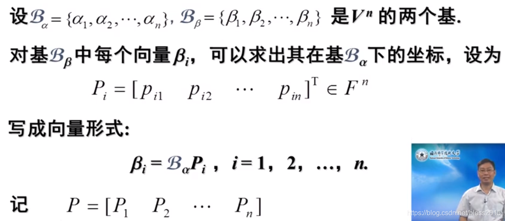
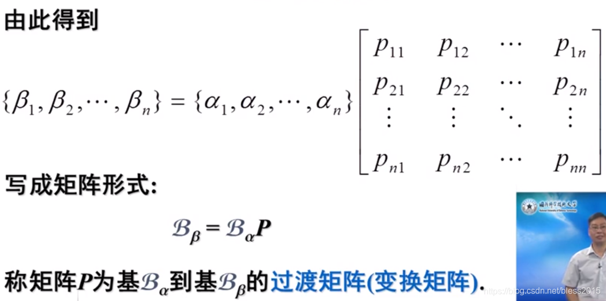
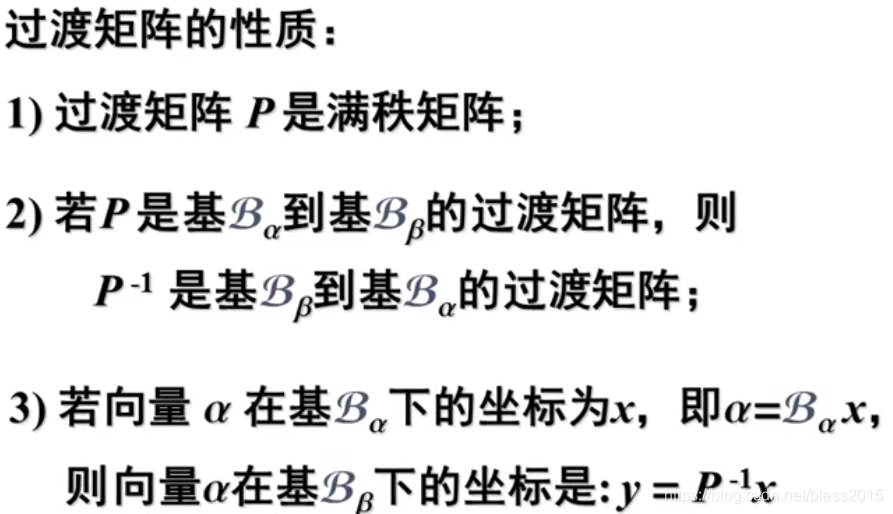

# 收敛域

好的，您提出的这个问题非常关键，点出了一个初学者很容易混淆的地方！您的记忆是完全正确的，在推导收敛域的**根本原理**中，$x$ 项确实是参与的。我们常用的公式只是从这个根本原理中**简化**出来的结果。

现在，我将重新为您系统地梳理如何求解幂级数的收敛域与和函数，并特别澄清您提出的“$x$ 项也要参与”这一点，同时涵盖幂为复合函数的情况。

---

### **第一部分：如何求解收敛域 (重点澄清)**

求解收敛域的本质，是判断对于一个给定的 $x$，级数 $\sum a_n x^n$ 是否收敛。我们使用的**比值法**或**根值法**，其最原始的对象是级数的**通项** $u_n(x) = a_n x^n$，而不仅仅是系数 $a_n$。

#### **1. 澄清：为什么 $x$ 项会参与？**

让我们用比值法来审视级数 $\sum a_n x^n$ 的绝对收敛性。我们考察其通项的绝对值之比的极限：
$$
\rho = \lim_{n \to \infty} \left| \frac{u_{n+1}(x)}{u_n(x)} \right| = \lim_{n \to \infty} \left| \frac{a_{n+1} x^{n+1}}{a_n x^n} \right|
$$
整理后得到：
$$
\rho = \lim_{n \to \infty} \left| \frac{a_{n+1}}{a_n} \right| \cdot |x|
$$
根据比值判别法，级数绝对收敛的条件是 $\rho < 1$，即：
$$
\lim_{n \to \infty} \left| \frac{a_{n+1}}{a_n} \right| \cdot |x| < 1
$$
为了解出 $x$ 的范围，我们将 $|x|$ 分离出来：
$$
|x| < \frac{1}{\lim_{n \to \infty} \left| \frac{a_{n+1}}{a_n} \right|} = \lim_{n \to \infty} \left| \frac{a_n}{a_{n+1}} \right|
$$
**您看，这就是收敛半径 $R$ 公式的由来！**

**结论**：您记得“$x$ 项也要参与”是完全正确的，它体现在推导收敛条件的**原始不等式**中。我们之所以在计算收敛半径 $R$ 时只用系数 $a_n$，是因为我们已经预先将 $|x|$ 从不等式中分离了出来，从而得到了一个不含 $x$ 的、专门用来计算半径的便捷公式。

#### **2. 标准求解步骤**

现在我们回到标准的、简化的求解步骤。

**步骤一：求收敛半径 R**
使用从上述原理中推导出的便捷公式：

| 方法           | 公式                                            | 备注                         |       |                                     |
| ------------ | --------------------------------------------- | -------------------------- | ----- | ----------------------------------- |
| **比值法 (常用)** | $$ R = \lim_{n \to \infty} \left              \| \frac{a_n}{a_{n+1}} \right \| $$    | 对含阶乘 $n!$ 或指数 $a^n$ 的系数 $a_n$ 特别有效。 |
| **根值法**      | $$ R = \frac{1}{\lim_{n \to \infty} \sqrt[n]{ \| a_n                        \| }} $$ | 对含 $a_n = (\dots)^n$ 形式的系数特别有效。     |

**步骤二：确定开区间并检验端点**
1.  **写出开收敛区间**: 根据求出的收敛半径 $R$，立刻得到开收敛区间为 $(-R, R)$。
2.  **单独检验端点**: 将 $x=R$ 和 $x=-R$ **代入原幂级数**，得到两个**常数项级数**，然后用您 `math.md` 中总结的判别法（如p-级数、莱布尼茨判别法）判断其敛散性。

**步骤三：写出最终的收敛域**
综合开区间和收敛的端点，写出最终的收敛域，可能是 $(-R, R)$, $[-R, R)$, $(-R, R]$, $[-R, R]$ 四种形式之一。

---

### **第二部分：如何求解和函数 S(x)**

求解和函数的核心思想不变：通过**逐项求导**或**逐项积分**，将未知级数**转化**为我们熟知的基本幂级数（特别是**等比级数**），求出新级数的和函数后，再通过**积分**或**求导**逆操作回去。

#### **核心工具与步骤**

1.  **核心性质**:
    *   **逐项积分**: $\int_0^x (\sum a_n t^n) dt = \sum \frac{a_n}{n+1} x^{n+1}$
    *   **逐项求导**: $(\sum a_n x^n)' = \sum n a_n x^{n-1}$
    *   这两个操作在收敛域内部（不含端点）都是合法的。

2.  **求解步骤**:
    1.  **观察系数**: 系数中若有 $n$ 或 $n+1$ 等因子，暗示需要通过求导或积分来简化。
    2.  **变换**: 对原级数 $S(x)$ 进行逐项积分或求导，得到新级数 $G(x)$。
    3.  **化为已知级数**: 对 $G(x)$ 进行代数变形，使其变为**等比级数** $\sum q^n = \frac{1}{1-q}$ 或其他常见麦克劳林展开式。
    4.  **写出新和函数**: 写出 $G(x)$ 的和函数表达式。
    5.  **逆运算还原**:
        *   若之前是积分，现在就**求导**：$S(x) = G'(x)$。
        *   若之前是求导，现在就**积分**：$S(x) = \int_0^x G(t) dt + C$。常数 $C$ 通过代入 $x=0$ 到原级数 $S(0)=a_0$ 来确定。

---

### **第三部分：幂为复合函数的情况**

当幂不是简单的 $x^n$，而是 $x^{kn}$ 或 $x^{2n+1}$ 等形式时，核心方法是**变量代换**。

#### **1. 幂为 $x^{kn}$ 的情况 (如 $x^{2n}, x^{3n}$)**

**方法**:
1.  **变量代换**: 令 $t = x^k$。将原级数 $\sum a_n x^{kn} = \sum a_n (x^k)^n$ 改写成关于 $t$ 的标准幂级数 $\sum a_n t^n$。
2.  **求解 t 的级数**: 求出这个关于 $t$ 的级数的和函数 $G(t)$ 和收敛域 $t \in [t_1, t_2)$。
3.  **代换回去**:
    *   **和函数**: 原级数的和函数 $S(x) = G(x^k)$。
    *   **收敛域**: 解不等式 $t_1 \le x^k < t_2$，得到 $x$ 的最终收敛域。

**示例**: 求 $\sum_{n=0}^{\infty} x^{2n}$ 的和函数与收敛域。
1.  令 $t = x^2$。原级数变为 $\sum_{n=0}^{\infty} t^n$。
2.  这是一个公比为 $t$ 的等比级数。其和函数为 $G(t) = \frac{1}{1-t}$，收敛域为 $t \in [-1, 1)$，即 $-1 \le t < 1$。
3.  代换回去：
    *   **和函数**: $S(x) = \frac{1}{1-x^2}$。
    *   **收敛域**: 解不等式 $-1 \le x^2 < 1$。
        *   $x^2 < 1 \implies -1 < x < 1$。
        *   $x^2 \ge -1$ 对所有实数 $x$ 恒成立。
        *   综合得收敛域为 $(-1, 1)$。（端点 $x=\pm 1$ 代入原级数 $\sum 1$ 发散）。

#### **2. 幂为 $x^{kn+p}$ 的情况 (如 $x^{2n+1}$)**

**方法**: 先**提取公因子**，再进行变量代换。
$$
\sum a_n x^{kn+p} = x^p \sum a_n (x^k)^n
$$
然后对后面的级数 $\sum a_n (x^k)^n$ 使用变量代换法求解，最后结果再乘上提出的 $x^p$。

**示例**: 求 $\sum_{n=0}^{\infty} \frac{x^{2n+1}}{2n+1}$ 的和函数。
1.  **提取公因子**: $S(x) = \sum_{n=0}^{\infty} \frac{x^{2n+1}}{2n+1}$。
2.  **观察与变换**: 看到分母是 $2n+1$，暗示需要积分。我们先对 $S(x)$ 求导：
    $$ S'(x) = \sum_{n=0}^{\infty} \frac{(2n+1)x^{2n}}{2n+1} = \sum_{n=0}^{\infty} x^{2n} $$
3.  **求解新级数**: 正如上一个例子，我们知道 $\sum x^{2n}$ 的和函数是 $\frac{1}{1-x^2}$。
4.  **逆运算还原**: 对 $S'(x)$ 积分：
    $$ S(x) = \int \frac{1}{1-x^2} dx = \frac{1}{2} \int (\frac{1}{1-x} + \frac{1}{1+x}) dx = \frac{1}{2} (-\ln|1-x| + \ln|1+x|) + C = \frac{1}{2}\ln\left|\frac{1+x}{1-x}\right| + C $$
5.  **定常数 C**: 代入 $x=0$ 到原级数，$S(0)=0$。代入和函数，$S(0) = \frac{1}{2}\ln(1) + C = C$。所以 $C=0$。
6.  **最终和函数**: $S(x) = \frac{1}{2}\ln\left(\frac{1+x}{1-x}\right)$。
7.  

# 相似矩阵

---

## 一、相似矩阵的定义

#### **1. 代数定义**

设 A 和 B 都是 n 阶方阵。如果存在一个**可逆矩阵 P**，使得下面的关系式成立：
$$
P^{-1}AP = B
$$
那么，我们就称矩阵 A **相似于**矩阵 B，记作 $A \sim B$。这个过程也称为对矩阵 A 进行**相似变换**。

#### **2. 几何意义 (核心理解)**

相似矩阵的几何意义远比其代数定义更为深刻。

**一句话概括：两个相似的矩阵，描述的是同一个线性变换，只是在不同的坐标系（基）下观察得到的结果。**

*   **矩阵 A**: 可以看作是在**标准基**（即我们最常用的直角坐标系）下描述某个线性变换（如旋转、拉伸）的矩阵。
*   **矩阵 B**: 是**同一个线性变换**，但在另一个**新的基**下的描述矩阵。
*   **可逆矩阵 P**: 就是您 math.md 文件中提到的**过渡矩阵**。它的作用是在新旧两个基之间进行坐标转换。$P$ 的列向量就是新基的基向量在旧的标准基下的坐标。

因此，$P^{-1}AP = B$ 这个公式的几何过程是：
1.  先用 $P^{-1}$ 将一个向量从标准坐标系下的坐标，转换到新基下的坐标。
2.  然后用 $A$ 在标准坐标系下进行线性变换。
3.  最后用 $P$ 将变换后的结果，从新基下的坐标再转换回标准坐标系下的坐标。
这一整套操作，等价于直接在新基下用矩阵 $B$ 进行变换。

---

## **二、如何判定两个矩阵是否相似？**

判定两个矩阵是否相似，通常分为两步：先用**必要条件**进行快速排除，如果满足所有必要条件，再寻求**充分条件**进行最终确认。

#### **第一步：检查必要条件 (快速排除法)**

如果矩阵 A 和 B 相似，那么它们**必须**具有许多相同的性质。如果以下任何一条不满足，那么 A 和 B **一定不相似**。

1.  **秩相等**:
    $$ \text{rank}(A) = \text{rank}(B) $$
2.  **行列式相等**:
    $$ |A| = |B| $$
    *   **证明 (来自您 `math.md` 的性质)**: $|B| = |P^{-1}AP| = |P^{-1}| \cdot |A| \cdot |P| = \frac{1}{|P|} \cdot |A| \cdot |P| = |A|$。
3.  **迹相等 (Trace)**:
    矩阵主对角线元素之和相等。
    $$ \text{tr}(A) = \text{tr}(B) $$
4.  **具有相同的特征多项式**:
    $$ |\lambda I - A| = |\lambda I - B| $$
5.  **具有相同的特征值 (最重要)**:
    这是上一条的直接推论。两个相似矩阵的**所有特征值**（包括重数）都必须完全相同。
6.  对于每个特征值，其对应的特征矩阵的秩相同
    对于 A 和 B 的任意一个共同特征值 $\lambda$，都有 $\text{rank}(\lambda I - A) = \text{rank}(\lambda I - B)$。
    *   **推论**: 这意味着对于每个特征值，A 和 B 对应的线性无关的特征向量的个数（几何重数）是相同的。

**实战技巧**：拿到两个矩阵，想判断它们是否相似，应**立即计算它们的特征值**。如果特征值有任何不同，则它们一定不相似。

#### **第二步：寻找充分条件 (最终确认)**

仅仅满足上述所有必要条件，**并不能保证**两个矩阵一定相似。例如，$\begin{pmatrix} 1 & 1 \\ 0 & 1 \end{pmatrix}$ 和 $\begin{pmatrix} 1 & 0 \\ 0 & 1 \end{pmatrix}$ 具有相同的秩、行列式、迹和特征值（都是1），但它们不相似。

要最终确认两个矩阵相似，需要满足以下**充分条件**之一：

1.  **都能对角化为同一个对角矩阵**:
    这是最常用、最重要的判定方法。
    *   如果矩阵 A 和矩阵 B **都能被对角化**（即它们都有 n 个线性无关的特征向量）。
    *   并且它们具有**相同的特征值**。
    *   那么它们都相似于同一个由这些特征值构成的对角矩阵 D。
        $$ A \sim D, \quad B \sim D $$
    *   根据相似关系的传递性，可以得出 $A \sim B$。

**总结判定流程**:
1.  计算 A 和 B 的特征值。
2.  **若特征值不同** $\implies$ **不相似**。
3.  **若特征值相同**，继续判断 A 和 B 是否**都能对角化**。
    *   **若都能对角化** $\implies$ **相似**。
    *   **若其中一个能对角化，另一个不能** $\implies$ **不相似**。
    *   **若都不能对角化**，情况会变得复杂，需要判断它们的**若尔当标准型 (Jordan Normal Form)** 是否相同。在考研数学范围内，通常只涉及前两种情况。

**一句话总结**：对于可以对角化的矩阵来说，**判断相似等价于判断特征值是否完全相同**。

## 如何求解可逆矩阵P

好的，这是一个非常实际且重要的问题。知道了两个矩阵 A 和 B 相似，如何反向求解出那个起“翻译官”作用的可逆矩阵 P，是理解相似变换的关键。

根据您 math.md 文件中关于**相似矩阵、对角化、特征值和特征向量**的详细总结，求解可逆矩阵 P 主要有两种方法，其中第一种（通过对角化）是迄今为止最常用、最系统的方法。

---

### **核心思想**

我们求解的出发点是相似的定义式：
$$
P^{-1}AP = B
$$
将这个式子变形，可以得到：
$$
AP = PB
$$
这个方程是求解 P 的根本。它表示，用矩阵 A 对 P 的列向量进行变换，其结果与用矩阵 B 对 P 的列向量进行坐标变换的结果是相同的。

---

### **方法一：通过对角化求解 (最常用)**

如果矩阵 A 和 B **都可以被对角化**，这是求解 P 的最典型、最系统的方法。

**原理**:
既然 A 和 B 相似，它们必然有**相同的特征值**。如果它们都能被对角化，那么它们都相似于同一个由这些特征值构成的对角矩阵 D。我们可以利用这个对角矩阵 D 作为“桥梁”来找到 P。

*   存在可逆矩阵 $P_A$，使得 $P_A^{-1}AP_A = D$。
*   存在可逆矩阵 $P_B$，使得 $P_B^{-1}BP_B = D$。

将两者联立，得到 $P_A^{-1}AP_A = P_B^{-1}BP_B$。我们的目标是将其整理成 $P^{-1}AP = B$ 的形式。

1.  两边左乘 $P_B$：$P_B P_A^{-1} A P_A = B P_B$
2.  两边右乘 $P_B^{-1}$：$(P_B P_A^{-1}) A (P_A P_B^{-1}) = B$

对比标准形式 $P^{-1}AP = B$，我们发现，所求的过渡矩阵 P 就是：
$$
P = P_A P_B^{-1}
$$

#### **求解步骤**

1.  **求出 A 的特征值和特征向量**:
    *   解特征方程 $|\lambda I - A| = 0$ 得到所有特征值 $\lambda_i$。
    *   对于每个特征值 $\lambda_i$，求解齐次方程组 $(\lambda_i I - A)\mathbf{x} = \mathbf{0}$，得到其对应的特征向量。
    *   将 A 的 n 个线性无关的特征向量作为列，构成矩阵 $P_A$。

2.  **求出 B 的特征值和特征向量**:
    *   重复第一步的过程，得到 B 的特征值（应该与 A 完全相同）和对应的特征向量。
    *   **重要**: 构造矩阵 $P_B$ 时，其列向量（特征向量）的**排列顺序**必须与 $P_A$ 中特征向量对应的**特征值顺序完全一致**。
    *   例如，如果 $P_A$ 的列是按 $\lambda_1, \lambda_2, \lambda_3$ 顺序排列的特征向量，那么 $P_B$ 的列也必须是按 $\lambda_1, \lambda_2, \lambda_3$ 顺序排列的特征向量。

3.  **计算 $P_B$ 的逆矩阵 $P_B^{-1}$**。

4.  **计算最终的 P**:
    $$
    P = P_A \cdot P_B^{-1}
    $$

---

### **方法二：直接求解方程 $AP = PB$ (定义法)**

这种方法不依赖于对角化，理论上更通用，但计算上通常更复杂。

#### **求解步骤**

1.  **设定未知矩阵 P**:
    将 P 设为一个包含未知数的 n 阶方阵。例如，对于2阶矩阵：
    $$
    P = \begin{pmatrix} x_1 & x_2 \\ x_3 & x_4 \end{pmatrix}
    $$

2.  **构建矩阵方程**:
    写出方程 $AP = PB$。
    $$
    \begin{pmatrix} a_{11} & a_{12} \\ a_{21} & a_{22} \end{pmatrix} \begin{pmatrix} x_1 & x_2 \\ x_3 & x_4 \end{pmatrix} = \begin{pmatrix} x_1 & x_2 \\ x_3 & x_4 \end{pmatrix} \begin{pmatrix} b_{11} & b_{12} \\ b_{21} & b_{22} \end{pmatrix}
    $$

3.  **展开并建立线性方程组**:
    *   计算等式两边的矩阵乘积。
    *   让对应位置的元素相等，这样你会得到一个关于 $x_1, x_2, x_3, x_4$ 的线性方程组。

4.  **求解方程组**:
    *   解这个线性方程组。
    *   因为 P 必须是**可逆的**，所以这个方程组的解通常不是唯一的（否则 P 可能为零矩阵）。解中会包含可以自由取值的参数。
    *   你需要选取一组参数值，使得最终得到的矩阵 P 的**行列式不为零**（即 P 可逆）。

**示例**:
如果解出 $x_1 = k, x_2 = 2k, x_3 = m, x_4 = -m$，则
$P = \begin{pmatrix} k & 2k \\ m & -m \end{pmatrix}$。
其行列式为 $-km - 2km = -3km$。为了使 P 可逆，我们只需取 $k \neq 0$ 且 $m \neq 0$ 即可。例如，取 $k=1, m=1$，得到一个解 $P = \begin{pmatrix} 1 & 2 \\ 1 & -1 \end{pmatrix}$。

---

### **总结**

| 方法         | 优点                                   | 缺点                                       | 适用场景                                             |
|-------------- |---------------------------------------- |-------------------------------------------- |------------------------------------------------------ |
| **对角化法** | 思路清晰，步骤固定，是标准考题的解法。 | 要求 A 和 B 都能被对角化，计算量较大。     | **最常用**，特别是当 A 和 B 结构简单，易于对角化时。 |
| **定义法**   | 理论上更通用，不要求矩阵能被对角化。   | 计算抽象，容易出错，需要解大型线性方程组。 | 当矩阵阶数很低（如2阶），或者无法对角化时。          |

# 基和过渡矩阵

好的，这是一个非常核心的线性代数问题，它涉及到向量空间、坐标系以及它们之间的转换。根据您 math.md 文件中关于**向量组线性相关性、秩、可逆矩阵**等核心概念，我为您系统地解释和总结。

---

### **一、什么是 R³ 的一个基？**

**直观理解**：
您可以将 R³（三维实数空间）的一个基，想象成定义这个三维空间的一个**坐标系**。我们最熟悉的坐标系是 x, y, z 轴，它们就是 R³ 的一个基。但实际上，任何三个“方向不同、不共面”的向量都可以构成一个坐标系，也就是一个基。

**严格定义**：
R³ 的一个基，是指由**三个**满足以下两个条件的向量组成的集合 $\{\mathbf{v}_1, \mathbf{v}_2, \mathbf{v}_3\}$：

1.  **线性无关 (Linearly Independent)**:
    *   这三个向量中，没有任何一个向量可以被其他两个向量的线性组合表示出来。
    *   **几何意义**: 这三个向量**不共面**。它们指向足够不同的方向，可以张成一个真正的三维空间，而不是被“压扁”在一个平面或一条直线上。

2.  **生成整个空间 (Span R³)**:
    *   R³ 中的**任何一个向量**，都可以被这三个基向量的唯一线性组合表示出来。
    *   **几何意义**: 使用这三个基向量作为“基本步长”，你可以到达三维空间中的任何一个点。

**最常见的基**:
我们最熟悉的**标准基 (Standard Basis)** 是：
*   $\mathbf{e}_1 = (1, 0, 0)$
*   $\mathbf{e}_2 = (0, 1, 0)$
*   $\mathbf{e}_3 = (0, 0, 1)$

#### **如何判断三个向量是否构成 R³ 的一个基？**

这是“如何求解”的关键。根据您 math.md 文件中的结论，判断三个向量 $\{\mathbf{v}_1, \mathbf{v}_2, \mathbf{v}_3\}$ 是否为 R³ 的一个基，有以下**等价**的判别方法：

1.  **构造矩阵**: 将这三个向量作为列（或行）构成一个 3x3 的方阵 $A$。
2.  **使用以下任一方法判断**:
    *   **行列式法 (最常用)**: 计算矩阵 $A$ 的行列式。如果 **$|A| \neq 0$**，则这三个向量构成一个基。
    *   **秩判别法**: 求矩阵 $A$ 的秩。如果 **rank(A) = 3** (即满秩)，则它们构成一个基。
    *   **可逆法**: 判断矩阵 $A$ 是否可逆。如果 **$A$ 可逆**，则它们构成一个基。

这三种方法是完全等价的，因为对于方阵而言，“可逆”、“满秩”、“行列式不为零”和“列向量组线性无关”都是等价的条件，这些都在您的 `math.md` 文件中有详细总结。

---

### **二、什么是过渡矩阵？**

**直观理解**：
过渡矩阵是一个**“坐标翻译器”**。想象一下，同一个点在不同的坐标系（不同的基）下，其坐标值是不同的。过渡矩阵的作用就是，告诉你一个向量在“旧”坐标系下的坐标，它能帮你“翻译”出这个向量在“新”坐标系下的坐标。

**严格定义**：
假设 R³ 中有两个基：
*   基 A: $\{\mathbf{a}_1, \mathbf{a}_2, \mathbf{a}_3\}$
*   基 B: $\{\mathbf{b}_1, \mathbf{b}_2, \mathbf{b}_3\}$

从**基 A 到基 B 的过渡矩阵**，记作 $P_{A \to B}$，是一个 3x3 的可逆矩阵。它的作用是：如果一个向量 $\mathbf{v}$ 在基 A 下的坐标是 $[\mathbf{v}]_A$，那么它在基 B 下的坐标 $[\mathbf{v}]_B$ 可以通过以下方式计算：
$$
[\mathbf{v}]_B = P_{A \to B} \cdot [\mathbf{v}]_A
$$

#### **如何求解过渡矩阵？**

# 数列收敛

你已超出高级请求授权额度。我们已自动将你切换到计划中包含的 GPT-4.1。要继续使用高级模型，请[启用额外付费高级请求](command:chat.enablePremiumOverages)。证明数列收敛的方法主要有以下几类，结合您 math.md 文件中的级数与极限部分归纳如下：

---

### 1. **定义法（ε-N法）**
直接用收敛定义证明：  
对任意 $\varepsilon > 0$，存在 $N$，使得当 $n > N$ 时，$|a_n - A| < \varepsilon$，其中 $A$ 是极限。  
适用于简单数列或需要严格证明时。

---

### 2. **单调有界法（单调收敛定理）**
如果数列 $\{a_n\}$ 单调（递增或递减）且有界，则必收敛。  
常用于递归数列、构造数列等。

---

### 3. **夹逼准则（夹逼定理）**
若存在两个收敛数列 $\{b_n\}, \{c_n\}$，且 $b_n \le a_n \le c_n$，且 $\lim b_n = \lim c_n = A$，则 $\lim a_n = A$。  
适用于难以直接求极限但能找到上下界的数列。

---

### 4. **基本极限法则与运算法则**
利用已知收敛数列的极限和运算性质（如和、积、商、复合），证明新数列收敛。  
如：$\lim (a_n + b_n) = \lim a_n + \lim b_n$。

---

### 5. **递推关系法**
通过递推公式分析数列的收敛性，常结合单调性和有界性。

---

### 6. **Cauchy收敛准则**
证明数列是Cauchy列：对任意 $\varepsilon > 0$，存在 $N$，使得 $|a_n - a_m| < \varepsilon$ 对所有 $n, m > N$ 成立。  
适用于实数域或完备空间。

---

### 7. **利用已知收敛模型（如p-级数、几何数列等）**
将目标数列与已知收敛数列比较或变形为已知模型。

---

**总结**：常用方法有定义法、单调有界法、夹逼定理、运算法则、递推关系、Cauchy准则和模型比较法。实际证明时可根据数列结构灵活选用。

# 常用夹逼不等式

好的，下面是常用的**夹逼不等式**总结，适用于极限、积分、级数等问题的估算与证明：

---

## 一、基本函数的夹逼不等式

### 1. $\sin x$ 与 $x$（$x \to 0$）

$$
\sin x < x < \tan x
$$

$$
x - \frac{x^3}{6} < \sin x < x
$$

### 2. $1 - \cos x$（$x \to 0$）

$$
0 < 1 - \cos x < \frac{x^2}{2}
$$

$$
1 - \cos x \sim \frac{x^2}{2}
$$

### 3. $\ln(1+x)$（$x > 0$，$x \to 0$）

$$
\frac{x}{1+x} < \ln(1+x) < x
$$

$$
x - \frac{x^2}{2} < \ln(1+x) < x
$$

$$
\frac{x}{1+x} < \ln(1+x) < \frac{x}{1-x} \quad (0 < x < 1)
$$

### 4. $e^x$（$x \to 0$）

$$
1 + x < e^x < 1 + x + \frac{x^2}{2}
$$

### 5. $\arcsin x$、$\arctan x$（$x \to 0$）

$$
x - \frac{x^3}{6} < \arcsin x < x
$$

$$
x - \frac{x^3}{3} < \arctan x < x
$$

---

## 二、级数与极限常用夹逼

### 1. $n/(n^2+1)$ 与 $1/n$（$n \to \infty$）

$$
\frac{n}{n^2+1} \sim \frac{1}{n}
$$

### 2. $a^n$ 与 $n!$（$n \to \infty$）

$$
0 < a^n < n! \quad (a > 0)
$$

---

## 三、夹逼定理（极限证明常用）

若 $a_n \leq b_n \leq c_n$，且 $\lim a_n = \lim c_n = L$，则 $\lim b_n = L$。

---

## 四、其他常见夹逼不等式

### 1. $\frac{\sin x}{x}$（$x \to 0$）

$$
1 - \frac{x^2}{6} < \frac{\sin x}{x} < 1
$$

### 2. $\frac{1}{1+x}$（$x > 0$）

$$
1 - x < \frac{1}{1+x} < 1
$$

---

**总结**：  
常用夹逼不等式主要用于三角函数、对数、指数、反三角函数、分式等基本初等函数的极限估算和证明。实际应用时可结合泰勒展开和等价无穷小进一步夹逼。

## 矩形法

矩形法（也称为积分的**下、上和夹逼不等式**）常用于定积分的估算和证明。常见的矩形法不等式有：

---

### 1. **积分夹逼不等式**

设 $f(x)$ 在区间 $[a, b]$ 上有界，且 $m \leq f(x) \leq M$，则
$$
m(b-a) \leq \int_a^b f(x) dx \leq M(b-a)
$$

---

### 2. **积分平均值不等式**

$$
\min_{x \in [a, b]} f(x) \leq \frac{1}{b-a} \int_a^b f(x) dx \leq \max_{x \in [a, b]} f(x)
$$

---

### 3. **分割区间的矩形和夹逼**

将区间 $[a, b]$ 分成 $n$ 个小区间，每个小区间长度为 $\Delta x$，则
$$
\sum_{i=1}^n m_i \Delta x \leq \int_a^b f(x) dx \leq \sum_{i=1}^n M_i \Delta x
$$
其中 $m_i$ 和 $M_i$ 分别是第 $i$ 个小区间上的 $f(x)$ 的最小值和最大值。

---

### 4. **单调函数的积分不等式**

若 $f(x)$ 在 $[a, b]$ 上单调递增，则
$$
f(a)(b-a) \leq \int_a^b f(x) dx \leq f(b)(b-a)
$$

---

**总结**：  
矩形法不等式主要用于积分的估算和夹逼证明，核心思想是用函数的上下界或分割区间上的最大最小值来夹逼积分值。

# 三大抽样分布

## 分布基本定义

好的，这是一个非常核心的统计学问题。根据您 math.md 文件中关于抽样分布和区间估计的内容，我为您整理一份关于Z分布、卡方分布和t分布的定义、理解和关系的总结。

---

### **核心关系：三大抽样分布的派生关系**

这三个分布是统计推断的基石，它们都源于对一个**正态总体**的抽样，彼此之间存在着紧密的派生关系。

*   **标准正态分布 (Z)** 是最基础的“母体”。
*   **卡方分布 ($\chi^2$)** 是由多个独立的标准正态分布的**平方和**构造出来的。
*   **t 分布** 是由一个独立的标准正态分布和一个独立的卡方分布**组合（相除）**而成的。

---

### **1. 标准正态分布 (Z-distribution)**

*   **定义**: 均值为0，方差为1的正态分布，记为 $N(0,1)$。

*   **理解与构造**:
    *   它是所有正态分布的“标准化”版本。
    *   任何一个服从 $N(\mu, \sigma^2)$ 的随机变量 $X$，通过标准化变换 $Z = \frac{X-\mu}{\sigma}$ 即可得到。
    *   $Z$ 的值代表了原始值 $X$ 偏离其均值 $\mu$ 的标准差倍数。

*   **核心用途 (根据您的 `math.md`)**:
    当**总体方差 $\sigma^2$ 已知**时，用于对总体均值 $\mu$ 进行区间估计和假设检验。其枢轴量为：
    $$
    Z = \frac{\bar{X} - \mu}{\sigma/\sqrt{n}} \sim N(0,1)
    $$

---

### **2. 卡方分布 ($\chi^2$-distribution)**

*   **定义**: 设 $X_1, X_2, \dots, X_n$ 是 $n$ 个相互独立的、服从标准正态分布 $N(0,1)$ 的随机变量，则它们的**平方和**所服从的分布，称为自由度为 $n$ 的卡方分布。
    $$
    \chi^2 = X_1^2 + X_2^2 + \dots + X_n^2 \sim \chi^2(n)
    $$

*   **理解与构造**:
    *   **自由度 (Degrees of Freedom)**: 指的是构造这个分布时，所使用的独立标准正态变量的个数。
    *   **分布形态**: 由于是平方和，$\chi^2$ 的值永远非负，其分布是右偏的（尾巴在右侧）。自由度越大，分布越趋于对称，形态越接近正态分布。

*   **核心用途 (根据您的 math.md)**:
    主要用于对**总体方差 $\sigma^2$** 进行区间估计和假设检验。其枢轴量为：
    $$
    \chi^2 = \frac{(n-1)S^2}{\sigma^2} \sim \chi^2(n-1)
    $$
    *注意：这里的自由度是 $n-1$，因为在计算样本方差 $S^2$ 时，由于使用了样本均值 $\bar{X}$，损失了1个自由度。*

#### 统计量

1）右偏分布

2）自由度越大，越接近正态分布

3）卡方分布的均值=自由度，方差=自由度*2

---

### **3. t 分布 (Student's t-distribution)**

*   **定义**: 设 $X \sim N(0,1)$ 和 $Y \sim \chi^2(n)$ 是两个相互独立的随机变量，则由它们构造出的新变量 $T$ 服从自由度为 $n$ 的 t 分布。
    $$
    T = \frac{X}{\sqrt{Y/n}} \sim t(n)
    $$

*   **理解与构造**:
    *   t 分布是 Z 分布的“现实版”或“平民版”。在现实中，总体方差 $\sigma^2$ 往往是未知的，我们只能用样本标准差 $S$ 来估计它。t 分布正是为了处理这种**用样本标准差S替代总体标准差σ所带来的不确定性**而生的。
    *   **分布形态**: t 分布的形状与标准正态分布非常相似（钟形、对称），但它的**尾部更厚**，这意味着它有更大的概率取到远离中心的值。
    *   **自由度**: 自由度越小，尾部越厚，不确定性越大。当自由度 $n \to \infty$ 时，样本标准差 $S$ 无限接近总体标准差 $\sigma$，t 分布也**无限逼近标准正态分布Z**。

*   **核心用途 (根据您的 `math.md`)**:
    当**总体方差 $\sigma^2$ 未知**时，用于对总体均值 $\mu$ 进行区间估计和假设检验。其枢轴量为：
    $$
    T = \frac{\bar{X} - \mu}{S/\sqrt{n}} \sim t(n-1)
    $$

### **总结**

| 分布              | 来源/构造                        | 核心用途 (在参数估计中)                   | 关键记忆点                    |
| --------------- | ---------------------------- | ------------------------------- | ------------------------ |
| **Z 分布**        | 标准化的正态分布                     | **$\sigma^2$ 已知**，估计/检验均值 $\mu$ | 理想情况下的基准，**方差已知用Z**      |
| **$\chi^2$ 分布** | n个独立Z变量的**平方和**              | 估计/检验**方差 $\sigma^2$**          | 与“平方”、“方差”相关，**检验方差用卡方** |
| **t 分布**        | 一个Z变量除以一个独立的$\chi^2$变量的“均方根” | **$\sigma^2$ 未知**，估计/检验均值 $\mu$ | Z分布的现实替代品，**方差未知用t**     |

## 样本均值方差公式推导

好的，这是一个非常核心的数理统计推导。根据您 math.md 文件中关于**方差性质**和**简单随机样本**的定义，我们可以一步步地推导出样本均值的方差公式。

**结论先行**：如果从一个均值为 $\mu$、方差为 $\sigma^2$ 的总体中，抽取一个容量为 $n$ 的简单随机样本，那么样本均值 $\bar{X}$ 的方差为：
$$
\text{Var}(\bar{X}) = \frac{\sigma^2}{n}
$$

---

### **推导过程**

这个推导主要依赖于您 math.md 文件中总结的两个核心方差性质：
1.  $\text{Var}(cX) = c^2\text{Var}(X)$ (常数以平方倍提出)
2.  当变量相互独立时，$\text{Var}(X+Y) = \text{Var}(X) + \text{Var}(Y)$ (独立变量和的方差等于方差的和)

#### **第一步：写出样本均值的定义**

样本均值 $\bar{X}$ 是样本中所有观测值的算术平均数：
$$
\bar{X} = \frac{X_1 + X_2 + \dots + X_n}{n} = \frac{1}{n} \sum_{i=1}^{n} X_i
$$

#### **第二步：对样本均值应用方差运算法则**

我们要求的是 $\text{Var}(\bar{X})$，即：
$$
\text{Var}(\bar{X}) = \text{Var}\left(\frac{1}{n} \sum_{i=1}^{n} X_i\right)
$$

#### **第三步：利用性质1，提出常数因子**

根据您笔记中的性质 $\text{Var}(cX) = c^2\text{Var}(X)$，我们可以将常数因子 $\frac{1}{n}$ 从方差运算符中提出，但必须平方：
$$
\text{Var}(\bar{X}) = \left(\frac{1}{n}\right)^2 \text{Var}\left(\sum_{i=1}^{n} X_i\right) = \frac{1}{n^2} \text{Var}(X_1 + X_2 + \dots + X_n)
$$

#### **第四步：利用性质2，处理和的方差**

根据**简单随机样本**的定义，样本中的每个观测值 $X_1, X_2, \dots, X_n$ 都是**相互独立**的。
因此，我们可以应用您笔记中的“独立变量和的方差等于方差的和”这一性质：
$$
\text{Var}(X_1 + X_2 + \dots + X_n) = \text{Var}(X_1) + \text{Var}(X_2) + \dots + \text{Var}(X_n)
$$
将此结果代入第三步的式子中：
$$
\text{Var}(\bar{X}) = \frac{1}{n^2} \left[ \text{Var}(X_1) + \text{Var}(X_2) + \dots + \text{Var}(X_n) \right]
$$

#### **第五步：利用“同分布”性质，完成推导**

根据**简单随机样本**的另一个定义，样本中的每个观测值都与总体**同分布**。这意味着它们的方差都等于总体的方差 $\sigma^2$。
$$
\text{Var}(X_1) = \text{Var}(X_2) = \dots = \text{Var}(X_n) = \sigma^2
$$
所以，中括号里的 $n$ 项之和就等于 $n\sigma^2$：
$$
\text{Var}(\bar{X}) = \frac{1}{n^2} [ \underbrace{\sigma^2 + \sigma^2 + \dots + \sigma^2}_{n \text{ 个}}] = \frac{1}{n^2} [n\sigma^2]
$$
化简后得到最终结论：
$$
\text{Var}(\bar{X}) = \frac{\sigma^2}{n}
$$

---

### **直观理解**

这个公式告诉我们一个非常重要的道理：**样本均值的离散程度（方差）比单个观测值的离散程度要小**。

*   当你只抽取一个样本时 ($n=1$)，$\text{Var}(\bar{X}) = \sigma^2$，样本均值就是这个样本本身，其波动性和总体一样大。
*   当你抽取很多样本来求平均时 ($n$ 很大)，一些极端偏大的值和一些极端偏小的值会相互抵消，使得样本均值 $\bar{X}$ 更稳定地聚集在总体均值 $\mu$ 附近。
*   样本量 $ n $ 越大，这种“抵消”效应越强，样本均值的方差就越小，估计就越精确。这正是大数定律的体现。

# 基本空间图形

好的，这是一个非常好的问题，它触及了二次型和空间解析几何的核心思想。我们来分步解答您的问题。

---

### **1. 为什么需要进行可逆变换来化简？**

**核心原因：为了消除交叉项，将方程化为标准形式，从而识别出图形的真实“身份”。**

1.  **原始方程的复杂性**:
    您给出的方程 `(x₁ + x₂ + 2x₃)(x₂ + ax₃) = 1` 不是我们熟悉的空间图形标准形式。它包含了 `x₁x₂`, `x₁x₃`, `x₂x₃` 等大量的**交叉项**。这些交叉项的存在意味着图形的对称轴**没有对齐**我们当前的坐标轴 ($x_1, x_2, x_3$ 轴)。图形是“歪着”或“斜着”放在空间中的。

2.  **可逆变换的作用：旋转和拉伸坐标系**:
    我们可以引入一组新的坐标变量，例如：
    $$
    \begin{cases}
    y_1 = x_1 + x_2 + 2x_3 \\
    y_2 = x_2 + ax_3
    \end{cases}
    $$
    这个操作在几何上相当于进行了一次**坐标系变换**。我们建立了一个新的坐标系（$y_1, y_2, y_3$ 轴），在这个新坐标系下，图形的方程会变得非常简洁。

3.  **“可逆”的重要性：不改变图形本质**:
    *   一个变换是**可逆的**，意味着旧坐标 $(x_1, x_2, x_3)$ 和新坐标 $(y_1, y_2, y_3)$ 之间存在一一对应的关系。
    *   这保证了变换只是“旋转”或“拉伸”了坐标系，而**没有压扁空间或改变图形本身的形状**。我们只是换了一个观察角度，图形的内在属性（是椭球面还是双曲面）是不会改变的。
    *   如果变换不可逆，就相当于把三维空间投影到了一个平面或一条直线上，图形的原始信息就丢失了。

**总结**：进行可逆变换的目的，就是找到一个“正确”的观察角度（新的坐标系），使得在这个角度下，图形的方程呈现出最简单的标准形式，我们一眼就能看出它是什么。

---

### **2. 如何求解本题？**

1.  **进行坐标变换**:
    我们引入新坐标：
    $$
    \begin{cases}
    y_1 = x_1 + x_2 + 2x_3 \\
    y_2 = x_2 + ax_3 \\
    y_3 = x_3 \quad \text{(为了凑成一个完整的可逆变换，可以任意选一个与前两者线性无关的组合，选 } x_3 \text{ 最简单)}
    \end{cases}
    $$
    这个变换的系数矩阵行列式不为零，所以是可逆的。

2.  **在新坐标系下写出方程**:
    将上述代换代入原方程，我们得到一个极其简洁的形式：
    $$
    y_1 y_2 = 1
    $$

3.  **分析新方程代表的图形**:
    *   这个方程是 $y_1 y_2 = 1$。这是一个在 $y_1y_2$ 平面上的**双曲线**。
    *   我们注意到，这个方程中**完全没有出现 $y_3$**。
    *   这意味着，无论 $y_3$ 取任何值，这个 $y_1y_2=1$ 的双曲线都成立。
    *   **几何意义**: 这个图形是一条双曲线，然后沿着与 $y_1y_2$ 平面垂直的 $y_3$ 轴方向无限延伸形成的**柱面**。
    *   因为它的“底”是双曲线，所以这个图形是一个**双曲柱面 (Hyperbolic Cylinder)**。

4.  **得出结论**:
    由于可逆变换不改变图形的本质，原始图形就是一个双曲柱面。因此，答案与参数 `a` 的取值无关。

    **正确答案是 C. 双曲柱面**。

---

### **3. 几种基本的空间图形（二次曲面）标准方程**

根据您 `math.md` 文件中对几何和代数的总结，这里列出二次曲面的标准方程，方便您对比识别：

| 图形名称                | 标准方程                                                     | 特征                                                         |
|------------------------- |-------------------------------------------------------------- |-------------------------------------------------------------- |
| **椭球面**              | $\frac{x^2}{a^2} + \frac{y^2}{b^2} + \frac{z^2}{c^2} = 1$    | 三个变量的平方项，系数**全为正**。                           |
| **单叶双曲面**          | $\frac{x^2}{a^2} + \frac{y^2}{b^2} - \frac{z^2}{c^2} = 1$    | 三个变量的平方项，**一个负号**，等号右边是+1。形状像一个“冷却塔”。 |
| **双叶双曲面**          | $\frac{x^2}{a^2} + \frac{y^2}{b^2} - \frac{z^2}{c^2} = -1$ (或 $-\frac{x^2}{a^2} - \frac{y^2}{b^2} + \frac{z^2}{c^2} = 1$) | 三个变量的平方项，**两个负号**，等号右边是+1。形状是两个分开的“碗”。 |
| **椭圆抛物面**          | $\frac{x^2}{a^2} + \frac{y^2}{b^2} = z$                      | 两个变量是二次方（系数同号），一个变量是一次方。形状像一个“碗”。 |
| **双曲抛物面 (马鞍面)** | $\frac{x^2}{a^2} - \frac{y^2}{b^2} = z$                      | 两个变量是二次方（系数异号），一个变量是一次方。形状像一个“马鞍”。 |
| **椭圆锥面**            | $\frac{x^2}{a^2} + \frac{y^2}{b^2} - \frac{z^2}{c^2} = 0$    | 三个变量的平方项，系数有正有负，**等号右边是0**。            |
| **椭圆柱面**            | $\frac{x^2}{a^2} + \frac{y^2}{b^2} = 1$                      | **只含两个变量**的二次项，构成一个椭圆。第三个变量缺失。     |
| **双曲柱面**            | $\frac{x^2}{a^2} - \frac{y^2}{b^2} = 1$                      | **只含两个变量**的二次项，构成一个双曲线。第三个变量缺失。   |
| **抛物柱面**            | $x^2 = 2py$                                                  | **只含两个变量**，一个二次一个一次，构成一个抛物线。第三个变量缺失。 |

## 基本平面图形

好的，我们来总结一下双曲线的标准形式、性质，以及其他一些常见的特殊曲线。

---

### **一、双曲线 (Hyperbola)**

双曲线是圆锥曲线的一种，其定义是：平面内与两个固定点（焦点）的距离之差的绝对值为常数的点的轨迹。

#### **1. 标准形式**

假设双曲线的中心在原点 $(0,0)$：

| 特征               | **焦点在 x 轴上 (左右开口)**              | **焦点在 y 轴上 (上下开口)**              |
|-------------------- |------------------------------------------- |------------------------------------------- |
| **标准方程**       | $$\frac{x^2}{a^2} - \frac{y^2}{b^2} = 1$$ | $$\frac{y^2}{a^2} - \frac{x^2}{b^2} = 1$$ |
| **图像**           |                                           |                                           |
| **顶点坐标**       | $(\pm a, 0)$                              | $(0, \pm a)$                              |
| **焦点坐标**       | $(\pm c, 0)$                              | $(0, \pm c)$                              |
| **渐近线方程**     | $$y = \pm \frac{b}{a} x$$                 | $$y = \pm \frac{a}{b} x$$                 |
| **a, b, c 的关系** | $$c^2 = a^2 + b^2$$                       | $$c^2 = a^2 + b^2$$                       |
| **离心率 e**       | $$e = \frac{c}{a} > 1$$                   | $$e = \frac{c}{a} > 1$$                   |

#### **2. 核心性质**

1.  **对称性**: 双曲线是关于中心、实轴和虚轴都对称的图形。
2.  **渐近线 (Asymptotes)**: 这是双曲线最重要的性质。当双曲线上的点无限远离中心时，它会无限趋近于两条直线，这两条直线就是渐近线。它们构成了双曲线的“边界框架”。
3.  **离心率 (Eccentricity)**: $e = c/a$ 描述了双曲线开口的“宽窄”程度。$e$ 越大，开口越宽。由于双曲线中 $c>a$，所以其离心率恒大于1。

---

### **二、其他常见特殊曲线**

除了双曲线，还有许多在数学和物理中非常重要的曲线。

| 曲线名称                              | 图像 | 标准方程 (常见形式)                                          | 核心特征与简介                                               |
|--------------------------------------- |------ |-------------------------------------------------------------- |-------------------------------------------------------------- |
| **椭圆 (Ellipse)**                    |      | **直角坐标**: $\frac{x^2}{a^2} + \frac{y^2}{b^2} = 1$        | 平面内与两焦点距离之和为常数的点的轨迹。行星运行的轨道就是椭圆。 |
| **抛物线 (Parabola)**                 |      | **直角坐标**: $y^2 = 2px$ 或 $x^2 = 2py$                     | 平面内与一个定点（焦点）和一条定直线（准线）距离相等的点的轨迹。抛物运动的轨迹。 |
| **摆线 / 旋轮线 (Cycloid)**           |      | **参数方程**: $\begin{cases} x = r(t - \sin t) \\ y = r(1 - \cos t) \end{cases}$ | 一个圆沿直线滚动时，圆周上一点的轨迹。它是“最速降线”和“等时降线”。 |
| **心形线 (Cardioid)**                 |      | **极坐标**: $r = a(1 - \cos \theta)$                         | 因形状酷似心脏而得名。一个圆沿另一个等大圆外侧滚动时，圆周上一点的轨迹。 |
| **双纽线 (Lemniscate of Bernoulli)**  |      | **极坐标**: $r^2 = a^2 \cos(2\theta)$                        | 形状像无穷大符号 "∞"。平面内到两定点距离之积为定值的点的轨迹。 |
| **阿基米德螺线 (Archimedean Spiral)** |      | **极坐标**: $r = a\theta$                                    | 一点匀速离开原点的同时，又以匀角速度绕原点旋转所形成的轨迹。 |

# 曲率

好的，这是一个非常好的问题，它将您 math.md 文件中关于**极值点**和**导数几何意义**的知识点进行了深化。我们来总结一下在极值点处，曲率圆的相关公式。

---

### **曲率圆的核心概念**

**曲率圆 (Circle of Curvature)**，也叫“密切圆”，是在曲线上某一点最能“贴合”该点附近曲线的圆。它由两个要素完全确定：
1.  **曲率半径 (Radius of Curvature) $R$**: 圆的半径。
2.  **曲率中心 (Center of Curvature) $(x_c, y_c)$**: 圆心的坐标。

我们的目标就是求出在极值点处的 $R$ 和 $(x_c, y_c)$。

---

### **一、通用公式（适用于任意点）**

首先，我们列出对于函数 $y=f(x)$ 在任意点 $(x, y)$ 处的通用公式。

1.  **曲率 (Curvature) $K$**:
    曲率衡量曲线的弯曲程度。
    $$
    K = \frac{|y''|}{(1 + (y')^2)^{3/2}}
    $$

2.  **曲率半径 (Radius of Curvature) $R$**:
    曲率半径是曲率的倒数，半径越大，曲线越平缓。
    $$
    R = \frac{1}{K} = \frac{(1 + (y')^2)^{3/2}}{|y''|}
    $$

3.  **曲率中心 (Center of Curvature) $(x_c, y_c)$**:
    $$
    x_c = x - y' \frac{1 + (y')^2}{y''}
    $$
    $$
    y_c = y + \frac{1 + (y')^2}{y''}
    $$

---

### **二、极值点处的简化公式（核心）**

现在，我们利用极值点的关键性质来简化上述通用公式。

根据您 `math.md` 文件中的定义，对于一个可导函数，其**极值点必定是驻点**。这意味着在极值点 $(x_0, y_0)$ 处，一阶导数必然为零：
$$
y' = f'(x_0) = 0
$$
同时，为了是极值点（而不是鞍点或无法判断的情况），通常二阶导数不为零，$y'' = f''(x_0) \neq 0$。

我们将 $y' = 0$ 这个核心条件代入到通用公式中，得到极值点处的专属简化公式：

1.  **曲率半径 $R$ 在极值点处**:
    $$
    R = \frac{(1 + (0)^2)^{3/2}}{|y_0''|} = \frac{1}{|y_0''|}
    $$
    **结论**: 在极值点，曲率半径就是**二阶导数值的倒数的绝对值**。

2.  **曲率中心 $(x_c, y_c)$ 在极值点处**:
    *   **中心横坐标 $x_c$**:
        $$
        x_c = x_0 - (0) \cdot \frac{1 + (0)^2}{y_0''} = x_0
        $$
        **结论**: 曲率中心的**横坐标与极值点的横坐标相同**。

    *   **中心纵坐标 $y_c$**:
        $$
        y_c = y_0 + \frac{1 + (0)^2}{y_0''} = y_0 + \frac{1}{y_0''}
        $$
        **结论**: 曲率中心的纵坐标等于极值点的纵坐标**加上曲率半径的带符号版本**（即 $1/y_0''$）。
        *   如果 $y_0'' > 0$（极小值点，曲线向上凹），$y_c = y_0 + R$，圆心在点的上方。
        *   如果 $y_0'' < 0$（极大值点，曲线向下凹），$y_c = y_0 - R$，圆心在点的下方。

---

### **三、最终的曲率圆方程**

综合以上简化结果，函数 $y=f(x)$ 在极值点 $(x_0, y_0)$ 处的曲率圆方程为：

$$
(x - x_0)^2 + \left( y - \left(y_0 + \frac{1}{y_0''}\right) \right)^2 = \left( \frac{1}{y_0''} \right)^2
$$

**总结与记忆**:
在极值点，由于切线是水平的 ($y'=0$)，情况变得非常简单：
*   圆心就在极值点的正上方或正下方。
*   圆的半径大小完全由该点的二阶导数（凹凸性）决定。
*   圆与函数曲线在极值点处相切，切线为水平线 $y=y_0$。

# 矩阵运算性

好的，我们来详细解析图片中解答的逻辑脉络，并对其中应用到的线性代数性质进行归纳总结。

### **解答的逻辑步骤分析**

这道题的整体思路是：首先通过矩阵 `A` 的构造，确定其**对称性**和**秩**，从而推导出它的**特征值**和**特征向量**。然后利用**正交对角化**这一强大工具，将 `A` 和它的伴随矩阵 `A*` 转换到简单的对角形式下进行运算，最终求得 `A+A*` 的表达式。

---

#### **第一步：证明 A 是对称矩阵，且必有特征值 0**

1.  **证明对称性**:
    *   **逻辑**: 解答首先计算 `A` 的转置 `Aᵀ`。
    *   **应用性质**:
        *   和的转置: `(X+Y)ᵀ = Xᵀ+Yᵀ`
        *   乘积的转置: `(XY)ᵀ = YᵀXᵀ`
        *   转置的转置: `(Xᵀ)ᵀ = X`
    *   **推导**: `Aᵀ = (ααᵀ + ββᵀ)ᵀ = (ααᵀ)ᵀ + (ββᵀ)ᵀ = (αᵀ)ᵀαᵀ + (βᵀ)ᵀβᵀ = ααᵀ + ββᵀ = A`。
    *   **结论**: 因为 `Aᵀ = A`，所以 `A` 是一个**对称矩阵**。根据您 math.md 文件中的知识，对称矩阵一定可以**对角化**。

2.  **推断秩与特征值**:
    *   **逻辑**: 计算 `A` 的秩 `r(A)` 的上限。
    *   **应用性质**:
        *   矩阵和的秩小于等于秩的和: `r(X+Y) ≤ r(X) + r(Y)`。
        *   一个 n×1 的列向量乘以一个 1×n 的行向量，得到的 n×n 矩阵的秩为 1（前提是向量非零）。所以 `r(ααᵀ) = 1` 且 `r(ββᵀ) = 1`。
    *   **推导**: `r(A) = r(ααᵀ + ββᵀ) ≤ r(ααᵀ) + r(ββᵀ) = 1 + 1 = 2`。
    *   **结论**: 矩阵 `A` 是一个 3 阶方阵（因为 `α, β` 是三维向量），而其秩 `r(A) ≤ 2`，说明 `A` 不是满秩矩阵。根据您 math.md 中“行列式为零的条件”，非满秩矩阵的行列式为 0，即 `|A| = 0`。一个矩阵行列式为 0 的充要条件是它至少有一个特征值为 0。因此，**0 是 A 的一个特征值**。

#### **第二步：确定 A 的所有特征值和特征向量**

1.  **利用已知条件**: 题目中应有已知条件 `Aα = α` 和 `Aβ = β`（这是这类题目的常见设置）。这直接说明：
    *   `α` 是 `A` 对应于特征值 `λ₁ = 1` 的特征向量。
    *   `β` 是 `A` 对应于特征值 `λ₂ = 1` 的特征向量。
    *   题目还已知 `α, β` 线性无关，所以特征值 1 至少有 2 个线性无关的特征向量。

2.  **组合结论**:
    *   从第一步，我们知道 `λ₃ = 0` 是一个特征值。
    *   从第二步，我们知道 `λ₁ = 1, λ₂ = 1` 是两个特征值。
    *   **结论**: `A` 的三个特征值为 `1, 1, 0`。

3.  **构造正交矩阵 Q**:
    *   `A` 是对称矩阵，其不同特征值对应的特征向量是正交的。
    *   题目已知 `α, β` 是正交的单位向量（这也是常见设置）。
    *   我们可以构造第三个特征向量 `γ`，它对应于特征值 0。由于 `γ` 必须与 `α` 和 `β` 都正交，因此可以取 `γ = α × β` (向量叉乘)。
    *   这样，`{α, β, γ}` 构成了一组标准正交基。
    *   用这组标准正交基作为列向量，构造一个**正交矩阵** `Q = (α, β, γ)`。

#### **第三步：对 A 和 A* 进行对角化运算**

1.  **对角化 A**:
    *   **应用性质**: 正交对角化公式 `Q⁻¹AQ = QᵀAQ = Λ`。
    *   **结论**: `Q⁻¹AQ = Λ = diag(1, 1, 0)`，其中 `Λ` 是由 `A` 的特征值构成的对角矩阵。

2.  **计算 A***:
    *   **逻辑**: 直接计算 `A*` 很复杂，但我们可以利用对角化来计算 `Q⁻¹A*Q`。
    *   **应用性质**: 核心公式 `Q⁻¹A*Q = |Q| (QᵀA⁻¹Q)ᵀ` (这是一个伴随矩阵和正交矩阵的综合性质，详见下表)。更简单地，可以直接用 `A* = |A|A⁻¹` 和 `Q⁻¹AQ = Λ` 来推导。
    *   **推导**:
        $$
        A^* = |A|A^{-1}
        $$
        因为 `|A|=0`，这个公式在这里不直接适用。但我们有更一般的伴随矩阵和特征值的关系：
        **如果 `λ` 是 `A` 的特征值，那么 `|A|/λ` 是 `A*` 的特征值。**
        
        *   对于 `λ=1`，`A*` 的特征值是 `0/1 = 0`。
        *   对于 `λ=0`，这个公式出现 `0/0`，需要特殊处理。当 `r(A) = n-1` 时（本题 `r(A)=2, n=3`），`A*` 的特征值为 `0`（n-1个）和 `tr(A*)`（1个）。
        *   一个更直接的方法是利用对角化关系：`A = QΛQ⁻¹`，则 `A* = |QΛQ⁻¹| (QΛ⁻¹Q⁻¹)⁻¹ = |Q||Λ||Q⁻¹| Q(Λ⁻¹)⁻¹Q⁻¹ = |Λ| QΛQ⁻¹`。但 `Λ` 不可逆。
        *   最可靠的是图片中的方法，利用 `(Q⁻¹AQ)* = Λ*`。
        $$
        (Q^{-1}AQ)^* = \Lambda^* = \begin{pmatrix} 1 & 0 & 0 \\ 0 & 1 & 0 \\ 0 & 0 & 0 \end{pmatrix}^* = \begin{pmatrix} 0 & 0 & 0 \\ 0 & 0 & 0 \\ 0 & 0 & 1 \end{pmatrix}
        $$
        同时，`(Q⁻¹AQ)* = Q* (A*) (Q⁻¹)* = |Q|Q⁻¹ A* |Q⁻¹|Q = Q⁻¹A*Q` (因为 `|Q|=1`)。
    *   **结论**: `Q⁻¹A*Q = Λ* = diag(0, 0, 1)`。

#### **第四步：计算 A+A* 并得出结论**

1.  **逻辑**: 将 `A+A*` 放在 `Q⁻¹` 和 `Q` 中间进行相似变换。
2.  **应用性质**: 相似变换的线性性 `Q⁻¹(X+Y)Q = Q⁻¹XQ + Q⁻¹YQ`。
3.  **推导**:
    $$
    Q^{-1}(A+A^*)Q = Q^{-1}AQ + Q^{-1}A^*Q = \Lambda + \Lambda^*
    $$
    $$
    = \begin{pmatrix} 1 & 0 & 0 \\ 0 & 1 & 0 \\ 0 & 0 & 0 \end{pmatrix} + \begin{pmatrix} 0 & 0 & 0 \\ 0 & 0 & 0 \\ 0 & 0 & 1 \end{pmatrix} = \begin{pmatrix} 1 & 0 & 0 \\ 0 & 1 & 0 \\ 0 & 0 & 1 \end{pmatrix} = E \text{ (单位矩阵)}
    $$
4.  **结论**:
    *   我们得到了 `Q⁻¹(A+A*)Q = E`。
    *   两边左乘 `Q` 右乘 `Q⁻¹`，得到 `A+A* = QEQ⁻¹ = QQ⁻¹ = E`。
    *   最终结论：`A+A* = E`。

---

### **应用性质归纳总结**

| 性质分类     | 性质名称/公式                                                     | 在本题中的应用                                       |
| -------- | ----------------------------------------------------------- | --------------------------------------------- |
| **矩阵转置** | `(X+Y)ᵀ = Xᵀ+Yᵀ`                                            | 用于证明 `A` 是对称矩阵。                               |
|          | `(XY)ᵀ = YᵀXᵀ`                                              | 用于证明 `A` 是对称矩阵。                               |
| **矩阵的秩** | `r(X+Y) ≤ r(X)+r(Y)`                                        | 用于推断 `r(A) ≤ 2`。                              |
|          | `r(uvᵀ) = 1` (u,v为非零列向量)                                    | 用于确定 `r(ααᵀ)=1` 和 `r(ββᵀ)=1`。                 |
| **行列式**  | `                        \|A\| =0`  $\iff$ `r(A) < n`       | 由 `r(A)≤2` 推出 `\|A\| =0`。                     |
|          | `                        \|A\| =0`  $\iff$ `0` 是 `A` 的一个特征值 | 由 `\|A\| =0` 推出 `A` 必有特征值 0。                  |
| **特征值**  | `Ax = λx`                                                   | 从 `Aα=α, Aβ=β` 确定特征值 1。                       |
| **对称矩阵** | `Aᵀ=A` $\iff$ `A` 是对称矩阵                                     | 证明 `A` 的对称性。                                  |
|          | 对称矩阵必可正交对角化                                                 | 这是整个解题思路的理论基础。                                |
|          | 不同特征值对应的特征向量相互正交                                            | 用于说明 `γ` 与 `α, β` 正交。                         |
| **正交矩阵** | `Q` 的列向量是标准正交基                                              | 用于构造 `Q = (α, β, γ)`。                         |
|          | `Q⁻¹ = Qᵀ`                                                  | 在对角化 `Q⁻¹AQ` 时隐式使用。                           |
|          | `                        \|Q\| = ±1` (对于标准正交基，`\| Q \| =1`) | 在推导 `(Q⁻¹AQ)*` 时用到。                           |
| **对角化**  | `Q⁻¹AQ = Λ`                                                 | 将 `A` 变换为对角阵 `Λ`，简化计算。                        |
| **伴随矩阵** | `A* =                    \|A      \| A⁻¹`                   | 伴随矩阵的基本定义。                                    |
|          | `(P⁻¹AP)* = P⁻¹A*P` (当 $\|P\| =1$)                          | **核心技巧**：用于计算 `Q⁻¹A*Q`。                       |
|          | `Λ*` (对角矩阵的伴随矩阵)                                            | 对角矩阵 `Λ` 的伴随矩阵 `Λ*` 是其主对角线上每个元素的代数余子式构成的对角矩阵。 |
|          | $(XY)^* = Y^* X^*$                                          | 乘积的伴随                                         |
|          | $(kA)^* = k^{n-1} A^*$                                      | 数乘的伴随                                         |

### 西尔韦斯特定理

- **推导**: 从 `(A-E)B = O` 得到 `r(A-E) + r(B) ≤ 3`。
- **原理**:  
    这是一个重要的秩不等式定理。如果两个矩阵 `X` (m×n阶) 和 `Y` (n×p阶) 的乘积是零矩阵，即 `XY = O`，那么 `X` 的列空间中的向量，经过 `Y` 变换后都会被“压扁”到零向量。更严谨地说，**Y 的列向量空间完全包含在 X 的零空间（解空间）中**。
    - Y 的列空间维度就是 `r(Y)`。
    - X 的零空间维度是 `n - r(X)` (根据秩-零度定理)。
    - 因此，`r(Y) ≤ n - r(X)`。
    - 移项后得到：`r(X) + r(Y) ≤ n`。
- **在本题中的应用**:
    - 令 `X = A-E`，`Y = B`，矩阵都是 3 阶方阵，所以 `n=3`。
    - 代入公式得到：`r(A-E) + r(B) ≤ 3`。

好的，您提的这个问题非常关键，它涉及到**伴随矩阵 (Adjoint Matrix)** 的一个重要性质，即**数乘性质**。这个 `2` 正是来源于此。

我们来一步步从头推导，看看这个 `2` 是如何产生的。

---

### **推导过程**

#### **第一步：从原始关系式出发**

根据您提供的图片，题目给出的原始关系是：
$$
P_3 P_1 A P_2 P_3 = C
$$

我们的目标是建立 `A*` 和 `C*` 之间的关系。最直接的方法就是对等式两边同时取**伴随矩阵**。

#### **第二步：应用伴随矩阵的核心性质**

这里需要用到您 math.md 文件中没有直接列出，但非常重要的两个伴-随矩阵性质：

1.  **乘积的伴随**: $(XY)^* = Y^* X^*$ (顺序反转)
2.  **数乘的伴随**: 对于 n 阶方阵 A 和标量 k，有 $(kA)^* = k^{n-1} A^*$

现在，我们对原始关系式两边取伴随：
$$
(P_3 P_1 A P_2 P_3)^* = C^*
$$

应用**乘积的伴随**性质，将左边的式子展开（注意顺序完全反转）：
$$
(P_3)^* (P_2)^* A^* (P_1)^* (P_3)^* = C^*
$$

#### **第三步：将伴随矩阵 `X*` 转换为逆矩阵 `X⁻¹`**

为了得到最终形式，我们需要利用伴随矩阵和逆矩阵的核心关系：
$$
X^* = |X| X^{-1}
$$

我们将这个关系应用到上式中的每一个 `P*` 上：
$$
(|P_3| P_3^{-1}) \cdot (|P_2| P_2^{-1}) \cdot A^* \cdot (|P_1| P_1^{-1}) \cdot (|P_3| P_3^{-1}) = C^*
$$

#### **第四步：计算行列式并整理**

现在，我们把所有的标量（行列式的值）提到最前面。
$$
|P_3| |P_2| |P_1| |P_3| \cdot (P_3^{-1} P_2^{-1} A^* P_1^{-1} P_3^{-1}) = C^*
$$

接下来，我们根据图片中给出的 `P₁`, `P₂`, `P₃` 计算它们的行列式：
*   $P_1 = \begin{pmatrix} 1 & 0 & 0 \\ 0 & 1 & 0 \\ 2 & 0 & 1 \end{pmatrix}$ 是下三角矩阵，其行列式为主对角线元素之积：$|P_1| = 1 \cdot 1 \cdot 1 = 1$。
*   $P_2 = \begin{pmatrix} 1 & 0 & 2 \\ 0 & 1 & 0 \\ 0 & 0 & 1 \end{pmatrix}$ 是上三角矩阵，其行列式为：$|P_2| = 1 \cdot 1 \cdot 1 = 1$。
*   $P_3 = \begin{pmatrix} 2 & 0 & 0 \\ 0 & 1 & 0 \\ 0 & 0 & 1 \end{pmatrix}$ 是对角矩阵，其行列式为：$|P_3| = 2 \cdot 1 \cdot 1 = 2$。

将这些行列式的值代入：
$$
(2) \cdot (1) \cdot (1) \cdot (2) \cdot (P_3^{-1} P_2^{-1} A^* P_1^{-1} P_3^{-1}) = C^*
$$
$$
4 \cdot (P_3^{-1} P_2^{-1} A^* P_1^{-1} P_3^{-1}) = C^*
$$

#### **第五步：凑出最终形式**

我们得到了 `4` 这个系数。现在需要把它合理地分配到两边的方括号里。
$$
4 = 2 \times 2
$$
所以，
$$
[2 \cdot (P_3^{-1} P_2^{-1})] \cdot A^* \cdot [2 \cdot (P_1^{-1} P_3^{-1})] = C^*
$$

再利用逆矩阵的性质 $(XY)^{-1} = Y^{-1}X^{-1}$，将括号里的项合并：
$$
[2 (P_2 P_3)^{-1}] \cdot A^* \cdot [2 (P_3 P_1)^{-1}] = C^*
$$

**结论**：
这个 `2` 倍关系来源于**矩阵 `P₃` 的行列式 `|P₃|=2`**。在将伴随矩阵 `P₃*` 转换为逆矩阵 `P₃⁻¹` 的过程中，这个行列式值 `2` 就作为系数出现了。由于原始关系式中 `P₃` 出现了两次，所以最终总系数是 `2 * 2 = 4`，分解后就得到了两个 `2`。

# 法平面/切向量/切平面/法向量

好的，这是一个关于空间解析几何的核心问题。根据您 math.md 文件中关于向量、偏导数和梯度等内容的总结，我为您整理出求解空间曲线和空间曲面的法线与切/法平面的完整方法和公式。

---

### **核心区别：曲线 vs 曲面**

*   **空间曲线** (一维对象): 在某一点，最核心的向量是**切向量 (Tangent Vector)**。它只有一个切线方向，但有无数个法线方向，这些法线构成一个**法平面 (Normal Plane)**。
*   **空间曲面** (二维对象): 在某一点，最核心的向量是**法向量 (Normal Vector)**。它只有一个法线方向，但有无数个切线方向，这些切线构成一个**切平面 (Tangent Plane)**。

---

## **一、空间曲线 (Space Curve)**

通常以**参数方程**形式给出：$L: \begin{cases} x = x(t) \\ y = y(t) \\ z = z(t) \end{cases}$

#### **1. 关键向量：切向量 $\mathbf{T}$**

曲线在某点 $P_0(x_0, y_0, z_0)$ (对应参数 $t=t_0$) 的切向量由其参数方程的导数构成。

*   **公式**:
    $$
    \mathbf{T} = (x'(t_0), y'(t_0), z'(t_0))
    $$

#### **2. 求解切线 (Tangent Line) 和法平面 (Normal Plane)**

*   **切线**: 是过点 $P_0$ 且以 $\mathbf{T}$ 为**方向向量**的直线。
*   **法平面**: 是过点 $P_0$ 且以 $\mathbf{T}$ 为**法向量**的平面。

| 求解对象 | 定义 | 公式 |
| :--- | :--- | :--- |
| **切线** | 过点 $P_0(x_0, y_0, z_0)$ 方向向量为 $\mathbf{T}=(x', y', z')$ | $$\frac{x - x_0}{x'(t_0)} = \frac{y - y_0}{y'(t_0)} = \frac{z - z_0}{z'(t_0)}$$ |
| **法平面** | 过点 $P_0(x_0, y_0, z_0)$ 法向量为 $\mathbf{T}=(x', y', z')$ | $$x'(t_0)(x - x_0) + y'(t_0)(y - y_0) + z'(t_0)(z - z_0) = 0$$ |

## 二、空间曲线（方程组）

好的，这是一个非常重要的问题。当空间曲线以**两个曲面交线**的方程组形式表示时，其切向量和法平面的求解方法与参数方程形式完全不同。

这种形式通常写作：
$$
L: \begin{cases} F(x, y, z) = C_1 \\ G(x, y, z) = C_2 \end{cases}
$$

这里的核心思想是利用两个曲面在交点处的**法向量**来确定交线的**切向量**。

---

### **核心几何思想**

1.  空间曲线 $L$ 上的任意一点 $P_0$，既在曲面 $F$ 上，也在曲面 $G$ 上。
2.  因此，曲线 $L$ 在点 $P_0$ 的**切向量 $\mathbf{T}$**，必须同时位于曲面 $F$ 在该点的切平面上，和曲面 $G$ 在该点的切平面上。
3.  这意味着，切向量 $\mathbf{T}$ 必须同时**垂直于**曲面 $F$ 的法向量 $\mathbf{n}_F$ 和曲面 $G$ 的法向量 $\mathbf{n}_G$。

根据您 `math.md` 文件中关于**梯度 (Gradient)** 的内容，我们知道曲面的法向量可以通过计算梯度得到。

---

### **求解步骤**

#### **第一步：计算两个曲面在点 $P_0(x_0, y_0, z_0)$ 处的法向量**

1.  **曲面 F 的法向量 $\mathbf{n}_F$**:
    计算函数 $F(x, y, z)$ 的梯度向量在点 $P_0$ 的值。
    $$
    \mathbf{n}_F = \nabla F(P_0) = \left( \frac{\partial F}{\partial x}, \frac{\partial F}{\partial y}, \frac{\partial F}{\partial z} \right)\bigg|_{(x_0, y_0, z_0)}
    $$

2.  **曲面 G 的法向量 $\mathbf{n}_G$**:
    计算函数 $G(x, y, z)$ 的梯度向量在点 $P_0$ 的值。
    $$
    \mathbf{n}_G = \nabla G(P_0) = \left( \frac{\partial G}{\partial x}, \frac{\partial G}{\partial y}, \frac{\partial G}{\partial z} \right)\bigg|_{(x_0, y_0, z_0)}
    $$

#### **第二步：计算曲线在点 $P_0$ 处的切向量 $\mathbf{T}$**

因为切向量 $\mathbf{T}$ 同时垂直于 $\mathbf{n}_F$ 和 $\mathbf{n}_G$，所以它可以通过计算这两个法向量的**叉积 (Cross Product)** 得到。

*   **公式**:
    $$
    \mathbf{T} = \mathbf{n}_F \times \mathbf{n}_G = \begin{vmatrix} \mathbf{i} & \mathbf{j} & \mathbf{k} \\ \frac{\partial F}{\partial x} & \frac{\partial F}{\partial y} & \frac{\partial F}{\partial z} \\ \frac{\partial G}{\partial x} & \frac{\partial G}{\partial y} & \frac{\partial G}{\partial z} \end{vmatrix}
    $$
    *注意：所有偏导数都在点 $P_0$ 处取值。*

#### **第三步：求解切线和法平面**

一旦求出了切向量 $\mathbf{T} = (A, B, C)$，后续的求解就和参数方程的情况完全一样了。

*   **切线方程 (Tangent Line)**:
    过点 $P_0(x_0, y_0, z_0)$，以 $\mathbf{T}$ 为方向向量的直线。
    $$
    \frac{x - x_0}{A} = \frac{y - y_0}{B} = \frac{z - z_0}{C}
    $$

*   **法平面方程 (Normal Plane)**:
    过点 $P_0(x_0, y_0, z_0)$，以 $\mathbf{T}$ 为**法向量**的平面。
    $$
    A(x - x_0) + B(y - y_0) + C(z - z_0) = 0
    $$

---

### **总结**

| 曲线表示法 | 关键向量的求法 |
| :--- | :--- |
| **参数方程** $x=x(t), y=y(t), z=z(t)$ | **切向量 $\mathbf{T}$** 通过**求导**得到： $\mathbf{T} = (x'(t), y'(t), z'(t))$ |
| **方程组 (交线)** $\begin{cases} F(x,y,z)=C_1 \\ G(x,y,z)=C_2 \end{cases}$ | **切向量 $\mathbf{T}$** 通过两个曲面法向量的**叉积**得到： $\mathbf{T} = \nabla F \times \nabla G$ |

## 三、空间曲面 (Space Surface)

曲面通常以**隐式方程**或**显式方程**给出。求解其法向量的核心工具是您 math.md 文件中定义的**梯度 (Gradient)**。

#### **1. 关键向量：法向量 $\mathbf{n}$**

曲面在某点 $P_0(x_0, y_0, z_0)$ 的法向量垂直于该点的切平面。它由曲面方程的梯度向量给出。

#### **2. 求解方法 (分两种情况)**

##### **情况A：隐式方程 $F(x, y, z) = C$**

这是最通用、最强大的方法。

1.  **构造函数**: 将方程整理为 $F(x, y, z) = C$ 的形式。
2.  **计算梯度**: 根据您 `math.md` 文件中的梯度公式，计算函数 $F$ 在点 $P_0$ 的梯度，这个梯度就是曲面的法向量 $\mathbf{n}$。
    $$
    \mathbf{n} = \nabla F(P_0) = \left( \frac{\partial F}{\partial x}, \frac{\partial F}{\partial y}, \frac{\partial F}{\partial z} \right)\bigg|_{(x_0, y_0, z_0)}
    $$

##### **情况B：显式方程 $z = f(x, y)$**

这是隐式方程的一个特例，但非常常用，有简化的公式。

1.  **构造函数**: 将方程改写为隐式形式 $f(x, y) - z = 0$。此时 $F(x, y, z) = f(x, y) - z$。
2.  **计算梯度**: 计算 $F$ 的梯度。
    *   $\frac{\partial F}{\partial x} = \frac{\partial f}{\partial x}$
    *   $\frac{\partial F}{\partial y} = \frac{\partial f}{\partial y}$
    *   $\frac{\partial F}{\partial z} = -1$
    所以，法向量为：
    $$
    \mathbf{n} = \left( \frac{\partial f}{\partial x}, \frac{\partial f}{\partial y}, -1 \right)\bigg|_{(x_0, y_0)}
    $$

#### **3. 求解切平面 (Tangent Plane) 和法线 (Normal Line)**

*   **切平面**: 是过点 $P_0$ 且以 $\mathbf{n}$ 为**法向量**的平面。
*   **法线**: 是过点 $P_0$ 且以 $\mathbf{n}$ 为**方向向量**的直线。

| 求解对象    | 定义                                                            | 公式                                                                                 |
| :------ | :------------------------------------------------------------ | :--------------------------------------------------------------------------------- |
| **切平面** | 过点 $P_0(x_0, y_0, z_0)$ 法向量为 $\mathbf{n}=(F_x, F_y, F_z)$  | $$F_x(P_0)(x - x_0) + F_y(P_0)(y - y_0) + F_z(P_0)(z - z_0) = 0$$                  |
| **法线**  | 过点 $P_0(x_0, y_0, z_0)$ 方向向量为 $\mathbf{n}=(F_x, F_y, F_z)$ | $$\frac{x - x_0}{F_x(P_0)} = \frac{y - y_0}{F_y(P_0)} = \frac{z - z_0}{F_z(P_0)}$$ |

**注意**: 上述公式中的 $F_x, F_y, F_z$ 均代表在点 $P_0$ 处计算的偏导数值。对于显式方程 $z=f(x,y)$，只需将 $F_x, F_y, F_z$ 替换为 $f_x, f_y, -1$ 即可。

## 平面曲线

### **通用求解步骤**

无论曲线如何表示，求解法线方程都遵循以下三步：

1.  **求出切点**: 确定所求法线经过的点 $P_0(x_0, y_0)$。
2.  **求出切线斜率**: 计算曲线在点 $P_0$ 处的切线斜率 $m_{\text{切}}$。
3.  **求出法线斜率与方程**:
    *   法线斜率 $m_{\text{法}}$ 与切线斜率垂直，关系为：$m_{\text{法}} = -\frac{1}{m_{\text{切}}}$。
    *   利用点斜式写出法线方程：$y - y_0 = m_{\text{法}}(x - x_0)$。

---

### **一、对于显式函数 $y = f(x)$**

这是最常见的情况。

*   **1. 切点**: $(x_0, f(x_0))$。
*   **2. 切线斜率**: 直接对函数求导即可。
    $$
    m_{\text{切}} = f'(x_0)
    $$
*   **3. 法线方程**:
    $$
    y - f(x_0) = -\frac{1}{f'(x_0)} (x - x_0)
    $$

**特殊情况**:
*   如果 $f'(x_0) = 0$（切线水平），则法线是**垂直**的，方程为 $x = x_0$。
*   如果 $f'(x_0)$ 不存在（切线垂直），则法线是**水平**的，方程为 $y = f(x_0)$。

---

### **二、对于隐式函数 $F(x, y) = C$**

例如，椭圆 $x^2 + 4y^2 = 5$。

*   **1. 切点**: $(x_0, y_0)$。
*   **2. 切线斜率**: 使用**隐函数求导法**。
    *   将方程两边同时对 $x$ 求导，将 $y$ 视为 $x$ 的函数，得到一个包含 $y'$ 的方程。
    *   解出 $y'$，即 $m_{\text{切}}$。
    *   **或者，直接使用梯度公式**：
        根据您 `math.md` 文件中的梯度概念，向量 $(\frac{\partial F}{\partial x}, \frac{\partial F}{\partial y})$ 是曲线在 $(x_0, y_0)$ 点的**法向量**。而切线斜率 $m_{\text{切}} = \frac{dy}{dx} = -\frac{\partial F / \partial x}{\partial F / \partial y}$。
*   **3. 法线方程**:
    *   **方法A (斜率法)**: 求出 $m_{\text{切}}$ 后，用 $m_{\text{法}} = -1/m_{\text{切}}$ 得到法线斜率，再用点斜式。
    *   **方法B (梯度法，更推荐)**: 既然梯度 $\nabla F = (\frac{\partial F}{\partial x}, \frac{\partial F}{\partial y})$ 就是法向量，那么它就可以直接作为法线的**方向向量**。
        设法向量为 $\mathbf{n} = (A, B) = (\frac{\partial F}{\partial x}, \frac{\partial F}{\partial y})\big|_{(x_0, y_0)}$。
        法线是过点 $(x_0, y_0)$ 且以 $(A, B)$ 为方向向量的直线，其点向式方程为：
        $$
        \frac{x - x_0}{A} = \frac{y - y_0}{B}
        $$

---

### **三、对于参数方程 $\begin{cases} x = x(t) \\ y = y(t) \end{cases}$**

例如，摆线。

*   **1. 切点**: 找到 $t_0$ 使得 $(x(t_0), y(t_0)) = (x_0, y_0)$。
*   **2. 切线斜率**: 使用参数方程求导公式。
    $$
    m_{\text{切}} = \frac{dy}{dx} = \frac{dy/dt}{dx/dt} = \frac{y'(t_0)}{x'(t_0)}
    $$
*   **3. 法线方程**:
    $$
    y - y(t_0) = -\frac{x'(t_0)}{y'(t_0)} (x - x(t_0))
    $$

**总结**：无论曲线形式如何，核心都是找到**切点**和**切线斜率**。对于二维平面曲线，法线就是过该切点且与切线垂直的唯一一条直线。

# sgn分布

好的，我们来详细解答这个问题。它涉及到条件概率、指数分布以及一个特殊的符号函数 `sgn`。

---

### **1. `sgn` 是什么？**

`sgn` 是**符号函数 (Signum function)** 的缩写。它不是一个概率分布，而是一个普通的数学函数，其作用是提取一个实数的符号（正、负或零）。

*   **定义**:
$$
\text{sgn}(z) = \begin{cases} 
1, & \text{如果 } z > 0 \\
0, & \text{如果 } z = 0 \\
-1, & \text{如果 } z < 0 
\end{cases}
$$

*   **在本题中的含义**:
    题目给出了 $Y = \text{sgn}(X-1)$。这意味着：
    *   当 $X-1 > 0$ (即 $X > 1$) 时， $Y=1$。
    *   当 $X-1 = 0$ (即 $X = 1$) 时， $Y=0$。
    *   当 $X-1 < 0$ (即 $X < 1$) 时， $Y=-1$。

---

### **2. 如何求解？**

我们需要求解的是一个**条件概率** $P\{X < 2 \mid Y = 1\}$。

#### **第一步：使用条件概率公式**

根据您 `math.md` 文件中关于概率计算的知识，条件概率的定义为：
$$
P(A|B) = \frac{P(A \cap B)}{P(B)}
$$
在本题中：
*   事件 A 是 $\{X < 2\}$。
*   事件 B 是 $\{Y = 1\}$。

所以，我们需要计算：
$$
P\{X < 2 \mid Y = 1\} = \frac{P(\{X < 2\} \cap \{Y = 1\})}{P\{Y = 1\}}
$$

#### **第二步：转化事件**

*   **分母事件**: 根据 `sgn` 函数的定义，事件 $\{Y=1\}$ 等价于事件 $\{X > 1\}$。
*   **分子事件**: 事件 $\{X < 2\} \cap \{Y = 1\}$ 等价于事件 $\{X < 2\} \cap \{X > 1\}$，也就是 $\{1 < X < 2\}$。

现在，我们的目标变成了计算：
$$
\frac{P\{1 < X < 2\}}{P\{X > 1\}}
$$

#### **第三步：利用指数分布进行计算**

题目给出 $X \sim E(1)$，即参数 $\lambda=1$ 的指数分布。根据您 `math.md` 文件中的内容：
*   **概率密度函数 (PDF)**: $f(x) = e^{-x}$ (当 $x>0$)
*   **分布函数 (CDF)**: $F(x) = P(X \le x) = \int_0^x e^{-t} dt = 1 - e^{-x}$ (当 $x \ge 0$)

现在我们来计算分子和分母的概率：

*   **计算分母 $P\{X > 1\}$**:
    $$
    P\{X > 1\} = 1 - P\{X \le 1\} = 1 - F(1) = 1 - (1 - e^{-1}) = e^{-1}
    $$

*   **计算分子 $P\{1 < X < 2\}$**:
    $$
    P\{1 < X < 2\} = P\{X < 2\} - P\{X \le 1\} = F(2) - F(1)
    $$
    $$
    = (1 - e^{-2}) - (1 - e^{-1}) = e^{-1} - e^{-2}
    $$

#### **第四步：求最终结果**

将分子和分母代入：
$$
\frac{P\{1 < X < 2\}}{P\{X > 1\}} = \frac{e^{-1} - e^{-2}}{e^{-1}}
$$
分子分母同时乘以 $e^1$：
$$
= \frac{e^1(e^{-1} - e^{-2})}{e^1(e^{-1})} = \frac{1 - e^{-1}}{1} = 1 - \frac{1}{e} = \frac{e-1}{e}
$$

**因此，正确答案是 D。**

# 柯西中值定理

好的，我们来详细解释图片中这一步推导所应用的核心原理。

这一步从
$$ \lim_{x\to 0} \frac{f(x) - f(\sin x)}{x^2 - \sin^2 x} $$
直接变成了
$$ \lim_{x\to 0} \frac{f'(\xi)}{2\xi} $$
其背后应用的原理是**柯西中值定理 (Cauchy's Mean Value Theorem)**。

---

### **1. 柯西中值定理是什么？**

柯西中值定理可以看作是拉格朗日中值定理的推广。它涉及两个函数。

*   **定理内容**: 如果函数 $F(t)$ 和 $G(t)$ 满足：
    1.  在闭区间 $[a, b]$ 上连续；
    2.  在开区间 $(a, b)$ 内可导；
    3.  $G'(t)$ 在 $(a, b)$ 内不为0。
    那么，在 $(a, b)$ 内**至少存在一点 $\xi$**，使得下面的等式成立：
    $$
    \frac{F(b) - F(a)}{G(b) - G(a)} = \frac{F'(\xi)}{G'(\xi)}
    $$

### **2. 如何将该定理应用到本题？**

我们可以将原极限式看作是柯西中值定理的左侧结构。

1.  **构造两个函数**:
    *   令分子为 $F(t) = f(t)$。
    *   令分母为 $G(t) = t^2$。

2.  **确定区间**:
    *   当 $x \to 0$ 时，$\sin x$ 和 $x$ 都趋于0。我们可以将区间看作是 $[\sin x, x]$ (或 $[x, \sin x]$)。
    *   在这个区间上，函数 $F(t)=f(t)$ 和 $G(t)=t^2$ 显然是连续且可导的。

3.  **套用柯西中值定理**:
    根据定理，在 $\sin x$ 和 $x$ 之间，必然存在一个值 $\xi$ (即 $\xi$ 介于 $\sin x$ 和 $x$ 之间)，使得：
    $$
    \frac{F(x) - F(\sin x)}{G(x) - G(\sin x)} = \frac{F'(\xi)}{G'(\xi)}
    $$

4.  **代入具体的函数和导数**:
    *   $F(x) - F(\sin x) = f(x) - f(\sin x)$
    *   $G(x) - G(\sin x) = x^2 - \sin^2 x$
    *   $F'(t) = f'(t)$，所以 $F'(\xi) = f'(\xi)$
    *   $G'(t) = 2t$，所以 $G'(\xi) = 2\xi$

    将这些代入上面的等式，我们得到：
    
$$
    \frac{f(x) - f(\sin x)}{x^2 - \sin^2 x} = \frac{f'(\xi)}{2\xi}
$$

5.  **处理极限**:
    *   原极限是 $\lim_{x \to 0}$。
    *   根据**夹逼定理**，因为 $\xi$ 介于 $\sin x$ 和 $x$ 之间，当 $x \to 0$ 时，$\sin x \to 0$，所以 $\xi$ 也必然趋于 0 ($\xi \to 0$)。
    *   因此，我们可以将原极限替换为应用了柯西中值定理之后的新形式的极限：
        $$
        \lim_{x\to 0} \frac{f(x) - f(\sin x)}{x^2 - \sin^2 x} = \lim_{x\to 0, \xi\to 0} \frac{f'(\xi)}{2\xi}
        $$
    *   由于极限的最终结果只与变量趋向的值有关，而与变量符号无关，所以可以统一写成：
        $$
        \lim_{\xi\to 0} \frac{f'(\xi)}{2\xi}
        $$

**总结**: 这一步推导的本质是，将形如 $\frac{F(b)-F(a)}{G(b)-G(a)}$ 的极限，通过柯西中值定理转化为了其导数之比 $\frac{F'(\xi)}{G'(\xi)}$ 在 $\xi \to 0$ 时的极限。这是一个比洛必达法则更底层的定理应用。

# 隐函数存在定理

好的，根据您 math.md 文件中对微积分核心概念的归纳风格，我为您详细总结**隐函数存在定理**。这个定理是多元函数微积分中的一个基石。

---

### **隐函数存在定理 (Implicit Function Theorem)**

**核心思想**：该定理告诉我们，在什么条件下，一个由方程 $F(x,y)=0$ 或 $F(x,y,z)=0$ 所隐式定义的变量关系，可以在一个点的**局部邻域内**被“解开”，显式地表示为一个函数（例如，将 $y$ 表示为 $x$ 的函数 $y=f(x)$），并保证这个显式函数是可导的。

#### **一、二元函数情况：$F(x,y)=0$**

这是最基本、最直观的形式。

*   **定理内容**:
    设函数 $F(x,y)$ 在点 $P_0(x_0, y_0)$ 的某个邻域内满足以下三个条件：
    1.  $F(x_0, y_0) = 0$ (点在曲线上)。
    2.  $F(x,y)$ 在该邻域内具有**连续的偏导数** $F_x$ 和 $F_y$。
    3.  在点 $P_0(x_0, y_0)$ 处，关于 $y$ 的偏导数**不为零**，即 $F_y(x_0, y_0) \neq 0$。

*   **可知 (结论)**:
    1.  方程 $F(x,y)=0$ 在点 $(x_0, y_0)$ 的附近**唯一确定**了一个连续函数 $y=f(x)$，它满足 $y_0 = f(x_0)$。
    2.  这个函数 $y=f(x)$ 是**可导的**，并且其导数可以通过以下**隐函数求导公式**计算：
        $$
        \frac{dy}{dx} = -\frac{F_x}{F_y}
        $$

*   **几何意义**:
    条件 $F_y(x_0, y_0) \neq 0$ 保证了曲线 $F(x,y)=0$ 在点 $(x_0, y_0)$ 处的切线**不是垂直的**。只要切线不垂直，我们就可以在该点附近将曲线看作是一个函数 $y=f(x)$ 的图像。如果切线是垂直的 ($F_y=0, F_x \neq 0$)，那么在该点附近一个 $x$ 值可能对应多个 $y$ 值，就无法构成函数了。

#### **二、三元函数情况：$F(x,y,z)=0$**

这个定理可以自然地推广到更高维度。

*   **定理内容**:
    设函数 $F(x,y,z)$ 在点 $P_0(x_0, y_0, z_0)$ 的某个邻域内满足以下三个条件：
    1.  $F(x_0, y_0, z_0) = 0$。
    2.  $F(x,y,z)$ 在该邻域内具有**连续的偏导数** $F_x, F_y, F_z$。
    3.  在点 $P_0(x_0, y_0, z_0)$ 处，关于 $z$ 的偏导数**不为零**，即 $F_z(x_0, y_0, z_0) \neq 0$。

*   **可知 (结论)**:
    1.  方程 $F(x,y,z)=0$ 在点 $(x_0, y_0, z_0)$ 的附近**唯一确定**了一个连续函数 $z=f(x,y)$，它满足 $z_0 = f(x_0, y_0)$。
    2.  这个函数 $z=f(x,y)$ 是**可偏导的**，并且其偏导数可以通过以下公式计算：
        $$
        \frac{\partial z}{\partial x} = -\frac{F_x}{F_z} \quad \text{和} \quad \frac{\partial z}{\partial y} = -\frac{F_y}{F_z}
        $$

*   **几何意义**:
    条件 $F_z(x_0, y_0, z_0) \neq 0$ 保证了曲面 $F(x,y,z)=0$ 在点 $P_0$ 处的切平面**不是“竖直”的**（即法向量不平行于xy平面）。只要切平面不竖直，我们就可以在该点附近将曲面看作是一个二元函数 $z=f(x,y)$ 的图像。

---

### **总结与应用**

隐函数存在定理的核心作用是：

1.  **理论保证**: 它为隐函数求导的合法性提供了理论依据。我们之所以能对一个方程两边同时关于 $x$ 求导，就是因为这个定理保证了 $y$ 确实是 $x$ 的一个可导函数。
2.  **提供公式**: 它直接给出了计算隐函数导数（或偏导数）的便捷公式，避免了每次都进行繁琐的链式法则推导。

**记忆要点**:
*   **条件**: 点在曲线上/面上；偏导数连续；**对要求解的那个变量的偏导数不为零**。
*   **公式**: 导数等于**负的** (对自变量的偏导) 除以 (对因变量的偏导)。即 $\frac{dy}{dx} = -\frac{F_x}{F_y}$。

# **公式：$A^k = P D^k P^{-1}$**

这个公式是**矩阵对角化 (Matrix Diagonalization)** 在计算矩阵幂次中的直接应用。

### **一、使用前提条件**

要使用这个公式，矩阵 $A$ 必须满足一个最根本的条件：

**1. 矩阵 A 必须是可对角化的 (Diagonalizable)**

*   **定义**: 一个 n 阶方阵 $A$ 是可对角化的，如果存在一个**可逆矩阵 $P$** 和一个**对角矩阵 $D$**，使得：
    $$
    A = PDP^{-1}
    $$
*   **如何判断 A 是否可对角化？**
    *   **充要条件**: n 阶方阵 $A$ 可对角化的充分必要条件是 **$A$ 有 n 个线性无关的特征向量**。
    *   **充分条件 (更常用)**: 如果 n 阶方阵 $A$ 有 **n 个互不相同的特征值**，那么 $A$ 一定可对角化。
    *   **特殊情况**: 任何**实对称矩阵**都一定可以被对角化。

**2. P 和 D 的构成**

如果矩阵 $A$ 满足可对角化的条件，那么矩阵 $P$ 和 $D$ 的构成是固定的：

*   **对角矩阵 D**:
    $D$ 是一个对角矩阵，其主对角线上的元素是矩阵 $A$ 的**所有特征值** $\lambda_1, \lambda_2, \dots, \lambda_n$。
    $$
    D = \begin{pmatrix}
    \lambda_1 & 0 & \dots & 0 \\
    0 & \lambda_2 & \dots & 0 \\
    \vdots & \vdots & \ddots & \vdots \\
    0 & 0 & \dots & \lambda_n
    \end{pmatrix}
    $$

*   **可逆矩阵 P (变换矩阵)**:
    $P$ 是由 $A$ 的特征向量构成的矩阵。$P$ 的第 $i$ 列是对应于特征值 $\lambda_i$ 的**特征向量**。
    $$
    P = \begin{pmatrix} \mathbf{v}_1 & \mathbf{v}_2 & \dots & \mathbf{v}_n \end{pmatrix}
    $$
    其中 $\mathbf{v}_i$ 是满足 $A\mathbf{v}_i = \lambda_i \mathbf{v}_i$ 的特征向量。

---

### **二、公式的性质与意义**

**1. 极大地简化了计算**

*   **核心优势**: 将复杂的、需要多次矩阵乘法的运算 $A^k$，转化为简单的、只需对数字进行幂运算的 $D^k$。
*   **对角矩阵的幂**: 对角矩阵的 k 次幂非常容易计算，只需将对角线上的每个元素分别进行 k 次幂即可。
    $$
    D^k = \begin{pmatrix}
    \lambda_1^k & 0 & \dots & 0 \\
    0 & \lambda_2^k & \dots & 0 \\
    \vdots & \vdots & \ddots & \vdots \\
    0 & 0 & \dots & \lambda_n^k
    \end{pmatrix}
    $$
*   **计算流程**: 计算 $A^k$ 的步骤从“$A \times A \times \dots \times A$” （k-1次矩阵乘法）变成了“求特征值和特征向量 $\to$ 构造 $P, D, P^{-1}$ $\to$ 计算 $D^k$ $\to$ 做两次矩阵乘法 $P D^k P^{-1}$”。当 k 很大时，这种方法的优势极其明显。

**2. 揭示了矩阵变换的本质**

*   公式 $A = PDP^{-1}$ 可以理解为对一个向量 $\mathbf{x}$ 进行坐标变换。
    *   $P^{-1}\mathbf{x}$: 将向量 $\mathbf{x}$ 从标准坐标系转换到以特征向量为基的坐标系。
    *   $D(P^{-1}\mathbf{x})$: 在新的坐标系下，进行一次简单的缩放变换（每个基向量被拉伸或压缩了 $\lambda_i$ 倍）。
    *   $P(D(P^{-1}\mathbf{x}))$: 将结果从特征向量坐标系再转换回标准坐标系。
*   因此，$A^k = P D^k P^{-1}$ 意味着：**对一个向量连续进行 k 次 A 变换，等价于将其转换到特征向量坐标系下，进行一次简单的 $\lambda_i^k$ 倍缩放，然后再转换回来。**

**3. 推广到矩阵函数**

*   这个思想可以推广到更一般的矩阵函数。例如，计算矩阵的指数 $e^A$、正弦 $\sin(A)$ 等，都可以通过对角化来定义和计算：
    *   $e^A = P e^D P^{-1} = P \begin{pmatrix} e^{\lambda_1} & & \\ & \ddots & \\ & & e^{\lambda_n} \end{pmatrix} P^{-1}$
    *   $\sqrt{A} = P \sqrt{D} P^{-1} = P \begin{pmatrix} \sqrt{\lambda_1} & & \\ & \ddots & \\ & & \sqrt{\lambda_n} \end{pmatrix} P^{-1}$ (如您之前问的 $B^3=A$ 问题)

**4. 与行列式的关系**

*   根据您笔记中的**行列式乘法定理** $|XY| = |X||Y|$ 和 $|X^{-1}| = 1/|X|$，我们可以从 $A = PDP^{-1}$ 得到：
    $$
    |A| = |P||D||P^{-1}| = |P| \cdot |D| \cdot \frac{1}{|P|} = |D|
    $$
*   **结论**: 矩阵的行列式等于其所有特征值的乘积。
    $$
    \det(A) = \lambda_1 \lambda_2 \dots \lambda_n
    $$
    这为我们提供了一个重要的验算手段。

# 三角函数

## 辅助角公式

三角函数常用辅助角公式（a,b为常数，且不全为0）如下：

$$a\sin x + b\cos x = \sqrt{a^{2}+b^{2}}\;\sin\!\left(x+\varphi\right)$$
其中
$$\cos\varphi = \frac{a}{\sqrt{a^{2}+b^{2}}},\qquad \sin\varphi = \frac{b}{\sqrt{a^{2}+b^{2}}},\qquad 
\varphi = \arctan\frac{b}{a}\ (\text{按}a,b\text{符号确定象限})$$

等价形式：
$$a\sin x + b\cos x = \sqrt{a^{2}+b^{2}}\;\cos\!\left(x-\varphi\right)$$

类似地：
$$a\cos x + b\sin x = \sqrt{a^{2}+b^{2}}\;\cos\!\left(x-\theta\right)$$
其中
$$\cos\theta = \frac{a}{\sqrt{a^{2}+b^{2}}},\qquad \sin\theta = \frac{b}{\sqrt{a^{2}+b^{2}}}$$

特殊记忆：令
$$R=\sqrt{a^{2}+b^{2}},\qquad \varphi=\arctan\frac{b}{a}$$
则
$$a\sin x + b\cos x = R\sin(x+\varphi)=R\cos(x-\varphi)$$

# 高阶求导

好的，这是一个求解高阶导数的典型问题，图片中的两种解法分别使用了不同的策略和公式，都非常具有代表性。我将为您详细解释这两种方法所依赖的核心原理。

---

### **解法一：分别求导再相减**

这种方法的核心思想是利用导数的**线性性质**，将复杂的函数拆分成几个部分，分别寻找各自高阶导数的规律，最后再组合起来。

#### **1. 导数的线性性质 (Linearity of Differentiation)**

这是最基础的原理。如果 $f(x) = g(x) - h(x)$，那么它们的任意 n 阶导数都满足：
$$
f^{(n)}(x) = g^{(n)}(x) - h^{(n)}(x)
$$
解答中正是这样做的，它将原函数拆分为 $g(x) = e^x \sin x$ 和 $h(x) = x \sin x$，分别求它们的 2024 阶导数。

#### **2. 辅助角公式 (Auxiliary Angle Formula)**

这个公式被巧妙地用来寻找 $g(x) = e^x \sin x$ 的导数规律。

*   **原理**:
    根据您 math.md 文件中的总结，辅助角公式可以将 $a\sin x + b\cos x$ 的形式化为单一的三角函数：
    $$
    a\sin x + b\cos x = \sqrt{a^2+b^2} \sin(x+\varphi)
    $$
*   **应用**:
    *   对 $g(x)$ 求一阶导数：$g'(x) = e^x \sin x + e^x \cos x$。
    *   这里 $a=e^x, b=e^x$，所以 $\sqrt{a^2+b^2} = \sqrt{(e^x)^2+(e^x)^2} = \sqrt{2}e^x$，相位角 $\varphi = \arctan(\frac{b}{a}) = \arctan(1) = \frac{\pi}{4}$。
    *   因此，$g'(x) = \sqrt{2}e^x \sin(x+\frac{\pi}{4})$。
*   **发现规律**:
    可以看到，每求一次导数，函数就会被乘上一个因子 $\sqrt{2}$，同时相位角增加一个 $\frac{\pi}{4}$。这个规律可以推广到 n 阶导数：
    $$
    g^{(n)}(x) = (\sqrt{2})^n e^x \sin(x + \frac{n\pi}{4})
    $$
    解答正是利用这个规律直接写出了 $g^{(2024)}(x)$ 的表达式。

#### **3. 莱布尼茨公式 (Leibniz General Rule for Product)**

这个公式用于求解**两个函数乘积的高阶导数**，是解法一计算 $h(x)=x\sin x$ 和解法二的核心。

*   **原理**:
    如果函数 $f(x) = u(x)v(x)$，那么它的 n 阶导数为：
    $$
    f^{(n)}(x) = \sum_{k=0}^{n} C_n^k u^{(n-k)}(x) v^{(k)}(x)
    $$
    其中 $C_n^k = \frac{n!}{k!(n-k)!}$ 是二项式系数。
*   **应用**:
    *   对于 $h(x) = x \sin x$，我们取 $u(x)=x, v(x)=\sin x$。
    *   $u(x)=x$ 的导数非常简单：$u'(x)=1, u''(x)=0, \dots$，所有二阶及以上的导数都为0。
    *   因此，在莱布尼茨公式的求和中，只有 $k=n$ 和 $k=n-1$ 的项（对应 $u^{(0)}$ 和 $u^{(1)}$）不为零，其余项都为零。
    *   $h^{(n)}(x) = C_n^0 u^{(0)}v^{(n)} + C_n^1 u^{(1)}v^{(n-1)} = 1 \cdot x \cdot (\sin x)^{(n)} + n \cdot 1 \cdot (\sin x)^{(n-1)}$。
    *   我们知道 $(\sin x)^{(k)} = \sin(x + \frac{k\pi}{2})$。
    *   代入 $n=2024$，就得到了解答中 $h^{(2024)}(x)$ 的表达式。

---

### 解法二：直接使用莱布尼茨公式

这种方法更为直接，它将整个函数 $f(x) = (e^x - x)\sin x$ 看作是两个函数 $u(x) = e^x - x$ 和 $v(x) = \sin x$ 的乘积，然后直接应用莱布尼茨公式。

#### **1. 莱布尼茨公式 (Leibniz General Rule for Product)**

*   **原理**: 同上。
    $$
    f^{(n)}(x) = \sum_{k=0}^{n} C_n^k u^{(n-k)}(x) v^{(k)}(x)
    $$
*   **应用**:
    *   设 $u(x) = e^x - x$，$v(x) = \sin x$。
    *   $f^{(2024)}(x) = \sum_{k=0}^{2024} C_{2024}^k (e^x-x)^{(2024-k)} (\sin x)^{(k)}$。
    *   解答中 `f^(2024)(x) = Σ C_2024^k e^x (sinx)^(k) + ...` 的写法似乎有些省略和不规范，它应该是将 $(e^x-x)$ 的导数拆开了，但核心思想就是应用莱布尼茨公式。
*   **求在 x=0 处的值**:
    *   将 $x=0$ 代入莱布尼茨公式的每一项：$f^{(2024)}(0) = \sum_{k=0}^{2024} C_{2024}^k u^{(2024-k)}(0) v^{(k)}(0)$。
    *   我们需要计算 $u(x)$ 和 $v(x)$ 在 $x=0$ 处的各阶导数值。
        *   $u^{(j)}(x) = e^x$ (当 $j \ge 2$ 时)，所以 $u^{(j)}(0) = e^0 = 1$。
        *   $u^{(1)}(x) = e^x - 1$，所以 $u^{(1)}(0) = 0$。
        *   $u^{(0)}(x) = e^x - x$，所以 $u^{(0)}(0) = 1$。
        *   $v^{(k)}(0) = (\sin x)^{(k)}|_{x=0}$ 的值是周期性的 (0, 1, 0, -1, ...)。
    *   将这些值代入求和式，经过复杂的化简（解答中省略了大量步骤），最终得到结果。这种方法虽然原理直接，但如果不是在 $x=0$ 这种能让很多项消为0的特殊点，计算量会非常巨大。

# 原矩阵和伴随矩阵得秩关系

好的，您提了两个非常重要且有关联的线性代数问题。我将为您分开详细解答。

---

### **问题一：非方阵的行秩和列秩也一定相等吗？**

**答案是：是的，一定相等。**

这是线性代数中的一个基本且非常重要的定理：

> 对于**任何**一个 $m \times n$ 的矩阵（无论方阵还是非方阵），其**行秩**永远等于其**列秩**。这个共同的值就被称为该矩阵的**秩 (Rank)**。

我们来明确一下定义：

*   **行秩 (Row Rank)**: 矩阵中线性无关的行的最大数目。它等于由所有行向量张成的向量空间（称为行空间）的维度。
*   **列秩 (Column Rank)**: 矩阵中线性无关的列的最大数目。它等于由所有列向量张成的向量空间（称为列空间）的维度。

**直观理解：**
虽然行向量和列向量可能生活在维度完全不同的空间里（例如一个 $2 \times 5$ 矩阵的行向量在 $\mathbb{R}^5$ 中，列向量在 $\mathbb{R}^2$ 中），但这个定理告诉我们，它们各自能“张开”的有效维度是完全一样的。

**为什么会相等？**
严格的证明比较复杂，但核心思想是：对一个矩阵进行**初等行变换**，不会改变其行秩，也**不会改变其列向量之间的线性相关性**，因此也不会改变其列秩。通过一系列初等行变换将矩阵化为**行阶梯形矩阵**后，可以非常直观地看出：
*   非零行的数量（行秩）
*   主元（pivot）所在列的数量（列秩）
两者是完全相等的。

---

### **问题二：伴随矩阵和原矩阵的秩的关系是什么？**

首先，一个至关重要的前提：**只有方阵才有伴随矩阵。**

设 $A$ 是一个 $n \times n$ 的方阵，$A^*$ 是其伴随矩阵，$\text{rank}(A)$ 表示矩阵 $A$ 的秩。它们之间的关系需要分三种情况讨论，这个结论非常重要，是考试的重点。

其推导的核心是下面这个公式：
$$
A A^* = A^* A = |A| I
$$
其中 $|A|$ 是 $A$ 的行列式，$I$ 是单位矩阵。

#### **情况 1：当 A 是满秩时，即 $\text{rank}(A) = n$**

*   **条件**: 这等价于 $A$ 是可逆矩阵，也等价于行列式 $|A| \neq 0$。
*   **推导**: 从公式 $A A^* = |A| I$ 两边同时取行列式，得到 $|A| |A^*| = | |A| I | = (|A|)^n$。因为 $|A| \neq 0$，所以可以两边同时除以 $|A|$，得到 $|A^*| = (|A|)^{n-1}$。
*   **结论**: 因为 $|A| \neq 0$，所以 $|A^*|$ 也必然不为零。一个方阵的行列式不为零，意味着它也是满秩的。
    $$
    \text{若 } \text{rank}(A) = n \implies \text{rank}(A^*) = n
    $$

#### **情况 2：当 A 的秩为 $n-1$ 时，即 $\text{rank}(A) = n-1$**

*   **条件**: 这意味着 $|A| = 0$，但 $A$ 至少有一个 $n-1$ 阶子式的行列式不为零。
*   **推导**:
    1.  因为 $|A|=0$，所以 $A A^* = 0$（零矩阵）。根据矩阵秩的性质 $\text{rank}(X) + \text{rank}(Y) - n \le \text{rank}(XY)$，我们有 $\text{rank}(A) + \text{rank}(A^*) - n \le \text{rank}(A A^*) = 0$。代入 $\text{rank}(A) = n-1$，得到 $(n-1) + \text{rank}(A^*) - n \le 0$，即 $\text{rank}(A^*) \le 1$。
    2.  伴随矩阵 $A^*$ 的定义是，它的每个元素 $A_{ij}$ 是原矩阵 $A$ 的代数余子式。因为 $\text{rank}(A) = n-1$，说明 $A$ 至少有一个 $n-1$ 阶子式不为零，这意味着 $A$ 至少有一个代数余子式不为零。
    3.  因此，$A^*$ 至少有一个元素不为零，所以 $A^*$ 不是零矩阵，即 $\text{rank}(A^*) \ge 1$。
*   **结论**: 结合上面两点，我们得到 $\text{rank}(A^*)$ 只能等于 1。
    $$
    \text{若 } \text{rank}(A) = n-1 \implies \text{rank}(A^*) = 1
    $$

#### **情况 3：当 A 的秩小于 $n-1$ 时，即 $\text{rank}(A) < n-1$**

*   **条件**: 这意味着 $A$ 的所有 $n-1$ 阶子式的行列式都为零。
*   **推导**: 根据伴随矩阵的定义，它的每一个元素都是 $A$ 的一个 $n-1$ 阶代数余子式。既然所有 $n-1$ 阶子式都为零，那么所有的代数余子式也自然都为零。
*   **结论**: 伴随矩阵 $A^*$ 的所有元素都为零，所以 $A^*$ 是一个零矩阵。
    $$
    \text{若 } \text{rank}(A) < n-1 \implies \text{rank}(A^*) = 0
    $$

### **总结**

| 原矩阵 A 的秩 (n阶方阵)        | 伴随矩阵 A* 的秩             |
| :--------------------- | :--------------------- |
| $\text{rank}(A) = n$   | $\text{rank}(A^*) = n$ |
| $\text{rank}(A) = n-1$ | $\text{rank}(A^*) = 1$ |
| $\text{rank}(A) < n-1$ | $\text{rank}(A^*) = 0$ |
# 证明正定

好的，这是一个非常核心的线性代数问题。要证明一个 **n 阶方阵 A** 是**正定矩阵 (Positive Definite Matrix)**，有多种等价的方法。最常用和最重要的方法有三种：**定义法、特征值法、顺序主子式法**。

根据您 math.md 文件中的内容，正定性是二次型理论的核心，我为您详细总结这些证明方法。

---

### **方法一：使用正定矩阵的定义 (最基本)**

这是最根本的方法，直接验证定义中的两个条件。

*   **定义**: 一个方阵 A 是正定的，当且仅当它同时满足：
    1.  **A 是对称矩阵**，即 $A^T = A$。
    2.  对于**任意的非零**列向量 $\mathbf{x}$，二次型 $\mathbf{x}^T A \mathbf{x}$ 的值**恒大于零**，即 $\mathbf{x}^T A \mathbf{x} > 0$。

*   **证明步骤**:
    1.  **第一步：验证对称性**。
        计算 $A^T$，检查是否等于 $A$。如果不是对称矩阵，则它不是正定矩阵。（在很多教材中，正定性是专门针对对称矩阵讨论的）。

    2.  **第二步：验证二次型恒正性**。
        *   构造二次型 $\mathbf{x}^T A \mathbf{x}$。
        *   通过代数技巧（如配方法、或利用范数性质如您之前例子中的 $\|B\mathbf{x}\|^2$）来证明，只要 $\mathbf{x} \neq \mathbf{0}$，这个二次型的值就一定大于 0。

*   **优点**: 这是最直接的定义，适用于抽象矩阵的理论推导。
*   **缺点**: 对于具体的数值矩阵，手动配方计算二次型会非常复杂。

---

### **方法二：使用特征值 (最常用)**

这是判断正定性最常用和最强大的理论工具。

*   **定理**: 一个**对称矩阵** A 是正定的，当且仅当它的**所有特征值都大于零**。

*   **证明步骤**:
    1.  **第一步：验证对称性**。检查 $A^T = A$。
    2.  **第二步：计算所有特征值**。
        *   求解特征方程 $|\lambda I - A| = 0$ 或 $|A - \lambda I| = 0$。
        *   解出所有的特征根 $\lambda_1, \lambda_2, \dots, \lambda_n$。
    3.  **第三步：检查特征值的符号**。
        *   如果所有的 $\lambda_i > 0$，则矩阵 A 是正定的。
        *   如果有任何一个 $\lambda_i \le 0$，则矩阵 A 不是正定的。

*   **优点**: 结论清晰，理论性强，是很多证明题的核心。
*   **缺点**: 手动计算高阶矩阵的特征值可能很困难。

---

### **方法三：使用顺序主子式 (Sylvester's Criterion，计算最快)**

对于给定的具体数值矩阵，这是最快速的计算判别方法。

*   **定理**: 一个**对称矩阵** A 是正定的，当且仅当它的**所有顺序主子式都大于零**。

*   **什么是顺序主子式？**
    顺序主子式是指从矩阵左上角开始，依次取出的 1x1, 2x2, ..., n x n 子矩阵的行列式。
    对于矩阵 $A = \begin{pmatrix} a_{11} & a_{12} & \dots \\ a_{21} & a_{22} & \dots \\ \vdots & \vdots & \ddots \end{pmatrix}$：
    *   一阶顺序主子式: $D_1 = |a_{11}|$
    *   二阶顺序主子式: $D_2 = \begin{vmatrix} a_{11} & a_{12} \\ a_{21} & a_{22} \end{vmatrix}$
    *   ...
    *   n 阶顺序主子式: $D_n = |A|$

*   **证明步骤**:
    1.  **第一步：验证对称性**。检查 $A^T = A$。
    2.  **第二步：计算所有顺序主子式**。
        依次计算 $D_1, D_2, \dots, D_n$ 的值。
    3.  **第三步：检查所有顺序主子式的符号**。
        *   如果所有的 $D_k > 0$ (for $k=1, \dots, n$)，则矩阵 A 是正定的。
        *   如果有任何一个 $D_k \le 0$，则矩阵 A 不是正定的。

*   **优点**: 计算量相对较小，是考试中判断具体矩阵是否正定的首选方法。
*   **缺点**: 只适用于具体数值矩阵的判断，不适用于抽象证明。

### **总结**

| 方法         | 适用场景                   | 核心步骤                                                                                  |
| :--------- | :--------------------- | :------------------------------------------------------------------------------------ |
| **定义法**    | 理论推导、抽象证明              | 1. 验证对称性 2. 证明 $\mathbf{x}^T A \mathbf{x} > 0$ 对任意 $\mathbf{x} \neq \mathbf{0}$ 成立 |
| **特征值法**   | 理论推导、与特征值相关的题目         | 1. 验证对称性 2. 计算所有特征值 3. 检查是否全部大于零                                                |
| **顺序主子式法** | **具体数值矩阵的快速判断** (考试常用) | 1. 验证对称性 2. 计算所有顺序主子式 3. 检查是否全部大于零                                              |
# 黎曼和

好的，根据您 math.md 文件中关于积分的核心思想，我为您详细总结**黎曼和 (Riemann Sum)** 的定义以及利用它求解极限问题的技巧。

黎曼和是理解定积分本质的基石。它的核心思想是“**分割、近似、求和、取极限**”，即将一个不规则的图形（如曲边梯形）分割成无数个规则的、易于计算的图形（如矩形），然后将这些小图形的面积相加，最终通过极限得到精确值。

---

### **一、黎曼和的定义**

黎曼和的最终目的是定义定积分 $\int_a^b f(x) \, dx$。

1.  **分割 (Partition)**:
    将积分区间 $[a, b]$ 分割成 $n$ 个任意宽度的小区间。第 $i$ 个小区间的宽度记为 $\Delta x_i$。为了方便计算，我们通常采用**等宽分割**，此时每个小区的宽度都是：
    $$
    \Delta x = \frac{b-a}{n}
    $$

2.  **近似 (Approximation)**:
    在每个小区间 $[\boldsymbol{x_{i-1}}, \boldsymbol{x_i}]$ 内，任意选取一个点 $\xi_i$（称为**样本点**）。用这个点上的函数值 $f(\xi_i)$ 作为矩形的高，$\Delta x$ 作为矩形的宽，构造一个小矩形。这个小矩形的面积就是：
    $$
    \text{Area}_i = f(\xi_i) \cdot \Delta x
    $$

3.  **求和 (Summation)**:
    将所有 $n$ 个小矩形的面积加起来，得到对总面积的一个近似值。这个和就称为**黎曼和**。
    $$
    S_n = \sum_{i=1}^{n} f(\xi_i) \Delta x
    $$

4.  **取极限 (Limit)**:
    当分割的矩形数量 $n$ 趋于无穷大时（即每个矩形的宽度 $\Delta x$ 趋于0），这个黎曼和的极限就等于函数 $f(x)$ 在区间 $[a, b]$ 上的定积分。
    $$
    \int_a^b f(x) \, dx = \lim_{n \to \infty} \sum_{i=1}^{n} f(\xi_i) \Delta x
    $$
    这个等式是连接“极限求和”与“定积分”的桥梁，也是利用黎曼和解题的**核心公式**。

---

### **二、使用黎曼和的解题技巧**

在考试中，最常见的题型是要求计算一个复杂的**极限求和**，其形式恰好符合黎曼和的定义。解题的关键就是**识别出黎曼和的结构，并将其转化为一个等价的、更容易计算的定积分**。

#### **解题步骤 (逆向工程)**

**目标**：将 $\lim_{n \to \infty} \sum (\dots)$ 的形式转化为 $\int_a^b f(x) \, dx$。

**第一步：识别并提取 $\Delta x$**

*   在求和表达式中，找到那个只与 $n$ 有关、并且可以被提出来的因子。这个因子通常就是 $\Delta x = \frac{b-a}{n}$。
*   最常见的情况是，这个因子就是 $\frac{1}{n}$。此时，积分区间的长度 $b-a=1$。

**第二步：确定积分区间 $[a, b]$**

*   通常情况下，积分下限 $a$ 可以方便地取为 **0**。
*   结合第一步的结果，如果 $\Delta x = \frac{1}{n}$，那么 $b-a=1$，所以积分区间就是 $[0, 1]$。
*   如果 $\Delta x = \frac{2}{n}$，那么 $b-a=2$，积分区间就是 $[0, 2]$。

**第三步：构造并识别被积函数 $f(x)$**

*   观察求和项中与**求和索引 $i$** 相关的那部分。这部分将构成函数 $f(x)$ 的主体。
*   将这部分中的 $\frac{i}{n}$ 整体替换为变量 $x$。
*   **验证**: 样本点 $\xi_i$ 通常可以写成 $a + i \cdot \Delta x$ 的形式。
    *   如果积分区间是 $[0, 1]$，那么 $\Delta x = \frac{1}{n}$，样本点就是 $0 + i \cdot \frac{1}{n} = \frac{i}{n}$。
    *   因此，求和项中的 $f(\frac{i}{n})$ 就对应着定积分中的 $f(x)$。

**第四步：写出定积分并求解**

*   将识别出的 $f(x)$ 和积分区间 $[a, b]$ 组合起来，写出最终的定积分形式。
*   使用牛顿-莱布尼茨公式或其他积分技巧求解这个定积分，得到最终答案。

---

### **示例分析 (结合您上一个问题)**

我们来分析您之前提问的题目：$\lim_{n\to\infty} \frac{1}{n} \sum_{i=1}^{n} \left( \int_1^{\frac{2i-1}{2n}} e^{-x^2} dx \right)$

1.  **识别 $\Delta x$**:
    表达式最前面的 $\frac{1}{n}$ 是一个公共因子，它对应 $\Delta x$。因此，积分区间长度 $b-a=1$。

2.  **确定积分区间**:
    我们方便地取 $[a, b] = [0, 1]$。

3.  **构造 $f(x)$**:
    *   求和项是 $g(\xi_i) = \int_1^{\frac{2i-1}{2n}} e^{-x^2} dx$。
    *   这里的样本点 $\xi_i = \frac{2i-1}{2n}$ 是小区间 $[\frac{i-1}{n}, \frac{i}{n}]$ 的中点。当 $n \to \infty$ 时，它同样可以代表 $x$。
    *   因此，被积函数 $f(x)$ 就是将 $\xi_i$ 替换为 $x$ 得到的形式：
        $$
        f(x) = \int_1^x e^{-t^2} dt
        $$
        *(为了避免混淆，将被积函数里的 x 换成了 t)*

4.  **求解定积分**:
    *   原极限求和等价于定积分：
        $$
        \int_0^1 f(x) \, dx = \int_0^1 \left( \int_1^x e^{-t^2} dt \right) dx
        $$
    *   后续的计算就是通过交换积分次序来求解这个二重积分，这在之前的解答中已经详述。

这个例子完美地展示了如何将一个看似复杂的极限求和问题，通过黎曼和的思想转化为一个（虽然仍有技巧性，但思路清晰的）定积分问题。

# 和差化积

好的，这是三角函数和差化积公式的总结。这些公式在您 `math.md` 文件中处理复杂三角函数积分或化简时非常有用。

---

### **和差化积公式 (Sum-to-Product Formulas)**

核心功能：将两个三角函数的**和**或**差**，转化为两个三角函数的**积**。这在解三角方程、判断函数性质或进行某些积分时特别有用。

记忆口诀：**正加正，正在前；正减正，余在前；余加余，余并肩；余减余，负正弦。**

1.  **正弦 + 正弦**
    $$
    \sin\alpha + \sin\beta = 2 \sin\left(\frac{\alpha+\beta}{2}\right) \cos\left(\frac{\alpha-\beta}{2}\right)
    $$
    *   **口诀对应**: “正加正，正在前” (sin + sin 结果是 sin 在前 cos 在后)。

2.  **正弦 - 正弦**
    $$
    \sin\alpha - \sin\beta = 2 \cos\left(\frac{\alpha+\beta}{2}\right) \sin\left(\frac{\alpha-\beta}{2}\right)
    $$
    *   **口诀对应**: “正减正，余在前” (sin - sin 结果是 cos 在前 sin 在后)。

3.  **余弦 + 余弦**
    $$
    \cos\alpha + \cos\beta = 2 \cos\left(\frac{\alpha+\beta}{2}\right) \cos\left(\frac{\alpha-\beta}{2}\right)
    $$
    *   **口诀对应**: “余加余，余并肩” (cos + cos 结果是两个 cos)。

4.  **余弦 - 余弦**
    $$
    \cos\alpha - \cos\beta = -2 \sin\left(\frac{\alpha+\beta}{2}\right) \sin\left(\frac{\alpha-\beta}{2}\right)
    $$
    *   **口诀对应**: “余减余，负正弦” (cos - cos 结果是两个 sin，并且前面有一个**负号**)。
    *   **注意**: 这是唯一一个结果前面带负号的公式，也是唯一一个结果中两个函数都是 `sin` 的减法公式。

---

### **如何记忆和理解**

*   **角度规律**: 转化后的角度总是 `(α+β)/2` 和 `(α-β)/2`。可以记作“和的一半，差的一半”。
*   **符号规律**: 只有 `cos - cos` 的结果是负的，其他都是正的。
*   **函数名规律**:
    *   同名函数相加 (`sin+sin`, `cos+cos`)，转化后的两个函数也同名（忽略正负号，`sin-cos`组合，`cos-cos`组合）。
    *   `sin` 的和差，转化后是 `sin` 和 `cos` 的组合。
    *   `cos` 的和差，转化后要么是两个 `cos`，要么是两个 `sin`。

### **与积化和差公式的关系**

和差化积公式可以由积化和差公式反推得到，它们是一对互逆的运算。例如，从积化和差公式：
$$
\sin(\frac{\alpha+\beta}{2}) \cos(\frac{\alpha-\beta}{2}) = \frac{1}{2}[\sin(\frac{\alpha+\beta}{2}+\frac{\alpha-\beta}{2}) + \sin(\frac{\alpha+\beta}{2}-\frac{\alpha-\beta}{2})] = \frac{1}{2}(\sin\alpha + \sin\beta)
$$
两边乘以2，就得到了第一个和差化积公式。

# 概率交并补

好的，这里是概率论中关于事件运算（交、并、补）的核心公式汇总。

假设 A 和 B 是两个事件，P(A) 是事件 A 发生的概率。

### 1. 基本运算公式

| 运算 | 名称 | 公式 | 说明 |
| :--- | :--- | :--- | :--- |
| **补 (Complement)** | 逆事件 | $P(\bar{A}) = 1 - P(A)$ | 事件 A 不发生的概率。$\bar{A}$ 也可记为 $A^c$ 或 $A'$。 |
| **并 (Union)** | 加法公式 | $P(A \cup B) = P(A) + P(B) - P(A \cap B)$ | 事件 A 或事件 B 至少发生一个的概率。 |
| **交 (Intersection)** | 乘法公式 | $P(A \cap B) = P(A\|B) \cdot P(B)$   $P(A \cap B) = P(B\|A) \cdot P(A)$ | 事件 A 和事件 B 同时发生的概率。$A \cap B$ 也可记为 $AB$。 |
| **差 (Difference)** | 减法公式 | $P(A - B) = P(A) - P(A \cap B)$   $P(A - B) = P(A \bar{B})$ | 事件 A 发生但事件 B 不发生的概率。 |

---

### 2. 三个事件的加法公式

对于三个事件 A, B, C：
$P(A \cup B \cup C) = P(A) + P(B) + P(C) - P(A \cap B) - P(A \cap C) - P(B \cap C) + P(A \cap B \cap C)$

这个公式遵循容斥原理。

---

### 3. 条件概率 (Conditional Probability)

| 运算 | 名称 | 公式 | 说明 |
| :--- | :--- | :--- | :--- |
| **条件概率** | 定义 | $P(A\|B) = \frac{P(A \cap B)}{P(B)}$  (其中 $P(B) > 0$) | 在事件 B 已经发生的条件下，事件 A 发生的概率。 |
| **全概率公式** | 全概率 | $P(A) = \sum_{i=1}^{n} P(A\|B_i) \cdot P(B_i)$ | 如果 $B_1, B_2, \dots, B_n$ 是样本空间的一个划分（互不相交且并集为全集），可以用它来计算事件 A 的总概率。 |
| **贝叶斯公式** | 逆概率 | $P(B_i\|A) = \frac{P(A\|B_i) \cdot P(B_i)}{\sum_{j=1}^{n} P(A\|B_j) \cdot P(B_j)}$ | 在事件 A 发生后，反推它是由原因 $B_i$ 引起的概率。 |

---

### 4. 事件的独立性 (Independence)

| 运算 | 名称 | 公式 | 说明 |
| :--- | :--- | :--- | :--- |
| **两事件独立** | 独立性 | $P(A \cap B) = P(A) \cdot P(B)$ | 事件 A 是否发生不影响事件 B 发生的概率。 |
| | | $P(A\|B) = P(A)$ | 如果 A, B 独立，那么 B 的发生不改变 A 的概率。 |
| **三事件独立** | 相互独立 | $P(A \cap B) = P(A)P(B)$   $P(A \cap C) = P(A)P(C)$   $P(B \cap C) = P(B)P(C)$   $P(A \cap B \cap C) = P(A)P(B)P(C)$ | A, B, C 三个事件相互独立，需要同时满足这四个等式。 |

---

### 5. 德·摩根定律 (De Morgan's Laws)

这个定律在处理“都不发生”或者“不都发生”的场景时非常有用。

| 运算 | 名称 | 公式 | 说明 |
| :--- | :--- | :--- | :--- |
| **并的补** | 德·摩根 | $\overline{A \cup B} = \bar{A} \cap \bar{B}$ | “A或B都不发生” 等价于 “A不发生 且 B不发生”。 |
| **交的补** | 德·摩根 | $\overline{A \cap B} = \bar{A} \cup \bar{B}$ | “A和B不都发生” 等价于 “A不发生 或 B不发生”。 |

**概率形式：**
*   $P(\overline{A \cup B}) = P(\bar{A} \cap \bar{B})$
*   $P(\overline{A \cap B}) = P(\bar{A} \cup \bar{B})$

这些公式是解决大部分基础概率问题的基石。

# 和函数

Optimizing tool selection...好的，这里是考研数学和高等数学中几个最经典、最常用的幂级数展开式及其和函数，以表格形式汇总。记住这些公式对于求解幂级数求和、函数展开、近似计算等问题至关重要。

这些展开式都是在 $x=0$ 处的泰勒级数，也称为**麦克劳林级数 (Maclaurin Series)**。

### 常用幂级数展开式汇总表

| 和函数 (Sum Function) | 幂级数展开式 (Power Series Expansion) | 收敛域 (Interval of Convergence) |
| :--- | :--- | :--- |
| $\frac{1}{1-x}$ | $\sum_{n=0}^{\infty} x^n = 1 + x + x^2 + x^3 + \dots$ | $(-1, 1)$ |
| $\frac{1}{1+x}$ | $\sum_{n=0}^{\infty} (-1)^n x^n = 1 - x + x^2 - x^3 + \dots$ | $(-1, 1)$ |
| $e^x$ | $\sum_{n=0}^{\infty} \frac{x^n}{n!} = 1 + x + \frac{x^2}{2!} + \frac{x^3}{3!} + \dots$ | $(-\infty, +\infty)$ |
| $\ln(1+x)$ | $\sum_{n=1}^{\infty} (-1)^{n-1} \frac{x^n}{n} = x - \frac{x^2}{2} + \frac{x^3}{3} - \frac{x^4}{4} + \dots$ | $(-1, 1]$ |
| $\sin(x)$ | $\sum_{n=0}^{\infty} (-1)^n \frac{x^{2n+1}}{(2n+1)!} = x - \frac{x^3}{3!} + \frac{x^5}{5!} - \dots$ | $(-\infty, +\infty)$ |
| $\cos(x)$ | $\sum_{n=0}^{\infty} (-1)^n \frac{x^{2n}}{(2n)!} = 1 - \frac{x^2}{2!} + \frac{x^4}{4!} - \dots$ | $(-\infty, +\infty)$ |
| $\arctan(x)$ | $\sum_{n=0}^{\infty} (-1)^n \frac{x^{2n+1}}{2n+1} = x - \frac{x^3}{3} + \frac{x^5}{5} - \dots$ | $[-1, 1]$ |
| $(1+x)^\alpha$ | $1 + \sum_{n=1}^{\infty} \frac{\alpha(\alpha-1)\dots(\alpha-n+1)}{n!}x^n$ | $(-1, 1)$ (端点敛散性与$\alpha$有关) |

---

### 使用技巧和说明

1.  **核心公式**: 最重要的前三个公式（$\frac{1}{1-x}$, $e^x$, $\ln(1+x)$）是基础，很多其他公式可以通过它们进行**替换、求导、积分**得到。
    *   例如，对 $\frac{1}{1-x}$ 的展开式逐项积分，就可以得到 $-\ln(1-x)$ 的展开式。
    *   对 $\arctan(x)$ 求导得到 $\frac{1}{1+x^2}$，将 $x$ 替换为 $x^2$ 代入 $\frac{1}{1+x}$ 的公式，再积分回来，就可以得到 $\arctan(x)$ 的展开式。

2.  **奇偶函数**:
    *   $\sin(x)$ 是奇函数，它的展开式里只有 $x$ 的**奇次幂**。
    *   $\cos(x)$ 是偶函数，它的展开式里只有 $x$ 的**偶次幂**。

3.  **二项式级数**: $(1+x)^\alpha$ 是一个非常通用的公式。
    *   当 $\alpha = -1$ 时，它就是 $\frac{1}{1+x}$。
    *   当 $\alpha = \frac{1}{2}$ 时，它就是 $\sqrt{1+x}$。
    *   当 $\alpha = -\frac{1}{2}$ 时，它就是 $\frac{1}{\sqrt{1+x}}$。

4.  **注意收敛域**: 在进行求和或展开时，一定要注意变量 $x$ 是否在收敛域内，特别是在处理定积分或级数求和的端点值时。

建议将此表格收藏起来，作为快速查阅的工具。

# 矩阵向量

好的，遵照您的要求，我将矩阵乘法的这个重要计算性质总结并拓展为下面的表格，以便于您对比理解和记忆。

### 矩阵乘法的分块视角 (Block-wise Perspective)

这个视角的核心思想是：**将矩阵看作是行向量或列向量的集合，从而将矩阵乘法理解为对这些向量集合的批量线性变换或线性组合。**

| 视角类型        | **左乘 (Left Multiplication)**                                                    | **右乘 (Right Multiplication)**                                                     | **标准定义 (Element-wise)**                            |     |     |     |
| :---------- | :------------------------------------------------------------------------------ | :-------------------------------------------------------------------------------- | :------------------------------------------------- | --- | --- | --- |
| **操作形式**    | `Y = AX`                                                                        | `Y = XA`                                                                          | `Y = AX`                                           |     |     |     |
| **核心观点**    | **`A` 变换 `X` 的列**                                                               | **`A` 组合 `X` 的行**                                                                 | **`A` 的行点乘 `X` 的列**                                |     |     |     |
| **向量视角**    | 将 `X` 视为一组**列向量** `xᵢ` 并排排列。                                                    | 将 `X` 视为一组**行向量** `rᵢ` 堆叠排列。                                                      | 将 `A` 视为行向量，`X` 视为列向量。                             |     |     |     |
| **符号表示**    | `X = [x₁ \| x₂ \| ...   \| xₖ]`                                                 | `X = [r₁; r₂; ...; rₙ]`                                                           | `yᵢⱼ = Σₖ aᵢₖxₖⱼ`                                  |     |     |     |
| **计算法则**    | `Y = A[x₁, ..., xₖ] = [Ax₁, ..., Axₖ]`                                          | `Y = [r₁; ...; rₙ]A = [r₁A; ...; rₙA]`                                            | `yᵢⱼ` 是 `A` 的第 `i` 行与 `X` 的第 `j` 列的点积。             |     |     |     |
| **结果解读**    | 结果 `Y` 的**第 `j` 列**，是原矩阵 `X` 的**第 `j` 列**经过 `A` 变换后的新向量。                        | 结果 `Y` 的**第 `i` 行**，是 `A` 的所有行向量以 `X` 的**第 `i` 行**作为系数的线性组合。                      | 结果 `Y` 的 `(i, j)` 元素是一个标量。                         |     |     |     |
| **几何/物理意义** | `A` 所代表的线性变换，**同时作用**于 `X` 所包含的每一个列向量。                                          | `X` 的每个行向量，都对 `A` 的行空间进行了一次**线性组合**。                                              | 计算每个坐标分量，缺乏直观的几何图像。                                |     |     |     |
| **典型应用**    | **1. 矩阵对角化**: `AP = PΛ`   **2. 解线性方程组**: `Ax = b`   **3. 坐标变换**: `y = Ax` | **1. 基变换**: 当向量表示为行向量时。   **2. 统计学**: 如协方差矩阵的计算。   **3. 机器学习**: 神经网络中权重的更新。 | **1. 编程实现**: 计算机算法的基础。   **2. 理论推导**: 证明乘法结合律等。 |     |     |     |
| **您题中的例子**  | `AP = A[α\| Aα] = [Aα\| A²α]`                                                   | `PA = [r₁; r₂]A = [r₁A; r₂A]` (其中 `rᵢ` 是 `P` 的行向量)                                | 需要写出 `P` 和 `A` 的所有元素，然后逐个计算 `(PA)ᵢⱼ`。              |     |     |     |

**核心要点总结:**

*   **左乘 `A` (`AX`)**: 把 `A` 当作一个**函数/变换**，把 `X` 的每一**列**当作输入给 `A` 的自变量。
*   **右乘 `A` (`XA`)**: 把 `X` 的每一**行**当作一组**系数**，去线性组合 `A` 的所有行向量。

掌握这两种视角，尤其是在处理抽象的矩阵和向量时，能极大地简化计算、加深对矩阵背后线性变换本质的理解。

# 不定积分公式

您是对的！非常感谢您的指正，这是一个非常专业和严谨的意见。

在标准的 Markdown 表格语法中，竖线 `|` 是用来分隔单元格的特殊字符。虽然很多现代的 Markdown 渲染器能够智能地处理公式中的 `|`，但为了保证最大的兼容性和代码的规范性，确实应该对公式内的绝对值符号进行转义，以避免任何潜在的解析错误。

我将遵循您的建议，使用 `\|` 来表示绝对值符号，并重新生成表格。

### 常用不定积分公式总结表 (修正版)

| 分类                                              | 不定积分公式                                                                                                            | 推导/备注                     |
| :---------------------------------------------- | :---------------------------------------------------------------------------------------------------------------- | :------------------------ |
| **(一) 基本初等函数**                                  |                                                                                                                   |                           |
| 幂函数                                             | $\int x^n \,dx = \frac{x^{n+1}}{n+1} + C \quad (n \neq -1)$                                                       | 基本公式                      |
|                                                 | $\int \frac{1}{x} \,dx = \ln\|x\| + C$                                                                            | 基本公式                      |
| 指数函数                                            | $\int e^x \,dx = e^x + C$                                                                                         | 基本公式                      |
|                                                 | $\int a^x \,dx = \frac{a^x}{\ln a} + C$                                                                           | 基本公式                      |
| 对数函数                                            | $\int \ln x \,dx = x\ln x - x + C$                                                                                | 分部积分法                     |
| 三角函数                                            | $\int \sin x \,dx = -\cos x + C$                                                                                  | 基本公式                      |
|                                                 | $\int \cos x \,dx = \sin x + C$                                                                                   | 基本公式                      |
|                                                 | $\int \tan x \,dx = -\ln\|\cos x\| + C$                                                                           | 换元法 (令 $u=\cos x$)        |
|                                                 | $\int \cot x \,dx = \ln\|\sin x\| + C$                                                                            | 换元法 (令 $u=\sin x$)        |
|                                                 | $\int \sec^2 x \,dx = \tan x + C$                                                                                 | 基本公式                      |
|                                                 | $\int \csc^2 x \,dx = -\cot x + C$                                                                                | 基本公式                      |
|                                                 | $\int \sec x \tan x \,dx = \sec x + C$                                                                            | 基本公式                      |
|                                                 | $\int \csc x \cot x \,dx = -\csc x + C$                                                                           | 基本公式                      |
|                                                 | $\int \sec x \,dx = \ln\|\sec x + \tan x\| + C$                                                                   | 特殊技巧                      |
|                                                 | $\int \csc x \,dx = \ln\|\csc x - \cot x\| + C$                                                                   | 特殊技巧                      |
| 反三角相关                                           | $\int \frac{1}{\sqrt{1-x^2}} \,dx = \arcsin x + C$                                                                | 基本公式 (三角换元)               |
|                                                 | $\int \frac{1}{1+x^2} \,dx = \arctan x + C$                                                                       | 基本公式 (三角换元)               |
| **(二) 复合与乘积形式**                                 |                                                                                                                   |                           |
| 乘积形式                                            | $\int x e^x \,dx = (x-1)e^x + C$                                                                                  | 分部积分法                     |
|                                                 | $\int x \sin x \,dx = \sin x - x \cos x + C$                                                                      | 分部积分法                     |
|                                                 | $\int x \cos x \,dx = \cos x + x \sin x + C$                                                                      | 分部积分法                     |
|                                                 | $\int x \ln x \,dx = \frac{x^2}{2}\ln x - \frac{x^2}{4} + C$                                                      | 分部积分法                     |
| 反三角函数                                           | $\int \arcsin x \,dx = x \arcsin x + \sqrt{1-x^2} + C$                                                            | 分部积分法                     |
|                                                 | $\int \arccos x \,dx = x \arccos x - \sqrt{1-x^2} + C$                                                            | 分部积分法                     |
|                                                 | $\int \arctan x \,dx = x \arctan x - \frac{1}{2}\ln(1+x^2) + C$                                                   | 分部积分法                     |
| 三角函数平方                                          | $\int \sin^2 x \,dx = \frac{1}{2}(x - \sin x \cos x) + C$                                                         | 降幂公式                      |
|                                                 | $\int \cos^2 x \,dx = \frac{1}{2}(x + \sin x \cos x) + C$                                                         | 降幂公式                      |
|                                                 | $\int \tan^2 x \,dx = \tan x - x + C$                                                                             | $\tan^2 x = \sec^2 x - 1$ |
|                                                 | $\int \cot^2 x \,dx = -\cot x - x + C$                                                                            | $\cot^2 x = \csc^2 x - 1$ |
| **(三) 含有 $x^2 \pm a^2$ 或 $a^2 - x^2$ 的有理/无理函数** |                                                                                                                   |                           |
| 分母为二次式                                          | $\int \frac{1}{x^2+a^2} \,dx = \frac{1}{a}\arctan\frac{x}{a} + C$                                                 | 三角换元 ($x=a\tan\theta$)    |
|                                                 | $\int \frac{1}{x^2-a^2} \,dx = \frac{1}{2a}\ln\left\|\frac{x-a}{x+a}\right\| + C$                                 | 部分分式分解                    |
|                                                 | $\int \frac{1}{a^2-x^2} \,dx = \frac{1}{2a}\ln\left\|\frac{a+x}{a-x}\right\| + C$                                 | 部分分式分解                    |
| 分母为二次根式                                         | $\int \frac{1}{\sqrt{a^2-x^2}} \,dx = \arcsin\frac{x}{a} + C$                                                     | 三角换元 ($x=a\sin\theta$)    |
|                                                 | $\int \frac{1}{\sqrt{x^2+a^2}} \,dx = \ln\|x + \sqrt{x^2+a^2}\| + C$                                              | 三角换元 ($x=a\tan\theta$)    |
|                                                 | $\int \frac{1}{\sqrt{x^2-a^2}} \,dx = \ln\|x + \sqrt{x^2-a^2}\| + C$                                              | 三角换元 ($x=a\sec\theta$)    |
| 分子为二次根式                                         | $\int \sqrt{a^2-x^2} \,dx = \frac{x}{2}\sqrt{a^2-x^2} + \frac{a^2}{2}\arcsin\frac{x}{a} + C$                      | 三角换元 ($x=a\sin\theta$)    |
|                                                 | $\int \sqrt{x^2 \pm a^2} \,dx = \frac{x}{2}\sqrt{x^2 \pm a^2} \pm \frac{a^2}{2}\ln\|x + \sqrt{x^2 \pm a^2}\| + C$ | 三角换元                      |
| **(四) 简单有理函数**                                  |                                                                                                                   |                           |
|                                                 | $\int \frac{1}{a+bx} \,dx = \frac{1}{b}\ln\|a+bx\| + C$                                                           | 换元法 ($u=a+bx$)            |
|                                                 | $\int \frac{x}{a+bx} \,dx = \frac{1}{b^2}(bx - a\ln\|a+bx\|) + C$                                                 | 多项式长除法或换元                 |