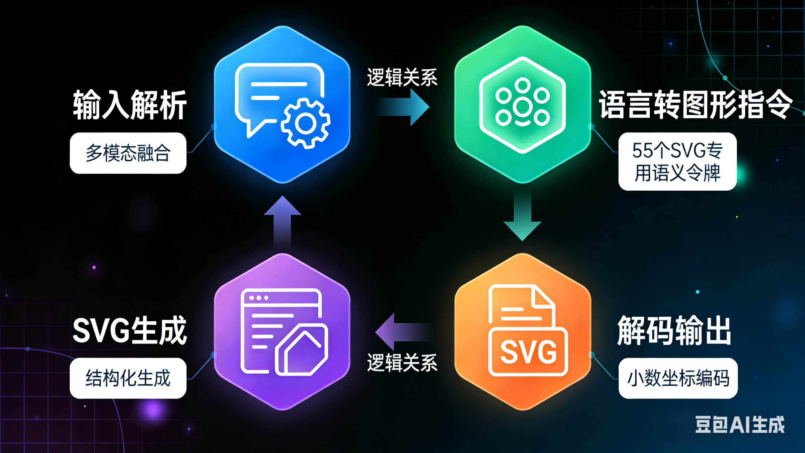

# 自然语言到矢量图形

## 参考链接

https://www.kaggle.com/competitions/drawing-with-llms

https://arxiv.org/html/2412.11102v1

https://simonwillison.net/2025/Nov/25/llm-svg-generation-benchmark/

https://github.com/ximinng/LLM4SVG

https://chat2svg.github.io/

## 两篇论文方案概括比较

第一篇方案是将每一个矢量图形的标签积木化，而不是拼接一个个零散的字符；然后进行数值精度提升、图形层级理解能力提升和数据集清洗。

第二篇思路是在保证结构符合语义的情况下生成简单模板，然后利用扩散模型补充细节，直到符合预期同时保证结构不变。


## [论文技术概括-LLM4SVG](https://arxiv.org/html/2412.11102v1)

LLM4SVG本质上是把**自然语言**（需求）翻译成**结构化代码**（SVG），但为了解决大模型在处理图形时的“幻觉”和“空间感缺失”，提出四种对应方案：



### 1. 语义标记化 (Semantic Tokenization)

*   **痛点**：普通 LLM 把 SVG 标签（如 `<path>`）拆成字母，模型理解负担较大。
*   **方案**：LLM4SVG 定义了 **55 个专用标记**。
    *   **标签标记**：`<path>`、`<rect>` 等直接变成一个独立的“单词”。
    *   **属性标记**：`fill`、`stroke-width` 也是独立单词。
*   **初始化技巧**：这些新单词不是随机生成的，而是用它们的自然语言描述（如“定义路径的标签”）的向量平均值来初始化，让模型一上手就大概知道这个词是干嘛的。

### 2. 坐标与颜色回归 (Precision Handling)

*   **痛点**：LLM 擅长处理离散的文字，不擅长处理连续的数值。不合理的数值生成会导致图形线条断裂或颜色诡异。
*   **方案**：
    *   **数值增强**：优化了分词器对数字的敏感度，支持两位小数。
    *   **十六进制支持**：让模型学习 `#RRGGBB` 格式，而不是简单的 `red`、`blue`。
*   **效果**：生成的图形边缘平滑，色彩过渡自然，不再是简笔画水平。

### 3. 两阶段训练策略 (Two-Stage Training)

*   **第一阶段：特征对齐 (Alignment)**
    *   **操作**：只训练“翻译层”（词嵌入层）。
    *   **目的**：让模型先把新学的 55 个 SVG 单词和它原本懂的英语单词对齐。
*   **第二阶段：指令微调 (Instruction Tuning)**
    *   **操作**：全量开放大脑（或使用 LoRA），进行端到端训练。
    *   **目的**：让模型学会复杂的逻辑，理解图形结构，比如“画一个在圆圈里的三角形”，它得知道先画圆、再画三角形，且坐标要重叠。

### 4. 自动化数据流水线 (Data Pipeline)

*   **痛点**：互联网上的 SVG 质量很低，有很多冗余信息。
*   **方案**：
    *   **无损压缩**：去掉所有不影响显示的垃圾内容，只保留核心路径。
    *   **自动标注**：把 SVG 转成图片，让 **BLIP** 生成简短标题，再让 **GPT-4** 生成详细的描述和指令对。
*   **成果**：造出了 58 万条高质量的数据。

### LLM4SVG 的技术本质

把 SVG 生成任务从**文本续写**提升到了**结构化合成**。

| 维度 | 传统 LLM 生成 | LLM4SVG 方案 |
| :--- | :--- | :--- |
| **理解单位** | 字符级 (碎片化) | **语义标记级 (结构化)** |
| **数值精度** | 整数/模糊 | **两位小数/精确十六进制** |
| **空间逻辑** | 容易遮挡/错位 | **通过指令微调强化层级感** |
| **数据质量** | 包含大量噪声 | **经过清洗和 GPT-4 增强标注** |


## [论文技术概括-Chat2SVG：结合大语言模型与图像扩散模型的矢量图形生成）](https://chat2svg.github.io/)


这是一个结合了 LLM（大语言模型） 和 图像扩散模型 优势的混合框架。首先利用 LLM 从基础几何图元生成具有语义意义的 SVG 模板。随后，在图像扩散模型的引导下，通过双阶段优化流水线在潜在空间（Latent Space）中精炼路径并调整点坐标，以增强几何复杂性。


### 步骤

1. **模板生成 (LLM)**：
    - 输入一段话（Prompt），先让 LLM（如 GPT-4）写出一个由基础形状（圆、方、简单路径）组成的 **SVG 初始模板**。这个模板虽然简单，但构图和语义是准确的。
2. **细节增强 (Diffusion Model)**：
    - 使用 **SDEdit + ControlNet** 技术。将初始模板渲染成图片，然后让扩散模型在保持构图不变的前提下，往图片里“填肉”，增加细节和质感，生成一张高质量的**目标位图**。
3. **双阶段优化 (Dual-Stage Optimization)**：
    - **第一阶段（属性优化）**：将 SVG 图元转换为潜在嵌入，优化颜色、描边和变换矩阵，使其在色彩上接近目标图。
    - **第二阶段（点级优化）**：调整路径上每一个锚点的位置，让形状的边缘完美契合目标图的轮廓。

### 优势

实验表明，Chat2SVG 在视觉保真度、路径规则性和语义对齐方面优于现有方法。此外，该系统支持通过自然语言指令进行直观编辑。


# 实际部署测试

## llm模型接入


sk-dd224054079afa78b04a6d03cc8a31d7de6962250232cROK

from openai import OpenAI
  client = OpenAI(
      base_url="https://api.gptsapi.net/v1",
      api_key="sk-dd224054079afa78b04a6d03cc8a31d7de6962250232cROK"
  )


第三方ai平台地址

https://2233.ai/

deepseek

sk-5cbdece47a99409586f2088f34cd4b90

原本的配置

```
if backend == "Claude":
                headers = {
                    "Content-Type": "application/json",
                    "x-api-key": api_key, 
                    "anthropic-version": "2023-06-01" # TODO use if antropics
                }
                response = requests.post("https://api.anthropic.com/v1/messages", headers=headers, json=payload)  # Anthropic

```

## 平台环境

### 报错一

#### 报错内容

conda环境链接Intel 的一个性能分析工具库（名为 ITT 或 VTune）。会报错如下：
符号无法识别


#### 原因

网络问题，不断重复安装，最后试出来成功的一次

### 报错二

cmake版本问题，最新的4.1版本无法兼容、低于3.5的版本无法兼容，导致无法正常编译diffvg库

#### 解决

优先选择3.22版本，指定版本号安装

```
conda install -c conda-forge cmake=3.22
```


### 报错三

pytorch的c扩展路径报错，原因在于conda环境问题

#### GraalVM 

它是由 Oracle 开发的一个高性能、支持多种语言的虚拟机。它不仅能运行 Java，还能运行 Python, Ruby, R, JavaScript 等。为了实现这一点，它会创建自己的 Python 解释器和环境。

**最可能的几种情况：**

1. **您主动安装过 GraalVM**：您可能因为其他 Java 项目、性能实验或其他开发需求，在系统上安装了 GraalVM。在它的安装过程中，它可能会询问是否要将其设置为默认的 Java/Python 环境，或者它会自动修改系统路径和配置文件。
    
2. **通过其他工具间接安装**：某些开发工具包、IDE（如带有特定插件的 VS Code, IntelliJ IDEA）或企业级开发平台，为了实现跨语言功能，可能会在后台捆绑安装并配置 GraalVM。您可能在不知情的情况下就安装了它。
    
3. **错误的 Conda 安装源**：虽然可能性较小，但如果您使用了某个非官方的、被修改过的 Miniconda 安装包，它可能预先就集成了 GraalVM。
    

**结论**：这个 `/jvm/` 不是 Conda 或 Python 自带的。它是一个**外来者 (GraalVM)**，它“鸠占鹊巢”，用自己的、不兼容的 Python 解释器替换了 Conda 环境中标准的 CPython 解释器，导致了后续所有的问题。


### c++编译环境缺失

#### 原因解释

这个问题的根源非常简单：**您的新服务器镜像是一个“最小化”的系统，它没有预装 C++ 编译工具链。**

- **什么是编译工具链？**  
    它是一套用于将 C/C++ 源代码转换成可执行程序的软件，核心就是编译器（如 `g++`）和相关的工具（如 `make`）。
    
- **为什么需要它？**  
    Python 的科学计算生态系统（包括 `numpy`, `scipy`, `scikit-learn`, `scikit-fmm` 等）为了追求极致的性能，大量使用 C/C++ 编写底层算法。当 `pip` 找不到为您的系统预编译好的二进制包（`.whl` 文件）时，它唯一的选择就是下载源代码，并尝试在您的机器上**即时编译**。如果此时您的机器上没有编译器，编译就会失败。
    
- **和 `Chat2SVG` 的关系**  
    `scikit-fmm` 是 `Chat2SVG` 项目 `requirements.txt` 文件中的一个依赖项。因此，在安装项目依赖的过程中，必然会触发对 `scikit-fmm` 的安装，从而暴露了缺少 C++ 编译器的问题。

#### 解决方案：安装 C++ 编译工具链

```
sudo apt-get update
sudo apt-get install -y build-essential
```

您需要在您的 Ubuntu 系统上安装 C++ 编译器。最简单的方法是安装 `build-essential` 这个元包，它包含了 `g++`, `gcc`, `make` 等所有进行软件编译所需的基础工具。

请在您的服务器终端中运行以下命令：
- **`apt-get update`**：更新您的包列表，确保能找到最新的软件版本。
- **`apt-get install -y build-essential`**：安装核心编译工具包。`-y` 参数会自动确认安装。


### 报错四

#### 内容

from transformers.modeling_utils import (
ImportError: cannot import name 'apply_chunking_to_forward' from 'transformers.modeling_utils' (/root/miniconda3/envs/chat2svg/lib/python3.10/site-packages/transformers/modeling_utils.py)

#### 原因

transformers版本问题，项目中使用的比较旧
使用如下版本：

pip install transformers==4.30.2 diffusers==0.21.4

#### 类似其它降级库

pip install transformers==4.30.2 diffusers==0.21.4 accelerate==0.21.0 huggingface-hub==0.16.4 datasets==2.14.5


pip install "numpy<2.0" opencv-python==4.8.0.76