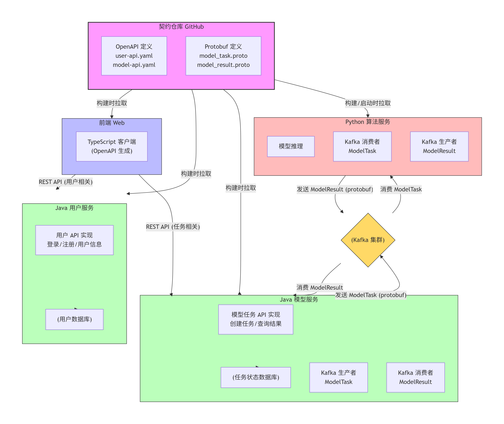

# 3.11
## stage_1

待办任务，依旧是隔离java的环境问题，把用户验证和实际模型服务分成两个模块比较好，这样后续移动也方便点，直接一整个文件夹就拖走了，也能隔离。

kafka就可能提升到基础设施层级，不要和业务代码混在一块了。

具体实现细节：

1. 新建两个子模块。
2. 分别管理模型生成和用户管理模块。
3. 分别启动服务。

### 待解决问题

web端访问内容结构依旧提供的是原始ip地址加端口后而非域名，导致其会访问本地的9000接口，但是这个web是通过frp端口转发渲染出来的，因此其访问并不是实际的服务宿主机上的对象服务器而是web渲染机的对象服务器，导致无法正确下载内容。


### 办法

使用nginx代理服务器，将所有的服务挂在nginx之下，这样内容服务请求可以直接和web服务公用一个ip地址和端口，并在内部转发到实际的地址进行响应返回。

### 具体操作

1. 部署docker中的nginx代理服务器
2. 修改frp，开放一个nginx本地端口进行服务挂载
3. 修改web中的内容服务器请求地址，将请求发送到公网固定端口，但是目前使用vite server代理即可访问java后端，不需要配置nginx代理了。
4. 主要是配置访问对象服务器和web服务器共用同一个端口
5. 只需要把java返回的地址给到公网地址对应的公开的frp端口即可。
6. 但是貌似没有必要，直接开放两个端口即可，这样就不需要配置nginx了。
7. 但是我想兼顾本地直接测试打开也支持外部访问的时候直接实现web正常获取内容。
8. 因此还是正常通过nginx代理内容服务器，这样也便于我拆分java部分的用户和模型服务模块。
9. MinIO服务器使用参数透传即可，暂时web对应的vite代理不用修改，直接将端口8080对应到nginx本地容器即可，无需占用多余公网流量,当然也可以改为公网ip。实际上通过公网获取的只有web和MinIO服务器内容

#### 代理过程

用户请求（通过浏览器或frp）
http：//你的公网IP:8080/files?url=http：//example.com/file.pdf&signature=abc123
Nginx转发到内容服务器
http：//127.0.0.1:9000/files?url=http：//example.com/file.pdf&signature=abc123
内容服务器处理并返回文件


### 契约开发

java-python之前使用kafka，使用arsv进行契约，控制接口对象同步，避免一点改动两头修改接口结构体的麻烦。

web-java使用openapi，作用类似。

#### 契约生成时间

|服务|推荐方式|理由|
|---|---|---|
|**Java模型服务**|✅ **生成时**|Java必须强类型，IDE支持|
|**Python算法服务**|✅ **运行时动态**|Python动态特性，契约变更无需重启|
|**前端Web**|✅ **生成时**|TypeScript类型安全，开发体验好|


#### stage_1_v2_最终完整方案：混合契约驱动开发架构

根据我们讨论的所有要点，这是为你量身定制的最终方案。

ps 契约文件从GitHub仓库拉取到构建目录中，不污染源码。

py不生成对象，其它java和ts都生成。

### 整体架构概览




### 方案优势总结

| 服务 | 方式 | 优势 |
|------|------|------|
| **Java模型服务** | 构建时生成 | 类型安全、IDE完美支持、编译期检查 |
| **Python算法服务** | 运行时动态 | 无需重启、契约变化立即生效、部署简单 |
| **前端Web** | 构建时生成 | 类型安全、开发体验好、无运行时开销 |

#### 关键技术决策

1. **不搭建私有仓库**：直接使用GitHub raw URL
2. **不下载契约文件**：Java在内存生成类，Python在内存解析
3. **不混用代码**：完全独立的仓库
4. **自动化CI**：GitHub Actions自动构建验证

这个方案完美实现了你所有的核心需求：
- ✅ Java和Python完全分离
- ✅ 不下载文件污染项目
- ✅ IDE完美支持（Java/TypeScript生成类）
- ✅ Python灵活动态（运行时拉取）
- ✅ 统一的契约源（GitHub）

你的想法很合理：如果通信结构比较稳定，Protobuf 是一个非常优秀的选择，它强类型、高效、跨语言支持好，而且序列化后的数据更紧凑。将 Avro 替换为 Protobuf 完全可行，下面我基于你之前的方案，给出使用 Protobuf 替代 Avro 的详细调整方案。

### 使用protbuf优势

####  唯一标识字段，而非字段名

- Protobuf 序列化后的二进制数据中，**不包含字段名**，只包含字段编号和对应的值。
    
- 例如：字段 `task_id = 1` 在数据中只存储 `1` 这个编号，而不是字符串 `"task_id"`。
    
- 这极大减小了数据体积，也使得字段重命名不影响兼容性。

二进制序列化天然适合kafka，并且支持多语言兼容。

### 使用 Protobuf 替换 Avro 的契约驱动方案

整体架构不变，依然采用 **契约仓库 + 各服务独立构建/运行** 的模式，仅将 `avro/` 目录替换为 `protobuf/`，并在 Java 和 Python 服务中调整代码生成方式。

#### 1. 契约仓库结构

```
contracts/
├── README.md
├── version.txt
├── protobuf/                     # 新增 Protobuf 契约目录
│   ├── model_task.proto          # Java→Python 任务消息
│   └── model_result.proto        # Python→Java 结果消息
└── openapi/                       # 保持不变
    ├── model-api.yaml
    └── user-api.yaml
```

**model_task.proto** 示例：

```protobuf
syntax = "proto3";

package com.aiplatform.contracts;

option java_package = "com.aiplatform.contracts.proto";
option java_outer_classname = "ModelTaskProtos";

enum ModelType {
  IMAGE = 0;
  TEXT = 1;
  AUDIO = 2;
}

message ModelTask {
  string task_id = 1;
  int64 user_id = 2;
  ModelType model_type = 3;
  string input_data = 4;
  map<string, string> parameters = 5;
  int32 priority = 6;
  int64 create_time = 7;
}
```

**model_result.proto** 示例：
```protobuf
syntax = "proto3";

package com.aiplatform.contracts;

option java_package = "com.aiplatform.contracts.proto";
option java_outer_classname = "ModelResultProtos";

message ModelResult {
  string task_id = 1;
  string status = 2;       // SUCCESS, FAILURE
  string result_data = 3;
  int64 processing_time_ms = 4;
}
```

---

#### 实操-2. Java 模型服务（生成时）

使用 `protobuf-maven-plugin` 直接从 GitHub 拉取 `.proto` 文件并生成 Java 类。

**pom.xml** 关键配置：

```xml
<properties>
    <protobuf.version>3.21.12</protobuf.version>
    <grpc.version>1.54.0</grpc.version>  <!-- 如果后续需要 gRPC 可以引入 -->
</properties>

<build>
    <extensions>
        <extension>
            <groupId>kr.motd.maven</groupId>
            <artifactId>os-maven-plugin</artifactId>
            <version>1.7.0</version>
        </extension>
    </extensions>

    <plugins>
        <!-- Protobuf 代码生成插件 -->
        <plugin>
            <groupId>org.xolstice.maven.plugins</groupId>
            <artifactId>protobuf-maven-plugin</artifactId>
            <version>0.6.1</version>
            <configuration>
                <protocArtifact>com.google.protobuf:protoc:${protobuf.version}:exe:${os.detected.classifier}</protocArtifact>
                <!-- 直接从 GitHub 拉取 proto 文件（需要网络） -->
                <protoSourceRoot>${project.build.directory}/protobuf-download</protoSourceRoot>
            </configuration>
            <executions>
                <execution>
                    <goals>
                        <goal>compile</goal>
                    </goals>
                </execution>
            </executions>
        </plugin>

        <!-- 下载 proto 文件的插件（可选，也可以直接使用 http 下载） -->
        <plugin>
            <groupId>com.googlecode.maven-download-plugin</groupId>
            <artifactId>download-maven-plugin</artifactId>
            <version>1.6.8</version>
            <executions>
                <execution>
                    <id>download-model-task-proto</id>
                    <phase>generate-sources</phase>
                    <goals>
                        <goal>wget</goal>
                    </goals>
                    <configuration>
                        <url>https://raw.githubusercontent.com/ai-platform/contracts/main/protobuf/model_task.proto</url>
                        <outputDirectory>${project.build.directory}/protobuf-download</outputDirectory>
                    </configuration>
                </execution>
                <execution>
                    <id>download-model-result-proto</id>
                    <phase>generate-sources</phase>
                    <goals>
                        <goal>wget</goal>
                    </goals>
                    <configuration>
                        <url>https://raw.githubusercontent.com/ai-platform/contracts/main/protobuf/model_result.proto</url>
                        <outputDirectory>${project.build.directory}/protobuf-download</outputDirectory>
                    </configuration>
                </execution>
            </executions>
        </plugin>
    </plugins>
</build>
```

**Java 代码示例**（发送/接收 Protobuf 消息到 Kafka）：
```java
import com.aiplatform.contracts.proto.ModelTaskProtos.ModelTask;
import com.aiplatform.contracts.proto.ModelResultProtos.ModelResult;

@RestController
public class ModelTaskController {
    
    @Autowired
    private KafkaTemplate<String, byte[]> kafkaTemplate;

    @Override
    public ResponseEntity<TaskResponse> createTask(CreateTaskRequest request) {
        String taskId = UUID.randomUUID().toString();
        
        // 构建 Protobuf 消息
        ModelTask task = ModelTask.newBuilder()
            .setTaskId(taskId)
            .setUserId(getCurrentUserId())
            .setModelTypeValue(request.getModelType().ordinal()) // 假设枚举顺序一致
            .setInputData(request.getInputData())
            .putAllParameters(request.getParameters() != null ? request.getParameters() : Collections.emptyMap())
            .setPriority(request.getPriority() != null ? request.getPriority() : 0)
            .setCreateTime(System.currentTimeMillis())
            .build();
        
        // 发送到 Kafka（序列化为 byte[]）
        kafkaTemplate.send("model-tasks", taskId, task.toByteArray());
        
        TaskResponse response = new TaskResponse();
        response.setTaskId(taskId);
        response.setStatus("PENDING");
        return ResponseEntity.ok(response);
    }
    
    @KafkaListener(topics = "model-results")
    public void handleResult(byte[] data) {
        try {
            ModelResult result = ModelResult.parseFrom(data);
            // 处理结果...
        } catch (InvalidProtocolBufferException e) {
            // 异常处理
        }
    }
}
```

---

#### 3. Python 算法服务（生成时或运行时）

Python 使用 Protobuf 通常推荐在构建时生成代码，以获得更好的类型提示和性能。但你也可以采用运行时动态解析（不常用）。这里给出两种方式：

##### 实际操作-方式一：构建时生成（推荐）

在 `setup.py` 或 `requirements.txt` 中定义生成步骤，或使用 `Makefile`。

**requirements.txt** 增加：
```
protobuf==4.22.0
grpcio-tools==1.54.0   # 用于生成代码
```

**Makefile** 或构建脚本：
```makefile
generate-proto:
	mkdir -p src/proto
	python -m grpc_tools.protoc \
		-I. \
		--python_out=./src/proto \
		--pyi_out=./src/proto \
		<(curl -s https://raw.githubusercontent.com/ai-platform/contracts/main/protobuf/model_task.proto)
	python -m grpc_tools.protoc \
		-I. \
		--python_out=./src/proto \
		--pyi_out=./src/proto \
		<(curl -s https://raw.githubusercontent.com/ai-platform/contracts/main/protobuf/model_result.proto)
```

然后在 `src/proto/` 下会生成 `model_task_pb2.py` 和 `model_result_pb2.py`。

**Python 代码示例**：
```python
from confluent_kafka import Consumer, Producer
from src.proto import model_task_pb2, model_result_pb2

class ModelAlgorithmService:
    def __init__(self):
        self.consumer = Consumer({...})
        self.producer = Producer({...})
        self.consumer.subscribe(['model-tasks'])

    def run(self):
        while True:
            msg = self.consumer.poll(1.0)
            if msg is None:
                continue
            # 反序列化 Protobuf
            task = model_task_pb2.ModelTask()
            task.ParseFromString(msg.value())
            print(f"Received task: {task.task_id}")

            # 处理任务...

            # 构建结果
            result = model_result_pb2.ModelResult()
            result.task_id = task.task_id
            result.status = "SUCCESS"
            result.result_data = json.dumps({"output": "..."})
            result.processing_time_ms = 1234

            # 发送结果
            self.producer.produce('model-results', value=result.SerializeToString())
            self.producer.flush()
```

##### 方式二：运行时动态解析（可选）

如果不想生成代码，可以使用 `google.protobuf.message` 的 `DynamicMessage` 或 `ParseFromString`，但需要提前加载描述符。这种方法较复杂，一般不推荐用于稳定结构。

---

#### 4. 前端与 OpenAPI 部分完全不变

OpenAPI 契约依然用于 HTTP API，前端通过 `openapi-generator` 生成 TypeScript 客户端，与 Protobuf 部分无关，保持原样。

---

#### 5. 为什么选择 Protobuf？

- **强类型**：Java 和 Python 生成的代码都有严格的字段类型，减少运行时错误。
- **性能**：序列化/反序列化速度快，数据体积小（比 JSON 小，比 Avro 略大但接近）。
- **跨语言**：官方支持 Java、Python、C++、Go 等，社区支持几乎全部语言。
- **向后兼容**：可以安全地添加新字段（需遵循 Protobuf 的更新规则）。
- **生态丰富**：可与 gRPC 无缝集成，未来如需 RPC 调用可平滑升级。

#### 6. 与 Avro 的简单对比

| 特性 | Avro | Protobuf |
|------|------|----------|
| 动态类型 | 支持（需 schema） | 需生成代码或动态消息 |
| 数据带 schema | 是（可包含在文件中） | 否（需独立交换 schema） |
| 性能 | 优秀 | 优秀 |
| 语言支持 | 多，但部分语言维护一般 | 官方支持所有主流语言 |
| 适用场景 | 大数据（Hadoop）、动态 schema | RPC、通用消息传递 |

如果你的结构稳定，不需要 Avro 的动态 schema 特性，Protobuf 会更简洁、更高效。

---

#### 7. 总结调整后的开发流程

- **Java 开发者**：`mvn clean compile` → 自动下载 `.proto` 并生成 Java 类，IDE 强类型支持。
- **Python 开发者**：运行 `make generate-proto`（或集成到 CI）生成 Python 类，然后正常开发。
- **前端开发者**：`npm run dev` 依然拉取 OpenAPI 生成 TypeScript 客户端。

所有契约变更只需更新 `contracts` 仓库，各服务重新生成代码即可，完全符合你之前设计的“契约驱动、服务独立”的理念。

如果你需要更详细的配置（比如如何在 CI 中自动生成 Python 代码），或者想了解如何用 gRPC 替换 Kafka 通信（直接 RPC），可以继续探讨。

## stage2

我的项目是有根据算法生成众多模型群落，但是这每一个模型可以和信息绑定，形成城市沙盒。然后python负责布局模型生成。java负责业务板块，现在信息模块还不知道怎么拓展，因为这两个环节经常变更迭代，不知道信息保存的格式、使用的框架、通信的方法怎么确定？我希望信息模块和模型模块完全解耦，不仅是逻辑上，开发中也要解耦，并且不要太复杂，便于迭代迁移。

### 项目结构

新开一个spring模块，环境和其它隔离，使用信息id和模型id（非必要）关联两个业务板块。


### 技术栈

使用postgresql数据库，其可直接存储JSON文档，同时是关系型数据库，不仅允许高性能存储文档，优于NoSQL。JSON同样支持任意结构

暂时不是很理解MongoDB这总Nosql数据库的优势

其次postgresql支持json单独修改其中一个字段。

要在 Windows 环境下使用 Docker 部署 PostgreSQL，并满足你的要求（数据卷映射到 `C:/APP/data/postgresql`，密码为 `helloworld`），可以按照以下步骤操作。


### 实际操作-数据库安装配置

#### 1. 拉取 PostgreSQL 镜像（可选，如果本地没有会自动拉取）

```bash
docker pull postgres:latest
```

---

#### 2. 运行 PostgreSQL 容器

windows环境的powershell换行符号是反引号。

默认用户名不是root而是postgre`

```powershell
docker run -d `
  --name postgres-container `
  -e POSTGRES_PASSWORD=helloworld `
  -p 5432:5432 `
  -v C:/APP/data/postgresql:/var/lib/postgresql `
  postgres:latest
```

##### 参数说明：
- `-d`：后台运行容器
- `--name postgres-container`：指定容器名称，可自行修改
- `-e POSTGRES_PASSWORD=helloworld`：设置数据库超级用户（postgres）的密码
- `-p 5432:5432`：将主机的 5432 端口映射到容器的 5432 端口（如果主机 5432 已被占用，可改为其他端口，如 `5433:5432`）
- `-v C:/APP/data/postgresql:/var/lib/postgresql/data`：将主机目录 `C:/APP/data/postgresql` 挂载到容器的数据目录，实现数据持久化。**注意**：Windows 路径使用正斜杠 `C:/APP/data/postgresql` 或双反斜杠 `C:\\APP\\data\\postgresql` 均可，Docker 会自动转换。

---

#### 3. 验证容器是否运行成功
```bash
docker ps
```
应该能看到 `postgres-container` 处于运行状态。

---

#### 4. 连接数据库（可选测试）
你可以使用任何 PostgreSQL 客户端（如 DBeaver、pgAdmin、psql）连接数据库：
- **主机**：`localhost` 或 `127.0.0.1`
- **端口**：`5432`
- **数据库**：默认会创建 `postgres` 数据库
- **用户**：`postgres`
- **密码**：`helloworld`

如果需要在容器内使用 `psql` 连接：
```bash
docker exec -it postgres-container psql -U postgres
```
然后输入密码 `helloworld` 即可进入 PostgreSQL 交互式命令行。

---

#### 注意事项
- 确保 `C:/APP/data/postgresql` 目录已经存在，否则 Docker 可能会自动创建（权限可能需要检查）。
- 如果遇到权限问题，可以尝试以管理员身份运行 Docker 或调整目录权限。
- 如果需要设置其他配置（如字符集、默认数据库名），可添加相应环境变量，例如 `-e POSTGRES_DB=mydb`。

如果你需要更复杂的配置（如同时创建用户、设置时区等），可以参考 [PostgreSQL Docker 官方文档](https://hub.docker.com/_/postgres)。


## 12阶段实操计划

1. postgresql-docker安装
2. 先分割java模块，新建子模块info，连接配置数据库postgresql。
3. 构建契约仓库：
	1. 先完善结构本身
		1. 优先已经有的web open api结构，有apifox支持导出
		2. 然后再构建补充info模块的新的结构和对象结构
		3. 然后做kafka的ptrotobuf结构
	2. 然后在Java部分增加依赖，观察生成类结构
	3. 在python端补充需要生成的对象，只考虑kafka的。
4. 尝试取代原本的lombok结构从java的用户模块开始，再是业务端的模型服务，最后是kafka的两端接口调整

### 实际遇到问题

数据库模块的共享问题


## stage_3待办

1. 模型配置颜色接口，不知道给python还是java，暂时不实现了，但是预留结构
2. react也需要重构
3. react初次生成模型和多次生成模型不触发页面刷新，导致不能及时显示加载的模型。
4. 信息半丁项目的构建-创建一个新分支，需要改造web端。